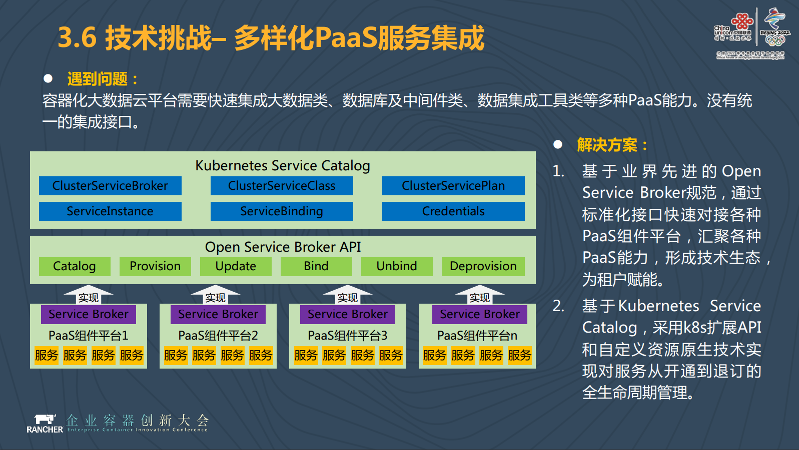

## 提升60%基础资源利用率！中国联通的容器化大数据平台实践 - Rancher - SegmentFault 思否  

> 作者: RancherLabs  
> 发布日期:    

中国联通数据中心总经理王志军在Rancher举办的ECIC大会上的演讲实录，分享了中国联通为何开始进行平台容器化并如何运用Kubernetes对9000台的服务器数据节点进行最大化利用和合理调度，进而提升了60%的基础资源利用率。

* * *

2019年6月20日，由Rancher Labs（以下简称Rancher）主办的第三届企业容器创新大会（Enterprise Container Innovation Conference, 以下简称ECIC）在北京喜来登大酒店盛大举行。本届ECIC规模宏大，全天共设置了17场主题演讲，吸引了近千名容器技术爱好者参加，超过10000名观众在线上直播平台观看了本次盛会。

来自Rancher、阿里云、百度云、平安科技、中国联通、飞贷金融科技、中国人寿、SmartX、华泰保险、厦门航空、JFrog、新东方、Cisco等十多家企业的技术负责人出席了本届ECIC，现场带来关于企业容器项目实践经验的精彩分享，为参会的容器技术爱好者带来企业容器化的经验分享。

大会现场，中国联通数据中心总经理王志军为现场容器爱好者带来了主题为《中国联通容器化大数据云平台探索与实践》 的内容分享。

中国联通是国内三大运营商之一，同时也是国内首批将大数据平台部署在容器云上的企业。关于中国联通在容器化大数据云平台上的发展和探索，王志军分享道：“通过研究、探索和实践，我们发现Kubernetes+Docker的技术路线更契合联通的实际需求，它几乎支持了所有的容器业务类型，也正是基于联通的技术选型，我们引入了Rancher的产品部署和Kubernetes集群管理功能，为联通的容器化大数据云平台提供更强而有力的容器技术及容器服务支撑。”

以下是中国联通集团数据中心总经理王志军的演讲实录：

大家好，非常感谢Rancher邀请我们在企业容器创新大会上进行演讲，我今天演讲的题目是《中国联通容器化大数据云平台探索和实践》，内容是中国联通是怎样将大数据和容器化云平台相连接的。

**建设背景**

我们一起来简单回顾一下中国联通大数据和云计算的发展历程。大数据和云计算分属于两个不同的领域，大数据主要关注怎么将数据集中起来，挖掘数据的价值。云计算主要关注怎么更高效地使用资源，提升资源的利用效率。当大数据发展到一定阶段的时候，它就会和云计算不期而遇。

在大数据的方面，存在有几个标志性的事件和历程，一是2006年Hadoop的出现，二是2009年CDH发行版的出现，到2012年，大数据出现了新的资源调度管理方式，流式计算技术比如Spark和Flink等。

云计算的标志性事件是从2006年亚马逊提出EC2开始的，EC2的出现标志着云计算时代的开启，2010年出现了OpenStack，这是我们在部署私有云中非常广泛使用的一个技术，2013年是Docker的元年，让容器技术风靡了云计算领域。2014年Kubernetes的出现则将Container as a Service变成了被业界广泛接受的全新理念。大量的我们原先在虚拟机上部署单体应用或者分布式应用的架构逐渐变成了基于容器的微服务加工方式。

我们所提出的ABC融合指的是AI+Bigdate+Cloud的融合。

在Bigdate 2.0时代，Hadoop商业版出现为大家利用Hadoop进行大数据的处理提供了更好的方式。另一方面，SQL on Hadoop逐渐成熟了起来。在我们看来，SQL on Hadoop是一种更为接近人类自然来进行数据处理的语言，它和我们的关系数据库并不是一个非常紧密的耦合关系，我们大量的实时处理是基于SQL on Hadoop去处理的。第三点是最开始我们做大数据的时候，大量采用的是批处理的处理方式，现在我们更多的是采用流失处理和批处理相结合以及交互是分析相结合的方式来进行的。

在Bigdate 3.0时代，大数据云和AI已经融为一体了，客户希望能在一个统一的平台上提供AI、Bigdate和Cloud。

中国联通是整个运营商行业当中实现数据集中的企业，我们拥有企业级全域数据的存储中心、计算中心、能力中心和孵化中心。在运营商行业，他们的系统架构模式基本上都是分省来进行建设的，但是中国联通在建设大数据平台的第一天我们就把数据集中汇集到总部的一个节点，我们坚信数据只有汇聚才能发生化学反应，才能产生最大化的价值。

中国联通拥有百PB级的数据吞吐能力和统一的数据服务能力。我们数据中心的数据量超过100个PB。当然，数据量并不是越大越好，数据本身是有成本的，我们希望数据的成本和数据的价值能达到一个平衡点。另外，我们有超过6500台对内服务的服务器数据节点，以及超过2000台对外服务的服务器数据节点，加起来有9000台左右的节点数量。除此之外，从中国联通的存储能力上看，我们目前的存储能力可能接近200个PB。

全域数据汇聚和管理中心沉淀了海量的计算能力、存储能力和数据能力，导致了中国联通面临着资源智能调度、最大化利用和能力共享的难题。

中国联通有整体的数据中心节点，而在总部底下是中国联通的省分公司和子公司，他们希望利用总部的大数据平台去进行各自的数据处理和数据分析，因此产生了云计算的需求。他们希望总部的节点能够为它提供一个数据处理的平台，省分公司和子公司在平台上进行自身的数据加工和处理。

这是我们自身优化的源动力，就是中国联通自身的节点如何避免计算、存储资源不均衡的调度，创新地为租户提供同样的能力。这时候，中国联通的大数据和云计算就自然而然地走到了一起。

**探索历程**

我们从2016年开始在中国联通大数据云平台建设上投入很大的力量，也经历了几个不同的发展阶段。

在最初的建设阶段，我们的资源是物理部署、人工划配、系统运维，我们经历了大数据的整体发展历程，在最开始的时候，你要做大数据，必须要通过物理机器来实现，你要部署一个Hadoop机器，如果你需要kafka，你还需要用物理的机器部署一个kafka，这是大数据平台建设必然的发展阶段。

下一个阶段属于优化提升阶段，我们希望通过一个集中工作组统一管理资源，在其他人有资源需求的时候，我们去做半自动化的部署、半人工的划配，还有就是系统运维的简单监控。

第三个阶段就是通过大数据云平台提供一键部署，你需要一个大数据平台，通过一键部署，我为你提供一个大数据平台，你可以在上面去做自身数据的加工和处理。而你的数据可以来源于总部的数据平台，也可以来源于自身的数据。这样就实现了按需自动分配、弹缩，统一监控和统一运维。我们目前已经在第三个阶段了。

在中国联通进行技术路线选型的时候，我们面临着Kubernetes和Mesos二者之间的选择。

我们为什么选择Kubernetes？因为Kubernetes几乎支持所有的容器业务类型，包括长期伺服、批处理、node-deamon以及状态应用等。我们最开始在做容器应用或者是微服务应用的时候，更多的是无状态的应用。但我们提供大数据服务的时候，很多应用是有状态的。

对Kubernetes和Mesos我们进行了非常深入的分析，尤其是生态活跃度，Kubernetes的生态活跃度和社区关注度在急剧上升。我们在进行技术选型的时候，包括它的使用场景、外部应用、中间节点和数据库、有服务状态等都进行了分析。另外，技术的成熟度是否有业界厂商的广泛加持，比如谷歌、亚马逊、Rancher、IBM、阿里、百度等。Kubernetes有非常好的生态，所以我们选择了Kubernetes来解决联通的实际需求。

谈及Kubernetes时，无可避免地一定会提及中国联通和Rancher的合作。

中国联通在搭建Kubernetes和Docker容器化平台的过程当中，我们引入了Rancher的产品去部署和管理多个Kubernetes集群。我们使用Rancher Server，通过图形化和RKE两种方式对多租户的Kubernetes集群进行部署和管理。

另一方面，从我们的角度来看，Rancher有丰富的容器化实施案例经验，这块正好弥补了中国联通的一些不足之处，成为我们在处理和解决问题中的一个坚强后盾。我们更加关注于怎样把服务变成云，然后开放给省分公司和子公司使用，我们怎样才能把数据处理的更好。而针对底层的服务，我们希望借助业界的合作伙伴和我们共同解决。

除此之外，开源的产品经常会有重大安全漏洞，在这一方面Rancher能为中国联通提供一个很好的技术支持，为中国联通的云平台安全保驾护航。

**平台实践**

中国联通提供几个方面的服务，一是大数据即服务，比如我们的省分公司或者子公司需要一个大数据平台，我们就为它一键提供一个大数据平台，包括Hadoop、Spark、Storm、impala等，一旦我能为省分公司及子公司提供大数据平台，他们就无需自己重新构建大数据平台了。

二是中间件和数据库即服务。对于省分公司和子公司而言，光有大数据平台来进行数据处理是远远不够的，这当中必然要用到很多中间件，所以我们要为他们提供中间件和数据库即服务，这里包括kafka数据库即服务、Redis分布式缓存服务、MySQL关系数据库的服务。

有了以上二者之后，我们还可以提供数据集成工具即服务，比如云化ETL，我可以去做数据抽取转化，来为省分公司和子公司提供调度。

我们前面提到了ABC，进一步扩展，我们可以提供深度学习即服务，比如TensorFlow、Caffe等。

最后一个就是容器云服务，我们可以提供应用托管的环境。

有了以上几个服务之后，对于租户来讲，涵盖了数据的加工、处理，流转以及应用的提供，基本上就具备了PaaS平台的框架了。我们的省分公司或者是子公司就不必再去建设做自己的大数据平台，如果他们要做大数据应用，就可以放到总部平台去做，相当于部署了一个任务在总部平台上，对于他们而言，他们有自己的数据，也有自己的空间来做一个处理，我们通过大数据平台的方式满足了他们的这种需求。

以上还列举了一些PaaS能力如Hadoop、Spark、Hive、HBase、ZooKeeper、Storm、Implpa等，另外包括分布式数据仓库、数据集市、实时计算、数据挖掘的引擎、信息检索引擎等等。

还有，中间件及数据库服务组件如kafka、MySQL，数据集成工具包括元数据管理、数据治理的服务，云化ETL服务、数据集合管理的服务等等。

我们目前还有很多其他的服务，比如数据安全的服务、脱敏的服务、溯源的服务，这些我们都通过云的方式提供给省分公司和子公司。

无论是中国联通的大数据基础服务、深度学习框架、中间件及数据库服务，还是微服务的开发部署、数据集成工具等，这些内容不可能由单一的团队完成，我们有非常多的团队，有些团队专注于大数据基础服务，有些团队专注于将深度学习的框架部署在Kubernetes上，有些团队专注于将中间件即服务的放到Kubernetes容器云平台上进行部署管理，这些都是由不同的团队完成的，所以我们需要有一个统一的管理平台。

在这上面我们使用的是Kubernetes Service Catalog和Open Service Broker。统一的集成框架像Kubernetes Service Catalog实现异构组件的统一纳管，通过业界标准的Open Service Broker实现第三方组件的接入和扩展。当我们底下有新服务的时候，我们通过整体开放的架构接入新服务，开放给我们的客户使用。

我们有四大类支持场景。第一种场景就是你需要一个大数据平台，我为你提供一个大数据平台，这是最基础的一个场景，也是最难实现的一个场景。第二种场景就是为你提供大数据的服务组件，你进行数据加工和处理，比如提供一个分布式的数据仓储，你将数据拿进来处理之后带走或者是拿来做其他的应用。第三种场景是应用微服务化的容器化部署。最后一种场景是假设我为你提供一个孵化平台，提供样本数据，提供数据处理组件，你自己去进行一些模型的训练。

从租户整体应用场景上看，最大的是进行模型训练的，比例为34%。省分大数据平台构建占比17%，容器化应用和服务开发部署占比为27%，大数据加工处理占比为22%。这是我们目前的应用情况。

我们之前还有采用一种逻辑多租的方式，因为我们有大数据平台，有资源的调度和管理，我们可以采用逻辑多租的方式来为你提供服务，但这具有一定的局限性。而基于容器云的大数据平台更多采用的是物理多租的方式，能对资源进行有效隔离，能对数据进行有效隔离，服务进行有效隔离，业务进行有效隔离。我申请的这个东西是我的，和逻辑多组不一样，逻辑多租总感觉我和别人共享一个空间，而物理多租这个空间就是你的，你在里面做什么事情我们不管，我们只希望你讲这个事情做得更加容易。

在这当中我们肯定会面临一些技术挑战。包括多种PaaS能力的集成。其二就是多个Kubernetes集群的互通，因为我们刚才分享了中国联通下面是有N个团队的，大数据平台服务可能分布在一个Kubernetes集群上，也有可能不止分布在一个Kubernetes集群上，是由多个Kubernetes集群组成的。其三是大数据服务的容器化，比如Hadoop怎么放到容器云平台上，Hadoop的部署方式是需要高度来进行规划的，需要做到计算和数据的亲和性，那这一问题我们应该怎么解决。最后是计算资源的本地化。

关于以上几种技术挑战，我们有一些解决方法。多样化PaaS能力的集成我们会用Open Service Broker来解决这一问题。

Kubernetes集群间网络互通我们会通过多机型的互通来解决，我们有多个集群，在大数据云平台上，我们的应用可以访问你的Datanote，你的应用通过直接访问Datanote写入和读取数据，API调用的问题通过定制Flannel网络插件来解决，两个集群共用一个Flannel网络，实现跨集群pod IP直接连接。

对于Hadoop容器化如何完成部署的问题，这里面包括如果将Hadoop的服务进行拆分，如何完成角色规划？将Hadoop按照组件进行最小单位拆分，通过亲和的调度算法实现一个集群的合理部署。拆分完之后怎么解决服务之间依赖和发现的问题？集群内部我们使用Headless Service的方式来解决，我们直接调用底层pod提供的服务。服务之间会通过DNS和配置注入的方式来进行发现。

面对Hadoop容器化计算本地化的挑战，我们采用k8s亲和的调度策略，确保统一集群的计算服务调度到相同的列表，第二步，我们更改了Yarn和Spark的调度逻辑，判断到对应的计算是否在同一个主机至上。第三步，多个pad我们共享Domain Socket，而且每个租户的Domain Socket相互独立。

中国联通大数据云平台提供的PaaS能力有6大类30多种，我们的集群数量有437个。在大数据云平台，我们开放给租户来使用这一平台，每月执行MR/Spark任务16万多个，实行的数据调度任务一万五千多个。

我们目前还在逐渐拓展使用的范畴，先前我们很多小的省份公司已经将大数据平台放到中国联通大数据云平台上进行部署。下一步中国联通会进一步扩大规模，未来绝大部分的省分公司、子公司都将大数据平台放到这一平台上进行部署。

后续我们希望中国联通大数据云平台不断地进行演进，将Kubernetes本身当做一个服务提供给我们的租户，另一方面我们希望可以提供FaaS，采用Serviceless的方式为客户提供更加方便的服务，它只需提供一个函数就可以了，后台服务可以根据函数调动的情况进行弹缩和缩放。

另一个探索方向是支持物联网的云平台。现在5G炒得很热，无论是运营商行业还是整体的社会，大家都在关注5G。5G主要解决三大问题，一是大带宽，二是高密度连接，三是低延迟。高密度连接和低延迟这两个问题都是属于物联网应用的问题。而我们构建大数据云平台为物联网提供新服务，万物互联将产生更多的数据，数据如何进行实时处理？怎样进行后续的分析和处理？我们希望通过公共云平台的方式解决这一问题。

**总结与展望**

以上是中国联通基于容器云的大数据平台建设情况，目前看来我们取得了非常不错的一个成果。在未来，我们将集成更多的能力，赋能前台，实现智能管理，提升整体利用效率。
