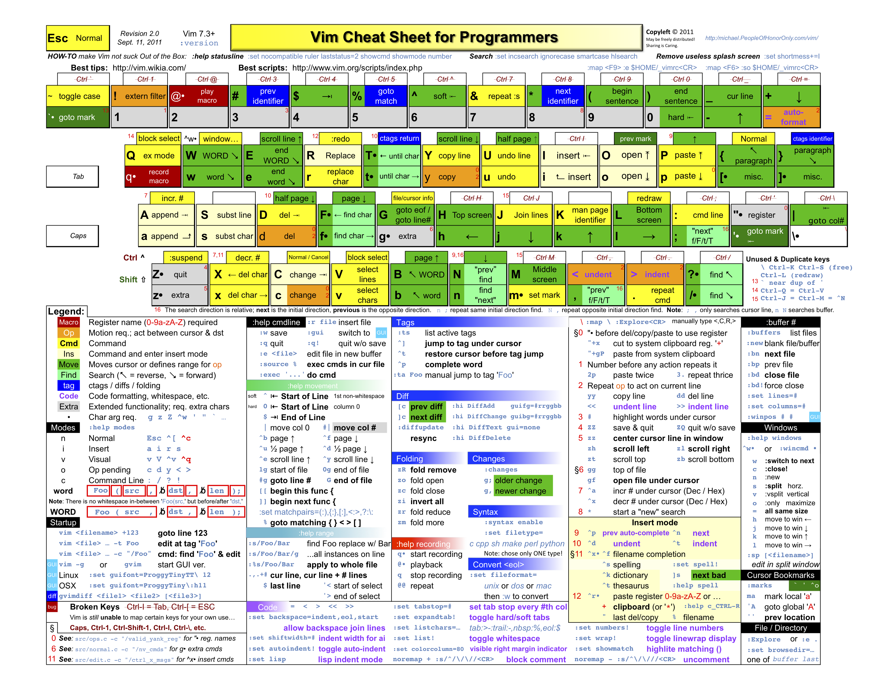

## 给程序员的VIM速查卡  

> 作者: 陈皓  
> 发布日期: 2011年09月16日  

前几天酷壳发布过“[vim简明攻略](https://coolshell.cn/articles/5426.html "简明 Vim 练级攻略")”，不知道大家练得怎么样了。如果你练了一下，那么这里这个速查卡就会对你有帮助了。以前本站也有过一个（[vim速查卡](https://coolshell.cn/articles/150.html "Vim命令速查卡")），不过其太简单了。我觉得这个很不错，很全，很直观。这个速查卡来自 **[这里](http://michael.peopleofhonoronly.com/vim/)** 。其用颜色标注了级别：

*   Green   = 存活级
*   Yellow   = 感觉良好
*   Orange   / Blue = 高级
*   Red   = 专家级

下面的图片点击可以看大图：

[

给程序员的VIM速查卡（点击看大图）

你还可以下载[PDF版](http://michael.peopleofhonoronly.com/vim/vim_cheat_sheet_for_programmers_print.pdf)的和[Excel版](http://michael.peopleofhonoronly.com/vim/vim_cheat_sheet_for_programmers_print.xlsx)的，如果你是色盲的话，还有[蓝色版PDF](http://michael.peopleofhonoronly.com/vim/vim_cheat_sheet_for_programmers_colorblind.pdf)的。如果你不是很喜欢的话，这里还有几个：

* <http://www.viemu.com/a_vi_vim_graphical_cheat_sheet_tutorial.html>
* <http://tnerual.eriogerg.free.fr/vim.html>
* <http://www.lagmonster.org/docs/vi.html>
* <http://jrmiii.com/2009/03/06/learning-vim-the-pragmatic-way.html>

 

关注CoolShell微信公众账号和微信小程序

**（转载本站文章请注明作者和出处[酷 壳 – CoolShell](https://coolshell.cn/) ，请勿用于任何商业用途）**

——=== **访问[酷壳404页面](http://coolshell.cn/404/) 寻找遗失儿童。** ===——

### 相关文章

* [

* [

* [

* [

* [

* [

 \( **28** 人打了分，平均分： **4.57** \)

 Loading...
