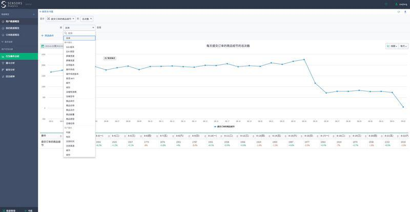

## “神策数据”面向中小企业提供私人定制方案，算是条蹊径么？  

> 发布: 徐宁  
> 发布日期: 2015-09-25  

目前在做大数据的公司，比如友盟、百度统计、Talking Data等，他们已有很大体量的数据积累，像Talking Data线上平台每天入口的数据就在10个T左右，初创公司想要颠覆并非易事。

但是现有的大数据工具基本为标准化产品，有着技术门槛高、上手成本高、和实际业务结合较差以及部署成本高，小公司用不起等特点。那么新创企业就可以根据以往这些产品的缺陷，来做更适合市场和客户的大数据分析工具和服务，也就是走个性定制的路子。

9月25日，[Sensors Data](http://sensorsdata.cn/?ch=36kr)公司（80%的人员来自百度大数据部门）正式发布一款用户行为数据分析产品，名为Sensors Analytics，旨在服务于数据量较少的初创公司，主要针对已有SaaS统计服务公司存在的三方面痛点：

1.在数据源收集方面。大部分公司的做法都是在网站前端嵌一个JS，或者在APP里面嵌一个SDK去采集客户端用户访问数据。其实有两类数据是没有采集到的，一个是数据库里面的数据，另一个则是服务端的数据。

这就会导致一些问题，比如说电商公司，需要将数据库的商品数据和用户行为结合起来分析，这些后端的数据利用前端是采集不到的，所以有些分析无法覆盖。这也是为什么一些企业用了第三方的数据统计软件，还需要有自己的数据团队去做分析。

2.在分析能力上，数据体量大的公司只能基于宏观指标进行分析，像地域、时间等通用维度。但例如“来自于北京的年龄在20-25之间的女性用户最近一个月购买过10次的商品的，平均客单价在……”这种多个维度组合在一起的深度分析方面就会有欠缺。

由于这类公司的数据太多了，又是标准化的产品，若想要增加一个维度指标，逻辑复杂性和计算量都会大大增加，需要投入的研发代价太大。

3.在数据安全方面，一些公司会担心自己的数据放在第三方平台是否安全。在国内的风险环境下，有一定规模的企业都希望自己做数据工作。

基于上述问题，[Sensors Data](http://sensorsdata.cn/?ch=36kr)做的改进如下：

1.Sensors Analytics支持私有和公有云两种部署方式。私有部署就像Oracle软件的性质一样，可以部署在企业自己的服务器上，这样就解决了企业对于数据安全方面的担心。同时对那些相对信用第三方平台的企业，Sensors Analytics也会提供云版本。

2.Sensors Analytics对于企业任何一个维度的需求，都可以进行分析。因为对每一家企业，使用的是独立的一套分析产品，其实就是相当于Sensors Analytics对每个企业都做了私人定制。

[Sensors Data](http://sensorsdata.cn/?ch=36kr)的联合创始人&CEO桑文锋认为，对于体量较小的创业公司来说，企业本身的数据以后足够支撑，不需要再扩大用户集合分析无关数据。

3.Sensors Analytics是在帮客户建立专属的数据仓库，数据仓库不同于数据库。数据库是为了满足业务需求，很多人同时使用，每个人只会查很小一部分数据，所以数据库只保留当前的状态，来满足高并发的请求。而数据仓库是可以追溯历史状态的，通过数据仓库可以恢复到数据库里面的任何一个状态。

通过数据仓库这样累积的一段时间的数据，企业可以在此基础上做二次开发，省掉了准备数据的步骤。

关于数据仓库的概念，我质疑了其他公司是否有在做，桑文锋解释到，Talking Data有一部分业务是针对银行开设的，像交易量、流水等，这种传统企业的数据仓库和Sensors Analytics是不一样的，Sensors Analytics是在基于用户行为建模。另外，阿里公有云也有在做数据仓库，他们的定位是在IaaS+PaaS，Sensors Analytics是在做PaaS+SaaS。

前期，[Sensors Data](http://sensorsdata.cn/?ch=36kr)的目标用户更侧重电商、O2O领域的创业公司，因为对于这类公司来说，用户数据可以直接产生价值，并且这两类创业公司的数量也相对较多。目前，爱鲜蜂、一亩田、pp租车、快快鱼、51offer等多家创业公司使用，基本靠口碑传播。年服务费在2万到20万之间，根据公司员工数量和需要接入的数据量来收费。
