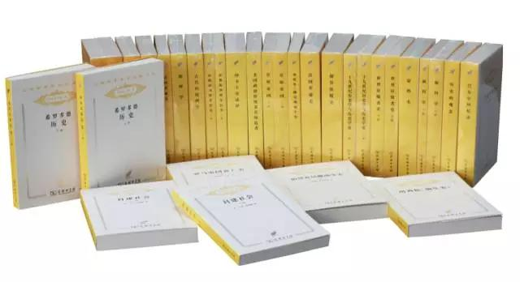
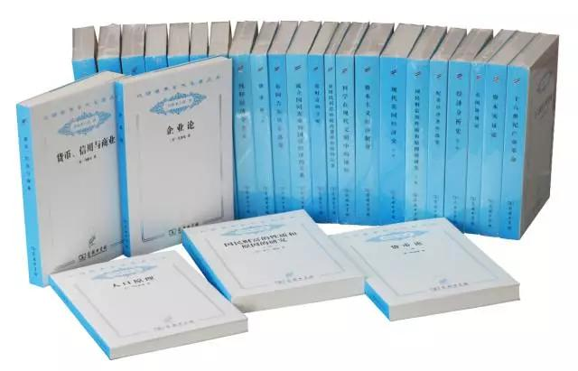

## 史上最全“汉译名著”书目（必备书单）  

> 发布: 商务印书馆  
> 发布日期: 2016-02-28  

1905年，商务印书馆出版了严复翻译的《天演论》。如果从那时算起，汉译名著已经走过百年。百余年来，凡在世界学术史上有反响、有定评，在某一学科称得上是里程碑式的作品均通过汉译名著传入我们的知识谱系，一个时代、一个民族、一种思潮的代表者的作品也都通过汉译名著丰富了我们的精神世界。

文化学术上的“高楼大厦”，只能一砖一石地去垒。曾翻译了包括《社会契约论》、《思想录》、《法国革命论》等7种传世甚广的“汉译名著”的学者何兆武先生说，一个国家之所以伟大，在于开放和包容，无论何时，如果想走得更远，必须先看得更远，而想看得更远，就得站在巨人的肩上。

中国社会科学院原副院长汝信先生认为：“中国多少代的哲学、社会科学工作者都受到了商务印书馆出版的这些重要的外国学术著作的熏陶、教育和培养。可以说，对于推动我们的哲学、社会科学的发展，恐怕它的作用完全不亚于一个社会科学的大学。”

1984年，邓小平说：要用几十年的时间把世界古今有定评的学术著作都翻译出版。这一指示令出版界欢欣鼓舞，它表明了一个开放的国家对待人类思想文化遗产的态度，也代表了当时社会发展的需求：中国的现代化建设需要了解西方国家的现代化经验，人们重新意识到，封闭只能导致僵化和萎缩。

目前“汉译名著”已推出15辑共650种。其中，哲学类226种，历史、地理类126种，政治、法律、社会学类158种，经济学类127种，语言学类13种。小编整理如下：

**一、哲学类，226种**

最初名为“爱智之学”的哲学，有着极古老的源头。

哲学源于惊异，它意味着人类的意识开始以一种独立的姿态探求万物的意义。

**第一辑**

1、形而上学 \[古希腊\]亚里士多德 著

2、忏悔录 \[古罗马\]奥古斯丁 著

3、对笛卡尔沉思的诘难 \[法\]伽森狄著

4、伦理学 \[荷兰\]斯宾诺莎 著

5、人类理解论\(上下册\) \[英\]洛克 著

6、人类理智研究 \[英\]休谟 著

7、人是机器 \[法\]拉·梅特里 著

8、狄德罗哲学选集

9、袖珍神学 \[法\]保尔·霍尔巴赫 著

10、先验唯心论体系 \[德\]谢林 著

11、精神现象学\(上下卷\) \[德\]黑格尔 著

12、逻辑学\(上下卷\) \[德\]黑格尔 著

13、哲学史讲演录\(共四卷\) \[德\]黑格尔 著

14、美学\(共三卷\) \[德\]黑格尔 著

15、科学中华而不实的作风 \[俄\]赫尔岑 著

16、物种起源 \[英\]达尔文 著

17、实用主义 \[美\]威廉·詹姆士 著

18、善的研究 \[日\]西田几多郎 著

19、西方哲学史\(上下卷\) \[英\]罗素 著

**第二辑**

20、物理学 \[古希腊\]亚里士多德 著

21、物性论 \[古罗马\]卢克莱修 著
22、人性论 \[英\]休谟 著

23、人类理智新论\(上下册\) \[德\]莱布尼茨 著

24、任何一种能够作为科学出现的未来形而上学导论\[德\]康德 著

25、法哲学原理 \[德\]黑格尔 著

26、作为意志和表象的世界 \[德\]叔本华 著

27、文明论概略 \[日\]福泽谕吉 著

28、一年有半, 续一年有半\[日\]中江兆民 著

29、实验心理学史 \[美\]E.G. 波林 著

30、近代心理学历史导引 \[美\]G. 墨菲 J. 柯瓦奇 著

**第三辑**

31、巴曼尼得斯篇 \[古希腊\]柏拉图 著

32、论原因、本原与太一 \[意\]布鲁诺 著
33、健全的思想 \[法\]霍尔巴赫 著

34、判断力批判\(上下卷\) \[德\]康德 著
35、论学者的使命 人的使命 \[德\]费希特 著

36、对莱布尼茨哲学的叙述、分析和批判 \[德\]费尔巴哈 著

37、基督教的本质 \[德\]费尔巴哈 著

38、我的哲学的发展 \[英\]罗素 著

39、论灵魂 \[阿拉伯\]伊本·西那\(阿维森纳\) 著

40、劝学篇 \[日\]福泽谕吉 著

41、原始思维 \[法\]列维- 布留尔 著

42、躯体的智慧 \[美\]W. B. 坎农 著

43、发生认识论原理 \[瑞士\]皮亚杰 著

44、艺术的起源 \[德\]格罗塞 著

45、逻辑哲学论 \[奥\]维特根斯坦 著

**第四辑**

46、理想国 \[古希腊\]柏拉图 著

47、回忆苏格拉底 \[古希腊\]色诺芬 著

48、范畴篇 解释篇 \[古希腊\]亚里士多德 著

49、新工具 \[英\]培根 著
50、培根论说文集

51、第一哲学沉思集——反驳和答辩 \[法\]笛卡尔 著

52、思想录 \[法\]帕斯卡尔 著

53、知性改进论 \[荷兰\]斯宾诺莎 著

54、全部知识学的基础 \[德\]费希特 著

55、小逻辑 \[德\]黑格尔 著

56、自然哲学 \[德\]黑格尔 著

57、人类的由来 \[英\]达尔文 著

58、感觉的分析 \[奥\]马赫 著

59、美学史 \[英\]鲍桑葵 著

60、精神分析引论 \[奥\]弗洛伊德 著

61、基督何许人也 ［日］幸德秋水 著

62、科学的社会功能 ［英］J.D..贝尔纳著

63、论有学识的无知 ［德］库萨的尼古拉 著
64、野性的思维 \[ 法\] 列维- 斯特劳斯 著

65、哲学史教程\(上下卷\) \[德\]文德尔班 著

**第五辑**

66、科学与近代世界 \[英\]怀特海 著

67、人类的知识 \[英\]罗素 著
68、科学与假设 \[法\]彭加勒 著
69、哲学的改造 \[美\]杜威 著

70、精神分析引论新编 \[奥\]弗洛伊德 著

71、逻辑与演绎科学方法论导论 \[波兰\]塔尔斯基 著

72、自然宗教对话录 \[英\]休谟 著

73、基督教并不神秘 \[英\]托兰德 著

74、自然哲学 \[德\]莫里茨·石里克 著

75、人有人的用处 \[美\]维纳 著

76、科学史 \[英\]丹皮尔 著

77、时间与自由意志 \[法\]柏格森 著

**第六辑**

78、笛卡尔哲学原理 \[荷兰\]斯宾诺莎 著
79、哲学辞典 \[法\]伏尔泰 著
80、人类知识起源论 \[法\]孔狄亚克 著
81、历史理性批判文集 \[德\]康德 著
82、苏鲁支语录 \[德\]尼采 著
83、文化科学和自然科学 \[德\]H. 李凯尔特 著

84、十六、十七世纪科学、技术和哲学史\(上下册\) \[英\]亚·沃尔夫 著

85、十八世纪科学、技术和哲学史\(上下册\) \[英\]亚·沃尔夫 著

86、亚里士多德的三段论 \[波兰\]卢卡西维茨 著

87、科学哲学的兴起 \[德\]H. 赖欣巴哈 著

**第七辑**

88、天象论 宇宙论 \[古希腊\]亚里士多德 著

89、灵魂论及其他 \[古希腊\]亚里士多德 著

90、斯宾诺莎书信集

91、莱布尼茨与克拉克论战书信集

92、纯粹理性批判 \[德\]康德 著

93、实验医学研究导论 \[法\]克洛德·贝尔纳 著

94、最后的沉思 \[法\]彭加勒 著

95、纯粹现象学通论 \[德\]胡塞尔 著

96、释梦 \[奥\]弗洛伊德 著

97、性心理学 \[英\]霭理士 著

98、人生的亲证 \[印度\]泰戈尔 著
99、佛教逻辑 \[俄\]舍尔巴茨基 著

100、神圣人生论\(上下册\) \[印度\]室利·阿罗频多 著

101、逻辑与知识 \[英\]伯特兰·罗素 著

102、哲学研究 \[奥\]维特根斯坦 著

103、形而上学导论 \[德\]海德格尔 著

104、结构主义 \[瑞士\]皮亚杰 著

**第八辑**

105、游叙弗伦 苏格拉底的申辩 克力同 \[古希腊\]柏拉图 著

106、诗学 \[古希腊\]亚里士多德 著

107、新系统及其说明 \[德\]莱布尼茨 著

108、泛神论要义 \[英\]约翰·托兰德 著

109、自然的体系 \[法\]霍尔巴赫 著

110、道德情操论 \[英\]亚当·斯密 著

111、实践理性批判 \[德\]康德 著

112、伦理学的两个基本问题 \[德\]叔本华 著

113、数理哲学导论 \[英\]罗素 著

114、尼耳斯·玻尔哲学文选

115、历史与阶级意识 \[匈\]卢卡奇 著

116、面向思的事情 \[德\]海德格尔 著

117、多元的宇宙 \[美\]威廉·詹姆士 著

118、物理学和哲学 \[美\]W. 海森伯 著

**第九辑**

119、谈谈方法 \[法\]笛卡尔 著
120、道德原则研究 \[英\]休谟 著
121、算术基础 \[德\]弗雷格 著

122、欧洲科学的危机与超越论的现象学 \[德\]胡塞尔 著

123、路标 \[德\]海德格尔 著

124、心的概念 \[英\]吉尔伯特·赖尔 著
125、计算机与人脑 \[美\]约·冯·诺意曼 著

126、十七世纪英格兰的科学、技术与社会 \[美\]罗伯特·金·默顿 著

127、卡布斯教诲录 \[波斯\] 昂苏尔•玛阿里 著
128、圣教论 \[印度\]乔荼波陀 著

**第十辑**

129、宗教经验之种种——人性之研究 \[美\]威廉·詹姆士 著

130、在通向语言的途中 \[德\]海德格尔 著

131、权力意志 \[德\]尼采 著
132、拓扑心理学原理 \[德\]库尔特·勒温 著

133、薄伽梵歌论 \[印度\]室利·阿罗频多 著

134、尼各马可伦理学 \[古希腊\]亚里士多德 著

135、论老年 论友谊 论责任 \[古罗马\]西塞罗 著

136、哲学和自然之镜 \[美\]理查德·罗蒂 著

137、自然哲学的数学原理 \[英\]牛顿 著

138、科学社会学 \[美\]罗伯特·金·默顿 著

**第十一辑**

139、动物四篇 \[古希腊\]亚里士多德 著

140、动物志 \[古希腊\]亚里士多德 著

141、爱克哈特大师文集
142、逻辑大全 \[英\]奥卡姆 著

143、简论上帝、人及其心灵健康 \[荷兰\]斯宾诺莎 著

144、宗教的本质 \[德\]费尔巴哈 著

145、耶稣传\(一二卷\) \[德\]施特劳斯 著

146、耶稣传 \[法\]欧内斯特·勒南 著

147、科学的价值 \[法\]昂利·彭加勒 著

148、内时间意识现象学 \[德\]胡塞尔 著

149、普通认识论 \[奥\]石里克 著

150、艺术即经验 \[美\]约翰·杜威 著

151、对莱布尼茨哲学的批评性解释 \[英\]罗素 著

152、宗教与科学 \[英\]罗素 著

153、尼采\(上下卷\) \[德\]海德格尔 著

154、感觉与可感物 \[英\]奥斯汀 著

155、行为的结构 \[法\]梅洛-庞蒂 著

156、自我的超越性 \[法\]萨特 著

157、保卫马克思 \[法\]路易·阿尔都塞 著

158、真理与方法 \[德\]伽达默尔 著

**第十二辑**

159、阿维斯塔——琐罗亚斯德教圣书 \[伊朗\]杜斯特哈赫 编选

160、薄伽梵歌 \[古印度\]毗耶娑 著

161、给塞伦娜的信 \[英\]托兰德 著
162、人类知识原理 \[英\]乔治·柏克莱 著

163、逻辑学讲义 \[德\]康德 著
164、伦理学体系 \[德\]费希特 著
165、认识与谬误 \[奥\]马赫 著

166、科学与方法 \[法\]昂利·彭加勒 著

167、论个人在历史上的作用问题 \[俄\]普列汉诺夫 著

168、第一哲学\(上下卷\) \[德\]胡塞尔 著

169、哲学作为严格的科学 \[德\]胡塞尔 著

170、物理学理论的目的与结构 \[法\]迪昂 著
171、思维方式 \[美\]怀特海 著
172、心的分析 \[英\]罗素 著

173、伦理学中的形式主义与质料的价值伦理学 \[德\]马克斯·舍勒 著

174、爱因斯坦文集

175、事实、虚构和预测 \[美\]纳尔逊·古德曼 著

176、数学、科学和认识论 \[匈\]拉卡托斯 著

177、声音与现象 \[法\]德里达 著

**第十三辑**

178、示教千则 \[印度\]商羯罗 著
179、奥义书
180、偶像的黄昏 \[德\]尼采 著
181、悲剧的诞生 \[德\]尼采 著

182、意义与真理的探究 \[英\]罗素 著
183、真理、意义与方法 \[美\]戴维森 著
184、科学的规范 \[英\]卡尔·皮尔逊 著
185、论原罪与恩典 \[古罗马\]奥古斯丁 著

186、论神性 \[古罗马\]西塞罗 著

187、论隐秘的上帝 \[德\]库萨的尼古拉 著

188、伦理学 \[德\]朋费霍尔著
189、护教篇 \[古罗马\]德尔图良 著
190、单纯理性限度内的宗教 \[德\]康德 著

191、论《创世记》 \[古罗马\]斐洛 著
192、神秘神学 \[古希腊\]狄奥尼修斯 著
193、哲学片段 \[丹麦\]克尔凯郭尔 著

194、智者 \[古希腊\]柏拉图 著

195、科学-神学论战史\(一二卷\) \[美\]安德鲁·迪克森·怀特著

**第十四辑**

196、裴洞篇 \[古希腊\]柏拉图 著

197、会饮篇 \[古希腊\]柏拉图 著
198、精神的婚恋 \[比\]吕斯布鲁克 著

199、如何以言行事 \[英\]奥斯汀 著

200、神学与哲学 \[德\]潘能伯格 著

201、为什么我不是基督徒 \[英\]伯特兰·罗素 著

202、过程与实在 \[英\]怀特海 著
203、德国的科学 \[法\]皮埃尔·迪昂 著

204、论宇宙的体系 \[英\]伊萨克·牛顿 著

205、宇宙体系论 \[法\]皮埃尔·西蒙·拉普拉斯 著

206、自然哲学概论 \[德\]奥斯特瓦尔德 著

207、神学论文集 哲学的慰藉 \[古罗马\]波爱修斯 著

208、道德形上学探本 \[德\]康德 著

209、认识的途径 \[美\]威廉·佩珀雷尔·蒙塔古 著

210、新实在论 \[美\]霍尔特等 著
211、美学原理 \[意\]克罗齐 著

**第十五辑**

212、琉善哲学文选   〔古罗马〕琉善 著

213、论存在者与本质〔意〕托马斯·阿奎那 著

214、天球运行论〔波兰〕哥白尼 著

215、论灵魂的激情   〔法〕勒内·笛卡尔 著

216、宗教的自然史   〔英〕休谟 著

217、亚当·斯密哲学文集〔英〕亚当·斯密 著

218、拉奥孔〔德〕莱辛 著

219、黑格尔早期神学著作〔德〕黑格尔 著

220、论德国宗教和哲学的历史〔德〕亨利希·海涅 著

221、善恶的彼岸〔德〕尼采 著

222、经验与自然〔美〕约翰·杜威 著

223、物理科学的哲学〔英〕阿瑟·爱丁顿 著

224、数学基础研究   〔奥〕维特根斯坦 著

225、哲学论稿   〔德〕马丁·海德格尔 著

226、可见的与不可见的   〔法〕梅洛-庞蒂 著

**二、历史·地理类126种**

历史是什么？人为什么要学习历史？人们的历史记录是真实的吗？以史为鉴到底有什么含义，有实用意义吗？这一连串的问题不仅让专家乃至思想家绞尽脑汁，就是一般的人也经常问着这样的问题。尤其是中国人，因为中国是史学大国，那浩如烟海的历史典籍构成了中华文明最重要的部分。

** **

****

**第一辑**

1、塔西佗《编年史》

2、法兰克人史 \[法兰克\]格雷戈里 著

3、法国革命史 \[法\]米涅 著

4、意大利文艺复兴时期的文化 \[瑞士\]布克哈特 著

5、古代社会\(上下册\) \[美\]路易斯·亨利·摩尔根 著

6、地理学性质的透视 \[美\]R. 哈特向 著

**第二辑**

7、高卢战记 \[古罗马\]凯撒 著

8、佛罗伦萨史 \[意\]尼科洛·马基雅维里 著

9、路易十四时代 \[法\]伏尔泰 著

10、伟大的德国农民战争\(上下册\) \[德\]戚美尔曼 著

**第三辑**

11、希罗多德《历史》\(上下册\) \[古希腊\]希罗多德 著

12、伯罗奔尼撒战争史\(上下册\) \[古希腊\]修昔底德 著

13、长征记 \[古希腊\]色诺芬 著
14、亚历山大远征记 \[古希腊\]阿里安 著

15、罗马史\(上下卷\) \[古罗马\]阿庇安 著

16、塔西佗《历史》 \[古罗马\]塔西佗 著

17、阿古利可拉传 日耳曼尼亚志 \[古罗马\]塔西佗 著

18、查理大帝传 \[法兰克\]艾因哈德 圣高尔修道院僧侣 著

19、克拉维约东使记\(修订本\) \[西班牙\]克拉维约 著

20、拿破仑时代\(上下卷\) \[法\]乔治·勒费弗尔 著

21、摩奴法典

**第四辑**

22、内战记 \[古罗马\]凯撒 著

23、史集\(共三卷\) \[波斯\]拉施特 主编
24、一六四〇年英国革命史 \[法\]基佐 著

25、历史学的理论和实际 \[意\]贝奈戴托·克罗齐 著

26、古代的地理学 \[苏联\]波德纳尔斯基 著

27、大陆和海洋的形成 \[德\]阿·魏根纳 著

28、地理学——它的历史、性质和方法 \[德\]阿尔夫雷德·赫特纳 著

**
**

**第五辑**

29、新科学\(上下册\) \[意\]维柯 著

30、十九世纪历史学与历史学家 \[英\]G. P. 古奇 著

31、新史学 \[美\]詹姆斯·鲁滨孙 著

32、地理学思想史 \[ 美\] 普·詹姆斯 杰• 马丁 著

**第六辑**

33、工作与时日 神谱 \[古希腊\]赫西俄德 著
34、西印度毁灭述略 \[西\]巴托洛梅·德拉斯·卡萨斯著

35、英吉利教会史 \[英\]比德 著
36、征服新西班牙信史\(上下册\) \[西班牙\]贝尔纳尔·迪亚斯·德尔·卡斯蒂略 著

37、气候与生命 \[苏联\]л.C. 贝尔格 著

38、理论地理学 \[美\]威廉·邦奇 著

**第七辑**

39、喀提林阴谋 朱古达战争 \[古罗马\]撒路斯提乌斯 著

40、罗马十二帝王传 \[古罗马\]苏维托尼乌斯 著

41、罗马帝国衰亡史\(上下册\) \[英\]爱德华·吉本 著

42、秘鲁征服史 \[美\]普雷斯科特 著

43、旧制度与大革命 \[法\]托克维尔 著

44、宪章运动史 \[英\]甘米奇 著
45、历史著作史\(上下卷\) \[美\]汤普森 著
46、蒙古帝国史 \[法\]雷纳·格鲁塞 著

47、历史的观念 \[英\]柯林武德 著

48、地理学的性质——当前地理学思想述评 \[美\]理查德·哈特向 著

49、地理学中的解释 \[英\]大卫·哈维 著

**第八辑**

50、巴布尔回忆录 \[印度\]巴布尔 著
51、印卡王室述评 \[秘鲁\]印卡·加西拉索·德拉维加著
52、风俗论\(全三册\) \[法\]伏尔泰 著
53、法国文明史\(全四卷\) \[法\]基佐 著
54、宗教与资本主义的兴起 \[ 英\] 理查德·亨利·托尼著
55、草原帝国 \[法\]勒内·格鲁塞 著
56、英国工人阶级的形成 \[ 英\]E. P. 汤普逊著

57、地中海与菲利普二世时代的地中海世界\(全二卷\) \[法\]费尔南·布罗代尔 著

58、人文地理学问题 \[法\]阿·德芒戎 著

**第九辑**

59、世界征服者史\(上下册\) \[伊朗\]志费尼 著

60、盎格鲁- 撒克逊编年史
61、西方的兴起 \[美\] 威廉·H. 麦克尼尔 著

62、中世纪的城市 \[比利时\]亨利·皮雷纳 著

63、阿拉伯- 伊斯兰文化史 \[埃及\] 艾哈迈德·爱敏 著

64、历史是什么? \[英\]E. H. 卡尔 著

65、希腊史 \[英\]N. G. L. 哈蒙德 著

**第十辑**

66、封建社会\(上下卷\) \[法\]布洛赫 著
67、中世纪之秋 \[荷\] 约翰·赫伊津加 著
68、古代城邦 \[法\] 古朗治 著
69、俄国史教程\(1-5 卷\) \[俄\] 瓦·奥·克柳切夫斯基 著

70、蒙塔尤 \[法\]勒华拉杜里 著

71、往年纪事 \[俄\] 拉夫连季 编

72、欧洲文明史 \[法\]基佐 著

73、宗教改革史\(上下卷\) \[英\] 托马斯•林赛 著

**第十一辑**

74、明日的田园城市 \[英\]埃比尼泽·霍华德 著

75、历史的地理枢纽 \[英\]哈·麦金德 著
76、工业区位论 \[德\]阿尔弗雷德·韦伯 著

77、战争史\(上下册\) \[拜占庭\]普洛科皮乌斯 著

78、三十年战争史 \[德\]席勒 著

79、琉璃宫史\(上中下卷\)

80、论历史上的英雄、英雄崇拜和英雄业绩 \[英\]卡莱尔 著

81、美国宪法的经济观 \[美\]比尔德 著

82、思想自由史 \[英\]伯里 著

83、法国革命史 \[法\]马迪厄 著

84、美国文明的兴起\(上下卷\) \[美\]比尔德夫妇 著

85、美国政治传统及其缔造者 \[美\]霍夫施塔特 著

86、两次世界大战之间的国际关系 \[英\]E. H. 卡尔 著

87、英国的家庭、性与婚姻1500-1800 \[英\]劳伦斯·斯通 著

88、圣路易\(上下卷\) \[法\]勒高夫 著

89、德国南部中心地原理 \[德\]沃尔特·克里斯塔勒 著

90、区位和土地利用——地租的一般理论 \[美\]威廉·阿朗索 著

91、比较城市化——20世纪的不同道路 \[美\]布赖恩·贝利 著

**第十二辑**

92、哥特史 \[拜占庭\] 约达尼斯 著

93、法国革命史 \[法\]乔治·勒费弗尔 著

94、十六世纪的无信仰问题 \[法\]吕西安·费弗尔 著

95、莱茵河 \[法\]吕西安·费弗尔 著

96、经济空间秩序 \[德\]奥古斯特·勒施 著

97、哲学与人文地理学 \[英\]R. J. 约翰斯顿 著

98、地理学与地理学家 \[英\]R. J. 约翰斯顿 著

**第十三辑**

99、德国的浩劫 \[德\]迈内克 著
100、马可波罗行纪

101、作为思想和行动的历史 \[意\]克罗齐 著

102、中世纪史学史 \[俄\]科斯敏斯基 著

103、论一元论历史观的发展问题 \[俄\]普列汉诺夫 著

104、法国大革命讲稿 \[英\]阿克顿 著

105、西域考古记 \[英\]斯坦因 著

106、革命节日 \[法\]莫娜·奥祖夫 著

**第十四辑**

107、历史的辉格解释 \[英\]赫伯特·巴特菲尔德 著

108、论李维罗马史 \[意\]马基雅维里 著

109、多桑蒙古史 \[瑞典\]多桑 著
110、巴黎,19 世纪的首都 \[德\]瓦尔特·本雅明 著

111、治国策 \[波斯\]尼扎姆·莫尼克 著

112、古代世界的政治 \[英\]芬利 著

113、东南亚的贸易时代:1450-1680 年 \[澳\]瑞德 著

114、劫余录 \[法\]阿伯拉尔 著

**第十五辑**

115、罗马史（全四册）   〔德〕特奥多尔·蒙森 著

116、神圣罗马帝国   〔英〕詹姆斯·布赖斯 著

117、十九世纪欧洲史〔意〕克罗齐 著

118、中国伊朗编〔美〕劳费尔 著

119、东方的文明（全两册）  〔法〕勒内·格鲁塞 著

120、世界历史与救赎历史〔德〕洛维特 著

121、中世纪与文艺复兴   〔意〕欧金尼奥·加林 著

122、罗芒狂欢节〔法〕勒华拉杜里 著

123、罗马共和国政制〔英〕安德鲁·林托特 著

124、制造路易十四   〔英〕彼得·伯克 著

125、沙乡年鉴   〔美〕奥尔多·利奥波德 著

126、发现乡土景观   〔美〕约翰·布林克霍夫·杰克逊 著

**三、政治 ·法律·社会学类，158种**

亚里士多德说，“人是政治的动物”，其基本涵义是，人天生是必须过群体生活的，而且只有通过群体生活，人才能达致善。由群体而形成社会、形成国家、形成人类的公共生活，人类不可能脱离政治生活和社会生活而存在。

** **

****

**第一辑**

1、政治学 \[古希腊\]亚里士多德 著

2、大洋国 \[英\]哈林顿 著

3、政府论\(下篇\) \[英\]洛克 著

4、马布利选集

5、爱弥儿\(上下卷\) \[法\]卢梭 著

6、拿破仑法典\(法国民法典\)

7、对劳动的迫害及其救治方案 \[英\]约翰·勃雷 著

8、劳动组织 \[法\]路易·勃朗 著

**第二辑**

9、乌托邦 \[英\]托马斯·莫尔 著
10、太阳城 \[意\]康帕内拉 著
11、温斯坦莱文选
12、傅立叶选集\(全三卷\)

13、政治正义论\(全两册\) \[英\]威廉·葛德文 著

14、伊加利亚旅行记\(全三卷\) \[法\]埃蒂耶纳·卡贝 著

15、祖国在危急中 \[法\]布朗基 著

16、和谐与自由的保证 \[德\]威廉·魏特林 著

17、阿奎那政治著作选

18、为英国人民声辩 \[英\]约翰·弥尔顿 著

19、神学政治论 \[荷兰\]斯宾诺莎 著

20、政府论\(上篇\) \[英\]洛克 著

21、论法的精神\(上下册\) \[法\]孟德斯鸠 著

22、社会契约论 \[法\]卢梭 著

23、论人与人之间不平等的起因和基础 \[法\]卢梭 著

24、雪莱政治论文选

25、拿破仑文选\(上下卷\) \[法\]拿破仑 著

26、战争论\(全三册\) \[ 德\] 克劳塞维茨 著

27、论自由 \[英\]约翰·密尔 著

28、潘恩选集

29、联邦党人文集 \[美\]汉密尔顿等 著

30、什么是所有权 \[法\]蒲鲁东 著

**第三辑**

31、遗书\(全三卷\) \[法\]让·梅叶 著

32、自然法典 \[法\]摩莱里 著

33、圣西门选集\(全三卷\)

34、欧文选集\(全三卷\)

35、公有法典 \[法\]泰·德萨米 著

36、人类幸福论 \[英\]约翰·格雷 著

37、皮佑选集

38、回顾 \[美\]爱德华·贝拉米 著

39、社会主义神髓 \[日\]幸德秋水 著

40、笛福文选
41、罗马盛衰原因论 \[法\]孟德斯鸠 著

42、古代法 \[英\]梅因 著

43、代议制政府 \[英\]约翰·密尔 著

44、互助论 \[俄\]克鲁泡特金 著

**第四辑**

45、论世界帝国 \[意\]但丁 著
46、君主论 \[意\]尼科洛·马基雅维里 著
47、利维坦 \[英\]霍布斯 著
48、塞瓦兰人的历史 \[法\]德尼·维拉斯 著
49、忏悔录\(一二部\) \[法\]卢梭 著
50、革命法制和审判 \[法\]罗伯斯庇尔 著

51、圣西门学说释义 \[法\]巴札尔 安凡丹 罗德里格 著
52、格雷文集
53、现实的人类和理想的人类 一个贫苦罪人的福音 \[德\]威廉·魏特林著

54、社会命运\(全两卷\) \[法\]维克多·孔西得朗 著

55、乌有乡消息 \[英\]威廉·莫里斯 著
56、民族主义 \[印度\]泰戈尔 著
57、保守主义 \[英\]休·塞西尔 著
58、人口问题 \[英\]卡尔- 桑德斯 著

**第五辑**

59、法学总论 \[罗马\]查士丁尼 著

60、为平等而密谋\(上下卷\) \[法\]菲·邦纳罗蒂 著

61、论出版自由 \[英\]约翰·弥尔顿 著

62、布朗基文选

63、面包与自由 \[俄\]克鲁泡特金 著

64、唯一者及其所有物 \[德\]麦克斯·施蒂纳 著

65、奥本海国际法 \[英\] 劳特派特 修订

**第六辑**

66、基督城\[德\]约翰·凡·安德里亚 著

67、法的形而上学原理——权利的科学\[德\]康德 著

68、论特权 第三等级是什么? \[法\]西耶斯 著

69、论平等 \[法\]皮埃尔·勒鲁 著

70、论美国的民主\(上下卷\) \[法\]托克维尔 著

71、人文类型\[英\]雷蒙德·弗思 著

**第七辑**

72、论宗教宽容 \[英\]洛克 著
73、政府片论 \[英\]边沁 著
74、女权辩护 妇女的屈从地位 \[英\]沃斯通克拉夫特约翰·穆勒 著

75、关于国家的哲学理论 \[英\]鲍桑葵 著

76、俄国社会思想史\(全三卷\) \[俄\]普列汉诺夫 著

77、政治中的人性 \[英\]格雷厄姆·沃拉斯 著

78、自由主义 \[英\]霍布豪斯 著

**第八辑**

79、雅典政制 \[古希腊\]亚里士多德 著

80、自然政治论 \[法\]霍尔巴赫 著
81、论实证精神 \[法\]奥古斯特·孔德 著
82、社会静力学  \[英\]赫伯特·斯宾塞 著
83、海军战略 \[美\]艾·塞·马汉 著
84、社会学方法的准则 \[法\]E. 迪尔凯姆 著

85、政治学——谁得到什么?何时和如何得到? \[美\]哈罗德·D. 拉斯韦尔著

86、儒教与道教 \[德\] 马克斯·韦伯 著

**第九辑**

87、国家篇 法律篇 \[古罗马\]西塞罗 著

88、法国革命论 \[英\]柏克 著

89、自杀论 \[法\]埃米尔·迪尔凯姆 著

90、形而上学的国家论 \[英\]L.T.霍布豪斯 著

91、司法过程的性质 \[美\]本杰明·卡多佐 著

92、意识形态与乌托邦 \[德\]卡尔·曼海姆 著

**第十辑**

93、论公民 \[英\] 霍布斯 著
94、自然法权基础 \[德\]费希特 著
95、普通法 \[美\] 霍姆斯 著
96、法律的道德性 \[美\]富勒 著
97、菊与刀 \[美\]鲁思·本尼迪克特 著

98、街角社会 \[美\]威廉·富特·怀特 著

99、道德与立法原理导论 \[英\]边沁 著

100、人类婚姻史\(全三卷\) \[芬兰\]E. A. 韦斯特马克 著

101、马基雅维里主义 \[德\]弗里德里希·迈内克 著

**第十一辑**

102、波斯人信札 \[法\]孟德斯鸠 著

103、阿赞德人的巫术、神谕和魔法 \[英\]E. E. 埃文斯- 普里查德 著

104、休谟政治论文选
105、新爱洛漪丝 \[法\]卢梭 著
106、对德意志民族的演讲 \[德\]费希特 著
107、托克维尔回忆录

108、贫困的哲学\(上下卷\) \[法\]蒲鲁东 著

109、英国宪法 \[英\]沃尔特·白芝浩 著

110、宗教生活的基本形式 \[法\]爱弥尔·涂尔干 著

111、原始分类 \[法\]爱弥尔·涂尔干 马塞尔·莫斯 著

**第十二辑**

112、人和公民的自然法义务 \[德\]塞缪尔·普芬道夫 著

113、杰斐逊选集
114、林肯选集
115、普通法的诉讼形式 \[英\]梅特兰 著

116、通过法律的社会控制 \[美\]罗斯科·庞德 著

117、萨摩亚人的成年 \[美\]玛格丽特·米德 著

118、日本官僚制研究 \[日\]辻清明 著

**第十三辑**

119、华盛顿选集
120、美洲三书 \[英\]柏克 著

121、缅甸高地诸政治体系 \[英\]埃德蒙·利奇 著

122、象征之林 \[英\]维克多·特纳 著

123、互动仪式链 \[美\]兰德尔·柯林斯 著

124、社会生活中的交换与权力 \[美\]彼得·布劳 著

125、权威与个人 \[英\]罗素 著

126、一个孤独的散步者的梦 \[法\]卢梭 著

127、兵法 \[意\]马基雅维里 著

128、国家制度和无政府状态 \[俄\]巴枯宁 著

129、法与国家的一般理论 \[奥\]凯尔森 著

130、法学导论 \[德\]拉德布鲁赫 著
131、权力论 \[英\]伯特兰·罗素 著

**第十四辑**

132、兵法简述 \[古罗马\]韦格蒂乌斯 著
133、新大西岛 \[英\]弗·培根 著
134、建设自由共和国的简易办法 \[英\]约翰·弥尔顿著

135、论财产 \[英\]葛德文 著

136、《人权与公民权利宣言》——现代宪法史论 \[德\]格奥尔格·耶里内克 著

137、金枝\(上下册\) \[英\]弗雷泽 著

138、公法的变迁 \[法\]狄骥 著

139、社会科学方法论 \[德\]马克斯·韦伯 著

140、巴黎公社公报集\(第一、二集\)

141、过渡礼仪 \[法\]范热内普 著

142、社会世界的意义构成 \[奥\]阿尔弗雷德·舒茨 著

143、图腾制度 \[法\]列维- 斯特劳斯 著

144、法律与宗教 \[美\]伯尔曼 著

145、中国家族法原理 \[日\]滋贺秀三 著

**第十五辑**

146、政治论〔荷兰〕斯宾诺莎 著

147、致达朗贝尔的信〔法〕卢梭 著

148、山中来信   〔法〕卢梭 著

149、论科学与艺术的复兴是否有助于使风俗日趋纯朴   〔法〕卢梭 著

150、普通法的精神   〔英〕波洛克 著

151、正义法的理论   〔德〕施塔姆勒 著

152、犯罪社会学〔意〕恩里科·菲利 著

153、职业伦理与公民道德〔法〕涂尔干 著

154、教育思想的演进〔法〕涂尔干 著

155、法律史解释〔美〕罗斯科·庞德 著

156、西太平洋上的航海者〔英〕布罗尼斯拉夫·马林诺夫斯基 著

157、努尔人〔英〕E.E.埃文思-普理查德 著

158、地方知识   〔美〕克利福德·格尔茨 著

**四、经济学类，127种**

在这里，读者可以不受时空限制，读到古希腊时代色诺芬的《经济论、雅典的收入》、古

罗马时代瓦罗的《论农业》和加图的《农业志》，可以在亚当·斯密、配第、李嘉图、休谟、魁奈的经典著述选集中倾听大家的娓娓讲述和精到分析，可以伴随马歇尔、凯恩斯、萨缪尔森等巨擘划时代的作品，静观经济思想海洋的潮起云涌。

** **

****

**第一辑**

1、经济论 雅典的收入 \[古希腊\]色诺芬 著

2、英国得自对外贸易的财富 \[英\]托马斯·孟 著

3、配第经济著作选集
4、国民财富的性质和原因的研究\(上下卷\) \[英\]亚当·斯密 著

5、李嘉图著作和通信集 第一卷 政治经济学及赋税原理 \[英\]彼罗·斯拉法主编

6、魁奈经济著作选集
7、关于财富的形成和分配的考察 \[法\]杜阁 著

8、政治经济学新原理 \[瑞士\]西斯蒙第 著

9、政治经济学原理 \[英\]麦克库洛赫 著

10、政治经济学的国民体系 \[德\]李斯特 著

11、资本实证论 \[奥\]庞巴维克 著

12、财富的分配 \[美\]克拉克 著

13、有闲阶级论 \[美\]凡勃伦 著

14、制度经济学\(上下卷\) \[美\]康芒斯 著

15、经济学原理\(上下卷\) \[英\]马歇尔 著

16、就业利息和货币通论 \[英\]凯恩斯 著

17、经济学\(上中册\) \[ 美\] 萨缪尔森 著

**第二辑**

18、论农业 \[古罗马\]M.T. 瓦罗 著
19、贸易论\( 三种\) \[英\]托马斯·孟 等著

20、论降低利息和提高货币价值的后果 \[英\]约翰·洛克 著

21、亚当·斯密关于法律、警察、岁入及军备的演讲\[英\]坎南 编著

22、政治经济学概论 \[法\]萨伊 著

23、关于德国国家经济状况的认识 \[德\]卡·洛贝尔图斯 著

24、自然价值 \[奥\]弗·冯·维塞尔 著

25、利息与价格 \[瑞典\]魏克赛尔 著
26、货币和资本理论的研究 \[瑞典\]林达尔 著
27、货币均衡论 \[瑞典\]米尔达尔 著
28、经济学\(下册\) \[ 美\] 萨缪尔森 著
29、现代经济学导论 \[英\]琼·罗宾逊 约翰·伊特韦尔著

30、价值与资本 \[英\]希克斯 著

31、投入产出经济学 \[美\]沃西里·里昂惕夫 著

**第三辑**

32、布阿吉尔贝尔选集
33、休谟经济论文选

34、论财富的分配 \[英\]乔治·拉姆赛 著

35、俄国工人阶级状况 \[俄\]恩·弗列罗夫斯基 著

36、穆勒政治经济学概述 \[俄\]尼·加·车尔尼雪夫斯基 著

37、政治经济学理论 \[英\]斯坦利·杰文斯 著

38、中世纪经济社会史 \[美\]汤普逊 著

**第四辑**

39、农业志 \[古罗马\]M. P. 加图 著

40、论货币和贸易 \[英\]约翰·罗 著

41、商业性质概论 \[爱尔兰\]理查德·坎蒂隆 著

42、李嘉图著作和通信集 第三卷 论货币问题

43、最能促进人类幸福的财富分配原理的研究\[英\]威廉·汤普逊 著

44、孤立国同农业和国民经济的关系 \[德\]约翰·冯·杜能 著

45、政治经济学大纲 \[英\]西尼尔 著

46、历史方法的国民经济学讲义大纲 \[德\]威廉·罗雪尔 著

47、货币、信用与商业 \[英\]马歇尔 著

48、罗马帝国社会经济史\(上下册\) \[美\]M. 罗斯托夫采夫 著

49、现代英国经济史\(三卷\) \[英\]克拉潘 著

50、货币论\(上下卷\) \[英\]凯恩斯 著

**第五辑**

51、政治经济学原理\(上下册\) \[俄\]杜冈- 巴拉诺夫斯基著

52、纯粹经济学要义\[法\]莱昂·瓦尔拉斯 著

53、政治经济学研究\(一二卷\) \[瑞士\]西斯蒙第 著

54、富兰克林经济论文选集

**第六辑**

55、论英国本土的公共福利 \[英\]伊丽莎白·拉蒙德 编

56、货币万能 \[英\]雅各布·范德林特 著

57、论影响社会上劳动阶级状况的环境 \[英\]约翰·巴顿 著

58、政治经济学原理\(上下卷\) \[英\]约翰·穆勒 著

59、十八世纪产业革命 \[法\]保尔·芒图 著

60、经济发展理论 \[美\]约瑟夫·熊彼特 著

61、用商品生产商品 \[英\]斯拉法 著

62、法国农村史 \[法\]马克·布洛赫 著

**第七辑**

63、论决定自然利息率的原因 \[英\]约瑟夫·马西 著

64、通货原理研究 \[英\]托马斯·图克 著

65、人口原理 \[英\]马尔萨斯 著

66、中世纪晚期欧洲经济社会史 \[美\]汤普逊 著

67、经济分析史\(三卷\) \[美\]约瑟夫·熊彼特 著

**第八辑**

68、财富理论的数学原理的研究 \[法\]奥古斯丹·古诺 著

69、论财富的分配和赋税的来源 \[英\]理查德·琼斯 著

70、金融资本——资本主义最新发展的研究 \[德\]鲁道夫·希法亭 著

71、资本主义、社会主义与民主 \[美\]约瑟夫·熊彼特 著

72、经济史理论 \[英\]约翰·希克斯 著

73、民主财政论 \[美\]詹姆斯·M. 布坎南 著

74、经济增长理论 \[英\]阿瑟·刘易斯 著

75、经济史上的结构和变革 \[美\]道格拉斯·C. 诺思 著

**第九辑**

76、经济和谐论 \[法\]巴师夏 著

77、人类交换规律与人类行为准则的发展 \[德\]赫尔曼·海因里希·戈森 著

78、经济科学的性质和意义 \[英\]莱昂内尔·罗宾斯 著

79、资本主义发展论 \[美\]保罗·斯威齐 著
80、贫困与饥荒 \[印度\]阿马蒂亚·森 著

**第十辑**

81、资本主义经济制度 \[美\]奥利弗·E. 威廉姆森 著

82、人类行为 \[奥\] 路德维希·冯·米塞斯 著

83、资本主义与自由 \[美\]米尔顿·弗里德曼 著

84、食利者政治经济学 \[俄\]尼·布哈林 著

85、家庭论 \[美\]加里·斯坦利·贝克尔 著

86、福利经济学 \[英\]A. C. 庇古 著

87、改造传统农业 \[美\]西奥多·W. 舒尔茨 著

88、自由的限度 \[美\] 詹姆斯·M. 布坎南 著

89、资本主义的法律基础 \[美\]约翰·R. 康芒斯 著

90、各国的经济增长 \[美\]西蒙·库兹涅茨 著

**第十一辑**

91、风险、不确定性与利润 \[美\]弗兰克·H. 奈特 著

92、国民经济学基础 \[德\]瓦尔特·欧肯 著
93、企业的性质 \[美\]奥利弗·威廉姆森 西德尼·温特编

94、施蒂格勒论文精粹 \[美\]库尔特·勒布 托马斯·穆尔 编

95、阿克洛夫、斯彭斯和斯蒂格利茨论文精选

**第十二辑**

96、早期经济思想 \[美\]A. E. 门罗 编

97、政治经济学要义 \[英\]詹姆斯·穆勒 著

98、进步与贫困 \[美\]亨利·乔治 著

99、资本与利息 \[奥\]庞巴维克 著

**第十三辑**

100、官僚体制的政治 \[美\]戈登·塔洛克 著

101、经济落后的历史透视 \[美\]亚历山大·格申克龙 著

102、亚当·斯密通信集 \[英\]欧内斯特·莫斯纳 伊恩·辛普森·罗斯 编

103、经济周期理论研究 \[美\]小罗伯特·E. 卢卡斯 著

104、科学在现代文明中的地位 \[美\]托尔斯坦·凡勃伦 著
105、企业论 \[美\]凡勃伦 著

106、财产、法律与政府——巴斯夏政治经济学文粹

107、商业循环问题及其调整 \[美\]韦斯利·C. 米契尔 著

**第十四辑**

108、利息理论 \[美\]欧文·费雪 著
109、倾销 \[美\]雅各布·瓦伊纳 著
110、动态经济学 \[英\]罗伊·哈罗德 著
111、经济学展望 \[英\]约翰·希克斯 著

112、经济学的三个世界 \[美\]劳埃德·雷诺兹 著

113、福利经济及国家理论 \[美\]鲍莫尔 著

114、增长、短缺与效率 \[匈牙利\]亚诺什·科尔奈 著

115、新左派政治经济学 \[瑞典\]阿萨·林德贝克 著

116、民主与资本主义 \[美\]塞缪尔·鲍尔斯 赫伯特·金蒂斯 著

117、资本主义、价值和剥削 \[英\]杰弗·霍奇森 著

**第十五辑**

118、论政治经济学的若干未定问题〔英〕约翰·穆勒 著

119、统制经济学〔美〕A.P.勒讷 著

120、经济哲学   〔英〕琼·罗宾逊 著

121、经济学与经济政策   〔英〕阿列克·凯恩克劳斯 著

122、最优化规划论文集   〔苏〕列奥尼德· V.康托罗维奇 著

123、国际经济秩序的演变〔美〕阿瑟·刘易斯 著

124、福利经济学评述〔英〕李特尔 著

125、公共选择   〔美〕戈登·塔洛克 著

126、经济等级制、组织与生产的结构   〔美〕戈登·塔洛克 著

127、货币、就业和通货膨胀   〔美〕罗伯特·巴罗 赫歇尔·格罗斯曼 著

**五、语言学类，13种**

**
**

语言曾被威廉·冯·洪堡特比作一个民族生存所必需的“呼吸”（Odem），是一个民族的灵魂之所在。推而广之， 语言也是人类生存所必需的“呼吸”，没有语言也就无所谓人类社会，无所谓人类文明。语言是人类交际的工具，是通往人类心灵的路径，对语言的思考其实就是对人类自身的思考。

** **

****

1、论人类语言结构的差异及其对人类精神发展的影响 \[德\]威廉·冯·洪堡特 著

2、语言论 \[美\]布龙菲尔德 著

3、普通语言学教程 \[瑞士\]索绪尔 著

4、语言论——言语研究导论 \[美\]爱德华·萨丕尔 著

5、论语言的起源 \[德\]G. 赫尔德 著

6、语法哲学 \[丹麦\]奥托·叶斯柏森 著

7、汉语的本质和历史 \[瑞典\]高本汉 著

8、普遍唯理语法 \[法\]安托尼·阿尔诺 克洛德·朗斯洛 著

9、语言 \[法\]房德里耶斯 著

10、语言分析纲要 \[美\]B. 布洛赫 G. L. 特雷杰 著

11、“格”辨 \[美\]C. J. 菲尔墨 著

12、比较语音学概要 \[法\]保尔·巴西 著

13、语言学概论 \[英\]L. R. 帕默尔 著

推荐阅读：

1.[新年，从读书开始](http://mp.weixin.qq.com/s?__biz=MjM5NTY1OTI0MQ==&mid=402361908&idx=1&sn=5beaa7df4ac9f89347df6e9cede4c2cf&scene=21#wechat_redirect)

2.[那些年，我们追过的50个书单](http://mp.weixin.qq.com/s?__biz=MjM5NTY1OTI0MQ==&mid=402376887&idx=1&sn=7c04b128affbfedb8250a1ba80048371&scene=21#wechat_redirect)

3.[那些年，我们追过的100篇暖文](http://mp.weixin.qq.com/s?__biz=MjM5NTY1OTI0MQ==&mid=402399111&idx=1&sn=7a665e85ec7467d889f453326532ae35&scene=21#wechat_redirect)

欢迎点击“阅读原文”

在商务印书馆官方微店选购您心仪的图书
