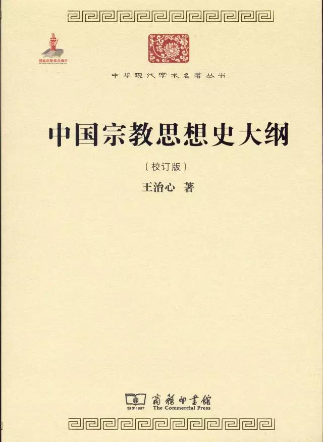
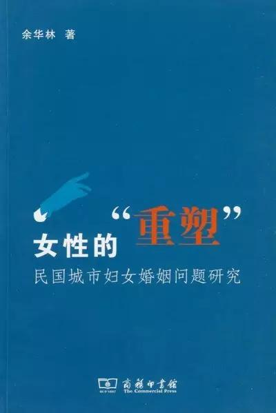
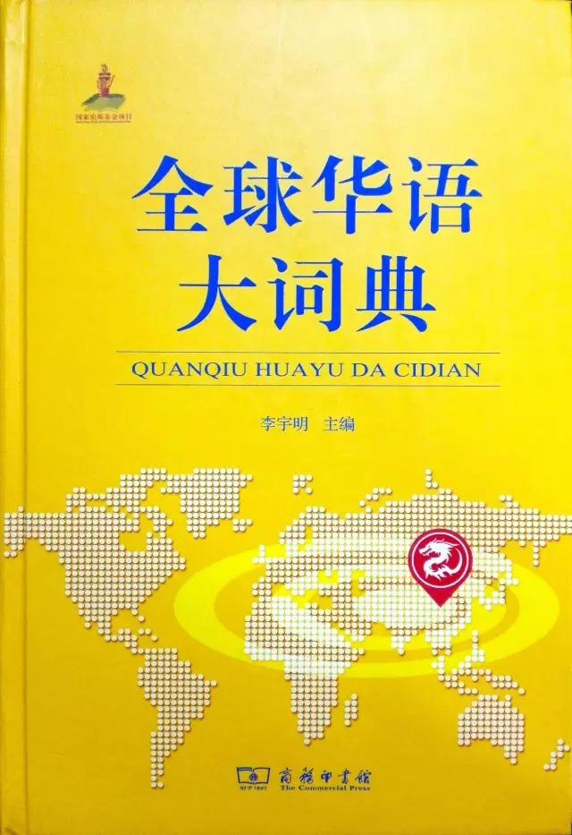
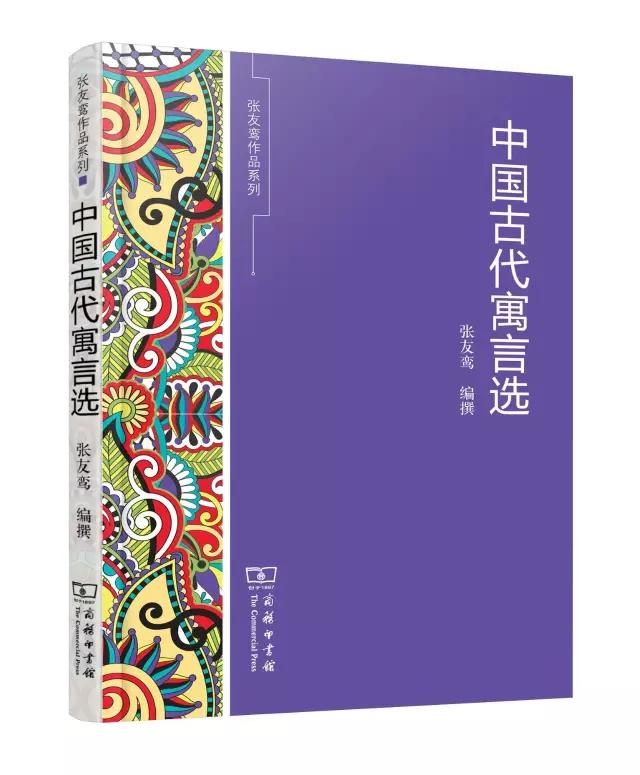

## 100本中国书（必备书单）  

> 发布: 商务印书馆  
> 发布日期: 2016-07-29  

中国文化，于世界为先进。

——钱穆

轻视文化，一个民族就没了灵魂，忽略学术，我们就断了精神的根，也就不会有尊严和长久的发展。

—— 江蓝生（中国社会科学院原副院长）

中华民族是全世界最富忍耐力的，当其他的民族只顾及到数十年的近忧之时，中国则已想到几个世纪之后的远虑……中国人能自由地追求符合人道的目标，而不是追求白种民族都迷恋的战争、掠夺和毁灭。

—— 罗素

儒家的生命力在于，作为周传统的守护人，他们亦成为中华文明的捍卫者。……儒学将它的所有一般观念根植于对已存的习俗、学问和历史先例的缜密的研究之中，它独自许诺将个体完全一体化于它的文化、社会和宇宙之中，这一定是中国社会得以延续的秘密之一。

——英国著名汉学家葛瑞汉

要围绕我国和世界发展面临的重大问题，着力提出能够体现中国立场、中国智慧、中国价值的理念、主张、方案。
我们不仅要让世界知道“舌尖上的中国”，还要让世界知道“学术中的中国”、“理论中的中国”、“哲学社会科学中的中国”，让世界知道“发展中的中国”、“开放中的中国”、“为人类文明作贡献的中国”。

—— 习近平（2016年5月17日在哲学社会科学工作座谈会上的讲话）

**20类书，每类5本，共100本，关于中国，关于我们自己。**

**一、国学**

钱穆在《国学概论》中说，“国学一名，前既无承，将来亦恐不立，特为一时代的名词。”

**1\. 任继愈《国学读本》** **国学大师任继愈先生生前主编的最后** **一部著作。弘扬中华人文精神、展示国学精华。**

**
**

任继愈先生说：“一个民族的文学、史学、哲学、宗教最能体现这个民族的性格和风格。”

不同于传统的经史子集编纂，分文学、历史、哲学三编，以阅读学习经典为主，有导读、注释、评析，辅以中外名家评论，配有参考书目。

**2\. 钱穆《劝读论语和论语读法》** **一部《论语》，中国人读了几千年；一部《论语心得》风靡全球，畅销数百万，被译成多种文字。但，读《论语》究竟有什么用？《论语》究竟应该怎么读？国学大师钱穆为您解答。**

凡关心吾中华民族之生命前途，必连带关心及于吾民族文化之传统。凡关心吾民族文化传统者，又必关心及于吾古圣先师之孔子。

若使中国人，只要有读中学的程度，每人到60岁，都读《论语》40遍到100遍，那都成圣人之徒，那时的社会也会彻底变样子。

——钱穆

**3\. 张荣明《中华国学》 在中华民族历史上占有重要地位、对当代生活具有深刻影响的学术思想。**

**
**

立足于现代学术进行本质性的阐发，而不是传统的四部之学的概要介绍；

立足于实用的学术，而不是空洞的思想学说；

立足于深入浅出的知识，而不是泥古不化的说教。

**4.梁启超《国学小史》 据国家图书馆所藏《国学小史》手稿及梁启超自述并与胡适通信整理而成。**

1920年冬，梁启超应清华学校之邀，开设课外讲演《国学小史》。该系列演讲的讲稿，在梁氏生前，仅以论文或单行本形式发表部分内容。

**

**

**
**

**5.钱穆《国学概论》 将我国古代学术，按每一时代学术思想、主要潮流，略加阐发，使读者了解两千年来学术思想流传变迁的趋势。 **

钱穆，“中国最后一位国学大师”。

《国学概论》讲述“二千年来本国学术思想界流转变迁之大势”。

“国学”一名，前既无承，将来亦恐不立。特为一时代名词。

**
**

**二、生活**

**
**

**6\. 沈从文《 **中国古代服饰研究** 》中国古代服饰研究系统化工程的开山之作。**

世界任何一个国家，都没有条件保存得那么丰富完整的物质文化遗产于地下。

砥砺18载，25万字，900余幅图片

受周恩来总理嘱托而作

曾被作为国礼送给英国女王和美国总统

**
**

**7\. 王学泰 《华夏饮食文化》从物质和精神两方面对我国饮食文化探讨。**

**
**

重点介绍了各时代的食物、肴饌、食品加工、烹调、饮食习俗乃至进餐环境、食具餐具等等情况，并论述了不同阶层人群的饮食生活。

**
**

**8.** **李建民《从中医看中国文化》  ** **中国医学不仅是一门技术，同时也是一个认识生命、想象身体、辩证知识的入口。**

**
**

探讨中国历史中的医学知识及身体建构，及其衍生的文化、政治、社会与性别意义。本书呈现中国医学传统极其多元复杂的面貌，不同的课题之间的关联，尤其引人入胜。

**
**

**

**

本书内容是作者在台湾清华大学、台北大学、香港中文大学相关课程讲座整理、修订而来。所授内容受到学生的欢迎。

**9\. 孙立群《 **中国古代的士人生活** 》从读书生活、住与行、衣与食、聚会结社等方面详细论证了中国古代士人的组成结构及其分化，阐述了古代士人与仕途密不可分的联系。**

入选国家新闻出版总局组织30家媒体、网站评选的2014年度“大众最喜爱的50种图书”。

**
**

**10\. 宋兆麟《古代器物溯源》 介绍了50余种中国古代器具，如弹、弓、弩、鹿笛等，并对其使用和流传情况进行了详细考证。**

小物件大内涵 探寻古代小玩意儿

穿越前必须了解的50种器具常识

活在古代不穿帮，你必须了解的古代小物

一物一图，看图识物，考古专家为你探秘骨牌演变历史，陪嫁画的讲究

** **三、读书之书****

** ******

**11.张明仁《古今名人读书法》** **不仅是读书法方法，更是一部中国人阅读的历史，一部国学指导教材。**

采集古今三百余位名人读书心得，列为八百余则，上自孔孟，下至蔡元培、胡适之，以时代为序，依次罗列，便于检索。书末附相关书目数十种，并介绍其作者、版本、存佚，乃至内容之优劣，尤便查考。

**12.朱自清《诗言志辨 经典常谈》** **研究《诗经》和古代典籍的经典之作。**

**
**

《诗言志辨》是对《诗经》的专门研究，《经典常谈》是对古代典籍的概论性著作。两书对现代的古典文学研究影响深远。

**
**

**13.** **余嘉锡《目录学发微 古书通例》** **余先生认为目录学的根本意义在于“辨章学术，考镜源流”。**

对目录书的体制、目录学的源流、历代目录书的类例沿革阐述甚详，举出目录学的体制有四种类型。《古书通例》（是一部从宏观角度研究古籍的专著，对于汉魏以前的古书，经过探微索隐，详加考证，分析归纳以阐明古书的通例。

****

**14.任继愈《中国藏书史话》 古代典籍之多，居于世界之首。**

**

**

**15.姚名达《** **中国目录 **学**** **史》** **一部具有里程碑意义的，能够站在现代学术的立场，对中国古代的目录及目录学给予全面的、科学性总结的著作。**

**四、经济**

**
**

**16.陈焕章《孔门理财学》 中国人第一次以西方现代经济学语言，向世界学者全面展示中国古代儒学经济思想的重要著作。**

“以义理财之科学”，中国学者在西方刊行的第一部中国经济思想名著，本书是一部思想史、经济史、制度史，甚至是财政史。

延伸阅读：

《中国厘金史》：20世纪上半叶清代财政史领域最具代表性的研究著作。（陈锋）

**
**

**17\. 王亚南《 **中国经济原论** 》首倡“中国经济学”概念，是“影响新中国经济建设的10本经济学著作”之一。**

**
**

以半封建半殖民地的旧中国作为研究对象，分析了其经济结构、经济运行、主要矛盾、发展方向，以及旧中国政治经济学概貌等。

**
**

延伸阅读：

\(1\)《中国历史上的基本经济区》：也许是迄今为止任何西文书籍中有关中国历史发展方面的最卓越的著作。（中国科学院外籍院士李约瑟）

\(2\)《中国国民所得》（一九三三年）（外一种：国民所得概论）

**18\. 马寅初《 ** **财政学与中国财政——理论与现实**** 》（全两册）将当时中国经济混乱的实情与西洋的学理结合起来，指出了症结之所在。**

反对原封不动将外国学说移植于中国，由此对凯恩斯理论及其学派的学识结合中国经济现实进行整理,得出一个轮廓，使读者一目了然。

**
**

**
**

**19\. 易纲《 **中国金融改革思考录** 》** **作者近年来思考中国金融改革的历程与成就、政策与措施的结晶。**

**
**

主要论题包括政府与市场的关系、经济与货币政策、中国金融企业改革开放的逻辑等，既有很高的学术价值，又有重要的政策指导意义。

**20\. 厉以宁《 **中国道路与蓝领中产阶级成长** 》** **未来来自个人的努力，而非依赖于家庭出身、父辈的门第或者祖上留下的遗产。**

中国的经济发展呼唤更多的“新蓝领”，发展壮大中国的“蓝领中产阶级”。

中产阶级并非仅仅来自于受到高等教育的、从事白领工作的人群。蓝领中产阶级是指从事劳动工作的雇员，由于工资水平的上升而加入城市的中产阶级。

**
**

蓝领中产阶级的成长还告诉人们，在一个既重公平、又重效率的社会里，这一事实本身表明了公平和效率是可以同时实现的，而且公平和效率可以处在相互促进的状态。

**五、 社会学**

**
**

**21\. 吴文藻《 论社会学中国化》中国社会学、人类学和民族学本土化、中国化的最早提倡者和积极实践者。**

中国目前问题的核心，一言以蔽之，是整个社会组织的解体……问题的症结，还在中西文化自接触以来所引起的根本冲突。

****

**22\. 杨开道《 **中国乡约制度** 》研究乡村组织和自治习俗的代表性著作。**

**
**

乡约制度是中国古来昔贤先觉建设乡村的一种理想，一种试验。他试验过多少次，有时成功，有时失败，然而理论一天一天的完成，工作一天一天的具体，整个实现，整个成功的时机大约也快了。

——杨开道

**23.** **费孝通《 **乡土中国 生育制度 乡土重建**》** **中国社会学和人类学的奠基人之一。**

中国人为什么如此讲究长幼有序？为什么故土难离还要落叶归根？

中国为什么是熟人社会，为什么攀交情重关系不重权利和契约？

延伸阅读:《中国秘密社会史》

**24**. **吴景超《 第四种国家的出路》发展都市以救济农村。**

**
**

中国人的问题最为艰难，而中国人对于改良的工作，也应当特别努力。

**
**

**

**

**
**

作者以人口密度和职业分派为标准，将世界上的各个国家分为四种类型。中国属于第四种类型，即人口密度颇高，但在农业中谋生的比例也较高。中国人要提高生活程度就必须开发资源，实现工业化，公平分配，控制人口数量。

**25\. 梁漱溟 《乡村建设理论》** ** **一个现代国家建设的系统方案。****

** **
****

我们的两大难处：第一点是高谈社会改造而依附政权；第二点是号称乡村运动而乡村不动。

 **延伸阅读:**

《中国的乡村与城镇生活》

《当代中国社会学》

**
**

**六、地理**

**
**

**26\. 顾颉刚 史念海《 **中国疆域沿革史** 》** **第一部公开问世的系统的历史地理专著。**

**
**

记述了从夏代到民国初年中国各个朝代疆域的变迁，以及各个朝代地方制度改革的情况，书中附有31个制度表和27幅各朝代疆域地图。

**
**

**27\. 顾朝林《 **中国城市地理** 》** **目前国内出版的第一本中国城市地理著作。**

**
**

力图全面反映国内中国城市地理的最新成果，为国民经济发展、城市规划和建设服务。是目前国内这一领域内容最全面，资料最翔实的一部力作，具有很高的学术性和较强的可操作性。

**28\. 王成组《中国地理学史》（先秦至明代）** **被称为是给中国地理学史研究带来“转变”的重要著作。**

曾被称为是给中国地理学史研究带来“转变”的重要著作。作者采用各个历史时期的代表著作表现出我国地理学上的新观点、新观察方法和新整理方法的创立与因袭的过程，以及少数正误观念之间长期存在的矛盾。

**
**

**29\. 冯承钧《 **中国南洋交通史** 》 **中国海洋交通史的开山之作。** **国内首次对中国历代与南洋相关的政治经济活动、各次航行的路线、所经过的地区的地名沿革、风土人情进行综合考察。****

在对作者所掌握的大量中外资料进行考证的基础上，在国内首次对中国历代与南洋相关的政治经济活动、各次航行的路线、所经过的地区的地名沿革、风土人情进行了综合考察，对以往史志中一些地名上和路线上的存疑或不明之处提出了自己的见解。

**

**

**30.** ** **靳尔刚 苏华《职**** ** **方边地——中国勘界报告书** 》（全两册）第一部系统全面地介绍我国勘界情况的书稿。**

**
**

论述了自1995年开始的全国省县两级陆地行政区域界线勘定情况，并用专章叙述了党和国家领导人处理边界争议的情况。

**七、政治**

**
**

**31\. 王亚南《 **中国官僚政治研究** 》用马克思主义科学方法系统地剖析传统官僚政治的著作。**

**
**

作者从分析中国社会经济形态入手，结合秦汉至民国的历史找出官僚政治的产生、形态和特征，及其与封建社会长期停滞的关联；并从与西方官僚制度的对比中，揭示出官僚政治发展和转化的一般规律，颇多卓越创见，至今仍具现实意义。

延伸阅读:

\(1\)《早期中国的政治与文明》

\(2\)《中国近现代文官制度》（全两册）

**32\. 萧公权《 **中国政治思想史** 》** **中国政治思想学奠基之作，运用西方实证治学方法，全面考量和分析中国政治思想史，开创中国政治思想研究新局面。**

富强为国策之主干，君主为国政之中心。毁灭宗周，解散封建之政治离心力，至此竟转化为促成集权专制之向心力。始皇之统一，不过因势利导，以一王全局之专制，代七雄分地之集权而已。

—— 萧公权

**33\. 鲍明钤《 **中国民治论** 》** **研究近代中国的宪政历程与出现的诸多问题、 从政治学、宪法学方面对内阁制与总统制、统一制与联邦制等诸多问题进行理论上的研究。**

**34\. 李剑农《 中国近百年政治史》** **一部 中国近代政治通史。史料之丰富，论述之详尽，实为其他同类书所不及。**

延伸阅读:

《近代中国的民族国家建设》

**35.《 **世界政要和名人谈 21世纪的中国与世界**》39位世界政要及中、外名人在“21世纪的中国与世界”国际论坛上的讲演。**

**
**

日本前首相、联合国前秘书长、德国前总理、英国前副 首相、泰国前国务部长、美国金融家索罗斯等外国名人。他们的讲话肯定中国经济取得的成绩，也指出中国发展中面临的问题和挑战，对世界政治、经济前景发表看法。

**八、法律**

**
**

**36\. 瞿同祖《 **中国法律与中国社会** 》** **学术界的开新之作，被认为是关于中国法律研究最好的西文著作。**

法律与社会有着密不可分的依存关系，它维护了当时社会的制度、道德和伦理等价值观念，也反映了一定时期的社会结构。

作者兼跨社会学、历史、法律三个学科，开创了把法律与社会史的结合研究，由此形成了一种新的学术研究体系，被称为法律社会史，《中国法律与中国社会》即为这一研究的代表之作。作者对于中国法制史学科发展的独特贡献，直到今天仍难有人超越。

**37\. 杨鸿烈《 **中国法律在东亚诸国之影响** 》回顾数千年来心血造指之宝贵财产。**

距今百年余年以前，东亚大地之文化殆无不以中国为惟一之微源地，而东亚诸国家亦咸兢兢以追随中国为当务之急，法律特其一端耳。

——杨鸿烈

延伸阅读:

《中国法制史》（中国大学法学教科书）

**
**

**38\. 陈顾远《** **中国法制史概要** **》** **公认的法制史名著， 堪称以近代部门法理论研究法制史的经典性著作。**

**
**

****

与传统法制史研究重考据不同，本书着重按照法律门类系统梳理史料，其关于中华法系演进的理论独成一家。

《中国法制史概要》为作者数部著作中影响最大的一部，被法学界誉为开专题史研究之先的著作。几十年来，这部著作影响着海峡两岸的几代法律学人。

**
**

**
**

**39\. 张晋藩《 **中国**** **监察法制史稿 》以我国历代监察法律制度为研究对象，探讨了监察机构的设置、监察制度的构建、监察活动** **的合法性根据等。**

**
**

张晋藩教授是我国法学领域的泰斗，他的一系列主要著作构筑了中国法律史学的基本理论框架。作者现为中国政法大学教授，兼任中国法律史学会的专业顾问、中国法文化研究会会长。

**40\. 何勤华《 **中国法学史纲** 》从汉语“法学”一词的起源入笔，系统梳理了中国古代法学的诞生、发展、兴盛、成熟到衰亡，近代中国法学的成长。**

**
**

对中国法学各个学科的形成和发展，以及这一形成和发展背后所涉广阔的社会历史背景进行了论述，对推动中国法学从古代向近代乃至走向现代化的历史上著名法学作品和法学家、律学家进行了具体的介绍和点评，对中国法学史在中国学术发展史中的历史地位和重要意义给予了评价，最后作者还阐述了对法学发展规律的基本看法。

**
**

**九、宗教**

**
**

**41.王治心《中国宗教思想史大纲》（校订版） 我国宗教史研究上的一本奠基性的著作。**

本书是我国著名学者王治心先生的一部重要著作。在这部著作中，作者分六章，叙述了从上古以迄近今中国宗教思想演变的历史。

**42\. 傅勤家《中国道教史》 中国的第一部真正意义上的道教史。**

**
**

从探讨宗教共同点出发，论述道教的起源与演变，道教的信仰与道术、戒律，道教的经典与宫观，道教的派别与佛道关系，展示了道教的历史发展主脉，对于后世的道教学术研究保持着长久的影响。

延伸阅读：

《中国的道教》

**
**

**
**

**43\. 蒋维乔《中国佛教史》** **中国第一部以近代方法写就的佛教简史。**

**
**

“历史之研究，实足为教理之辅助”，此即为蒋维乔撰写本书之出发点。《中国佛教史》不仅对《支那佛教史》进行了全面的梳理，而且新增了许多内容，使中国佛教史显得更加完整。

延伸阅读：

\(1\)《佛学研究十八篇》

\(2\)《漫画佛教经典》

\(3\)《欧阳竟无内外学》

**
**

**44\. 李安宅《 **藏族宗教史之实地研究** 》国内外公认为通过实地考察和社会调查而撰写的有关藏族宗教史的第一部杰作。**

作者对甘南藏区藏传佛教格鲁派（黄教）六大寺院之一的拉卜楞寺进行了三年的实地考察的成果，这部著作虽然是半个世纪以前的旧作，但它是我国对藏传佛教进行实地考察的一个开端，标志着一个时代的学术水平。

**45.朱谦之《中国景教》** **朱谦之晚年写作的最后一部著作，全面地、完整地论述了景教的起源、发展和在中国的传入及传播情况。**

延伸阅读：

《基督教与中国文化》

《中国天主教传教史概论》

**十、博物**

** **

**46\. 潘富俊《 **草木缘情——中国古典文学中的植物的世界** 》你相不相信植物会解决文学史上的公案？它们说《红楼梦》不是曹雪芹一个人写的。**

文学作品中植物名称的辨析与古今演变，植物的文学意境，国画中表达画家情意志趣的植物，礼仪植物及文学植物引进史均有涉及，可以说是作者近半个世纪研究成果的最为系统、最为集中的展现，可以满足读者对该主题的阅读需求。

第二版借鉴、吸收了近年来国内外相关领域最新的研究成果，修订内容达一百余处，置换图片二十余幅。主要奖项：2015中国好书、文津图书奖。

**47\. 付新华《 **中国萤火虫生态图鉴** 》中国第一本萤火虫生态图鉴。**

**
**

研究者辨识萤火虫的工具书，爱好者观赏萤火虫的指导书。

** **

****

**48\. 马克平《 **中国常见植物野外识别手册：苔藓册** 》国内首本便携的苔藓识别手册。**

本书精选中国南北各地苔藓植物代表种88科186属306种。可供国内大多数省市的自然爱好者和园艺工作者作参考。

延伸阅读：

《中国常见植物野外识别手册：祁连山册》

《中国常见植物野外识别手册：衡山册》

《中国常见植物野外识别手册：荒漠册》

**49\. 张鹏 **《猿猴家书——我们为什么没有进化成人》** **第一本以书信形式介绍灵长类及其进化的科普书。****

入围2015中国好书

入选国家新闻出版广电总局2016年向全国青少年推荐的百种优秀出版物

我们是谁？我们从哪里来，要到哪里去？我们为什么没有进化成人？

**50.郭郛 《尔雅注证：中国科学技术文化的历史纪录》（全两册）** **涵盖自然科学、社会科学、人文科学内容的百科全书。**

**
**

本书 由我国著名的动物学家、自然科学史家郭郛进行注证。他将《尔雅》一书十九章有序地分类和校正。其中，释天、地、山、水和草、木、虫、鱼、鸟、兽、畜篇是人类和生物生活、生存环境的生物环境科学、生态系统科学的经典篇章。

**十一、三农**

**51.万国鼎《中国田制史》 一本系统阐述中国土地制度的演变及其土地资源利用与管理的专著。**

**52\. 邓云特《 **中国救荒史** 》收录上自晚清下至20世纪80年代末中国大陆及港澳台地区、以人文社会科学为主体兼及其他。**

**

**

**53.理查德·R.托尼 《中** **国的土地和劳动** 》 **英国著名经济史学家理查德·托尼1930年代撰写分析了当时中国的经济和社会发展状况。**

作为一个关注中国的学者，托尼在这部著作中，肯定了中国自身的优势以及中国在经济发展中取得的进步，也在很多方面非常有针对性地指出了存在的问题。本书对于研究20世纪30年代及以前的中国农业、农村问题有重要的参考意义。

****

**

**

**54\. 赵树凯《 **农民的鼎革** 》关怀农民在中国社会变革中的角色地位。**

**

**

**
**

**55\. 费孝通《 **江村经济——中国农民的生活** 》称为研究中国经济、社会与文化的必读之书，最初是作者用英语写就的博士论文。此番以英汉双语形式重新出版。**

这是一本描述中国农民的消费、生产、分配和交易等体系的书，是根据对中国东部，太湖东南岸开弦弓村的实地考察写成的。它旨在说明这一经济体系与特定地理环境的关系，以及与这个社区的社会结构的关系。

**十二、婚姻与家庭**

**56.陈顾远《中国婚姻史》 现代中国婚姻史研究领域的开山之作。**

按我国向之所谓婚礼，无论在婚义或婚仪方面，除有类于现代民事法者外，实即当时代社会意识之结晶，此与社会现象为有关者。

**57\. 高罗佩《中国** **古代房内考——中国古代的性与社会》 影响世界看中国的汉学名著之一。** **
** ****

一部从社会史和文化史的角度研究中国古代性生活的学术专著。作者在书中运用了大批中文史料，有些是海外珍本秘籍，有些是从浩如烟海的中国旧籍中细心钩稽出来，工程庞大。 根据时间的先后顺序，对汉代至清代，以及维新时期和近代的妇女生活状况进行了描述。本书批判了传统中国在制度、习俗、生活中对妇女的种种压迫和不公。

**58\. 陈东原《 **中国** **妇女生活史** 》** **中国妇女史第一部系统性的论著。**

该书时间跨度从中国上古至民国，以朝代分章，各章中又以主题分节，例如婚姻、礼教、妇女教育、妇德、妓女、贞节观、缠足、近代的女权运动等。

在观点上该书由于受到民初新文化运动的反传统思想的影响，对於传统中国在文化上、制度上和实际生活中对於妇女的种种不公、压制多有描述及批判。该书资料极为丰富，且论述范围甚广。

**59.张念《性别政治与国家：论中国妇女解放》 从小闺阁到大世界，从三寸金莲到女性同志，从铁姑娘到身体写作，我们能走多远？ **

深刻呈现中国妇女解放过程中的种种矛盾与悖论，在理论视野中铺展中国妇走向自由的曲折历程，实属一部填补当今学术空白之作。

**
**

**60.余华林《女性的“重塑”——民国城市妇女婚姻问题研究》 通过对城市妇女实际婚姻生活中所发生的复杂变化，揭示出婚姻观念与婚姻行为变化背后的文化、价值冲突。**

**
**

**十三、教育**

**
**

**61\. 陶行知《 **中国教育改造** 》教育救国的思想“这部书代表我在中国教育里摸黑路所见着的几线光明”。**

他（陶行知）一生所想做的就是一件事——培养人去创造理想的社会。

—— 储朝晖

**62\. 郭秉文《 **中国教育制度沿革史** 》一本书了解中国教育史，是第一本以非中国传统视角、用英文介绍中国教育体制沿革的书。**

**
**

空前之作……一部大历史，其始生活而已。

—— 黄炎培

**63\. 舒新城《 **近代中国留学史 近代中国教育思想史**》中国近代第一部研究留学问题的专著。**

教育史是人类教育的自我意识之学，是通过研究主体而展开的历史与现实的对话。

——于述胜

**64\. 张雪门《 **幼稚园教材研究 幼稚教育新论**》梳理了中国幼儿教育的历史及背景，提出了今后幼稚园教育发展的思路、课程和方法。** **
**

**
**

“中国的福禄贝尔”

影响台湾近代教育的前二十人物之一

张雪门的幼稚教育论述便是全球观点下思考中国本土需求的产物。

——翁丽芳

**65** **. 黄达人等《 **大学的治理** 》** **访问20所海外大学校长，以对话形式，为国内大学提供有益的参考。**

****

延伸阅读：

《大学的声音》

**十四、文学**

**
**

**66.** ** ** **钱钟书** **《谈艺录》** **中国一部集传统诗话之大成的书，也是第一部广采西方人文、社科新学来诠评中国古典诗学诗艺的书。**

**
**

书中对古来诗家作品多所评骘，唐以后一些有代表性的诗人更被重点论列。本书征引或评述的内容包括曾作为思想理论界显学的佛学、精神分析学、结构主义、文化人类学、新批评和较新起的流派如超现实主义、接受美学、解构主义等。

**67.** **《 诗经》** **我国第一部诗歌总集精选。**

**推荐读本：《诗经选》（古代诗词典藏本，袁行霈题词推荐）**

诗三百，一言以蔽之，思无邪。

不学诗，无以言。

—— 孔子

颂其诗，读其书，不知其人可乎？是以论其世也。

—— 孟子

始乎诵经，终乎读礼。

—— 荀子

**68\. 龙榆生** **《中国韵文史》** **讨论韵文的权威著作。**

**
**

作者以一般研治诗词学者所不及的敏锐思辨能力和广阔的视野。注重体裁之发展与流变， 精要地勾勒出了中国古典诗、词、曲发展流变的轮廓及其历史文化背景。

**69\. 王国维** **《王国维文学论著三种》 关于《红楼梦评论》《人间词话》和《宋元戏曲考》。**

《王国维文学论著三种》整理出版了王国维的《红楼梦评论》、《人间词话》和《宋元戏曲考》， 为便于读者更为全面、深入地了解王国维的这三种文学论著及其在文学研究方面的相关成就，《王国维文学论著三种》还选收了王国维的词作及一些相关的著述作为附录。

**70.** **郭绍虞 **《中国文学批评史》（上**** **、下）** ** **上卷中讨论问题的重心，是文学性质与方法的讨论，而下卷的重心，又转移到批评理论的讨论。****

**十五、 军事类**

**
**

**71.孙武《孙子兵法》** **我国最古老最杰出的一部兵书，超越军事领域的兵法。**

**
**

观诸兵书，无出孙武。

—— 李世民

兵者，国之大事，死生之地，存亡之道，不可不察也。

—— 孙子

**72\. 雷海宗 《中国文化与中国的兵》重点剖析了两千年来中国兵员的组成、兵制和兵文化。**

**
**

探讨了中国古代中央与地方的关系、文官与武官的关系、士大夫与流氓的关系、家族制度与国家架构的关系、皇族血统退化与中国国力盛衰的关系、中国历史的分期问题等，由此引申出他对中国历史的全新解释。作者把注意力放在中国古代军队的人员组成上，认为这是决定中国军队战斗力、乃至决定中国国力的一个重要因素。

延伸阅读：

《绿营兵志》

**73\. 丁中江 《北洋军阀史话》** **台湾历史学家丁中江先生呕心沥血之作。**

自1964年问世以来，行销华语世界数十年，至今累计印行十余版。世界各国大图书馆中，凡有中文藏书，必有《北洋军阀史话》。

****

**
**

**74\. 卜正民 《秩序的沦陷：抗战初期的江南五城** **》 一部研究战时社会复杂性的新作。**

卜正民教授的非凡之处，在于他长期发掘并研究中日双方高质量的档案资料与回忆录，故而能以个案研究的方式，展示战时问题的隐晦性与复杂性……这部书对中日战争史的研究与现代中国史的研究，都有不可估量的价值。

——大卫·P.巴拉特（DavidP. Barrett）：《中国历史评论》

**
**

**
**

**75\. 韩永利《 **第二次世界大战与中国抗战地位研究** 》通过对史料深入细致的分析研究对以往的某些观点作了改进和修改，观点新颖独特，值得一读。**

中国抗日战争在世界反法西斯战争中的战略地位，战时中美战略关系，太平洋战争爆发前美国东亚政策的演进历程，战时中外关系的发展变化，中国持久战胜利与法国短期败降的原因和历史启示六个方面循序渐进地研究阐述了第二次世界大战与中国的抗战地位，内容丰富、史料翔实。

延伸阅读：

《抗战时期的重庆文化》

《黄埔军校生活史》（1924-1927）

**十六、工具书**

** **
****

**76.《辞源》（第三版）** **中国现代史上第一部大型语文性工具书，** **通往传统文化的桥梁 。纪念《辞源》出版一百周年，新修第三版，一部兼收古汉语语词和百科的大型综合性辞书。**

**
**

**

**

* 北京大学何九盈教授、北京师范大学王宁教授、中国社会科学院董琨研究员任修订主编，来自全国高校及科研院所的100多位专家学者参与修订。

* 《辞源·第三版（套装全2册）》收字头14210个，复词92646个，插图1000余幅，约1200万字。

* 借助大型语料库，探求字、词的形源、音源、义源、典源和证源，择定字形，完善注音，修订释义，补充书证，力求音义契合、义例契合。

* 增收典章制度、宗教器物类条目6500余个，突出百科知识的贮存功能，揭示中华传统文化的历史渊源。

**77.《新华字典》（第11版）** **新中国第一部现代汉语字典，荣获吉尼斯世界纪录：“最受欢迎的字典”和“最畅销的书\(定期修订\)”。成为中华文化的一块基石。**

**

**

承载恢宏的大国文化，凝聚着几代学人的心血和智慧，影响了亿万民众的语言生活，为中华民族的文化普及和教育事业的发展做出了巨大贡献。

** ** **78.《新华成语词典》（第2版）****** **集录成语精华，浓缩中国智慧。荣获第五届国家辞书奖。**

**

**

* 审核、调整词目，收词从第1版的8000余条增加到10000余条，增收大量古今常用成语及新近产生的成语。

* 全面检查、改进释义。

* 核查书证；补充及更换部分更典型、更恰当的书证。

* 调整语源阐释方式，增加“语本”体例以表明成语定型之前的语源。

* 以常用常见和兼顾语源为原则，对部分主副条进行调整。

* 词典采用双色套印，条目释义部分用蓝色楷体表示，较第1版更为清晰、美观。

**
**

**79.《古汉语常用字字典》（第5版，即将上市） 首届中国辞书奖一等奖。著名语言学家王力、岑麒祥、林焘、戴澧、唐作藩、蒋绍愚等先后主持或参与编修工作。是学习古汉语的必备工具书。迄今发行量超过1000万册。**

** **
****

** **
****

** **80.《全球华语大词典》**** ** **呈现全球华语风貌，彰显多彩中华文化。一部华人学者合力打造的大型华语词典。****

**

**

**十七、文化**

**
**

**81.陈登原《中国文化史》\(上下册\) ****中国文化史研究早期的一部代表性著作。**

**
**

考察了从上古到近古的中国文化的生成、定型、发展的历史。全书以资料丰富见长，立论也颇有深度，为民国时期研究中国文化史的必读书。

**延伸阅读:**

\(1\)《中国文化史导论》（修订本）

\(2\)《中华传统文化探幽》

**82\. 任继愈《 **中国文化史知识丛书** 》（100种）多角度、多层次地反映中国文化的主流与特点。**

**
**

****

****

****

**83\. 张友鸾《 **中国古代寓言选** 》中国古代寓言源远流长，历史悠久，中国被公认为是世界寓言三大发祥地之一。** **
**

**
**

从《庄子》《孟子》《韩非子》等几十部中国古代经典中，整理编写寓言近二百则，并亲译为白话文。

**84.** **张先清《 **小** **历史：明清之际的中西文化相遇** 》** **从“小历史”角度，深入考察不同文化背景的文人文化接触行为，提供了一种审视明清之际中西文化相遇 的“大历史”视角。**

**85.  吴小鸥《文化拯救——近现代名人与教科书》** **窥见近代中国经历三千年未有之大变局的一个侧影。**

**
**

** ******

本书分别讲述了从19世纪末叶到20世纪中叶十六位先贤编写教科书的往事。他们社会身份不同，政治倾向各异，都在教科书编写方面留下了难以磨灭的历史印记。本书资料扎实，语言平实，叙事翔实。

——丁东 （著名学者）

**
**

**十八、艺术**

**
**

**86.** **裴文中** **《旧石器时代之艺术》 我国最早、较有影响的研究史前艺术的著作之一。**

这是我国著名考古学家裴文中先生于1935年在商务印书馆出版的专著。书中系统详细地介绍了史前时代的人类艺术作品，如雕刻、彩画、塑像等。

****

**87.徐复观 《中国艺术精神》只有以庄子为代表的道家艺术精神构成了中国艺术精神的主体，山水画的出现，乃庄学在人生中、艺术上的落实。**

徐氏与唐君毅、牟宗三被尊推为港台新儒家“三大师”。

**88.《中国设计全集》 以建筑内容反映中国传统建筑的艺术特征、文化特征与技术特征。**

本卷为共收录与解析了150个案例。主要涉及中国古代、近代传统建筑中的宫殿、官邸衙署、民居、园林和庭院院落五大部分，案例分布在我国的北京、山东、河北、辽宁、西藏、陕西、江苏、上海、浙江、广东、山西、安徽、四川、福建、云南、吉林、江西、新疆十八个省市自治区及台湾地区。

**89.《中国当代设计全集》 中国设计最近的60年，超过了设计史上任何一个变革时期，几乎是一场彻底的造物革命。**

续了首创的“案例研究标准”和“案例研究手法”，应用当代世界通行的现代设计学标准，对每一件经典案例的四大设计要素（功能设计、材料设计、工艺设计、形态设计）进行详细的剖析绘图和文字解读，从品种上囊括了与中国当代社会生产方式与生活方式密切相关的方方面面，填补了中国当代设计史学的空白。

**90.** **宗白华《艺境》** **“融贯中西艺术理论的一代美学大师” 宗白华先生唯一自选的文集 。**

**十九、历史**

**
**

**91.** **钱穆** **《国史大纲》** **创编纂通史的一种新体例。首重政治制度** **，次为学术思想，又次为社会经济。社会经济为最下层的基础，政治制度为其最上层的结构，而学术思想则为其中层的干柱。**

当信任何一国之国民，尤其是自称知识在水平线以上之国民，对其本国已往历史，应该略有所知。尤必附随一种对其本国已往历史之温情与敬意。

——钱穆

**92\. 丁山《古代神话与民族》** **丁山先生的遗著。**

**
**

一个民族，追寻他的文化来源，由文字记载以前至于邃古之初，时代愈悠远，故事愈神秘，神秘至于不可再追寻的阶段，便断之以洪水。

——丁山

**
**

丁山先生主要就中国上古史的一些重要问题——如三代都邑迁徙、殷商史、宗法制度起源、大禹治水、炎帝事迹、神农、九州方位等进行详细考证，书中许多论点在当时乃发人所未发，具有重要参考价值。

**
**

**

**

**93\. 翦伯赞《中国史纲》** **《史前史、殷周史》出版后随即在战时的重庆文化界引起了巨大的反响；《秦汉史》则是中国史学界的第一部“秦汉史”专著。**

这本书，我虽不敢说它已经把殷周及其以前的古史，从神话的霉锈中洗刷出来，但至少它已使这一段古史，显出了它本来的面目，一言以蔽之，从神的历史还原为人的历史。

——翦伯赞

**
**

**

**

**94\. 葛剑雄《统一与分裂：中国历史的启示》** **不以王朝起讫为统一的终始，不以定论成说为立论的依据，返观纷扰的昔日天下，立足真实的历史疆域。**

作者以凝练的笔触厘清统一与分裂的长度，诠释统一与分裂的标准，穿透千年的时空隧道，追寻中国历史的分分合合。

**95\. 王大鹏  丁聪** **《百年国士》** **蔡元培、章太炎、王国维、** **季羡林、巴金、冰心、张大千等48位国士的生活轶事， 著名漫画家丁聪先生为每一位国士绘制画像。**

凡一种文化值衰落之时，为此文化所化之人，必感苦痛，其表现此文化之量愈宏，则其所受之苦痛亦愈甚；迨既达极浑之度，殆非出于自杀无以求一己之心安而义尽也。

—— 陈寅恪《王观堂先生挽词》

**二十、哲学** **
**

**
**

****

**96\. 梁漱溟《东西文化及其哲学》** **现代新儒学的开山之作。**

他在逆流而上，顶着全盘西化的狂澜，竭力提倡儒家文化的真精神。他不愧为现代儒学思想的第一人，是现代新儒家的源头活水。

——胡军（北大哲学系教授）

作者认为，人类文化的发展必然要有一个根本变革，即“由西洋态度改变为中国态度”，因为“住世思想之最圆满者无逾于孔子”。

**
**

**97\. 冯友兰《 中国哲学史》第一部完整的具有现代意义的中国哲学史，中国哲学史学科的奠基之作。**

本书基本架构已为中国哲学史界普遍接受，许多观点（如名家应分为惠施之“合同异”、公孙龙之“离坚白”两派；二程思想不同，分别为心学、理学之先驱；又如程朱异同，陆王异同，朱王异同；等等），均发前人所未发，在学术界享有盛誉。

**
**

延伸阅读：

（1）《中国哲学史大纲》：在中国哲学史研究的近代化工作中，胡适创始之功，是不可埋没的（冯友兰）

（2）《中国哲学大纲》：全书分为宇宙论、人生论、致知论三大部分。人我和谐之道的宣示被作者认为是中国哲学的最大贡献。

（3）《中国哲学批评史论》：中国近现代学术和科学的发展迟缓是与文化上的独断独行分不开的。

**
**

**98\. 蔡元培** **《 **中国伦理学史** 》（外一种）** **近代的第一部伦理学史专著，28位思想家的伦理思想，另附有《中学修身教科书》。**

吾国夙重伦理学，而至今尚无伦理学史，迩及伦理界怀疑时代之托始，异方学说之分道而输入者，如风如烛，几有互相衡突之势，苟不得吾民族固有之思想体系以相为衡准，则益将彷徨于歧路，盖此事之亟如此。

——蔡元培

**99\. 熊十力** **《 **新唯** **识** **论** 》** **“识”或“本心”乃宇宙之本体、万化之根源，“体用不二”。**

宇宙万象刹那顿变，都不暂住，犹如幻化，故曰无常。

——熊十力

**

**

**
**

**100\. 梁启超** **《 中国近三百年学术史》（新校本）呈现了梁启超对于中国学术史的系统看法，是其任教于清华大学、南开大学等校所编讲义。**

叙述明清以降中国学术之演变，经纬交织、层次繁复，分别以问题叙史、人物（学派）叙史、学科叙史，构成社会思潮史、学派史与学科史三大板块。

**猜你喜欢：**

* [史上最全“汉译名著”书目](http://mp.weixin.qq.com/s?__biz=MjM5NTY1OTI0MQ==&mid=402596146&idx=1&sn=da3086194a40af2ea9d172dc23d7ad7e&scene=21#wechat_redirect)

* [17本哲学社会](http://mp.weixin.qq.com/s?__biz=MjM5NTY1OTI0MQ==&mid=2651021766&idx=1&sn=e7d74827cd40914e906bac700f874d4d&scene=21#wechat_redirect)[科学经典 ](http://mp.weixin.qq.com/s?__biz=MjM5NTY1OTI0MQ==&mid=2651021766&idx=1&sn=e7d74827cd40914e906bac700f874d4d&scene=21#wechat_redirect)

* [那些年，我们追过的100个书单](http://mp.weixin.qq.com/s?__biz=MjM5NTY1OTI0MQ==&mid=402884733&idx=1&sn=8f47d3af19f0ea5ef5cda2c6d89993ce&scene=21#wechat_redirect)

* [那些年，我们追过的100篇暖文](http://mp.weixin.qq.com/s?__biz=MjM5NTY1OTI0MQ==&mid=402399111&idx=1&sn=7a665e85ec7467d889f453326532ae35&scene=21#wechat_redirect)

* [100本好书（必备书单） ](http://mp.weixin.qq.com/s?__biz=MjM5NTY1OTI0MQ==&mid=2651020809&idx=1&sn=0b239403259d75da20afbdb1928274c6&scene=21#wechat_redirect)

欢迎点击“阅读原文”

选购您心仪的图书
