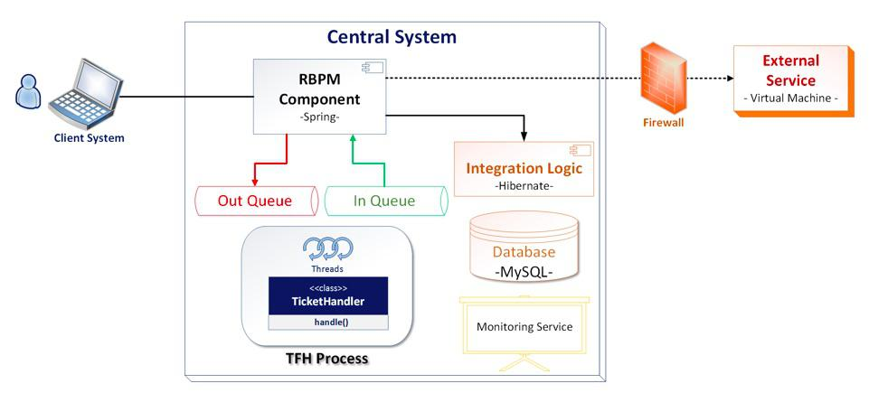

## 软件架构图的艺术  

> 作者: Ionut Balosin  
> 译者: 薛命灯  
> 发布日期: 2017 年 8 月 27 日 17:31  

> ## 要点
>
>   * 设计软件架构图并非一件轻而易举的事情，即使是很简单的一个架构图也可能会出错。有意义且具备一致性的架构图有助于为不同的利益相关者澄清事实，并达成共识。
>   * 在大多数情况下，问题的根源并不在于是否使用了一门有效的架构描述语言（比如 UML），而在于低估了架构图的重要性，转而依赖不恰当或不具备一致性的指导性原则，或者缺乏架构思维。
>   * 在创建架构图的过程中，试着混合使用自动生成的图元和手动创建的图元，这样可以减少工作量，并且可以表达出各方面的关注点，覆盖到系统的各个层面。
>   * 系统不断地发生演化，要维护更新架构图需要花费额外的精力。我们需要知道如何有效地应对这种情况，同时能够保持架构图的一致性和健壮性。
>   * 现代的软件架构带来了更多的复杂性，这些都反映在了架构图上。
>

曾几何时，我们的每一个软件项目都需要一个架构图。不管我们是否遵循正式的架构模型（比如 Kruchten 4+1、Rozanski & Woods 等），都有必要通过图表来对应用程序的某些部分进行文档化。在软件架构里，这些图表一般都是按照某些视图进行设计的，这些视图本身就是模型的一部分，不过在这篇文章里，我倾向于使用架构图这个术语，因为它看起来不是那么正式，至于其他方面的内容并不会在这篇文章里涉及到。

作为一个软件架构师和技术培训师，从我的经验来看，不同项目之间以及同一个团队的不同开发人员之间创建架构图的方式也是很不一样的。我看到过很多问题，比如一致性问题、碎片化问题、信息粒度大小的问题，以及图表的外观问题。相比架构模型的正式和标准化，架构图倒是不必要那么正式或者遵循什么标准。

不过，架构图必须是自描述的，并且要具备一致性和足够的准确性，能够与代码相呼应。这也就是为什么架构师或软件工程师在创建架构图时需要依赖各种指导性原则，因为它们是理解应用架构（比如结构、元素、关系、属性、原则）的基石，同时也是具有不同技术背景和关注点的利益相关者的沟通基础。

### 当前架构图的不足之处

在深入展开说明之前，我想引用一句英语谚语：“一张图片胜过千言万语”。[ Wiki ](https://en.wikipedia.org/wiki/A_picture_is_worth_a_thousand_words)上解释说，“这句谚语的意思是，一个复杂的想法可以通过一张静态的图片表达出来，或者图片可以表达一个主题的意思，又或者图片比文字描述来得更加直接有效”。对于架构图来说也是一样的：如果它所导致的疑问比它能解释的问题还要多，那么它就不是一张好的架构图。一张好的架构图不需要多余的文字解释！

图片：一张不是很好的架构图一般会存在如下几个问题。

现在让我们来过一下不好的架构图都有哪些问题，这些问题会阻碍我们创建好的架构图。

### 方框或其他形状表示什么意思？

* 随意使用方框或其他形状可能会引起误解。这些形状有可能表示数据、代码或者流程。一个简单的方框可能会引起多种猜想，所以很有必要显式地给这些形状添加有意义的说明。

### 形状的边线表示什么意思？

* 在一个糟糕的架构图里，形状的边线（虚线、点线，等等）可能会引起误解。边线是否表示某种组件类型（比如虚线表示容器、微服务、层，等等），或者只是因为设计者想让架构图的观感看起来更加丰富一些？所以，在使用多种边线或非标准边线时，要在图例里提供准确的说明。

### 线条或箭头表示什么意思？

* 线条或箭头可以被理解为数据流（比如从系统 A 到系统 B 的数据流）或元素间的关系（比如组件 A 依赖组件 B）。在大多数情况下，箭头所表示的关系或数据流并不会总是汇聚到同一个方向上，所以很有必要在图例里说明清楚。

### 线条或箭头表示哪一种类型的交互或关联？

* 尽管线条可以表示数据流或组件间的关系，但用于表示交互类型（对于数据流而言）或关联类型（对于关系而言）的线条或箭头仍然需要详细说明。例如，如果使用线条表示数据流，那么交互类型可以是同步或异步的，但如果线条表示的是关系，那么关联类型有可能是指依赖、继承、实现，等等。这些细节必须在图例里说明。

### 颜色代表什么意思？

* 一个使用了多种颜色的架构图却没有适当的文档说明很容易引起误解（比如为什么有些方框是绿色的，而其他是红色的？为什么有些线条是黑色的，而有些是蓝色的？）。颜色在架构图里的作用不是非常大，添加太多的颜色并不会给架构图带来更多有价值的信息。一个仅仅使用了黑白两色的架构图也应该是不言自明的，除非非常有必要使用特定的颜色来强调图中的某些部分。在任何情况下都要保持颜色的简单性，如果一定要用多种颜色，不要忘了添加说明。

### 单独的元素或实体

* 如果架构图中出现了单独的元素或实体，说明架构图有可能是不完整的。不管是从结构还是从行为角度来看，每一个元素或实体都应该依赖系统的其他部分，或者与它们之间存在某些联系。

### 费解的缩略语或含糊不清的名词

* 在为架构图中的元素添加标签时，切忌使用费解的缩略语，这样容易引起困惑。如果没有恰当的说明，字母的堆叠（比如 TFH、RBPM，等等）就毫无意义，最好在图例里进行说明（比如 TFH 表示 ticket feed handler，RBPM 表示 rates business process manager）。
* 在给元素命名时，另一个常见的问题是使用了含糊不清的名词（比如业务逻辑、集成逻辑），这些名词并不能做到自解释。代码里可能也会存在这样的问题，我们建议遵循清晰的代码原则，使用自解释的名字。

### 在架构图中详述技术、框架、编程语言、IDE 或开发方法论

* 架构图并非以技术、框架、编程语言、IDE 或开发方法论为基础，它们只是用来实现架构的工具，而不是中心关注点。它们不应该被包含在架构图里，不过可以在架构描述里简述使用它们的理由。

### 在同一个架构图里混杂运行时元素和静态元素

* 运行时元素（比如线程、进程、虚拟机、容器、服务、防火墙、数据仓库，等等）不会出现在编译阶段，而且不应该与静态元素（比如组件、包、类）同时出现在同一个架构图里。针对运行时元素有专门的类型图（比如并发图、部署图），一定要注意区别这两种元素，尽可能避免把它们混杂在一起。

### “稍后详述”或“稍后解释”

* 不包含在架构图里的任何信息都有可能丢失，而架构图里并没有额外的地方可以容纳口头说明。所有的口头说明都会丢失，当其他利益相关者（比如开发人员、架构师）查看架构图时，他们并不知道原来还有所谓的口头说明。试着把所有必要的信息都包含在架构图里，而不是事后加以说明。

### 层级冲突或混合抽象

* 在同一个架构图里添加不同层级的抽象可能会导致冲突的出现，因为它们是从不同的角度描述问题的。例如，把组件添加到上下文架构图里，或者把类加到部署图里，这些都会偏离架构图原先的目的。在创建架构图时，试着保持相同的抽象层级。

### 使用混乱或含糊不清的架构图表达过量的信息或无效的细节

* 爱因斯坦曾经说过，“凡事应该尽可能简单，简单到极致”。对于架构图来说也是一样的，我们需要谨慎地选择信息的层级和粒度，这并不是一件容易的事情，它取决于所使用的架构模型、架构师的经验和系统的复杂度。

### 在创建架构图时可参考的指南

除了上面列出的问题清单，还可以参考如下的一些指南来创建更好的架构图。

### 选择最优的架构图数量

* Philippe Kruchten 说过，“架构是一项复杂的工作，只使用单个图表来表示架构很容易造成莫名其妙的语义混乱”。要对系统进行良好的文档化，我们不能只使用一种图表。不过在创建架构图的时候，我们也难以确定该使用哪些类型的架构图以及应该创建多少个。在做出决定之前，我们需要考虑多方面的因素。例如，架构的属性和复杂度、架构师的技能和经验、可用的时间、维护成本，以及利益相关者的关注点。网络工程师可能想看到包含了主机、通信端口和协议的网络模型，数据库管理员更关心如何系统是如何操作、管理和分布数据的。所以，我们要选择最优的架构图数量，不管这个数字是多少。
* 糟糕的架构图（比如缺乏文档）可能会缺失一些信息，反过来说，如果架构图太多（比如过度文档化），那么用于保持架构图一致性和更新架构图的工作量也会相应增加。

### 保持架构图的结构一致性和语义一致性

* 架构图之间应该在方框、形状、边框、线条、颜色等方面保持一致。架构图的结构外观应该是一样的，团队不同成员创建的架构图不应该给任何一个利益相关者造成理解上的障碍。理想情况下，可以在所有项目里使用相同的建模工具。
* 从语义角度来看，所有的架构图与最新的代码变更之间以及架构图与架构图之间都应该定期保持同步，因为一个架构图的变更可能会影响到其他架构图。同步可以通过手动进行，也可以通过建模工具自动触发。通过建模工具自动触发会更好一些，不过这也取决于具体的项目。最终的目的是要保持架构图和代码之间的一致性，至于使用什么样的方法或工具可以自行决定。Simon Brown 说，“如果架构图与代码失去了联系，那么就无法用来改进架构”。他的话其实是在强调保持语义一致性的重要性。

### 避免架构图碎片化

* 架构图越多就越难以理解，而且维护起来也很费劲。最直接的后果就是有可能出现碎片化（比如，通过两到三个架构图来描述同样的质量属性——性能、伸缩性，等等——但每一个架构图都无法完整地描述它们）。在这种情况下，建议移除不能反映相关质量属性的架构图，或者把它们合并起来。

### 保持架构图的可追踪性

* 保留架构图的变更记录、比较不同版本架构图之间的不同点，以及可以很容易地进行回退，这些都是很重要的。如果建模工具不支持这几点，那么对我们来说可能会是个问题。最近业界倾向于使用简单而直接的文本语言来生成架构图，这样似乎可以解决可追踪性问题。这样做的另一个好处是可以保持架构图之间的结构一致性。

### 在架构图旁边加上图例

* 如果你没有使用标准的架构描述语言（比如 UML、ArchiMate），那么就要在图例里注明每个架构图元素的用意（比如方框、形状、边框、线条、颜色、缩略语，等等）。
* 如果使用了标准的架构描述语言，只要在图例里添加关键性的架构描述，不需要太多额外的信息，因为看图的人都知道如何按照标准的描述语言规范来理解你的架构图。

### 使用架构描述语言（比如 UML、ArchiMate 等）会有不一样的效果吗？

关于如何在项目里使用正确的架构描述语言有很多不同的看法。有些人认为 UML 太过死板，用来做架构设计缺乏灵活性，在某种程度上我认同这个看法。有时候，在不依赖 UML 的 profile 和 stereotype 特性的情况下也能很好地完成架构图设计。至于说到其他的架构描述语言，我认为[ ArchiMate ](http://www.opengroup.org/subjectareas/enterprise/archimate)更加强大，相比 UML，它更适合用来为企业系统建模。还有[ BPMN ](http://www.bpmn.org/)，它更专注业务流程的建模。对这些工具进行深入比较已经超出这篇文章的范围，所以不再累述。

在选择架构描述语言时，综合性和灵活性是首要考虑的因素。但据我所知，完全不使用架构文档的情况也很常见。有些人觉得创建架构文档是一件很无聊的事情，而且觉得它们没有什么意义。这样的项目应该不在少数。人们因为没有使用合适的架构描述语言，所以创建不出很好的架构图，相反，如果他们使用了更好的工具，结果可能会大不一样。但事实并非如此，实际上他们跟本不想去创建什么架构文档（包括架构图），更糟糕的是，他们可能不知道该如何创建架构图。这是我们首要解决的问题——了解文档的重要性以及如何创建它们（给软件工程师做培训），然后选择合适的工具。

### 在系统和架构发生变化时如何更新架构图？

更新架构图有几种方式，我将会介绍其中的三种。第一种，也是最简单的一种，就是直接从代码生成架构图。这样可以保证架构图与代码是一致的。不过目前的工具还不能完全支持这种方式，在没有人工介入的情况下，工具还无法基于代码生成精确且有意义的架构图。Len Bass 说，“在最理想的开发环境里，只需要一个按钮就能得到我们想要的文档”。他指的就是自动生成架构图，但我们还远远没有达到那种程度。

第二种，先用建模工具创建架构图，然后生成代码骨架（比如组件或包、API），随后开发人员可以在骨架上添加代码。每次架构图发生变更，需要从架构图端重新生成代码骨架。

第三种，在每次加入新特性时手动更新架构图。为了保证代码与架构图的一致性，建议把更新架构图作为开发流程的一部分。不过我们不推荐这种方式，因为这样很容易造成架构图过时或出现不一致（比如开发人员总是忘记或者不想更新架构图）。

我的建议是混合使用现有的工具，结合手动和自动的方式来创建架构图。例如，尝试自动生成架构图，使用工具基于代码渲染出符合基本要求的架构图，不包含混乱无用的信息。架构图可以高度可变（比如可以适应频繁的开发变更，这类架构图一般具有较低层次的抽象），也可以是静态的。这类图表可以是上下文架构图、参考架构图、包图、类图、实体图，等等。不过有时候仅仅基于代码无法生成满足需求的架构图，所以在这种情况下，自动创建架构图不是理想的方式。这个时候需要手动建模作为补充，这类架构图包括时序图、状态图、并发图、部署图、运营图，等等。

### 现代架构（如微服务）对架构图有什么影响？

微服务或其他任何一个现代架构风格（如无服务器、事件驱动）只会影响到系统的结构、组件间的交互方式（比如组件间的关系）和原则。在我看来，我不认为架构风格会改变架构图原先的含义。不过，相比传统的系统（比如单体），我们所说的现代系统架构具有更高层次的复杂性，它们对架构描述和架构图确实会有一些影响，这些是我们需要注意的。我们需要考虑分布式组件（比如分布式微服务）、每种组件的类型、组件间的交互方式（比如边界、API、消息）、他们的生命周期以及从属关系。

综上所述，我们需要在架构图中体现系统的分解、开发、部署和运维。假设有一个包含了大量微服务的系统，它就会有很多的架构图，因为每个微服务都可能有自己的架构图。一致性（例如，改变一个服务的 API 会影响到其他服务，所有相关的架构图都需要做出修改）、碎片化（例如，一个架构图无法反映分布式服务的高可用性和性能）和横断面（例如，是谁在负责处理系统的监控或安全问题）问题会让人手忙脚乱。我们首要面对的挑战是如何进行良好的团队协作，不仅仅是开发，也包括后续的维护。

总而言之，现代系统的复杂性会带来额外的问题，它们会在架构图层面造成一定程度的影响。

### 关于作者

**Ionut Balosin** 是 Luxoft 的软件架构师，拥有十年以上的应用程序开发经验，专注性能调优和软件架构。他是开发大会的演讲常客，也是一名技术培训师。

**查看英文原文：** [ The Art of Crafting Architectural Diagrams ](https://www.infoq.com/articles/crafting-architectural-diagrams)
