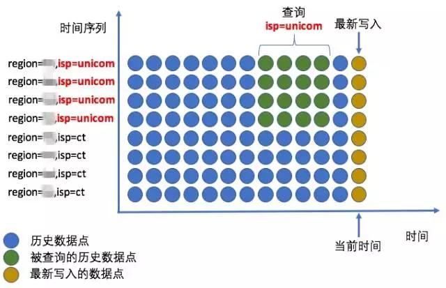

## 百度大规模时序数据存储（一）| 监控场景的时序数据  

> 原创：  
> 运小尧  
> 作者: AIOps智能运维  
> 发布日期: 2017-10-20  

作者简介

运小尧    百度高级研发工程师

负责百度运维大数据存储平台的设计和研发，致力于追求大规模存储系统的高性能和高可用。

干货概览

百度运维大数据平台的 **时序数据存储系统** （Time Series Database，TSDB）是智能运维团队于 2014 年自研的一套分布式监控数据存储系统。发展至今，经历过几次大的架构更迭，现在 TSDB 作为百度监控系统的底层存储服务，承载了公司诸多核心产品线的监控数据存储和查询需求，日均写入数据点 **数以万亿** 计，承载 **50K QPS** 的查询请求。百度大规模时序数据存储系列文章将介绍 TSDB 在监控场景的应用和系统设计实践，本文将介绍 TSDB 在监控场景下的应用以及系统设计面临的技术挑战。

一监控时序数据

百度的监控时序数据来源于监控系统在全网数十万台服务器上部署的 **Agent** ，Agent 采集各类监控对象的监控项，并以不同的频率向 TSDB 上报这些监控项的测量值。通过一张 CPU 空闲率趋势图可以直观地看到监控时序数据。

图1    CPU 空闲率趋势图

1监控对象（Object）

监控对象可以分为三类：

*  **机器级** ：物理机、虚拟机、操作系统等

*  **实例级** ：容器、进程、日志等

*  **服务级** （逻辑对象）：服务、服务组、集群等

图2    监控对象

2监控项（Metric）

监控对象的一些需要关注的 **指标** ，如机器的 CPU 空闲率、内存使用率、网卡带宽以及磁盘 I/O等，称为监控项。除了这些通用的机器监控项以外，根据不同的需求还可以自定义监控项，比如数据服务的缓冲对列长度、查询请求的平均响应时间等。

3标签（Tag）

标签是一对 **Key-Value** ，标识了监控对象在某个 **维度** （Key）的 **特征** （Value），一个监控对象也可以从多个维度来标识，比如部署在多地域、多运营商的服务可以有地域和运营商两个维度，根据不同的维度取值可以生成不同标签，如 \(“机房=杭州”, “运营商=电信”\) 和 \(“机房=北京”, “运营商=联通”\)。

4时间序列（Time Series）

把监控对象的监控项测量值，按照时间的顺序排列起来就构成了时间序列：

**时间序列 = 监控对象 + 标签列表 + 监控项 + 数据点**

其中数据点由时间戳和取值构成，每个时间序列对应到趋势图上的一条曲线。

二监控时序数据的特点1数据的使用场景

通过 **Web 页面、HTTP API 或命令行工具** ，用户可以方便地从 TSDB 种获取到自己关注的数据：

* 在日常运维工作中，运维工程师通过 Web 页面人工查看趋势图、同环比报表和热力图等来了解系统的最新或历史状态

* 一些自动化的服务通过高频、批量地查询时序数据来进行数据分析，进一步地挖掘数据的价值，如异常检测、汇聚计算、根因定位等

2数据的读写特点

在时序数据的大多数使用场景中，我们更加关注最近一段时间的数据，而这些数据的产生却是 7 \*24 小时不间断的，这就导致时间序列的读请求与写请求特征迥异且量级悬殊：

*  **随机写** ：不同的时间序列按照不同频率各自写入数据点

*  **顺序读** ：指定时间范围读取一段连续的数据点

*  **写多读少** ：写入请求量占比达九成以上

3数据的多维度

前面提到，可以使用标签来从多个维度标识一个监控对象，在获取数据时，也可以通过标签，将监控对象按维度进行筛选聚合。如，对于一个多地域、多运营商部署的服务，获取其在某段时间内、不同地域相同运营商的总流量：

图3    多维度聚合查询

三面临的挑战1高负载和高可用

在百度，有数千万的监控对象，时间序列的总量近 **10 亿** 。监控项的采集周期通常为 10s，在高时效性要求的场景下要求 **5s** 的采集周期，这意味着每一秒钟都有数千万个数据点要写入 TSDB，每天产生的数据点规模达到 **万亿量级** 。与此同时，TSDB 每秒钟还要处理 **数万次查询** 请求，由于查询有一定的突发性，峰值的查询流量可达到常态流量的数百倍，且根据业务的需求，绝大多数的请求都应该能在 **500ms** 返回结果给用户。

在处理 7 \* 24 小时持续高并发写入的同时，还要应对高并发的查询请求，负载不可谓不重，高吞吐和低延迟是对 TSDB 的基本要求。此外，打铁还需自身硬，作为监控系统自身的基础服务，其可用性必须有所保障，根据业务需求，我们制定的可用性目标至少是 **99.99%** 。

2复杂的数据保存策略

前文提到监控时序数据的使用场景有很多，包括汇聚值报警、查看指标的历史趋势图、实时的数据报表（天/周/季/年的同/环比）、趋势异常检测以及历史数据离线分析等，这些场景分别有着独特的查询特点：

场景时间范围查询数据量查询频率时效性要求
汇聚值报警最近数分钟或数小时小高高
异常检测多个时间区间小高高
实时报表最近数小时或数天大高低
历史趋势图自定义时间范围小低低
离线分析数天、数周或数月大低低

可以看到，每种场景的查询数据量、数据的分布以及对数据时效性的需求不尽相同，TSDB 需要在这些场景下都能够高效地获取数据。

3

不断增长的业务规模

百度的产品线数量、业务规模在不断地增加，相应地，监控系统的体量也随着增长，TSDB 的规模也势必增长，必然会面临容量、成本和可用性的压力。低成本地换取系统容量的增加和可用性的提升，是在系统设计时需要考虑的重点之一。

4

多样化的数据保存需求

不同的业务对监控数据的保存时长有不同的要求，不同的场景对数据的粒度也有不同的要求，例如，想要知道某服务过去一天的总流量相比去年同期的变化，需要数据至少保存一年，但数据的粒度可以是天级；而对于最近一个小时的流量，希望能够支持更细粒度的监控数据，以便能够发现短暂的流量突变。

总结

本文主要介绍了 **监控场景时序数据** 的特点，以及我们在设计时序数据存储时面临的挑战，对于百度在应对这些挑战时的 **设计实践** ，敬请期待下期文章。
