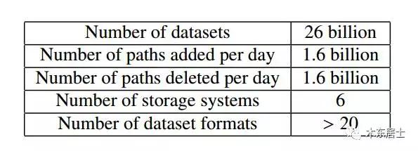
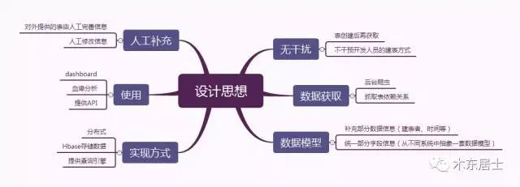
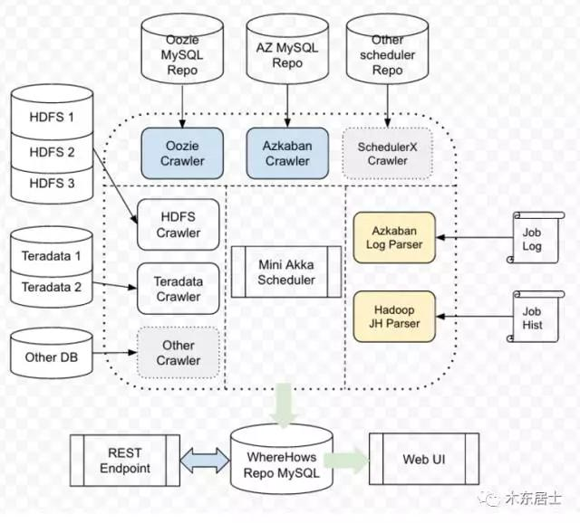
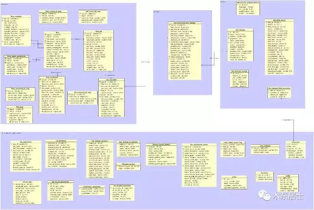
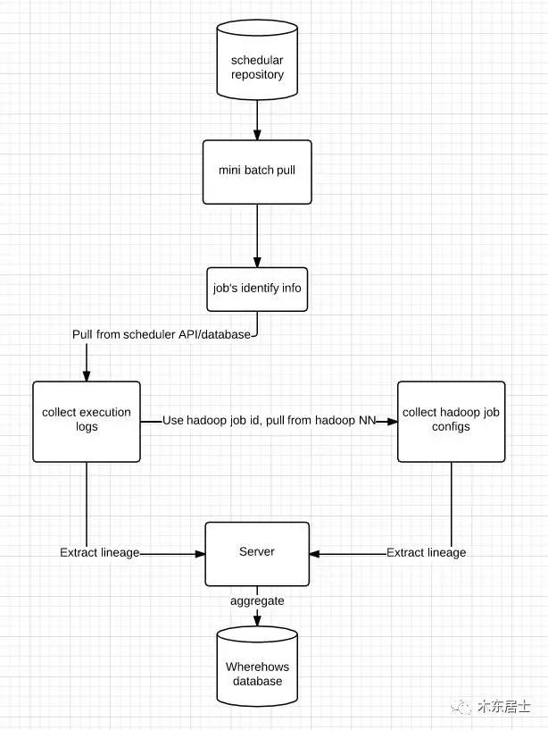

## No.21 别人家的元数据系统是怎么设计的  

> dantezhao  
> 发布: 木东居士  
> 发布日期: 2017-10-26  

### 0x00 前言

本篇分享是元数据管理的内容，主要参考Google在2016年发布的论文《Goods: Organizing Google’s Datasets》以及  Linkedin 在2016年新开源的项目：WhereHows，当然也有笔者的一点理解。

**Google 的论文整体描述十分详细，可以作为理论来学习，LinkedIn 已经开源了一个版本的系统，可以看成最佳实践。两者结合起来，还是很能拓展思路的。** 不太清楚 Google 和 Linkedin 真实的系统做成什么样，是不是像 Gfs 那样自己已经要淘汰了才发表文章出来。 不过这个不重要。只要能学到一些新东西就行了。

本文没有具体的实现，只有各种的设计思想。另外，其它数据仓库相关的文章请参考历史文章。

#### 一、本文讲什么？

本文会围绕 Goods 来展开，辅助以 LinkedIn 的 WhereHows 和笔者的理解。

先整体说明一下 Goods 是什么？可以这样理解：

1. Google的数据表太多了，工程师们会生产出很多的数据表，为了更好地管理和复用这些表，Google做了一个数据管理系统

2. 这个系统是一个开放的系统，它会通过类似爬虫的方式定时从各个系统（Hive、Hbase、Mysql）中抓取元数据信息然后存入系统中。并生产表之间的依赖关系。

3. 他和 EDM 的不同在于，它是来爬各个系统的元数据，然后来汇总。这点很重要，属于一种事后处理。给了工程师更大的开放性。

#### 二、文章结构

从我的感觉上来讲，元数据系统最经常被质疑的地方有两个：价值和作用。为了突出这两者的重要性，我会单独着重地写。

1. 为什么：元数据系统的价值；

2. 是什么：元数据系统相关的概念；

3. 怎么做：分享一下Google的论文《Goods: Organizing Google’s Datasets》中的内容，只有部分内容；

4. 怎么做：分享一下Linkedin的新开源的项目WhereHows的一些设计。

5. 补充：自己的一些想法。

### 0x01 价值何在？

#### 一、挑战

元数据的存在有它的必要性，我大致做了一个简单的梳理，列出一些和数据相关的挑战。这些其实也是元数据系统的价值所在。

#### 二、数据问题

如果业务复杂度比较低或者数据量比较小的话，可能就感触不深，不过在Google这种公司来讲，表的数量之大，光是管理表的元数据系统就要做成分布式的。

看一下Google的数据量，是挺大的了。

#### 三、使用问题

个人理解，这是元数据系统的主要战场。总的来讲， **就是方便人使用** 。

特别是表的维护者、量级这些不太起眼的属性往往是十分重要的，这些额外信息的完善度直接决定别人在用这张表时候的可用性。

#### 四、管理问题

举个栗子：假设你的集群已经快慢了，这时候要删除一些表来释放空间，但是你根本不知道哪些表有用，哪些没用？是不是很纠结？

元数据系统可以来管理这些。

包括不同员工的权限管理、数据质量监控这些功能，都可以通过元数据系统来体现。

### 0x02 背景知识和相关概念

大部分都加入了笔者个人理解，有误的请指出。

#### 一、元数据

任何文件系统中的数据分为数据和元数据。

* 数据是指实际的数据，就是我们能看到的一条条记录。

* 而元数据指用来描述一个表的特征的系统数据，比如表的字段信息、访问权限、拥有者以及数据
块的分布信息\(inode…\)等等。

比如Hive就专门有自己的元数据，里面存了Hive每张表的表名、列信息、索引等信息。

#### 二、元数据系统

管理元数据的系统。网上没找到定义，个人对它的理解如下：

1. 一个管理元数据信息的系统

2. 能够提供方便的元数据的操作和查询操作

#### 三、EDM

EDM的方式是数据的发布和使用都要通过这个系统。

> Enterprise Data Management \(EDM\) is one common way to organize datasets in an enterprise setting. However, in the case of EDM, stakeholders in the company must embrace this approach, using an EDM system to publish, retrieve, and integrate their datasets.

Goods的不同在于，它是事后处理的方式。

> An alternative approach is to enable complete freedom within the enterprise to access and generate datasets and to solve the problem of finding the right data in a post-hoc manner. This approach is similar in spirit to the concept of data lakes , where the lake comprises and continuously accumulates all the datasets generated within the enterprise.

### 0x03 Google的设计

#### 一、设计思路

> Goods, a project to rethink how we organize structured datasets at scale, in a setting where teams use diverse and often idiosyncratic ways to produce the datasets and where there is no centralized system for storing and querying them.

看完论文之后整理了一份思维导图，整个 Goods 的设计思路如下，基本包含了论文中大部分的点。

#### 二、整体架构

如下图，是 Goods 的整个设计架构。架构有几个点需要注意：

1. 前面提到的多数据源，比如 Hbase、Hive 还有 Hdfs 路径这种也算。

2. 数据设计。Google 抽象了一套数据模型，如图中展示了一部分

3. 使用。就如图中列出来的一些。

**注意：** 感觉论文的作者很自豪自己设计的血缘分析，论文中提了很多次。看下图的最右侧，为了获取到血缘图，他们做了不少的工作。

> Overview of Google Dataset Search \(Goods\). The figure shows the Goods dataset catalog that collects metadata about datasets from various storage systems as well as other sources. We also infer metadata by processing additional sources such as logs and information about dataset owners and their projects, by analyzing content of the datasets, and by collecting input from the Goods users. We use the information in the catalog to build tools for search, monitoring, and visualizing flow of data.

#### 三、数据模型

我一直感觉这个设计是最难的，因为要从那么多数据系统中抽象出来一份通用的数据模型。

数据模型整体分为两部分：基本的元数据信息和依赖关系。英文解释很清楚，就不再翻译了。

> Basic metadata - The basic metadata for each dataset includes its timestamp, file format, owners, and access permissions. We obtain this basic metadata by crawling the storage systems and this process usually does not necessitate any inference. Other Goods modules often depend on this basic information to determine their behavior. For example, some of the modules bypass catalog entries that have restricted access or the entries that have not been modified recently.
>
> provenance - Datasets are produced and consumed by code. This code may include analysis tools that are used to query datasets, serving infrastructures that provide access to datasets through APIs,
> or ETL pipelines that transform it into other datasets. Often, we can understand a dataset better through these surrounding pieces of software that produce and use it.

### 0x03 Linkedin 的设计

Linkedin 的设计，就不再自己画思维导图了，主要从几个点来对 Google 的设计做一个补充，帮助更好的理解。

#### 一、整体架构

WhereHows 从架构上来看主要分三个部分，和 Google 的 Goods 比较类似。

* Data Model

* Backend ETL

* Web Service

#### 二、数据模型

数据主要有四部分组成。图片有点不清楚，暂时没找到更清楚的。

* Datasets: Dataset schema, comments, sample data…

* Operational data: flow group, flow, job, job dependency, execution, id map tables \(helper tables to generate unique IDs\)

* Lineage data: input and output of jobs, dependency, partition, high watermark

* WhereHows ETL and Web UI/Service: configurations

#### 三、血缘分析ETL

血缘分析的数据需要从如下方式来获取。

> Lineage information refers to the dependency of jobs and datasets. It also includes some operation data, such as whether this is a read or write operation, and how many records it can read/write.

### 0x05 总结

#### 一、总结

元数据系统属于数据仓库建设中的一部分，它的很多意义和价值其实是和数据仓库强绑定的。在最开始列举的一些元数据系统的挑战和数据仓库的挑战是重合的，不过这些也很能反应元数据系统的重要性。

关于 Google 和 LinkedIn 两家公司的设计，其实是很相近的，只是 Google 给出的是思想，LinkedIn 给出的实现的，整体来看，两者的设计还是十分接近的，看一家的看不懂，看两家就行了。

#### 二、个人补充

Google 和 LinkedIn 都比较关注提高开发者的开发体验，就是我再前面设计思想里面列的 **无干扰** 。这样做的好处十分明显，就是不影响开发效率，侵入性很低。

个人感觉可以做一些补充，比如数据管理功能。

大部分互联网公司的童鞋都知道我们的数据源会有很多，因此都会有一个数据接入系统。我们可以把数据接入系统嵌到元数据系统中，开发一套自动化接入流程，用户如果想接入新的数据源了，可以通过元数据系统申请接入（离线或者实时）。

**强烈建议把 Google 的论文和 LinkedIn 的开源项目看一下，会有很多收获的，比看数据仓库的经典书籍和网上的各种博客要靠谱很多很多。**
