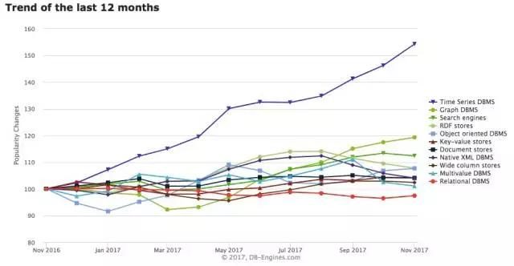
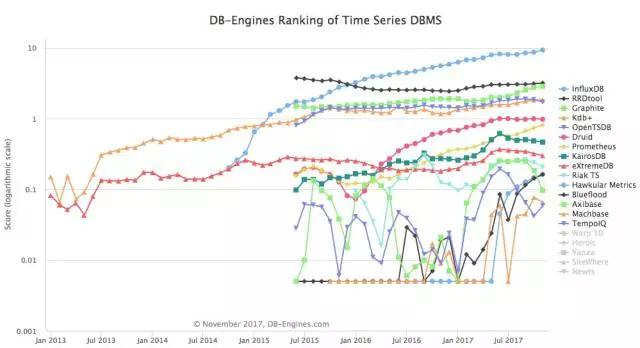
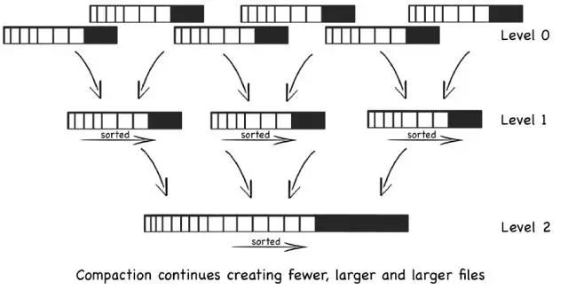
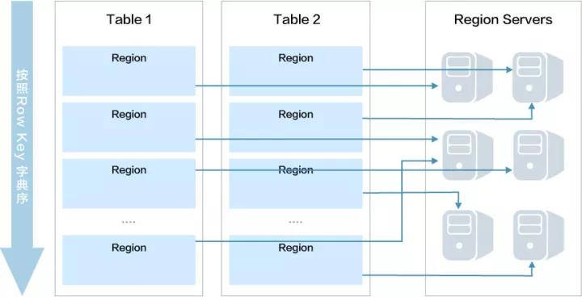
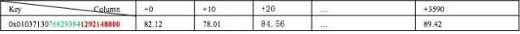
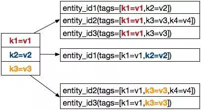
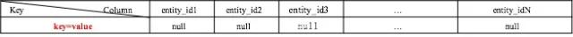

## 百度大规模时序数据存储（二）| 存储选型及数据模型设计  

> 原创：  
> 运小尧  
> 作者: AIOps智能运维  
> 发布日期: 2017-11-09  

作者简介

运小尧    百度高级研发工程师

负责百度运维大数据存储平台的设计和研发，致力于追求大规模存储系统的高性能和高可用。

干货概览

在 **[百度大规模时序数据存储（一）| 监控场景的时序数据](http://mp.weixin.qq.com/s?__biz=MzUyMzA3MTY1NA==&mid=2247484010&idx=1&sn=89d0e9c957e86ff93c99688f11e0b819&chksm=f9c37ba3ceb4f2b549a0b59c67a74f0d6aebcf22ae8ca83451b6a25d0ec8073bd286d050ae39&scene=21#wechat_redirect)** 文章中，我们简要地介绍了百度监控场景时序数据的特点，且分析了在每天 **万亿级** 的数据规模下，时序数据的存储所面临着的诸多挑战。本篇将介绍 TSDB 在 **方案选型** 和 **存储模型** 设计上的实践。

一简介

**TSDB** （Time Series Database，时间序列数据库）是一种日趋流行的数据库，从 DB-Engines 提供的最近一年各类数据库流行趋势来看，最近一年TSDB 的增长势头强劲，远超其它类型的数据库。

图1    数据库分类流行趋势

二底层存储选型

为了更好地适应业务需求，我们选择自研 TSDB，由于时序数据的规模很大，我们在底层存储的选型上需要慎重考量。在 **百万级** 指标的规模下，用 MySQL 来实现就可以满足需求，如开源监控系统 Zabbix 的底层存储方案。

随着业务的快速发展，我们的数据规模也从百万级涨到了千万级以至于现在的 **万亿级** ，此时传统关系型数据库愈显乏力。我们尝试过的一些集群方案在读/写延迟上并没有显著的提升，其扩展能力也只是差强人意，这迫使我们寻求新的方案。

重新审视我们对存储系统的核心需求： **高吞吐、低延迟、可扩展** 。对于监控场景来说，关系型数据库的强一致模型、事务机制以及联合查询等强项并不是我们关注的重点，单个数据点的丢失并不影响监控指标的整体趋势，数据的偶发延迟也可以接受。

近两年开源的 TSDB 项目不断涌现（见图 2），许多优秀的项目也成为我们调研和学习的对象，我们发现这些项目在底层存储的选型上各有偏好，这里列举一些：

*  **OpenTSDB** ：著名的老牌 TSDB，底层存储最初只支持 HBase，后来增加了对 Cassandra 的支持

*  **InfluxDB** ：基于自研的 TSM 存储引擎，集群方案未开源

*  **KairosDB** ：发源于 OpenTSDB，早期底层选用 HBase，目前主打使用 Cassandra，还支持H2（用于非生产环境）

*  **Prometheus** ：Google 监控系统 Borgmon 的开源版本，基于 LevelDB和本地存储

图2    TSDB排名变化趋势

然而无论是 HBase、Cassandra、LevelDB 还是 InfluxDB 的 TSM 存储引擎，他们的一个重要共同点就是都基于 **LSM-tree** 实现（Log-Strutured Merge-tree，日志结构合并树）。如图 3 所示，LSM-tree 这种树形结构可以像打印日志一般，以追加的方式顺序写入数据，并且不断地将较小的数据块合并成更大的块，最终将数据批量地刷写到磁盘。

图3    LSM-tree

使用 LSM-tree 有什么实际的意义？在上一篇文章中我们提到，监控数据的写入量非常大（每秒数千万数据点），存储时长最长可达数年，从成本角度考虑，廉价的磁盘自然是合适的选择。然而，磁盘的机械结构使得其随机 I/O 性能在面对每秒数千万的写入请求时显得力不从心。LSM-tree正是能够借助内存缓冲将大量的随机写入转化成 **批量的顺序写入** ，使得最终磁盘承载的写入次数对数级减少，极大地 **提升了写入吞吐量** 。

综合来看， **NoSQL 数据库** 是更合适的选择。在诸多 NoSQL 数据库中，我们选择了基于 LSM 实现的 HBase ，主要出于如下考虑：

* 高吞吐、低延迟，满足读/写性能需求

* 数据存储在 HDFS，支持多副本冗余，满足可靠性需求

* 表格存储，模型简单、业务开发较为方便

* 支持横向扩展，可线性扩容，能够适应业务增长

* 成熟的代码、活跃的社区和广泛的应用案例

三基于HBase的存储设计

HBase Table 中的数据按照 **RowKey** 的字典序排列，在行的方向上数据可以分布到多个 HRegion 中，而 HRegion 可以分布在不同的节点上，因此只要能够使数据均匀地分布在 HRegion 中，就可以实现存储的负载均衡。

图4    HRegion的分布

容易看出，RowKey 的设计是负载均衡的关键。如果 RowKey 设计不好，就容易形成热点HRegion，导致其所在节点负载过重，进而集群的整体性能下降。

接下来重点介绍 TSDB 中最关键的两张表的设计：数据表和维度索引表。前者支撑了所有时序数据的存储和查询，后者是多维度聚合查询的基础。

1数据表

前文介绍过，监控时间序列构成如下：

**时间序列 = 监控对象 + 标签列表 + 监控项 + 数据点**

为方便讲解，换一种形式表述：

**ts = \(object + tags\) + metric + \[\(timestamp, value\), \(timestamp, value\), ...\]**

可见，由 **object + tags + metric + timestamp** 可以唯一定位一个数据点的取值。为了充分利用HBase 的特性，我们借鉴了 OpenTSDB 的做法，将 RowKey 设计如下：

**RowKey = entity\_id + metric\_id + timebase**

**entity\_id** 是由 object 和 tags 的经过 hash 得到的一个固定长度的值，hash 后原始字符串的自然顺序被打乱，使得 RowKey 能够相对均匀地分布在不同 HRegion 中。

**metric\_id** 为 metric 的字符串 hash 值，同样是固定长度。

**timebase** 为 Unix 时间戳按照 1 小时（3600 秒）取整得到的数值，固定 4 个字节的长度

这样的设计有如下好处：

* entity\_id 和 metric\_id 的散列使得数据相对均匀分布

* timebase 置于 RowKey 的字节低位，使得同一个时间序列数据的 RowKey 连续分布，可以高效地按时间进行范围扫描

* 固定长度的 RowKey 减少了空间浪费，同时前缀式的设计可以充分利用 HBase 的前缀压缩机制，进一步节省 RowKey 所占空间

RowKey 代表的行包含 1 小时的数据，行中数据点按照当前时间在 1 小时内的偏移量进行存储，最终的表结构示意如表 1：

表1    数据表 RowKey 设计

2

维度索引表

在数据表的设计中，tags 被编码进固定长度的 entity\_id 中，同时 HBase 并没有对索引的原生支持，这导致无法通过 tag 找到对应的 entity\_id，也就无法满足数据的多维度检索聚合需求。为此我们引入了一张索引表，建立从 tag 到 entity\_id 的映射，以支持通过 tag 筛选数据。

如图 5 所示，通过指定一个 **tag: k1=v1** ，可以查到所有包含这个 tag 的 entity\_id1、entity\_id2 和entity\_id3。

图5    维度索引

RowKey 的构造比较简单：

**RowKey = key + value**

索引对应的 entity\_id 直接作为 Column 的 Qualifier 存储，对应的 Column Value 留空，最终的表结构：

表2    索引表设计

总结

底层存储选型和数据模型设计是 TSDB 设计中的两个重要的基础环节，前者决定了后者的设计思路，后者的设计影响上层功能的设计实现，二者又与集群的架构设计和性能表现息息相关。然而，影响系统性能和可用性的设计环节还有很多，接下来的文章将逐步为读者介绍百度 TSDB 在 **功能** 和 **架构** 上的设计实践。敬请期待~~
