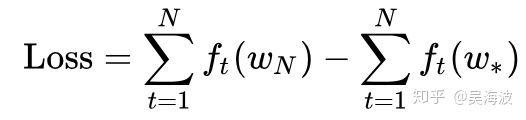
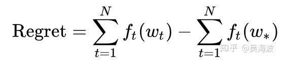
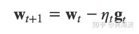
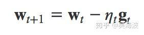
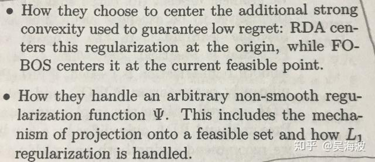
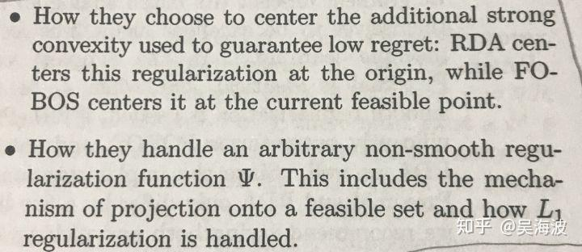
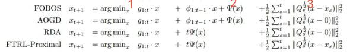
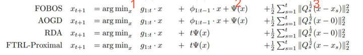
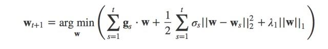
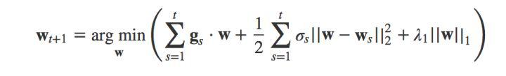

## 在线学习（Online Learning）导读  

> 作者: 吴海波  
> 发布日期: 2018-05-04  

### **前言**

这几年在工业界，FTRL基本等价于在线学习。2013年google的论文：Ad Click Prediction:a View from the Trenches，给出了FTRL的工程实现，15年的时候，国内开始比较火，我们组也是那个时候尝试了一把，后来16年又搞了一次，没有什么明显的收益，只是在大促的时候会有些变化。据了解，当时淘宝某个主场景的实验结论和我们一致。当时大家追求快糙猛以及各种其他原因，一看没有收益，就没有继续。最近随着我们在大规模离散化特征上的实践，发现当时的思路有些问题，当时的使用的特征，随时间发生分布变化的概率小，没有必要用ftrl。最近开始重新实验FTRL（交了一笔学费）。从实践的情况来看，先不论线上的收益，仅当FTRL训练的更快，使用的资源更少，就足以吸引各大公司使用。

FTRL的代码实现非常简单，腾讯的开源PS angel上已经支持，摘抄一段：

> FTRL是一种在线学习的常见优化算法，方便实用，而且效果很好，常用于更新在线的CTR预估模型。之前的传统实现多见于Storm。但是实际应用中，数据集的维度往往很大，且模型稀疏性，这种Case下，用Spark Streaming结合Angel，其实会有更好的效果，而且代码很少，性能稳健。
> 具体见：[https://github.com/Tencent/angel/blob/master/docs/algo/ftrl\_lr\_spark.md](https://link.zhihu.com/?target=https%3A//github.com/Tencent/angel/blob/master/docs/algo/ftrl_lr_spark.md)

一直以来，只是知道FTRL怎么用，而不了解是怎么来的。最近抽了一段时间，翻阅了H.Brendan McMahan的三篇论文，并看了一些网上的资料，有了大致的认知，由于这方面好的资料不少，本文从初学者的角度去做一份导读，解释一些背景知识和概念，希望能帮助到大家。在线学习里有不少是最优化的知识，比如证明regret bounds，但我毕竟在工业界，更关心这些算法是怎么做迭代的，即权重W是怎么更新的。由于在线写公式太繁琐了，且参考文献里面的推导很详细，本文尽量少用公式。

###  **背景知识**

###  **在线学习解决什么问题**

wiki上对online learning的定义如下：

> In computer science, online machine learning is a method of machine learning in which data becomes available in a sequential order and is used to update our best predictor for future data at each step, as opposed to batch learning techniques which generate the best predictor by learning on the entire training data set at once.

在工业界，不单参与训练的数据量大，模型特征量的规模也大。比如点击率预估，往往特征规模会在亿级别，训练数据很容易过TB，对资源的压力很大。Spark集群的一台高性能的服务器是很贵，有钱的大厂当然可以堆机器去搞，大部分公司还是要掂量下。另外，类似电商这种业务，会有许多场景的需要单独做模型。如果能够从batch转换到online learning，有明显的经济收益。

online learning是基于stream的data，无法直接对目标优化，普遍会选择regret作为优化目标。看下二者的公式，

公式（1）

公式（2）
直观理解二者的区别，Loss是在一次batch计算完，得到了新的Wn，然后计算loss，追求loss最小。而Regret是每t个样本来，更新w后得到Wt，追求累计regret最小，有点贪心的思想。

###  **看似不相干的重要特性：稀疏解**

在Online learning的场景，直观上，batch的梯度下降用不了，我们能不能用mini-batch或者SGD（Stochastic Gradient Descent。特别是SGD，先来看下SGD的weight更新公式：

公式（3）
天然符合online learning的需求，online gradient descent就是这个思路。但这里有个严峻的问题，SGD不能带来稀疏解。就算增加L1正则，在batch的时候可以得到稀疏解，但在online的时候却不行。 **前面提到过，类似ctr预估的模型的特征空间在亿级别，好的公司在百亿级别，不能训练出稀疏解即代表没有办法实际使用模型** 。网上关于这个SGD不能给出稀疏解有很多解释，比如认为由于浮点数计算，难以真正变成0. 个人更倾向于这个解释：

> 不同于 Batch，Online 中每次𝑊的更新并不是沿着全局梯度进行下降，而是沿着某个样本的产生的梯度方向进行下降，整个寻优过程变得像是一个“随机” 查找的过程\(SGD 中 Stochastic 的来历\)，这样 Online 最优化求解即使采用 L1 正则化的方式， 也很难产生稀疏解。

###  **非常正经的导读**

###  **在线学习算法概述**

学术界和工业界都在研究能学习出高精度且稀疏的模型。先从最简单的想法开始，既然SGD不能直接得到稀疏解，我们可以将小于一定阈值的weight置为0，但由于online是一个样本过来就训练，那么就有可能因为训练不充分导致了weight小，这样简单截断损失很大。随后FOBOS、RDA、FTRL等算法提出，其中RDA是微软10年的工作，FTRL是google的H. Brendan McMahan 3年的工作，FTRL结合了FOBOS高精度以及RDA较好的稀疏性的特点。一开始接触这块，很容易陷入到公式细节中，无法建立大局观， _重点理解下面两句话中的观点，可免于在公式的推导中迷失_ ：

### **优化相关的一些背景知识**

###  **拉格朗日乘子和KKT条件**

这块在公式推导里会用到，简单来讲Online场景面对的目标函数，很多时候是带约束条件的。举个简单的例子讲，LR的交叉熵loss函数，在没有加正则前，是无约束的优化问题，加了正则并限制正则的大小，则变成了一个有约束的问题。具体可以分为三种，无约束优化问题、有等式约束优化问题以及不等式约束的优化问题，其中等式约束的优化问题和不等式约束问题分别可以通过拉格朗日乘子和KKT条件来转换为无约束问题。细节可以参考后面提到的几篇文章。

###  **次梯度**

上面章节提到了怎么处理L1是关键，而L1正则化在0处不可导， L1本身都是凸函数，因此可以采用次梯度代替其梯度。其中次梯度（subgradient）一般是个集合，\[左导数，右导数\]，举个例子，y=|x|，次梯度的集合为\[-1,1\]。

###  **好文筛选**

###  **从SGD到TG、FOBOS到FTRL的原理**

首推这篇[在线算法最优解](https://link.zhihu.com/?target=https%3A//plushunter.github.io/2017/07/26/%25E6%259C%25BA%25E5%2599%25A8%25E5%25AD%25A6%25E4%25B9%25A0%25E7%25AE%2597%25E6%25B3%2595%25E7%25B3%25BB%25E5%2588%2597%25EF%25BC%258831%25EF%25BC%2589%25EF%25BC%259A%25E5%259C%25A8%25E7%25BA%25BF%25E6%259C%2580%25E4%25BC%2598%25E5%258C%2596%25E6%25B1%2582%25E8%25A7%25A3%25EF%25BC%2588online%2520Optimization%25EF%25BC%2589/)

写的很详细，是不可多得的优质中文资料，介绍了TG、FOBOS、RDA以及FTRL的算法原理，并有详细的推导，里面有一些符号错误，但不影响理解， **以模型参数迭代更新的方式为主线，记住前文提到的两个核心问题** ，读起来事半功倍，强烈建议读下原文，本文不再赘述。

###  **FOBOS/RDA/FTRL统一形式下的对比分析**

H.Brendan McMahan在论文Follow-the-regularized-leader and mirror descent: Equivalence theorems and L1 regularization里从形式上统一了几种算法，然后做了对比分析，其中FOBOS被改写为累计梯度的形式。上面的公式分位三个部分：

* 1代表梯度或累积梯度，RDA区别于FOBOS是考虑累计梯度。
* 2代表正则项
* 3代表限制了x的变化不能离过去太远或者离0点太远。
其中x可以理解成模型的weight。这篇论文也写的比较容易懂，建议读下。

###  **FTRL的工程细节**

主要是几个方面：

1. 由于长尾，大部分特征是稀疏的，且频次很低，online的场景无法用batch的方式去统计特征频次。论文提了两个方案，以泊松概率p决定特征是否更新和建立Bloom Filter Inclusion。我看大部分实现都是用Bloom Filter。
2. 对浮点数重编码，变的更小。
3. Training Many Similar Models
4. A Single Value Structure
5. 用计数去替换学习率的计算中的累计梯度，可以又快又省。
6. 对负样本重采样。但会改变数据分布，所以可以给重采样的样本加上权重。

具体细节可以看这篇文章：[各大公司广泛使用的在线学习算法FTRL详解](https://link.zhihu.com/?target=https%3A//www.cnblogs.com/EE-NovRain/p/3810737.html)
，讲的很好，细节不再赘述。也可以直接看原论文：Ad Click Prediction:a View from the Trenches，这部分讲的通俗易懂。

PS:里面关于Training Many Similar Models和A Single Value Structure两部分，不是很理解它的业务场景。还请有了解的小伙伴分享下。

###  **FTRL和SGD的关系**

有一篇文章提到FTRL和上面公式是等价的，角度不一样，比较有意思，参考：[http://vividfree.github.io/%E6%9C%BA%E5%99%A8%E5%AD%A6%E4%B9%A0/2015/12/05/understanding-FTRL-algorithm](https://link.zhihu.com/?target=http%3A//vividfree.github.io/%25E6%259C%25BA%25E5%2599%25A8%25E5%25AD%25A6%25E4%25B9%25A0/2015/12/05/understanding-FTRL-algorithm)
可以加深对于FTRL公式的理解：

引用一段原文：

> 由此可以更好的体会下公式为啥长这样子，其左边两项承担了SGD算法的功能，而最右边的一项承担的是得到稀疏模型的功能。因为有这样的一种数学含义在背后，所以才好放心的下结论说，FTRL算法融合了RDA算法能产生稀疏模型的特性和SGD算法能产生更有效模型的特性，也就是说能学习出有效的且稀疏的模型。

###  **一些讨论**

1. [Online方式点击率预估时学习率不断变小，是否可能追不上目标函数的变化？](https://www.zhihu.com/question/29973925)
2. [在机器学习中有哪些典型的Online算法？](https://www.zhihu.com/question/28025036?sort=created)
3. [FTRL算法在使用中需不需要通过Batch Model初始化？](https://www.zhihu.com/question/37866658/answer/73891786)
4. [Why L1 norm for sparse models](https://link.zhihu.com/?target=https%3A//stats.stackexchange.com/questions/45643/why-l1-norm-for-sparse-models)

###  **总结**

炒了个冷饭，已经没有什么可写的了，因此做个导读给大家。

###  **参考文献：**

\[1\] [https://plushunter.github.io/2017/07/26/%E6%9C%BA%E5%99%A8%E5%AD%A6%E4%B9%A0%E7%AE%97%E6%B3%95%E7%B3%BB%E5%88%97%EF%BC%8831%EF%BC%89%EF%BC%9A%E5%9C%A8%E7%BA%BF%E6%9C%80%E4%BC%98%E5%8C%96%E6%B1%82%E8%A7%A3%EF%BC%88online%20Optimization%EF%BC%89/](https://link.zhihu.com/?target=https%3A//plushunter.github.io/2017/07/26/%25E6%259C%25BA%25E5%2599%25A8%25E5%25AD%25A6%25E4%25B9%25A0%25E7%25AE%2597%25E6%25B3%2595%25E7%25B3%25BB%25E5%2588%2597%25EF%25BC%258831%25EF%25BC%2589%25EF%25BC%259A%25E5%259C%25A8%25E7%25BA%25BF%25E6%259C%2580%25E4%25BC%2598%25E5%258C%2596%25E6%25B1%2582%25E8%25A7%25A3%25EF%25BC%2588online%2520Optimization%25EF%25BC%2589/)
\[2\] [https://www.cnblogs.com/EE-NovRain/p/3810737.html](https://link.zhihu.com/?target=https%3A//www.cnblogs.com/EE-NovRain/p/3810737.html)
\[3\] [http://vividfree.github.io/%E6%9C%BA%E5%99%A8%E5%AD%A6%E4%B9%A0/2015/12/05/understanding-FTRL-algorithm](https://link.zhihu.com/?target=http%3A//vividfree.github.io/%25E6%259C%25BA%25E5%2599%25A8%25E5%25AD%25A6%25E4%25B9%25A0/2015/12/05/understanding-FTRL-algorithm)
\[4\] Subgradient. [http://sv.wikipedia.org/wiki/Subgradient](https://link.zhihu.com/?target=http%3A//sv.wikipedia.org/wiki/Subgradient)
\[5\] H. Brendan McMahan & M Streter. Adaptive Bound Optimization for Online Convex Optimization. In COLT,
2010
\[6\] H. Brendan McMahan. Follow-the-Regularized-Leader and Mirror Descent: Equivalence Theorems and L1
Regularization. In AISTATS, 2011
\[7\] H. Brendan McMahan, Gary Holt, D. Sculley, Michael Young, Dietmar Ebner, Julian Grady, Lan Nie, Todd
Phillips, Eugene Davydov, Daniel Golovin, Sharat Chikkerur, Dan Liu, Martin Wattenberg, Arnar Mar Hrafnkelsson, Tom Boulos, Jeremy Kubica, Ad Click Prediction: a View from the Trenches. In ACM SIGKDD, 2013
\[8\] Ad Click Prediction:a View from the Trenches
