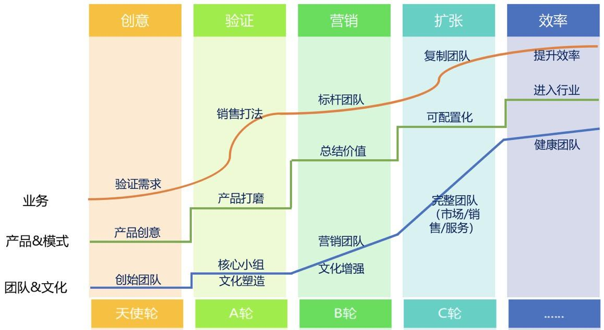

## SaaS创业路线图（四）：产品打磨阶段各个角色怎么配合？  

> 发布: 吴昊@SaaS  
> 发布日期: 2018-06-19  

编者按：作者介绍 - 吴昊，纷享销客天使投资人、前执行总裁，20年企业信息化和6年SaaS营销团队创新经验，每天一篇2000字创业文章的坚持者。欢迎关注公众号：SaaS白夜行。

根据[\#SaaS创业路线图\#](https://www.fxiaoke.com/XV/Home/Index#stream/showtopic/=/name-SaaS%E5%88%9B%E4%B8%9A%E8%B7%AF%E7%BA%BF%E5%9B%BE)8个阶段的逻辑，形成普遍意义上的“产品价值及商业模式验证”，是第2阶段的关键任务。

[\#SaaS创业路线图\#](https://www.fxiaoke.com/XV/Home/Index#stream/showtopic/=/name-SaaS%E5%88%9B%E4%B8%9A%E8%B7%AF%E7%BA%BF%E5%9B%BE)中说到，第2个阶段“产品打磨和商业模式验证”，就需要有营销人员参与了。形成普遍意义上的“产品价值及商业模式验证”，这是第2阶段的关键任务。

产品需求调研的环节，不是只产品经理的事儿，产品经理当然应该去客户现场了解需求，但主导产品调研的，反而应该是营销能力强的人。如果创始人又有产品背景，又有营销能力，当然最好。如果创始人是技术范儿的，务必在早期就找一个营销能力强的合伙人。

今天我就专门讲讲产品调研阶段的原则。

最近我深聊过的20多个SaaS公司中，有几个就在产品调研阶段。我看到其中大部分都犯了这样的错误：有了一个产品方向后，产品经理市场调研进行地很简略，然后在办公室里，用工程师的“完美主义 + 系统逻辑”主导研发工作。

虽然不是闭门造车，但显然“闭门”的时间远远大于在一线与客户交互的时间。最后结果呢？经过几个月的研发后，刚刚到位的营销人员拿着产品见客户，发现完全没有切到客户痛点，产品和营销的兄弟都垂头丧气......

听说另一个创业团队犯的错误是这样：美其名曰“大范围市调查”，叫几个位实习生做了上百家客户的调研，一看调研报告，就像说人人都有2个胳臂2条腿一样，抓不住深度的需求。和个人消费者不同，因为组织和业务复杂，企业客户大多是说不清楚自己需要什么的。那个著名的例子不是说吗？客户说要让马车更快，实际上应该给他汽车。

听梁宁老师的“产品思维”课，她的建议是，toC产品打痛点、打爽点都行，但toB产品只能打痛点。

而且C端需求比较感性，B端需求非常理性，别想拿“未来”的东西忽悠我“现在”的钱！

此外，toB与toC相比，还有一个很大区别 —— 客户需求一致性较差。换句话说，即使在一个行业里，各个企业间的业务和组织差异就很大。也许一个创意点子在创始人头脑里很完美，但一到市场上，必然面对南北差异、一二三线城市差异、规模差异、老板素质差异，甚至门店位置差异的问题。不同客户的需求有偏差，找到共性需求成为很大的难题。

正确的方式应该如何操作？我建议用以下调研框架来解决产品打磨的问题：

1、任何行业市场都需要细分，要做广度调研，弄清楚这些目标客户有哪些主要属性，每一类客户数量大致有多少、需求紧迫性及购买力如何？

2、选择头部3~4个细分市场，在这个特定范围内进行调研，才有机会找到共性需求。调研最好是创始人、产品经理、营销合伙人一起上，分别把握产品价值、产品体验和未来产品是否可卖。创始人够牛能够三合一，效率更高；但这样创业一路会有点儿孤独哈。

3、我把客户对SaaS的需求分2类：基础功能需求（例如会员管理）和增值需求（例如帮门店老板增加收入）。正常情况下，产品经理会说，必须得有会员管理模块才能存储客户数据和做增值业务啊，所以得先做会员系统，再做增值模块。可问题是，会员系统早就有人做过无数次了，凭什么别人做出来卖不好，你的做出来就能卖得出去？

大家如果都卡在了“客户用不好会员系统，因此没机会用更深、更有价值的功能”，那我认为就要在产品上想尽一切办法，让客户直接用“有价值的”功能，把不好用的功能跳过去！

也就是说，咱们要“逆向”设计这类商业SaaS，让价值需求优先于基础功能需求。这点说服产品经理和研发团队会很难，我干过8年研发，知道技术男们对逻辑严密的要求有多高但一定想清楚，如果突破不了第一关（让客户用），后面所有的努力都没有意义。

4、不要想一次把功能做完整和闭环，新产品应该胜在“锋利”而非“完整”。这也是MVP（最小可验证产品）的题中应有之意。《精益创业》和《跨越鸿沟》是这个阶段需要重点读的2本书。

那么在实际运作中，还有个组织方式的问题。产品经理、研发老大、营销老大，大家通过接触一线和系统思考，对不同的选择有不同的想法，为每个小点争论不休......那最后应该听谁的？

首先，我建议让大家充分表达意见，但创始人要分得清楚，哪些是关键问题，值得反复探讨；哪些是非关键问题，你就必须设置关闭deadline。时间一到，创始人立即拍板关闭。老板和拍板就是一个“板”啊！快速出原型见客户最重要，不要花费太多时间“闭门”讨论。

这里还有一个分支问题，也是最近我在中欧商学院、在mini创业营多次和同学在讨论的，就是在大公司里孵化新项目的尴尬局面。

很多大公司设立了新项目创业团队，但这些团队由于自身业务特点，在薪资上、工作方式上、激励方法上与老团队完全不同。我认为大老板一定要给内部孵化的创业团队独立的资源，在人事和管理制度上、办公区域上、甚至在公司架构上，要让创业团队有独立空间。否则新组织根本没机会生存。

举个真实的例子，一个公司里，新项目的很多决策需要上公司管理例会，老部门的大佬毕竟是公司元老、手握公司主要营收，说难听点儿，“你们新项目这些人就是我养的”。在这个场景下，你可以想象，多数新项目负责人是不敢据理力争、要些特殊政策的......

6月初我参加mini创业营的复训，听龚焱教授讲创新方法，他提到MVP方法论也有“短视”的问题，可能放弃了需要长期投入但更大的发展机会。所以MVP也要辩证看，关键还是创始人的判断。开玩笑地说，即使创始人错了，也应该听他的。团队就是因为他、因为这个创意聚到一起，成也萧何、败也萧何。

换句话说，没有决断力的，做不好创始人。

推荐阅读：

[SaaS创业路线图（一）：SaaS创业路线全貌](http://36kr.com/p/5136068.html)

[SaaS创业路线图（二）：一文读懂SaaS创业路线全貌](http://36kr.com/p/5137220.html)

[SaaS创业路线图（三）：创业公司核心营销团队招募](http://36kr.com/p/5138329.html)

[SaaS创业路线图（五）：SaaS的销售模式和营销组织演进](https://36kr.com/p/5140391.html)
