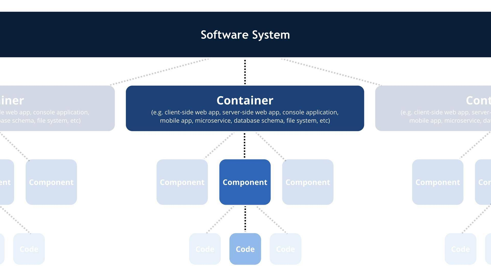
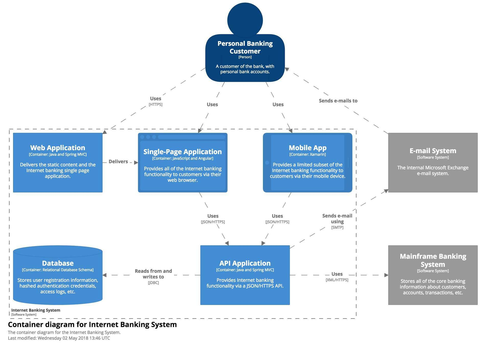
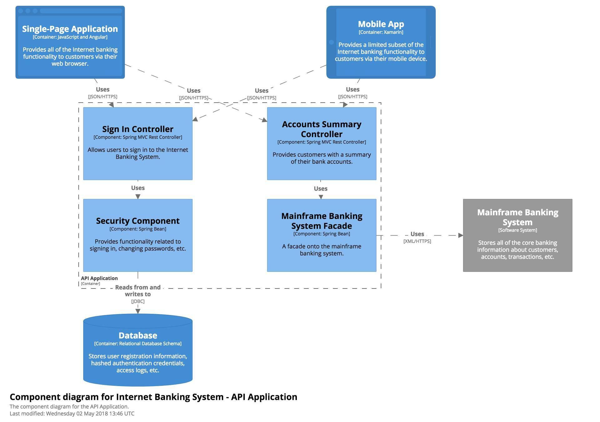
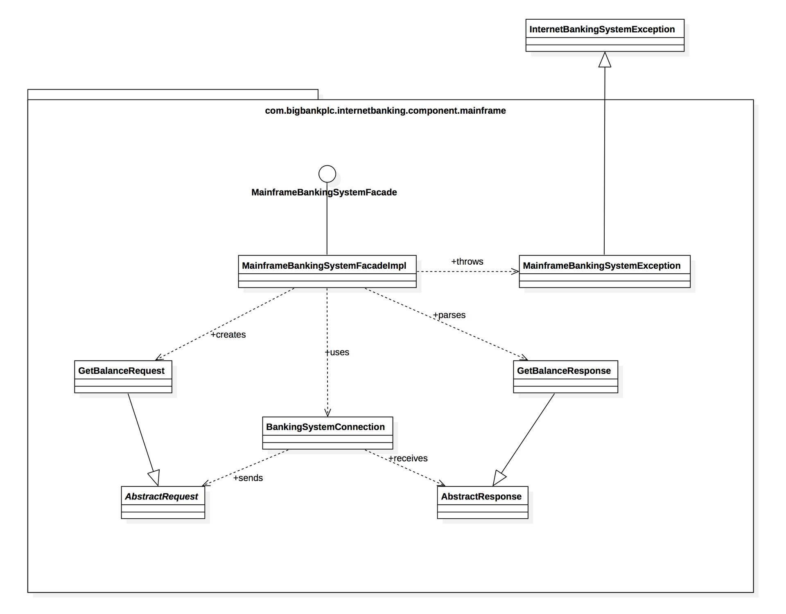
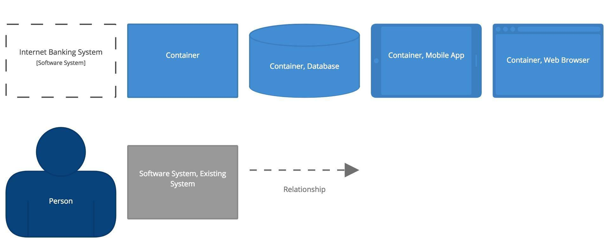

## 用于软件架构的 C4 模型  

> 作者: Simon Brown  
> 译者: 无明  
> 发布日期: 2018 年 6 月 30 日 15:44  

### 关键要点

>
>   * 由于向敏捷转型，软件架构图的使用规模已经大幅缩减。即使有在使用软件架构图，它们往往也混淆不清。
>   * C4 模型由一系列分层的软件架构图组成，这些架构图用于描述上下文、容器、组件和代码。C4 图的层次结构提供了不同的抽象级别，每种抽象级别都与不同的受众有关。
>   * 为了避免出现含糊不清的情况，可以在图中包含足够数量的文本和关键的图例。
>

软件架构图是一种非常好的表达方式，可以用它们来表达你将如何构建一个软件系统（预先设计）或者现有的软件系统是如何工作的（回顾文档、知识分享和学习）。

然而，你所看到的大多数软件架构图很可能只是由混乱的框和线组成。[敏捷软件开发宣言](http://agilemanifesto.org/)的一个副作用就是让很多团队停止或缩减了他们的图表和文档工作，包括使用UML。

现在，这些团队倾向于依靠他们在白板上绘制的临时图表，或者使用通用的图表工具（如微软的 Visio）。Ionut Balosin 在去年写了一篇叫作“[软件架构图的艺术](http://www.infoq.com/cn/articles/crafting-architectural-diagrams)”的文章，他在文章中描述了一些常见问题，这些问题与不可理解的符号和不明确的语义有关。


含糊不清的软件架构图容易导致误解，这可能会拖慢一个优秀团队的前进步伐。在我们的行业中，我们真的应该努力创建出更好的软件架构图。多年来，我自己参与软件开发，并与世界各地的团队合作，基于这些经验，我建立了一个称之为“C4 模型”的东西。C4 代表 **上下文（Context）、容器（Container）、组件（Component）** 和 **代码（Code）** ——一系列分层的图表，可以用这些图表来描述不同缩放级别的软件架构，每种图表都适用于不同的受众。可以将其视为代码的谷歌地图。


要为你的代码创建地图，首先需要一组通用的抽象来创建一种无处不在的语言，用来描述软件系统的静态结构。C4 模型使用 **容器** （应用程序、数据存储、微服务等）、 **组件** 和 **代码** 来描述一个软件系统的静态结构。它还考虑到使用软件系统的人。


### 第 1 层：系统上下文

第 1 层是系统上下文图，它显示了你正在构建的软件系统，以及系统与用户及其他软件系统之间的关系。以下是一个系统上下文图的示例，描述了一个互联网银行系统的系统上下文：


银行的个人客户使用互联网银行系统查看有关银行账户的信息并进行支付。互联网银行系统使用银行现有的大型机银行系统来执行此操作，并使用银行现有的电子邮件系统向客户发送电子邮件。图中的颜色表示哪些软件系统已经存在（灰色）以及待构建的系统（蓝色）。

### 第 2 层：容器

第 2 层是一个容器图，将软件系统放大，显示组成该软件系统的容器（应用程序、数据存储、微服务等）。技术决策也是该图的关键部分。以下是互联网银行系统的容器图示例。它显示了互联网银行系统（虚线框）由五个容器组成：服务器端 Web 应用程序、客户端单页面应用程序、移动应用程序、服务器端 API 应用程序和数据库。


Web 应用程序是一个 Java/Spring MVC Web 应用程序，它仅提供静态内容（HTML、CSS 和 JavaScript），包括组成单页应用程序的内容。单页面应用程序是一个运行在客户网络浏览器中的 Angular 应用程序，提供所有的网上银行功能。或者，客户可以使用跨平台 Xamarin 移动应用程序访问互联网银行的部分功能。单页应用程序和移动应用程序都调用 JSON/HTTPS API，这是由服务器端运行的另一个 Java/Spring MVC 应用程序提供的。API 应用程序从数据库中获取用户信息（关系数据库模式）。API 应用程序还使用专有的 XML/HTTPS 接口与现有的大型机银行系统进行通信，以获取有关银行账户或交易的信息。如果需要向客户发送电子邮件，API 应用程序还会调用现有的电子邮件系统。

### 第 3 层：组件

第 3 层是组件图，将单个容器放大，以显示其中的组件。这些组件映射到代码库中的真实抽象（例如一组代码）。下面是一个虚拟的网上银行系统的组件图示例，显示了 API 应用程序中的一些组件（而不是全部）。


两个 Spring MVC REST 控制器为 JSON/HTTPS API 提供访问点，每个控制器随后使用其他组件访问数据库和大型机银行系统中的数据。

### 第 4 层：代码

最后，如果你确实想要，或者说有这个必要，可以放大个别组件，以显示该组件的实现方式。以下是一个虚拟的网上银行系统的 UML 类图示例（部分），显示了组成 MainframeBankingSystemFacade 组件的代码元素（接口和类）。


它表明该组件由很多类组成，实现细节直接反映了代码。我并不建议创建在这种详细程度的图表，有时候你可以直接从大多数 IDE 中获取它们。

### 符号

C4 模型没有预定义任何特定的符号，你在这些示例图中看到的是一个个简单的符号，适用于白板、纸张、便签、索引卡片和各种图表工具。你也可以使用 UML 作为符号，并适当使用包、组件和原型。无论你使用哪种符号，我都会建议让每个元素都包含名称、元素类型（即“人”、“软件系统”，“容器”或“组件”）、技术选型（如果有的话），以及一些描述性文字。在图表中包含如此多的文本可能看起来很不寻常，但这些附加文本有助于消除软件架构图中通常会出现的不明确的表示。

即使符号对你来说是显而易见的，仍然要确保为这些符号提供图例。图例中应该包括颜色、形状、首字母缩略词、线条样式、边框、尺寸等。理想情况下，符号应该在每个细节层次上保持一致。下面是前面显示的容器图的图例。


最后，不要忘记了标题，它应该出现在每个图表上，以明确地描述每个图表的类型和范围（例如，“网上银行系统的系统上下文图表”）。

### 更多信息

C4 模型是一种在不同抽象层次上交流软件架构的简单方法，可以向不同的受众讲述不同的故事。这也是向软件开发团队介绍（通常是重新引入）严谨和轻量级建模的一种方式。有关 C4 模型的更多信息，以及补充图（运行时和部署）的示例、符号清单、常见问题解答、会议讲座视频和工具选项，请参阅[ c4model.com ](http://c4model.com/)。

### 关于作者

Simon Brown** 是一位专门从事软件架构的独立顾问，也是“Software Architecture for Developers”（面向开发人员的软件架构、技术领导力和敏捷性平衡的指南）的作者。他还是 C4 软件架构模型的创建者，这是一种创建代码映射的简单方法。Simon 在国际软件开发会议上经常发表演讲，并在世界各地旅行，以帮助组织可视化和记录他们的软件架构。

**查看英文原文** ：[ The C4 Model for Software Architecture ](https://www.infoq.com/articles/C4-architecture-model)
