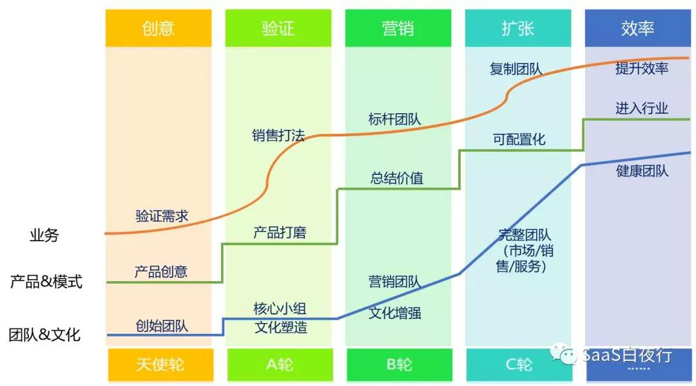

## SaaS创业路线图（10）：如何培养骨干营销团队？  

> 发布: 吴昊@SaaS  
> 发布日期: 2018-07-31  

“作者介绍 - 吴昊，纷享销客天使投资人、前执行总裁，20年企业信息化和6年SaaS营销团队创新经验，每天一篇2000字SaaS创业文章的坚持者，目前正处在从创业人向投资人的转型过程中。欢迎关注公众号：SaaS白夜行。

本文为《SaaS创业路线图》系列文章第十篇，[作者专栏地址（点击查看）](https://36kr.com/user/1308477002)

**团队扩大后立即面临的问题就是，谁来带这些团队？**

基层销售团队要想带得好，一个人管十几个是不现实的，因为销售管理的工作非常细碎，从早会激发、夕会复盘（根据业务复杂情况不同）、陪访、理单、过程数据管理、辅导、团队内部专项能力培训，到谈心激励（花费大量业余时间）、沟通绩效、劝退，一个业务主管带8个一线业务员已经是极限。

那么团队扩张后，必然就会面临基层和中层干部不足的问题。

**空降是选择之一，比较简单快捷，但这是最不得已、成功率最低的选择。**

空降让销售团队成员看不到自己晋升的希望，也会认为这是公司对大家能力的否定。即使来的新老大非常牛X，把大家都震慑了、也花时间把topsales都搞定了，还有一个能否适应企业文化、理解产品、掌握业务的几个坎。如果失败一次，下一次新来的Leader只会更难获得大家的信任。最近几年实际看下来，销售团队空降Leader成功的不多。唯一有必要的情况是：团队做业务方式转型。

**提拔销冠是第二个选择** 。

我以前的文字说过，销冠大多是独狼特性，如果缺乏团队领导力，甚至因为以前内部竞争在队友间形成了不好的口碑，他作为管理者从能力上和群众基础上都有困难。最终结果往往是，“少了一个销冠，多了一个很烂的Leader”。

这个情况在团队初期很容易频繁发生。解决办法是把晋升标准说清楚， **帮助别人的意愿是首位的，其次是要有领导力，也要给骨干员工参加管理培训的机会。**

这个也是topsales同学要自我修炼的地方， **如果你想晋升，业绩很重要，与人合作的意愿和能力同样重要。**

管理就是让别人做事，管理就是培养别人把事情做好。

**第三个选择是专项招募、专项培养** 。

由公司销售VP在HR的配合下 **招几个有过销售管理经验的同学，说服他们在一线干2~4个月** 。因为毕竟有一个学习产品和标准打法的过程，而且大家也都知道空降死亡率高，所以以我的经验，这些同学的接受度还不错。具体成功率需要每家公司自己摸索。我在前一家公司的6年中，说服过二、三十个不错的销售管理者接受这样的过渡期。

其中一半以上都能成功，以他们的能力肯定是能够过关的，关键是决心和心态。所以关键在前期沟通，说明困难，说明意义，说明前景。当然，底薪方面也可以酌情大方些，我的套路里，一般是“管理岗的薪酬、一线的职位”。因为 **提成/奖金是对岗位工作绩效的认可，而底薪是对过去经验和能力的认可，这个没必要太苛刻。**

同时这里还有一个比较棘手的问题，对团队Leader来说—— **公司把我团队最优秀的人抽走了，他还成为我的竞争者，那我的年度业绩目标（Quota）怎么完成？**

这事儿有三个应对方法：

**一是玩“组织裂变”** ，新团队还放在老Leader下面，分裂地多，老Leader就被兄弟们顶上去晋升一级。这个玩法在百度的合作伙伴那里见过，前提是团队未来就是一个会扩张到几百人的大团队。

**二是做经济补偿** ，每培养一个新Leader，老Leader加底薪x元。这是企业QQ部分合作伙伴的玩法。如果这是事先大家都接受的规则，也算能摆平。但坏处是这批人的底薪就在薪酬体系之外飘着了，未来做组织调整或薪酬绩效调整会遇到困难。而且这对文化是个破坏，把贡献和钱直接绑定，那今后所有的贡献都要用钱来衡量了。

至于把新Leader前3个月的业绩与老Leader绑定的办法，有点儿太复杂了，高层制定规则时需要留意他们之间的信任沟通成本是否会太高。

**三是靠文化和沟通协调** 。文化和氛围的建立复杂些，这是一个系统工程，今后有机会再写。从人性的角度来说，毕竟作为Leader也希望自己的兄弟有前途，一个团队里有晋升通道也能激发更多成员努力拼目标。所以做好沟通和部分其它不违背原则的平衡，还是能够达成一致的。

最后补充一点。不少管理者都觉得自己手下的人不行，但又长期解决不了这个问题。 **所谓管理，就是在重要的事情上放足够多的资源和自己的时间** 。人的事情，或培养或招募，只要肯花“足够”的时间就会有变化。

相关阅读：

[SaaS创业路线图（三）：创业公司核心营销团队招募](https://36kr.com/p/5138329.html)

[SaaS创业路线图（六）：如何高效扩张团队？](https://36kr.com/p/5141259.html)

[作者专栏地址（点击查看）](https://36kr.com/user/1308477002)
