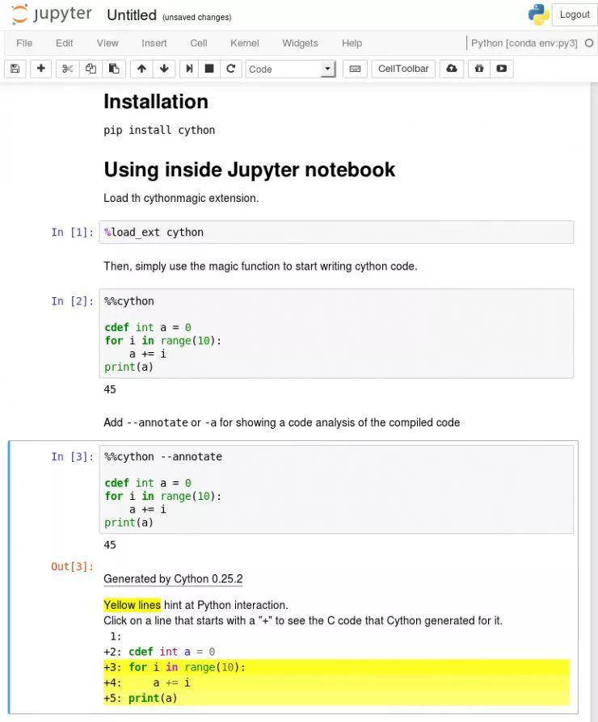

## 老司机都开火箭了！Cython 助力 Python NLP 实现百倍加速  

> 作者: AI研习社  
> 发布日期: 2018-07-26  

> 雷锋网 AI 研习社按：本文的作者是来自 Hugging face 的科学家 Thomas Wolf，他的研究方向包括机器学习、自然语言处理和深度学习。在这篇博客中，他介绍了如何利用 Cython 和 spaCy 让 Python 在自然语言处理任务中获得百倍加速。雷锋网\(公众号：雷锋网\) AI 研习社根据原文进行了编译。


SpaceX 猎鹰重型发射器，版权归 SpaceX 所有

> 提示：本文中涉及的所有例子都可以在这个 Jupyter notebook 中获得源码。

在去年我们发布了用 Python 实现的基于神经网络的相互引用解析包（Neural coreference resolution package）之后，在社区中获得了惊人数量的反馈，许多人开始将该解析包用到各种各样的应用中，有一些应用场景甚至已经超出了我们原本设计的对话框用例（Dialog use-case）。

后来我们发现，虽然这个解析包对于对话框消息而言，解析速度完全够用，但如果要解析更大篇幅的文章就显得太慢了。

因此我决定要深入探索解决方案，并最终开发出了 NeuralCoref v3.0。这个版本比之前（每秒解析几千字）的要快出百倍，同时还保证了相同的准确性，当然，它依然易于使用，也符合 Python 库的生态环境。

在本篇文章中，我想向大家分享我在开发 NeuralCoref v3.0 过程中学到的一些经验，尤其将涉及：

* 如何才能够使用 Python 设计出一个高效率的模块，
* 如何利用好 spaCy 的内置数据结构，从而设计出超高效的自然语言处理函数。

我的标题其实有点作弊，因为我实际上要谈论的是 Python，同时也要介绍一些 Cython 的特性。不过你知道吗？Cython 属于 Python 的超集，所以不要让它吓跑了！

> 小提示：你当前所编写的 Python 项目已经算是一个 Cython 项目了。

以下给出了一些可能需要采用这种加速策略的场景：

* 你正在使用 Python 给自然语言处理任务开发一个应用级模块
* 你正在使用 Python 分析一个自然语言处理任务的大型数据集
* 你正在为诸如 PyTorch/TensoFlow 这些深度学习框架预处理大型训练集，或者你的深度学习模型采用了处理逻辑复杂的批量加载器（Batch loader），它严重拖慢了你的训练速度

> 提示：我还发布了一个 Jupyter notebook，其中包含了本文中讨论的所有示例，欢迎大家下载调试！

##

###  **百倍加速第一步：代码剖析**


你需要知道的第一件事情是，你的大部分代码在纯 Python 环境下可能都运行良好，但是其中存在一些瓶颈函数（Bottlenecks functions），一旦你能给予它们更多的「关照」，你的程序将获得几个数量级的提速。

所以你应该从剖析自己的 Python 代码开始，找出那些低效模块。其中一种方法就是使用 cProfile：

> import cProfile import pstats import my\_slow\_module cProfile.run\('my\_slow\_module.run\(\)', 'restats'\) p = pstats.Stats\('restats'\) p.sort\_stats\('cumulative'\).print\_stats\(30\)

你很可能会发现低效的原因是因为一些循环控制，或者你使用神经网络时引入了过多的 Numpy 数组操作（我不会花费时间在这里介绍 Numpy，这个问题已经有太多文章进行了讨论）。

那么我们该如何来加速循环呢？

###

###  **在 Pyhthon 中加入 Cython 加速循环计算**


让我们通过一个简单的例子来解决这个问题。假设有一堆矩形，我们将它们存储成一个由 Python 对象（例如 Rectangle 对象实例）构成的列表。我们的模块的主要功能是对该列表进行迭代运算，从而统计出有多少个矩形的面积是大于所设定阈值的。

我们的 Python 模块非常简单：

from random import random class Rectangle: def \_\_init\_\_\(self, w, h\): self.w = w self.h = h def area\(self\): return self.w \* self.h def check\_rectangles\(rectangles, threshold\): n\_out = 0 for rectangle in rectangles: if rectangle.area\(\) > threshold: n\_out += 1 return n\_out def main\(\): n\_rectangles = 10000000 rectangles = list\(Rectangle\(random\(\), random\(\)\) for i in range\(n\_rectangles\)\) n\_out = check\_rectangles\(rectangles, threshold=0.25\) print\(n\_out\)

其中 check\_rectangles 函数就是我们程序的瓶颈！它对一个很长的 Python 对象列表进行迭代，而这一过程会相当缓慢，因为 Python 解释器在每次迭代中都需要做很多工作（查找类中的 area 方法、参数的打包和解包、调用 Python API 等等）。

> 这时候该有请 Cython 出场帮助我们加速循环操作了。

Cython 语言是 Python 的一个超集，它包含有两种类型的对象：

* Python 对象就是我们在常规 Python 中使用到的那些对象，诸如数值、字符串、列表和类实例等等
* Cython C 对象就是那些 C 和 C++ 对象，诸如双精度、整型、浮点数、结构和向量，它们能够由 Cython 在超级高效的低级语言代码中进行编译

> 该循环只要采用 Cython 进行复现就能获得更高的执行速度，不过在 Cython 中我们只能够操作 Cython C 对象。

定义这种循环最直接的一种方法就是，定义一个包含有计算过程中我们所需要用到的所有对象的结构体。具体而言，在本例中就是矩形的长度和宽度。

然后我们可以将矩形对象列表存储到 C 的结构数组中，再将数组传递给 check\_rectangles 函数。这个函数现在将接收一个 C 数组作为输入，此外我们还使用 cdef 关键字取代了 def（注意：cdef 也可以用于定义 Cython C 对象）将函数定义为一个 Cython 函数。

这里是 Cython 版本的模块程序：

```
from cymem.cymem cimport Pool

from random import random

cdef struct Rectangle:

float w

float h

cdef int check_rectangles(Rectangle* rectangles, int n_rectangles, float threshold):

cdef int n_out = 0

### C arrays contain no size information => we need to give it explicitly

for rectangle in rectangles[:n_rectangles]:

if rectangle[i].w * rectangle[i].h > threshold:

n_out += 1

return n_out

def main():

cdef:

int n_rectangles = 10000000

float threshold = 0.25

Pool mem = Pool()

Rectangle* rectangles = <Rectangle*>mem.alloc(n_rectangles, sizeof(Rectangle))

for i in range(n_rectangles):

rectangles[i].w = random()

rectangles[i].h = random()

n_out = check_rectangles(rectangles, n_rectangles, threshold)

print(n_out)
```

这里我们使用了原生的 C 数组指针，不过你还有其它选择，特别是 C++ 中诸如向量、二元组、队列这样的结构体。在这段程序中，我还使用了一个来自 cymem 提供的 Pool\(\) 内存管理对象，它可以避免手动释放所申请的 C 数组内存空间。当不再需要使用 Pool 中的对象时，它将自动释放该对象所占用的内存空间。

> 补充：spaCy API 的 Cython 标准页面提供了在实际应用中使用 Cython 实现自然语言处理任务的参考资料。

#### 让我们开始动手吧！

有很多办法来测试、编译和发布 Cython 代码。Cython 甚至可以像 Python 一样直接用于 Jupyter Notebook 中。

通过 pip install cython 命令安装 Cython。



#####

####  **首先在 Jupyter 中进行测试**

使用 %load\_ext Cython 指令在 Jupyter notebook 中加载 Cython 扩展。

然后通过指令 %%cython，我们就可以像 Python 一样在 Jupyter notebook 中使用 Cython。

如果在执行 Cython 代码的时候遇到了编译错误，请检查 Jupyter 终端的完整输出信息。

大多数情况下可能都是因为在 %%cython 之后遗漏了 -+ 标签（比如当你使用 spaCy Cython 接口时）。如果编译器报出了关于 Numpy 的错误，那就是遗漏了 import numpy。

正如我在一开始就提到的，请好好阅读这份 Jupyter notebook 和这篇文章（https://github.com/huggingface/100-times-faster-nlp），它包含了我们在 Jupyter 中讨论到的所有示例。

#####

####  **编写、使用和发布 Cython 代码**

Cython 代码的文件后缀是 .pyx，这些文件将被 Cython 编译器编译成 C 或 C++ 文件，再进一步地被 C 编译器编译成字节码文件。最终 Python 解释器将能够调用这些字节码文件。

你也可以使用 pyximport 将一个 .pyx 文件直接加载到 Python 程序中：

> >>> import pyximport; pyximport.install\(\) >>> import my\_cython\_module

你也可以将自己的 Cython 代码作为 Python 包构建，然后像正常的 Python 包一样将其导入或者发布，更多细节请参考这里。不过这种做法需要花费更多的时间，特别是你需要让 Cython 包能够在所有的平台上运行。如果你需要一个参考样例，不妨看看 spaCy 的安装脚本。

在我们开始优化自然语言处理任务之前，还是先快速介绍一下 def、cdef 和 cpdef 这三个关键字。它们是你开始学会使用 Cython 之前需要掌握的最主要的知识。

你可以在 Cython 程序中使用三种类型的函数：

* Python 函数由 def 关键字定义，它的输入和输出都是 Python 对象。在函数内可以使用 Python 和 C/C++ 对象，并且能够调用 Cython 和 Python 函数。
* Cython 函数由 cdef 关键字进行定义，它可以作为输入对象，在函数内部也可以操作或者输出 Python 和 C/C++ 对象。这些函数不能从 Python 环境中访问（即 Python 解释器和其它可以导入 Cython 模块的纯 Python 模块），但是可以由其它 Cython 模块进行导入。
* 通过关键字 cpdef 定义的 Cython 函数与 cdef 定义的 Cython 函数很相似，但是 cpdef 定义的函数同时还提供了 Python 装饰器，所以它们能够在 Python 环境中被直接调用（函数采用 Python 对象作为输入与输出），此外也支持在 Cython 模块中被调用（函数采用 C/C++ 或者 Python 对象作为输入）。

cdef 关键字的另一个用途就是，在代码中表明某一个对象是 Cython C/C++ 对象。所以除非你在代码中使用 cdef 声明对象，否则这些对象都会被解释器当做 Python 对象（这会导致访问速度变慢）。

####

####  **使用 Cython 和 spaCy 加速自然语言处理**

这一切看起来都很好，但是......我们到现在都还没开始涉及优化自然语言处理任务！没有字符串操作，没有 unicode 编码，也没有我们在自然语言处理中所使用的妙招。

此外 Cython 的官方文档甚至建议不要使用 C 语言类型的字符串：

> 通常来说：除非你明确地知道自己正在做什么，不然就该避免使用 C 类型字符串，而应该使用 Python 的字符串对象。

那么当我们在操作字符串时，要如何在 Cython 中设计一个更加高效的循环呢？

> spaCy 引起了我们的注意力。

spaCy 处理该问题的做法就非常地明智。

#####

####  **将所有的字符串转换为 64 位哈希码**

spaCy 中所有的 unicode 字符串（一个标记的文本、它的小写形式文本、它的引理形式、POS 标记标签、解析树依赖标签、命名实体标签等等）都被存储在一个称为 StringStore 的数据结构中，它通过一个 64 位哈希码进行索引，例如 C 类型的 uint64\_t。


StringStore 对象实现了 Python unicode 字符串与 64 位哈希码之前的查找映射。

它可以从 spaCy 的任何地方和任意对象进行访问，例如 npl.vocab.strings、doc.vocab.strings 或者 span.doc.vocab.string。

当某一个模块需要在某些标记（tokens）上获得更快的处理速度时，你可以使用 C 语言类型的 64 位哈希码代替字符串来实现。调用 StringStore 查找表将返回与该哈希码相关联的 Python unicode 字符串。

但是 spaCy 能做的可不仅仅只有这些，它还允许我们访问文档和词汇表完全填充的 C 语言类型结构，我们可以在 Cython 循环中使用这些结构，而不必去构建自己的结构。

#####

####  **SpaCy 的内部数据结构**

与 spaCy 文档有关的主要数据结构是 Doc 对象，该对象拥有经过处理的字符串的标记序列（“words”）以及 C 语言类型对象中的所有标注，称为 doc.c，它是一个 TokenC 的结构数组。

TokenC 结构包含了我们需要的关于每个标记的所有信息。这种信息被存储成 64 位哈希码，它可以与我们刚刚所见到的 unicode 字符串进行重新关联。

如果想要准确地了解这些漂亮的 C 结构中的内容，可以查看新建的 spaCy 的 Cython API 文档。

接下来看一个简单的自然语言处理的例子。

####

####  **更快的自然语言处理**

假设现在有一个文本文档的数据集需要分析。

```
import urllib.request

import spacy

with urllib.request.urlopen('https://raw.githubusercontent.com/pytorch/examples/master/word_language_model/data/wikitext-2/valid.txt') as response:

text = response.read()

nlp = spacy.load('en')

doc_list = list(nlp(text[:800000].decode('utf8')) for i in range(10))
```

我写了一个脚本用于创建一个包含有 10 份文档的列表，每份文档都大概含有 17 万个单词，采用 spaCy 进行分析。当然我们也可以对 17 万份文档（每份文档包含 10 个单词）进行分析，但是这样做会导致创建的过程非常慢，所以我们还是选择了 10 份文档。

我们想要在这个数据集上展开某些自然语言处理任务。例如，我们可以统计数据集中单词「run」作为名词出现的次数（例如，被 spaCy 标记为「NN」词性标签）。

采用 Python 循环来实现上述分析过程非常简单和直观：

```
def slow_loop(doc_list, word, tag):

n_out = 0

for doc in doc_list:

for tok in doc:

if tok.lower_ == word and tok.tag_ == tag:

n_out += 1

return n_out

def main_nlp_slow(doc_list):

n_out = slow_loop(doc_list, 'run', 'NN')

print(n_out)
```

但是这个版本的代码运行起来非常慢！这段代码在我的笔记本上需要运行 1.4 秒才能获得答案。如果我们的数据集中包含有数以百万计的文档，为了获得答案，我们也许需要花费超过一天的时间。

我们也许能够采用多线程来实现加速，但是在 Python 中这种做法并不是那么明智，因为你还需要处理全局解释器锁（GIL）。另外请注意，Cython 也可以使用多线程！Cython 在后台可以直接调用 OpenMP。不过我没有时间在这里讨论并行性，所以请查看此链接以了解更多详情。

现在让我们尝试使用 spaCy 和 Cython 来加速 Python 代码。

首先需要考虑好数据结构，我们需要一个 C 类型的数组来存储数据，需要指针来指向每个文档的 TokenC 数组。我们还需要将测试字符（「run」和「NN」）转成 64 位哈希码。

当所有需要处理的数据都变成了 C 类型对象，我们就可以以纯 C 语言的速度对数据集进行迭代。

这里展示了这个例子被转换成 Cython 和 spaCy 的实现：

```
%%cython -+

import numpy # Sometime we have a fail to import numpy compilation error if we don't import numpy

from cymem.cymem cimport Pool

from spacy.tokens.doc cimport Doc

from spacy.typedefs cimport hash_t

from spacy.structs cimport TokenC

cdef struct DocElement:

TokenC* c

int length

cdef int fast_loop(DocElement* docs, int n_docs, hash_t word, hash_t tag):

cdef int n_out = 0

for doc in docs[:n_docs]:

for c in doc.c[:doc.length]:

if c.lex.lower == word and c.tag == tag:

n_out += 1

return n_out

def main_nlp_fast(doc_list):

cdef int i, n_out, n_docs = len(doc_list)

cdef Pool mem = Pool()

cdef DocElement* docs = <DocElement*>mem.alloc(n_docs, sizeof(DocElement))

cdef Doc doc

for i, doc in enumerate(doc_list): # Populate our database structure

docs[i].c = doc.c

docs[i].length = (<Doc>doc).length

word_hash = doc.vocab.strings.add('run')

tag_hash = doc.vocab.strings.add('NN')

n_out = fast_loop(docs, n_docs, word_hash, tag_hash)

print(n_out)
```

代码有点长，因为我们必须在调用 Cython 函数之前在 main\_nlp\_fast 中声明和填充 C 结构。

> 补充：如果你在代码中需要多次使用低级结构，比每次填充 C 结构更优雅的做法是，使用 C 类型结构的 Cython 扩展类型装饰器来设计 Python 代码。这就是大多数 spaCy 代码所采用的结构，它非常优雅，兼具高效、低内存花销和易于访问的特性。

这串代码虽然变长了，但是运行效率却更高！在我的 Jupyter notebook上，这串 Cython 代码只运行了大概 20 毫秒，比之前的纯 Python 循环快了大概 80 倍。

使用 Jupyter notebook 单元编写模块的速度很可观，它可以与其它 Python 模块和函数自然地连接：在 20 毫秒内扫描大约 170 万个单词，这意味着我们每秒能够处理高达 8 千万个单词。

对使用 Cython 进行自然语言处理加速的介绍到此为止，希望大家能喜欢它。

关于 Cython 还有很多其它的东西可以介绍，但是已经超出了这篇文章的初衷（这篇文章只是作为简介）。从现在开始，最好的资料也许是这份综述性的 _Cython 教程（http://cython.readthedocs.io/en/latest/src/tutorial/index.html）_ 和介绍 spaCy 自然语言处理的 _Cython 页面（https://spacy.io/api/cython）_ 。

如果你还想要获得更多类似的内容，请记得给我们点赞哟！

####  **相关资料**

* 本文代码链接： https://github.com/huggingface/100-times-faster-nlp
* 基于神经网络的相互引用解析包 https://medium.com/huggingface/state-of-the-art-neural-coreference-resolution-for-chatbots-3302365dcf30
* NeuralCoref v3.0 https://github.com/huggingface/neuralcoref/
* spaCy 的安装脚本 https://github.com/explosion/spaCy/blob/master/setup.py

Via _100 Times Faster Natural Language Processing in Python_

雷锋网 AI 研习社编译整理
