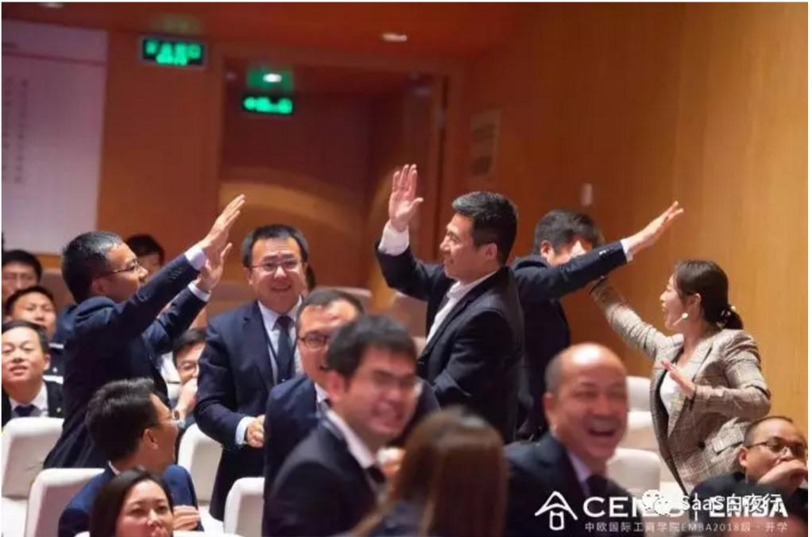

## SaaS创业路线图（九）：面对同行无底线竞争，怎样的竞争策略最聪明？  

> 发布: 吴昊@SaaS  
> 发布日期: 2018-07-24  

作者介绍 - 吴昊，纷享销客天使投资人、前执行总裁，20年企业信息化和6年SaaS营销团队创新经验，每天一篇2000字SaaS创业文章的坚持者。欢迎关注公众号：SaaS白夜行。原题目《SaaS创业路线图（九）：怎样的竞争策略最聪明？》

同领域的SaaS公司很容易陷入恶性竞争的局面中。这应该是中国独有的现象。我在2015年初拜访硅谷的SaaS公司时，美国SaaS创业者们说他们不会选择抢既有细分赛道，而是在别人的创意旁边另辟蹊径，也就是说他们更喜欢差异化策略。

### 一、为何中国SaaS公司会陷入激烈竞争呢？

我判断有3个因素。

一是前2年中国热钱比美国更多，拿了投资的SaaS厂商在竞争过程中更倾向以“销售额”为导向而非最求“利润”。

二是中国人创业热度高，大量创业者没有商业经验、也缺乏保护现金流的实际经营企业的经验，容易做出激进决策；

三是国有垄断企业的高额利润在商业环境中形成了一个假象，“先用低价干掉对手，我们未来再提价”。

二、错误结论的来源

咱们先讨论一下第3点。国家政策垄断和市场垄断是一回事吗？当然不是，看看滴滴合并快滴和Uber之后的竞争格局就知道了：只要看到你有高毛利率，美团、高德会来抢，易到也能再融到钱继续和你玩，新的玩家还会再出现......

因此， **在自由竞争的局面下，不存在长时间的垄断利润** 。以下这些都是错觉：

1999年，没有一家软件公司能打败微软了！——微软股价在2016年才回到1999年的高度，用了17年时间......

2010年，淘宝垄断了电商！——之后京东很快通过物流奇兵拿到头部市场，至今看不到菜鸟如何能打破京东物流的效率优势......

2013年，百度搜索第一！——现在要加上限定词“PC”，今天在移动端“推荐阅读”更受欢迎，因为屏幕太小了、手机输入搜索关键词很不方便......

2016年，微信的流量入口地位无人可以挑战！——结果2017年出来个“抖音”......

今年5月我在中欧EMBA参加“态马”商战模拟，最大感受是，传统行业比互联网行业更理解商业的本质，毛利率是企业生存的命根子，不要毛利的竞争是不理性的。

三、说完理论再说说实战的惨状

销售团队大多是充满狼性的，在客户那里遇到竞争对手都有战胜对手的强烈愿望。在团队内部，也很容易形成“树靶子”的风气，这不是坏事。 **有标杆、有靶子，Leader们更容易激发销售团队的斗志。**

我最近6年服务的SaaS公司亦是如此，2014年十几家友商一起扬帆竞争局面还算正常，2015年与主要友商的竞争就非常激烈了。当时我就觉得友商在价格和其它一些方面没有底线。我善意地相信后者是基层员工个人行为，这里只讨论价格战的问题。

当年价格竞争非常离谱，到了月底我每天面对一大堆低折扣审批。恼火之余，我毕竟还得体谅一线的兄弟们的业绩压力，我自己是千人营销团队的老大，也背着每个月增长25%的任务，所以只能批批批......

今天抽身看当年这些情况，我的总结是：产品同质化后，价格竞争无可避免。当时产品价值以外勤管理为主，虽然也有销售团队能用得上的其它功能，但每个客户用法都差不多，用哪个产品差别也不大。这时候，就是拼销售的能力和价格了。

阿甘在美团时有一个方式，我没实践过，大家可以参考：折扣审批在系统中严格按流程执行，与标准不符的，系统就不允许签合同，阿甘也不会特批。 **这样销售遇到阻力，就会往外在客户身上想办法，而不是朝内设法走特殊通道。**

当然，美团的特点是地推、大量、小单、与小B分成，这个与管理SaaS不同，大家自行判断是否适用。

### 四、市场竞争的本质

**其实我们去研究一个新兴市场，经常会看到这样的情况：市场的繁荣依靠众多厂商共同的培育和耕耘。** 那些急功近利的厂商，很快会被边缘化；那些认真对待客户需求的厂商们，会通过Marketing教育客户、通过良性竞争提升产品价值和服务能力，让客户满意、进而吸引更多企业变成客户，做大整个蛋糕。

正巧我2个前东家都是这样的例子。深圳同城的华为和中兴，一路在从中国走向世界的激烈比拼中提升了对手的战斗力；巴黎同城的威立雅水务和苏伊士水务，一个在塞纳河南岸一个在北岸，一路比拼，最后在全球前3大水务公司中各占一席。

**所以我们紧盯的不应该是竞争对手做了什么，而应该是自己的产品和服务是否让客户满意？** 以我过去6年的经验看，很多时候友商也昏招不断，keep one eye on it，就足够了。不必事事跟进，不必经常开会讨论对手怎着了，不要分心、做好自己事儿才是关键。 **因为市场竞争的本质是实力，而非花招。**

###  五、从更高视角看待竞争问题

总的来说，我认为应对竞争的关键还是应该 **初期就在公司战略、产品定位上做好定位** 。

SaaS是为企业客户服务的， **企业的情况千千万万，不同SaaS厂商完全可以在产品价值上找到差异点。即使产品类似的，也可以在实施交付形式和服务上找到差异点。**

**拼价格只能一起死，看看竞争后各方的惨状就知道了。**

至于用“买2年送1年”的方法，也是变相降价，更是自寻死路。这样折扣更低，毛利损失更大；而且 **未来2年没有续费** ， **服务团队自然会轻视对他们的服务。** 因为无论你怎么考核活跃率，能见到“钱”的续费率毕竟才是更重要的指标。相关内容详见我另一篇文字《SaaS的本质和SaaS公司的大坑》。

**我这里不是鼓吹建立价格同盟，90年代的“家电价格同盟”就是个闹剧，我强调的是产品差异化定位和坚守毛利率底线。**

这里还有一个例子很有意思。昨晚我和一个在健身门店SaaS领域很成功的CEO交流，发现他们的价格很坚挺，而竞争对手在目录价格只有其一半的情况下还无底线打折，结果反而是对手崩盘、他们实现公司整体盈利。为什么？

**我推导一下被迫走低价策略公司的状况：客单价低——销售不挣钱——招不到优秀的销售——销售没能力打动老板——只能用更深的折扣说服客户......”这显然是一个恶性循环。**

这对所有厂商都是个很痛的问题，欢迎大家探讨：你有定价的困惑吗？你的友商是否无底线打折？你的销售团队是否经常申请深折扣？

如果有好的思路，也欢迎留言！

我目前处在从SaaS创业者向SaaS投资者的转型阶段中，经常1对1地在产品、营销思路及企业经营上帮助SaaS创业者，很愿意与大家在线或当面交流。

**相关阅读：**

《SaaS产品与传统软件的本质区别》（见公众号“SaaS白夜行”）

[SaaS创业路线图（一）](https://36kr.com/p/5136068.html)

[SaaS创业路线图（五）SaaS的销售模式和营销组织演进](https://36kr.com/p/5140391.html)

作者专栏：

[吴昊SaaS（点击查看所有系列文章）](https://36kr.com/user/1308477002)
