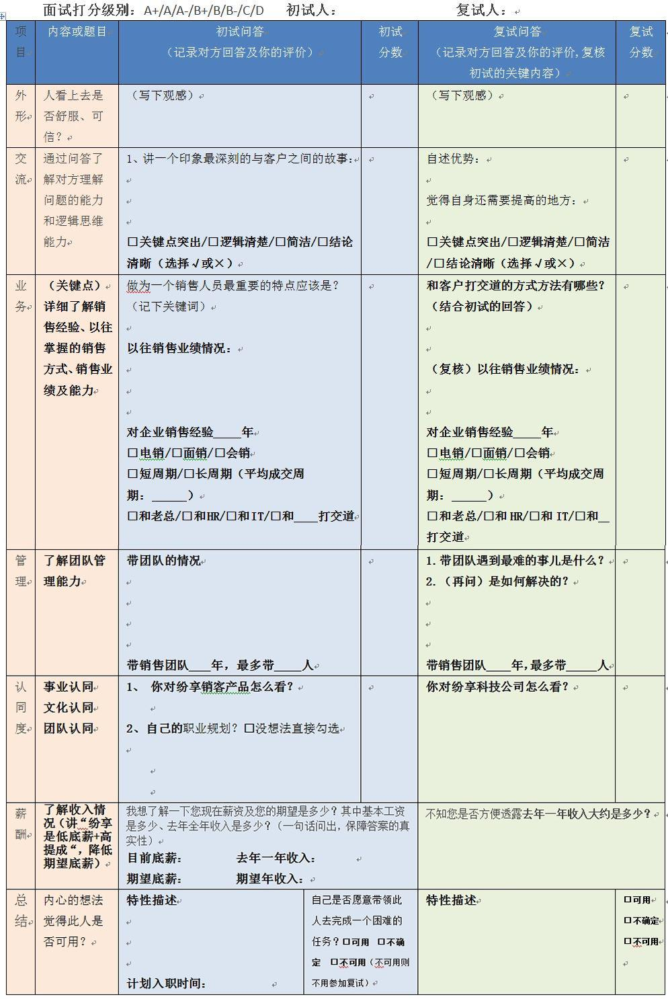
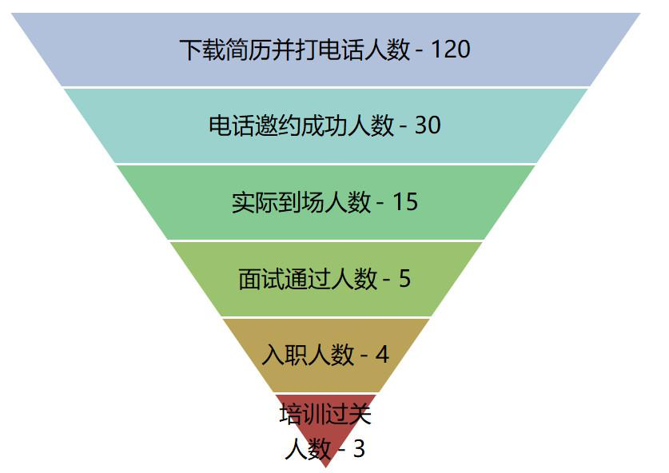

## SaaS创业路线图（六）：如何高效扩张团队？  

> 发布: 吴昊@SaaS  
> 发布日期: 2018-07-03  

编者按：作者介绍 - 吴昊，纷享销客天使投资人、前执行总裁，20年企业信息化和6年SaaS营销团队创新经验，每天一篇2000字创业文章的坚持者。欢迎关注公众号：SaaS白夜行。

最近每周我都和5、6个SaaS公司创始人深聊，招不到合适的人，是每个公司在“扩张”阶段最大的苦恼。

我之前的公众号文章说过，纷享销客在2014~2016年曾把团队招聘模块做出“花儿”了，精雕细琢每个环节，像对待销售漏斗一样做“招聘效率漏斗”。销售团队从10人到1800人，在持续18个月里，每个季度人数翻番、业绩翻番。

我今天就讲讲当时我在纷享是如何带领大团队做招聘的，未必完全适合你的公司，讲讲这个故事供大家参考。

**首先讲讲大原则，就是“集中招聘、集中入职、集中培训”。**

传统的方式是HR一个个通知应聘者，然后一个个来公司面试，可以看到这样效率非常低。因为你给每个人的时间太少，介绍公司不透彻（除非你是BAT或华为，不需要介绍公司，但也得介绍部门和岗位吧？），对方意愿没激活，双方表达不彻底。

我从核心部分开始讲，这样比较容易理解。

**从2014年到2015年，有一个演讲我讲了50遍，就是招聘宣讲。**

通过多次演练，这个演讲我控制在70分钟，短了讲不清楚，长了影响后面的面试时间。我会在这70分钟，讲清楚行业前景、公司愿景、团队实力、产品价值、个人收入情况、销售提成比例、新人培训计划、吃苦耐劳的要求。其中还会穿插10分钟产品演示，（纷享销客自己的产品正好支持类似微博的信息流）演示除了介绍功能，也通过演示内容展现团队艰苦奋斗、团结互助的文化，加上5分钟答疑。最后演讲不能在答疑后“没人提问了？那我们就这样吧...”冷清的结束，而是再做个拔高总结——让每个人都觉得“现在加入，正逢其时！”

我刚才看了一下，招聘PPT最后一个版本是v3.8，那么从v1.0到v3.8，我大概迭代了28个版本。几乎每次演讲后都会做小优化。演讲中每7分钟有一次快速互动，防止听众走神。

通过集中招聘宣讲，应聘者能够全面了解公司，大幅增加其入职的意愿。每次到场30~120人不等，中途离场的比例不超过1%。甚至有新同学直接说，“昊哥，公司不给我开薪水我也要来”。这几位同学请跟帖举手哈。

讲完核心部分，我讲讲我们 **与众不同的招聘流程。**

**第一，业务主管亲自搜简历。** 很多HR喜欢在招聘网站上挂个JD（岗位描述），其实 **主动投来的简历平均质量很差，看这些简历简直是浪费时间，远不如主动搜索的质量好。** 当然，本篇讲的是规模招聘，如果是个别高端岗位招聘，应该通过别的来源通道，具体参考我的前一篇文章[《创业公司核心营销团队招募》。](https://36kr.com/p/5138329.html)

为什么不是安排HR搜就行了呢？因为在智联、51job等网站搜索，有很多Filter参数，要很灵活地调整参数，平衡简历质量和数量的关系。这活儿到底是HR做还是业务主管做？我的建议是看公司阶段，创业公司还是业务主管做靠谱，速度快、浪费少。当然，这不是业务工作，当年纷享的业务主管们是每周三、周四晚上熬夜干这活儿的。

**第二，招聘专员或助理发模板招聘邮件** （包含公司完整介绍，这样可以节约打招聘电话的时间），并电话确认对方在找工作（这可以烘托后面电话面试者的身份很重要）。

**第三，我要求业务主管亲自打招聘电话。** 因为优秀的应聘者会有N个公司邀约，HR如果只做“面试通知”，优秀人员来的概率就只有1/N。要把这个概率提高到80%以上， **主管应该为每个优秀的简历打15分钟电话** ，把公司、岗位、个人发展和收入介绍清楚，把来听招聘宣讲的价值也讲清楚。

这里有一些灵活度，如果业务主管很忙，可以把简历按质量排序，前20~40%业务主管打，剩下的由HR招聘专员或助理打，最终转化率也可以接受。管理上28原则到处都适用。

**第四，电话沟通后再跟个短信。** （至于为什么要这么做，请你思考，欢迎跟帖）

**第五，面试前一天下午或面试当天提前2小时短信再确认。**

**第六、周五上午9点，高层集中宣讲** （节约时间、形成气场）（HR打印好简历及打分表、签到表）。
**大家会奇怪，为啥是周五上午9点，不是周四，也不是下午2点？这是有原因的，欢迎大家把你的猜测回复在帖子后面。**

**第七、管理者逐一面试、复试、要求尽快入职。** 这里有一个打分表，要求初试、复试的面试官按多个标准维度打分。并提供了部分统一问题，初试官、复试官的标准提问是不同的。

**第八、总结、汇总、跟踪“招聘效率漏斗”。**

我们要把一次招聘、入职、培训的过程，当做一个（销售）效率漏斗来统计和分析。每个环节都要细抠，才能提升最终效率。

**第九、集中在下周一入职，** 进入为期2周的新人入职培训环节。所以我另一个配套的演讲是《新员工入职文化培训》，我也固定在每周一早上9点开讲，同样讲了50多遍。

至于培训环节，如果有机会我再单独写。

**在纷享开了5个分公司后，我要求每个分公司总经理按这个招聘流程工作。** 他们的招聘演讲，我请各分公司助理录下来发给我，我审一遍能提出十几个问题，下次演讲再录、再发给我提建议。管理就是日积月累，每周提高1%，一年下来也能提高64%。

看完这个“招聘转化率漏斗”，你会突然发现，原来招到3个合适的人，竟然要打100多个电话！没错，招聘就是一件苦活儿，但没有人啥也做不成。

集中招聘至少在效率上比零散招聘节省30~50%的时间。更重要的是，不耽误公司发展机遇。当然，集中招聘也有岗位级别、岗位类型的适用范围，适不适合你的公司，见仁见智吧。

最后有一点我想强调， **不要推脱说你们招聘遇到了多少困难，问题永远在于作为CEO或销售VP，你有没有在最重要的事情上花足够多的时间。**

另外，创意和创新能力非常重要，我常说，人家发微信时，你就要回归短信；座机电话效果下降了，就换手机打；手机也不行了，你就要写信。

**营销的关键是独特和极致。**

（“纷享毕业生”平台上的伍鹏等同学对本文亦有贡献，在此表示感谢。）

> 为什么电话沟通后再跟个短信？为什么高层集中宣讲是周五上午9点，不是周四，也不是下午2点？你还有其他想跟作者交流的吗？欢迎在评论区留言，作者会亲自解答~

推荐阅读：

[SaaS创业路线图（一）：SaaS创业路线全貌](http://36kr.com/p/5136068.html)

[SaaS创业路线图（二）：一文读懂SaaS创业路线全貌](http://36kr.com/p/5137220.html)

[SaaS创业路线图（三）：创业公司核心营销团队招募](http://36kr.com/p/5138329.html)

[SaaS创业路线图（四）：产品打磨阶段各个角色怎么配合？](http://36kr.com/p/5139286.html)

[SaaS创业路线图（五）：SaaS的销售模式和营销组织演进](https://36kr.com/p/5140391.html)
