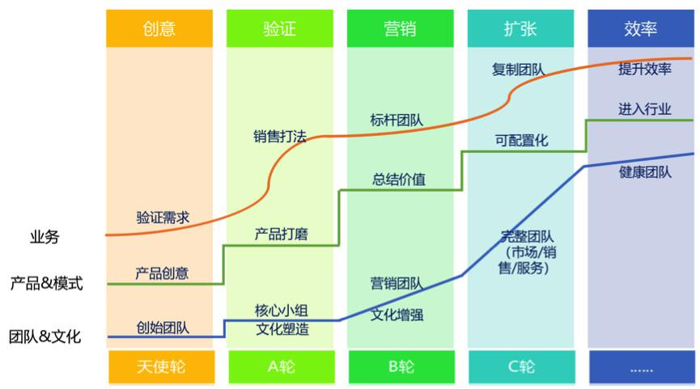

## SaaS创业路线图（13）：营销服务部门绩效和提成该如何设计？  

> 发布: 吴昊@SaaS  
> 发布日期: 2018-08-21  

作者介绍：吴昊，纷享销客天使投资人、前执行总裁，20年企业信息化和6年SaaS营销团队创新经验，每天一篇2000字SaaS创业文章的坚持者，目前正处在从创业者向投资人的转型过程中。欢迎关注公众号：SaaS白夜行。[本文为系列文章《SaaS创业路线图》第十三篇](https://36kr.com/user/1308477002)，点击查看全系列。

绩效无小事，因为这涉及到对团队、对个人的评价，也关系到个人收入。公司要赢得员工的信任，初期靠CEO、VP的领导力。团队规模上200人后，信任依赖于制度的稳定性、合理性以及执行的公正。

### 1、市场人员绩效设计

市场对提供市场线索负责，对整体输出负责，但工作努力与输出结果之间不是线性关系（受外界市场环境、宏观及行业经济波动影响很大），因此一般拿绩效奖金。

即便是负责清洗市场线索的SDR，主要收入也是工资+奖金，一般不与其出单线索的销售挂钩（也就是不拿销售提成）。因此他们的线索也来自公司资源，而非自开拓；按出单销售额挂钩，会误导他们不重视中小客户，影响整个市场部的目标（输出有效线索数量）。

当然，如果公司的SDR是电话销售的概念，那是销售部门，不在此列。

### 2、新购

我们定义新客户的首次采购为“新购”。

销售人员的收入大部分应该是新购的销售提成。新购业绩也应该是销售团队的主要业绩。

销售的提成设计比较复杂，细节我不多说，有兴趣的同学可以在我的公众号“SaaS白夜行”下看看：《销售团队高增长目标下的提成和绩效奖金设计？》、《销售VP的薪酬如何设计？》等文章。

### 3、增购

增购是争议比较大的部分。新签客户多长时间内的增购要与销售挂钩？是完全视同新购计算业绩和提成、还是另外计算？

关于个人收入的设计都有一个原则：收益与贡献挂钩。

新购肯定是销售贡献最大，开拓新客户的艰难大家都理解。

那么增购呢？销售作为“把客户找来的人”，该客户在3~6个月内增购应该是与销售挂钩的。至于3~6个月之后，可能是实施、CSM的贡献更大，但也可能是销售早与客户约定好的“按计划增购”，所以仍然不好判断。

是否要制定政策细节，如果是“按计划增购”，销售仍作为主要贡献者；反之则由CSM作为主要贡献者呢？这个要结合公司的总体战略（例如，今年是新开为主？还是老客户服务后的增购为主？）、产品服务特点以及历史政策情况决定了。

一定不要这样做：每单到时候人为判断。这会带来很多争议、内耗，同时损耗判单者的威信（总会有一方不太服气）。营销团队在磨合期（20~50人）就应该逐步把这些规则搭建起来。

为何么要20~50人的时候建立制度呢？因为这时候leader带领团队打天下初见成效、威信高，团队人数少、成员之间关系密切，这样遇到规则不合理，“谈谈心”也就接受了。所以这阶段团队可以容忍规则反复调整，找到最合适自己公司的一套制度。

其实，这里又引出另一个战略层面的问题。如果公司明确做中小企业市场，“按计划增购”的概率很低，政策上也没必要做地那么复杂。如果目标是大企业市场，考虑合同中有“增购计划”就很有必要了。

### 4、续费

续费一般在新购12个月之后发生，与销售的相关度比较低了，与CSM相关度较高。

而且制度设计上也往往不希望老业务员“躺”着拿老客户的续费提成而缺乏新开动力。但也要考虑业务员对开拓客户的贡献，所以首年续费不计算销售业绩，但计较低比例（相对新购）的销售提成，是一个比较折中的方式。

至于CSM是应该拿续费销售提成还是拿完成总体续费（老客户）/活跃（新客户）任务的绩效奖金？
这要看公司老客户的续费情况。如果老客户续费率很高，CSM起到的作用更像客服，这时候CSM拿绩效更合适，避免他们像销售团队那样“狼性”太过。

但如果续费率不高，需要CSM非常努力地在续费期前6个月就深度服务、甚至要做二次实施，那就应该用高激励的方式，给CSM的更类似续费业绩销售提成了。

### 5、其它业务政策问题

涉及到多个部门间的职责划分、业绩分割、个人收益核算，这中间还有很多问题点需要管理者提前考虑。

* 业务员A离职，接手其客户的业务员B是否应该享有对应的增购业绩、续费提成？

* 一个合同如果是分期付款如何区分新购和增购？如果分期付款是跨年的呢？

* 软件服务费和实施费是否区别计算业绩和提成？

* CSM获得的转介绍线索，公司应统一管理还是允许自行找合适业务员跟进？如果公司统一管理，是否要给CSM少量提成奖励？业务员的提成是否对应减少？销售组织按什么规则分配这些线索？

* 发生退款，业绩如何扣减？跨年退款呢？

* 实施费收多少？是谁说了算？

还是那句话，绩效政策很关键。大家要相信人性。合理的机制可以牵引所有员工更主动、更积极想方设法解决问题。这和业务打法的标准化一样重要。

我最后需要强调一下，这篇我为绩效和提成设计提出了一些原理和原则，但每个公司的产品复杂度不同、LtoC（Leads to Cash\)的组织和业务流程不同，务必需要结合自身情况进行设计，还得尊重历史既有规则。

在组织管理上，优秀与普通的差别就在于有没有预见性和规划能力了。

绩效和提成设计的环境变量很多，欢迎大家结合自己公司的实践提出问题，我也需要更多信息完善自己的实战体系。谢谢大家！

参考文章：

[SaaS创业路线图（十二）市场、销售、售后（CSM）各部门的配合关系如何设计？](https://36kr.com/p/5148187.html)

[SaaS创业路线系列文章地址（点击查看）](https://36kr.com/user/1308477002)
