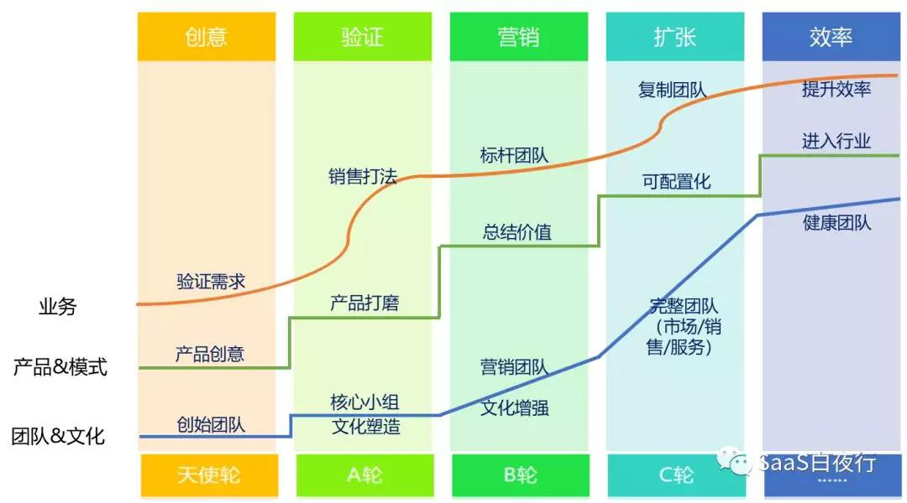

## 纷享销客联合创始人刘晨：为什么说SaaS公司一定要做客户成功  

> 发布: 吴昊@SaaS  
> 发布日期: 2018-09-04  

本文作者：刘晨，纷享销客联合创始人，华北区客户成功负责人。

本系列文章作者：吴昊，纷享销客天使投资人、前执行总裁，20年企业信息化和6年SaaS营销团队创新经验，每天一篇2000字SaaS创业文章的坚持者，目前正处在从创业者向投资人的转型过程中。

（我的系列原创文章已经写了14篇，从这第15篇起，我偶然会邀请一些专业岗位上的专家写一些专题给大家分享。关于客户成功，我请到纷享销客的联合创始人刘晨。以下为刘晨原创内容。）

最近接触传统软件相关的人比较多，聊的比较多的都是传统软件和SaaS软件的区别，以及这些区别延伸出来的一系列的变化。从最近沟通的内容来看，SaaS模式和传统软件模式相比其实带来了非常深远的变化，可以说延续到了整个SaaS从商业模式到业务逻辑的所有方面。

从商业模式变化上来看，传统软件是“一锤子买卖”，后续的10%的维护费用其实不足以调动软件厂商的积极性，所以基本上从付款后买卖双方的关系就发生了变化，这也是传统软件约定分步按比例付费的核心原因。但是无论如何，一旦买方支付完所有的产品费用后，后续驱动厂商提供服务的难度就大幅增加。在SaaS模式下，首先买方前期付出的成本更小，同时对SaaS交付的质量和长期服务的要求更高，而SaaS公司都知道，只有伺候好客户，客户的长期续费才能支撑起SaaS公司的运营模式，所以SaaS公司在服务都是愿意投入的，而且特别需要考核客户满意等相关指标。

从交付逻辑上，传统软件的交付依赖于当下的版本，产品能力是受限的或很难发生变化的，所以对于交付团队来说更重要的能力是“变通解决问题”的能力。而SaaS产品由于可以得到研发的持续支持，所以交付团队的核心能力是要清晰的了解产品演进的路径，从而做到“最合适”的交付。这个“合适”是指在交付方案的选择上，必须要考虑产品能力的演进，保证交付方案是处于产品演进路径上，避免未来重新做二次实施。这也使得交付团队从关注个性化交付向执行标准化交付上做演进，很多时候项目经理必须要做出合理的交付计划并说服客户等一等，来取得对双方都有利的长期结果。

从长期服务的逻辑上，传统软件一旦交付后，后续的服务必然迅速降低为响应式服务，而且服务的频度和次数都非常有限。因为维护费用的固定，导致服务的成本必须要控制在一定的范围内。传统软件下一波售卖的机会往往是大版本升级，而由于传统软件基本都是个性化交付，所以升级的成本非常高昂。当这些成本都转移给客户时，升级软件的商机会非常稀缺，能够从中为客户创造价值的频率就变得非常有限。而SaaS产品由于是在一套标准的产品框架下，产品功能的每一次迭代都有可能直接带来新的增值机会。同时，由于升级难度大幅降低，客户所要支付的升级成本也比较低廉，反而加速了增值机会的创造。所以SaaS公司在长期服务上面的投入可以通过短期内产生的增值购买覆盖服务成本，这也使得SaaS公司愿意加深对现有客户的服务。

基于这些变化，SaaS公司对于客户成功的投入包含从交付环节开始的长期服务。虽然现在国内的大部分公司如果能做到交付成功都很好了，但是把SaaS公司的成交后服务的部分叫做“客户成功”而不是“售后服务”的关键是认知到这里面是有本质逻辑变化的，所以“名字不同”这件事情的价值是大于实际的这个名字本身的，这样大家也不用纠结于这个名字是否拗口的问题了。

深入一步说，客户成功的考量需要包含以下要素：

**1、客户的分类分级**

随着产品的不断完善或者产品能力的不断增强，SaaS公司的客户规模往往都从小客户向中大甚至大型客户延伸。在服务资源有限的情况下，做好客户的分类分级是十分有必要的。服务一个头部的客户的价值要远高于服务10个小规模的客户，而服务成本可能只是3-5倍。在资源不足的情况下也要优先保证大客户的服务质量，对于建立后续的口碑都有重大的帮助，当然，哪个公司会觉得自己的资源是充足的呢？

**2、服务内容的分类分级**

服务一个客户的内容往往涉及到使用帮助、BUG排查、需求响应、管理建议等等，不同的服务内容也需要划分级别，并通过不同的手段做服务响应。使用帮助，考虑在线的FAQ、产品内置的引导、帮助手册和帮助视频等，尽量让用户可以自助解决问题。BUG排查这些往往涉及到人工和客户的反复沟通，同时需要卷入研发的工程师。这个时候一定要使用工单系统做好服务追踪，并且方便统计工作量。

**3、做好客户满意度**

现在其实国内的SaaS公司大家谈论CS（Customer Success 客户成功）真的太早，还不如先做到CS（CustomerSatisfaction）。在产品完善度不够的情况下，良好的服务是可以一定程度的提升客户满意，进而达到增值和续费的目的的。同NPS（净推荐值）一样，客户满意是一个感受型指标。感受型指标在有些人看来可能不够“清晰、客观”，但实际上toB服务中我更倾向于感受型指标。企业服务比个人服务难就难在客户的诉求是全方位的，不仅仅是“解决问题”。企业服务中解决问题仅仅是个基本维度，是一定更要做到的，再往上还要满足企业相关决策人、项目相关人等一系列从个人身份到企业身份的需求。所以采用感受型指标反而更容易反应我们在客户心中的全貌，将复杂的难以量化的指标归结为一个单一指标。当然，客户满意也还是需要量化的，推荐0-10进行打分，细化维度方便后续追踪变化。

**4、做好价值包装和价值传递**

中国的文化普遍对于服务的价值认知不够，所以SaaS公司要特别关注服务价值包装和服务价值传递这两个环节。包装要注意塑造价值（公司价值、项目价值、实施经理的价值、客户管理员价值、客户核心负责人价值等），传递环节要注意关键节点（项目启动会、需求调研会、交付阶段性汇报、上线试运行汇报、使用期的周期性汇报、续费期的价值传递等）。做得好也要说的好，对于目前的客户和市场环境来说非常重要。

总结来说，客户成功其实不仅仅是某个部门的事情，客户成功是要贯彻到整个SaaS公司的业务模型当中，渗透到业务的每个环节来。SaaS模型的难度来自于做每个环节的时候都需要关注到客户的长期价值，这对于企业管理者的要求也是大幅上升的，这也是SaaS公司的管理难点所在。

本文系 SaaS创业路线图（十五），您也可以点击查看 [SaaS创业路线图 ](https://36kr.com/user/1308477002)系列文章
