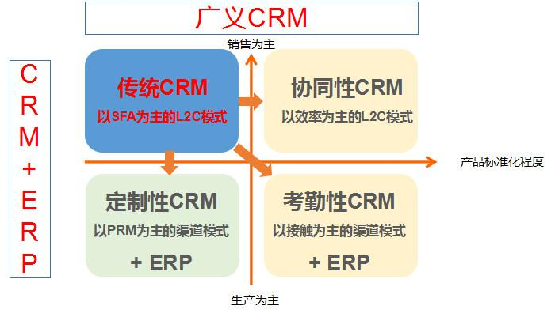
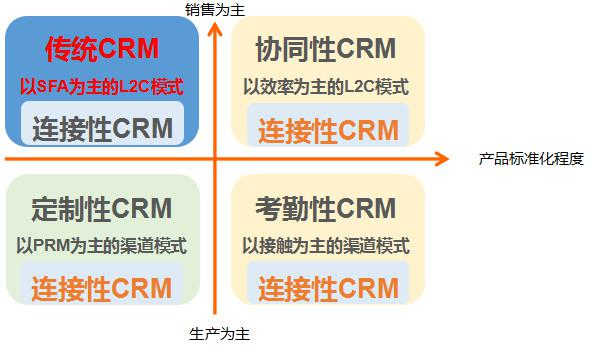
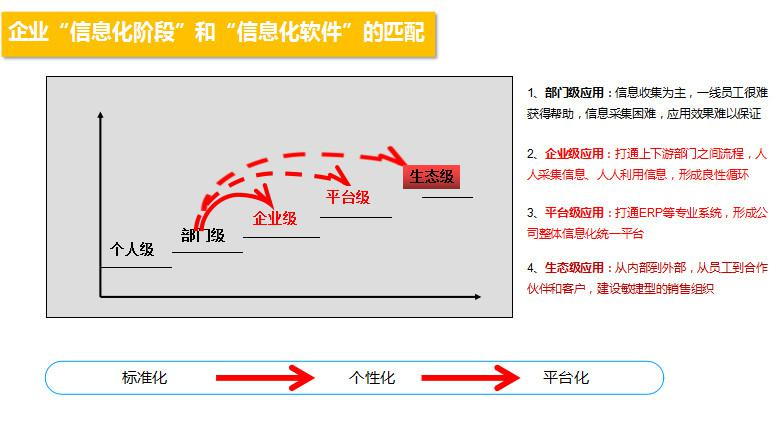

## SaaS售前及实施的实战举例（1）| SaaS创业路线图  

> 发布: 吴昊@SaaS  
> 发布日期: 2018-09-18  

“本文作者介绍：杨康杰，纷享销客华北区售前及实施部门负责人，国内最早一批CRM从业实践者。

“本系列文章作者介绍 - 吴昊，SaaS创业顾问，纷享销客天使投资人、前执行总裁，20年企业信息化和6年SaaS营销团队创新经验。

本文系SaaS创业路线图系列文章第17篇，[点击查看SaaS创业路线图系列文章](https://36kr.com/user/1308477002)

> 吴昊：对于较重的SaaS产品来说，售前及实施是非常关键的环节。我一直在考虑如何把这件复杂的事情说清楚，想来想去，还是用一个在运行着的CRM售前及实施体系为例来说明问题，对大家启发更大，也更具实战参考性。
>
> 因此接下来3篇文章，我请到纷享销客华北大区的售前及实施部门负责人杨康杰为大家讲解此中门道。

CRM作为企业信息化非常重要的一部分，从2000年左右在国内萌芽并快速发展，逐渐从SFA前延到市场、后延到服务、同时具备BI分析能力，形成自己独立的理论体系并开始在企业信息化中落地实践，形成以本地部署为主的第一次CRM浪潮。IT、工控设备、系统集成、医疗、消防安全、物流等竞争逐渐激烈且接受新事物较快的几大行业为代表，经过当时资本加持下的几大CRM厂商的市场教育，普遍深度接触了CRM，并且相当一部分企业开始了第一次CRM应用。

2005到2007年随着MyCRM的转让、TurboCRM的被收购，CRM进入五代十国的蛰伏期，甚至一度沦为ERP的一个模块。2010年左右SaaS的兴起给CRM带来新的契机，2015年SaaS市场200亿左右的规模被誉为SaaS元年，同时形成以SaaS模式为主的第二次CRM浪潮。

从CRM到SaaSCRM，既有核心管理理念的延续，又在售前、售中（实施交付）、售后（CSM）面临深刻的变化和挑战，SaaSCRM的核心本质不是从本地部署的购买到软件即服务的租用，而是随着企业信息化的不断深入，对CRM本身从模式上有了更深层次的需求。

### 一、从CRM到SaaSCRM的本质

#### 1、CRM在企业信息化管理中的几个趋势

第一是横向趋势，经过20年左右的企业信息化发展，信息孤岛越来越成为企业的痛点，带来企业信息化系统的边界越来越模糊化。

从企业信息化厂商角度，人为的的形成了CRM（以客户及相关业务为主线）、ERP（以生产物流等订单执行为主线）、OA（以日常事务管理为主线）等，但各自为了更好的体现各自在企业信息化中的优势，在竞合中相互的功能覆盖越来越多。

从客户角度，希望的是一套能解决自己整体业务信息化的平台。

从CRM本身的角度，OA和ERP在某种意义上都是CRM中的围绕C（客户）的R（关系），传统CRM的R需要人工重复采集，未来CRM中的R应该是集成OA以及和ERP实时数据同步。

#### 第二是纵向趋势，CRM本身在企业信息化中的应用不断深入和细化。

如下图一所示，CRM的范围，从第一次CRM浪潮中IT系统集成、工控设备等B2B行业为代表、相对复杂的销售模式管理为主的第四象限传统CRM，不断拓展到快销、教育等行业为代表的B2C、B2BC2模式为主的第一象限协同性CRM、第二象限考勤性CRM不断细化扩展，甚至未来会扩展到以重型制造、复杂化定制生产为主的第三象限定制化CRM。往往一个企业的业务横跨多个象限。

图一：CRM象限图

第三是互联趋势，在没有淘宝以前没有C2C而是C2B2C，在没有一个生态平台的前提下，C和C之间必须通过B来实现连接，路径长带来效率低。当前的B2B和B2C本质是B2C2B和B2C2C，B和B（C）之间必须通过C\(销售人员\)来实现连接，同样是路径长带来效率低。传统的CRM只能一定程度上通过过程管理不断优化路径来有限提高效率，而SaaSCRM在不远的将来，可以通过SaaS平台的企业互联真正实现从B2C2B（C）到B2B（C）的路径优化从而本质上提高效率。

当前的企业间的信息互联，更多是存在上下游关系的企业之间，通过相互授权实现从B2C2B（C）到B2B（C）的路径优化提高效率。如图二所示，无论是何种业务模式，都需要通过连接型CRM实现自身和客户、合作伙伴等的直接信息连接。

图二：连接型CRM

#### 2、SaaSCRM核心价值

SaaS模式的初始成本低、免基础维护、即开即用等优势大多企业已经了解，从CRM本身的角度SaaS模式的价值不仅限于此。

第一是如上所述CRM的三个大趋势决定了未来的CRM必须是开放的、智能的平台，SaaS模式可以更敏捷的适应CRM从横向趋势到纵向趋势的不断进化，也只有SaaS模式才能真正实现CRM的互联趋势。

第二是CRM作为企业管理系统，具备管理和IT双重属性，企业在CRM落地过程中，需要同时具备丰富的管理业务知识和IT知识的人，才能真正把CRM系统结合企业自身业务不断优化。这种复合型人才极少，大多数企业懂管理的不熟悉IT知识，懂IT的不熟悉企业业务，是导致很多企业CRM一直无法充分发挥价值的核心原因之一。SaaS的天然搭档PaaS功能，大大降低对CRM系统维护人员对IT知识的要求，可以让企业中懂业务的人发挥最大的价值，提高CRM落地成功率。

第三是当前很多企业存在安全认识的误区，认为SaaSCRM数据没有存储在企业自己的服务器上难以保证安全。恰恰相反，企业自己服务器的安全级别和SaaS厂商为几十万家企业的数据安全提供的安全级别，就相当于自己家里的安全级别和银行的安全级别一样，根本不在一个级别。当然，在当前SaaS厂商也参差不齐，对SaaS厂商的实力考察必不可少。

### 二、CRM及SaaSCRM的售前

关于售前，无数前辈已经总结出非常多的理论，像C139、ICEBREAKER、方案式、话术式、心理式、微笑曲线理论、风险曲线理论等等。个人认为售前的本质，是通过沟通让客户觉得我们提供的是他正好需要的。听明白客户的需求、讲明白客户的场景基本就成功了一半。

SaaSCRM首先是CRM，本质都依然是为不同类型的企业提供以客户为核心的业务解决方案，在售前环节，SaaSCRM和传统CRM面临的大多是同样的问题。SaaSCRM首先要解决的问题是传统CRM必须要解决的问题，然后才是SaaS模式本身能给客户提供的增值价值。

SaaSCRM又本质区别于传统CRM，从市场、售前、交付、售后（CSM）的每一个环节，普遍认为SaaS模式的核心是效率模型，都在探索SaaS模式下，2B领域是否可以像2C领域一样，实现指数级增长而不是线性增长。售前、交付、售后（CSM）在业务上有前后之分，但在业务能力模型尤其是效率模型上有很多共通之处，在售前环节先不作单独讨论。

1、根据本文图一CRM象限图先判断客户所处象限，从大类上先理解客户业务模式。

2、帮客户判断企业当前信息化阶段可以匹配的信息化系统类型

1）企业管理信息化的三个大阶段

内部人员对内部事务的管理：公司定制度就能执行的管理，例如费用报销、考勤等

内部人员对外部事务的管理：公司的制度很难量化的管理，例如客户、订单、商机等

外部人员对外部事务的管理：需要互联才能实现的管理，例如代理商、客户直接下单等

2）我们可以给企业所处信息化阶段能带来的提升

大多数第一次上CRM的企业，都处于个人级的EXCEL管理

经历了第一次CRM浪潮的IT、工控等行业的企业，以及使用过OA、钉钉等系统的企业，很多处于部门级应用。

3、从行业到业态

从客户角度更关注的是本行业案例，尤其是知名案例，客户自己并没有自己清晰的业务模型意识。

从厂商角度，在行业案例基础上细分出项目型、客户发展性、标准产品型、分销型等业态，给客户超出预期的案例分享

4、给客户四个关键角色提供各自的核心价值：

一线执行角色：不仅仅是数据的采集，采集到CRM的信息后续处理可以得到反馈等。

部门经理计划调度角色：方便的任务分发和监督，有实时数据支撑对团队员工工作的准确评价等。

总监计划分解角色：公司各种流程的落地，各种业务的预测，各种任务的完成对比，各种管理盲点的清晰化、公司所需的各种实时数据报表统计分析等

高层决策规划角色：资源的企业化、人员的可控化等，公司业绩、回款等同比、环比等方式的各种图表分析等。

5、关于售前面对的不同决策角色。

业务负责人：结合客户业务的管理理念的交流，比如客户盲点理论、漏斗理论、木桶理论、黑洞理论、L2C理论、商机预测、项目备案、客户查重、流程执行、信息统一等等，能产生业务管理共鸣。

技术负责人：需求快速功能化（PaaS）优势、维护优势、安全优势、快速迭代优势等。

运营负责人：有引导的不同厂商的细节对比，可以快速建立竞争壁垒。

对接人：相对级别较低但愿意学习，基本知识的普及，协助撰写汇报材料等，协助完成项目各种准备工作。

6、售前体系的多道防线

销售体系的第一道防线：成熟的首面、再面方案和策略；完成大部分中小客户的销售

售前体系的第二道防线：中大规模的客户如果在销售环节如果没有建立优势，售前顾问、售前总监可以争取机会从专业角度挽回。

公司高层的第三道防线：中大规模尤其是有影响的行业头部客户如果在销售、售前环节都没有建立优势，可以从公司高层之间的战略合作角度加持。

避免初始接触环节多体系接触，一旦没有建立优势，很难有挽回的机会。

7、关于售前的节奏把握

我们领先的时候，尽量加快项目节奏，避免夜长梦多

我们落后的时候，尽量减缓和打乱项目节奏，争取领先的机会。

8、同理心和安全感：售前的风险更多在客户，在售前阶段通过企业实力、人员专业度、系统功能等价值传递让客户各个角色产生安全感。

（未完，敬请期待下周再续“中篇”）
