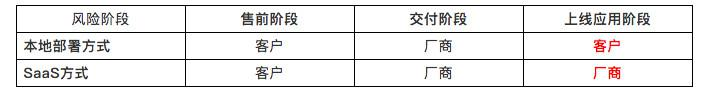
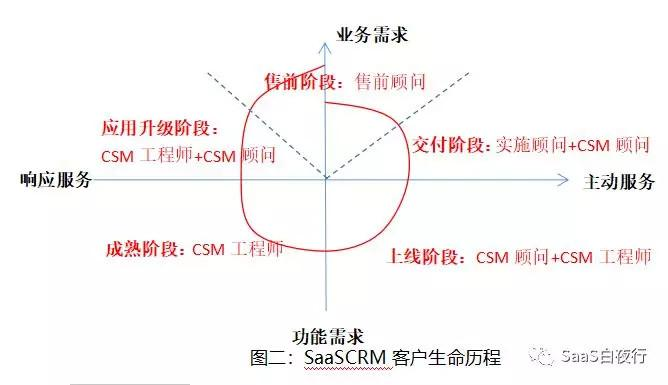

## SaaS售前及实施的实战举例（2）| SaaS创业路线图  

> 发布: 吴昊@SaaS  
> 发布日期: 2018-09-25  

“本文作者介绍：杨康杰，纷享销客华北区售前及实施部门负责人，国内最早一批CRM从业实践者。

“本系列文章作者介绍- 吴昊，SaaS创业顾问，纷享销客天使投资人、前执行总裁，20年企业信息化和6年SaaS营销团队创新经验。

吴昊：对于SaaS中较重的产品来说，售前及实施是非常关键的环节。我一直在考虑如何把这件复杂的事情说清楚，想来想去，还是用一个在运行着的CRM售前及实施体系为例来说明问题，对大家启发更大，也更具实战参考性。因此接下来3篇文章，我请到纷享销客华北大区的售前及实施部门负责人杨康杰为大家C中门道。

本文为杨康杰“售前及实施的实战举例”的中篇，点击查看上篇[《SaaS售前及实施的实战举例（1）》](https://36kr.com/p/5153822.html)

### 三、SaaSCRM售前/实施交付/CSM的本质

#### 1、从SaaS的定义“软件即服务”说起：

“软件”：尤其是相对较重的企业信息化管理软件，大都有相对明确的售前、交付、服务维护等阶段；

“服务”：和客户之间的过程是线性的或螺旋的，很难有非常明确的售前、交付、服务维护等阶段区分。

SaaSCRM的双层机制，第一内部根据客户需求以及团队能力模型细分售前、实施、CSM等角色；第二面对客户很难有“软件”模式的标准先后顺序，而是根据不同类型的客户实际情况快速匹配。

SaaSCRM双层机制必须分步，如果第一步内部基本功没有成熟之前直接进入第二步的快速客户需求匹配，反而会因为内部的混乱导致客户需求的脱节。

#### 2、SaaS模式的本质：

SaaS的本质是客户的长期应用带来的存量客户的长期激活。

非SaaS模式依赖增量客户受限于资源投入：传统软件必须依赖不断的增量市场，随着业绩的增长必然带来投入资源的不断增长，资源的线性投入决定了业绩的增长也是相对平缓的线性；

SaaS模式=增量客户+存量客户：SaaS模式可以在第一步不断开拓增量市场的同时，做到第二步存量市场的不断庞大，存量市场对资源的需求远小于增量市场，可以滚雪球一样带来的业绩的指数型增长。

#### 3、SaaS模式对客户关系质的颠覆。

风险路径的变化：本地部署到SaaS方式，风险的承担路径出现了本质的变化，本地部署厂商交付后被动响应的“客户服务”部门，SaaS方式必须升级为主动的“CSM”部门。

CRM本质=“满意度”+“价值度”：传统厂商的“客户服务”部门有足够的“满意度”即可（即使价值度不高客户因为已经承担了所有成本，更换厂商的概率相对较低），SaaS模式的厂商必须在“满意度”基础上提供不断的“价值度”，才能保证SaaS模式的成立。

#### 4、SaaSCRM售前/实施/CSM之间的分工和配合

\(1\)分工配合思路

SaaSCRM客户关系如上图“SaaSCRM客户生命历程”所示螺旋式重复，图中所列角色的能力模型见下一节详细描述。

CRM标准象限：第一、第二象限是和传统CRM类似的典型增量客户象限，虽然可以根据SaaS模式的特点做效率优化，但2B的复杂性决定了在这两个象限更多需要的是一对一服务，必须依赖资源的不断等比投入才能带来业绩的等比增长。

SaaSCRM增值象限：第三、第四象限是SaaSCRM形成自己价值模式的区间，可以提供一对多服务，需要相对较少的资源就能带来存量客户业绩的不断增长。

各象限的相辅相成：如果没有第一第二象限的基础，第三第四象限就是空中楼阁，如果没有第三第四象限的SaaS模型，SaaSCRM就是披着SaaS外衣的传统CRM。

SaaSCRM在各象限的特点：这四个象限是站在客户角度，客户应用CRM的不同阶段，在SaaSCRM下每个象限有可能都存在售前、实施、服务的相互协同和配合。

\(2\)分工配合重点

关于短期付费使用：SaaSCRM的客户有着传统CRM更难拒绝的短期使用需求（例如1~3个月），所以如上图所示，售前和实施交付阶段之间很难有明确的实线区分，如果资源的匹配不足会直接影响第一象限增量市场的客户流入，第一象限没有快速的增量客户，就无法形成庞大的第二象限的存量客户，没有庞大的存量客户就无法形成第三第四象限真正的SaaS模式。

关于续费和增购：CRM作为非标信息化管理平台，信息化系统会随着企业业务的变化不断变化，随着使用的深入和公司业务的调整，在一段稳定期后会有相对较大的业务变化带来对CRM新的需求，从CSM顾问、CSM工程师、售前顾问根据自身岗位职责相互配合，为客户提供新一轮的价值，从而带来客户主动的续费和不断的增购。

### 四、SaaSCRM的团队能力模型和核心能力模型的搭建步奏

#### 1、SaaSCRM的团队能力模型

\(1\)工程师：售前DEMO的搭建、实施交付软件落地配置、CSM面对大量客户的分类及时响应服务、CSM主动服务、常用文档以及常见问题知识库整理等。

基本素质：对产品要极其熟悉，需要足够的耐心和勤奋；

能力复制容易：合理招聘及完善的培训，可以快速进入工作（1-3个月）；

一对多模式：被动响应服务（内部顾问、外部客户）的同时，可以主动一对多服务，例如新功能的推送、定期沙龙、管理员培训、需求感知等等；

落地体系：需要有完善的培训体系（能力复制）、工作体系（客户分类及路径）和落地工具（自用CRM系统）

\(2\)项目经理：分为初级项目经理（小项目交付、CSM响应）、中级项目经理（中大项目交付、中小项目售前）、高级项目经理（大项目交付、中大项目售前），分别协助不同类型、不同阶段的客户在产品上不断产生轻咨询服务的价值。

熟悉管理：熟悉产品基础上，需要对企业业务管理和信息化管理熟悉。

能力复制困难：单纯的培训很难达到胜任标准，需要大量的项目历练，可以从工程师岗位选拔转任或外聘（外聘项目经理需要1-3个月时间才能真正熟悉公司软件）。

一对一模式：无论主动被动，需要提供的更多是客户一对一的服务。

落地模式：需要有相对长远的人才模型、内容沉淀和输出模型，不断完善的自用CRM系统。

\(3\)项目顾问：售前及实施方法论模型的输出、中大项目的售前支持、中大项目的实施交付、工程师及项目经理的赋能、智能知识库的规划设计和落地路径设计等。

极其熟悉企业管理：最少在企业信息化领域有5年以上的工作经历、服务过上百家大中小各类客户，有过创业经历最佳，熟悉企业各个职能部门的管理，能和企业管理高层探讨企业的日常管理及信息化相关。

能力复制极其困难：内部培养周期较长，在内部项目经理选拔的基础上，初期建议从外部招聘为主。

落地模式：需要战略忍耐性和长期的培养，一般的项目顾问都具备带团队能力（在模型跑通业务不断扩大的基础上能快速裂变团队），需要从公司层面设计考核、激励和关怀。

\(4\)PaaS顾问：售前实施CSM工作中遇到的非系统可配置的PaaS二次开发、系统之间对接等工作，PaaS知识库的规划设计，PaaS场景及功能的培训等

PaaS作为专业性比较强的工作，工程师、项目经理、项目顾问都需要具备基本的能力，但面对客户比较复杂个性的需求，从效率上讲需要专业的PaaS顾问岗位。

对PaaS实际能力模型及能力培养、落地模式等，不在此处探讨。

\(5\)其他辅助岗位：

“运营”负责相关“一对多”类型服务的规划，部门文化建设，人才团队的落地执行，文档方案等落地执行等等

“商务”负责和其他部门的商务协调等。

“讲师”负责专职的客户培训、员工培训等等。

如上所述，SaaSCRM需要两大类核心能力模型本质区别极大的岗位。人员配备上可以相互兼任，团队建设及人员梯队上需要非常明确的不同规划。

2、售前实施CSM人员能力模型搭建步骤：

没有形成相对成熟的体系，就很难明确每个岗位的职责；没有每个岗位明确的职责，就很难实现岗位的协同；没有岗位的协同，就无法形成有效的效率模型。

没有形成相对有效的效率模型，售前、实施、CSM就不能实现真正的融合，形式上的融合无法带来人员能力的复制和递增，带来的是陷入传统CRM类似的业绩增长需要同比的资源投入陷阱。

\(1\)人员能力模型搭建

A、基本素质：每个人都必须具备，熟悉产品，勤奋，熟悉基本的售前、实施、CSM方法论，了解相关过程及配套文档，能简单完成被动式的售前、交付和CSM工作。

B、1.0僵化-矫枉过正-在“工程师”基础上，初步搭建完成项目经理和PaaS顾问团队，通过方法论培训掌握CRM基本理论，掌握项目交付过程方法论，能独立完成简单项目的售前和交付，可以在接到项目后快速根据经验制定项目计划。

C、2.0优化-效率提高：在“工程师”“初级项目经理”“PaaS顾问”基础上，搭建完成“中级项目经理”团队，团队可以根据分工熟练的独立完成中、小项目的售前和交付，具备项目计划制定能力和需求调研能力，能同时并发执行3-5个项目。

D、3.0固化-形成自己的方法论：在“工程师”“初级项目经理”“中级项目经理”“PaaS顾问”基础上，搭建完成“高级项目经理”团队并不断优化“PaaS顾问”能力，团队可以顺利完成大、中、小各种项目的售前、交付、CSM，可以根据客户类型、项目规模形成自己的方法论。

E、4.0输出-形成效率模型：最终搭建完成“工程师”“初级项目经理”“中级项目经理”“高级项目经理”“PaaS顾问”“项目顾问”完整的团队模型，可以输出自己的方法论，可以裂变团队，可以外聘的基础上自主培养各个角色岗位，形成团队生态。

A、B、C、D、E五个阶段可以根据公司实际情况外聘和内部培养，每个阶段的时间长短根据企业内部实际情况动态变化，时机成熟阶段之间可以同时进行甚至跨越。

\(2\)售前、实施、CSM的融合：

形成ABCDE闭环人才体系后，可以根据公司业务情况形成一人多岗备份

具备D、E阶段能力的角色可以随时支持重大项目售前和大项目的实施交付（无论是首次购买交付还是CSM过程中发起的二次实施交付）

具备A阶段能力的角色，可以支持售前搭建DEMO，也可以支持实施交付的系统搭建，如果有需要可以作为CSM工程师为第三象限的老客户提供服务。

具备B、C阶段能力的角色，作为实施交付主力，完成首次购买交付以及在CSM过程中进入第四象限的二次实施交付。同时在平时实施交付过程大量积累了客户案例的基础上，可以作为中小项目的售前配合销售撰写售前方案提供售前DEMO。

在具备更高阶段能力的角色团队未成熟之前，面对需要该阶段能力的客户项目，需要有充分的耐心和TL的协调，勤能补拙，以服务、方法及态度先尽力维护，但切忌用超出团队的资源去填补，影响更多客户项目。

（未完，敬请期待下周再续“下篇”）

> 你的企业在售前、实施过程中遇到过哪些问题？欢迎留言交流，文章作者很愿意通过在线回复或其它线上、线下方式与SaaS同路人们进行交流。

**10月14日（周日）下午，将在北京举办一场“SaaS创业路线图”公开课，欢迎SaaS同路人报名** **[（点击查看报名链接）](http://pc-shop.xiaoe-tech.com/appBUJrXmrG2030/login)**

[SaaS创业路线系列文章地址（点击查看）](https://36kr.com/user/1308477002)
