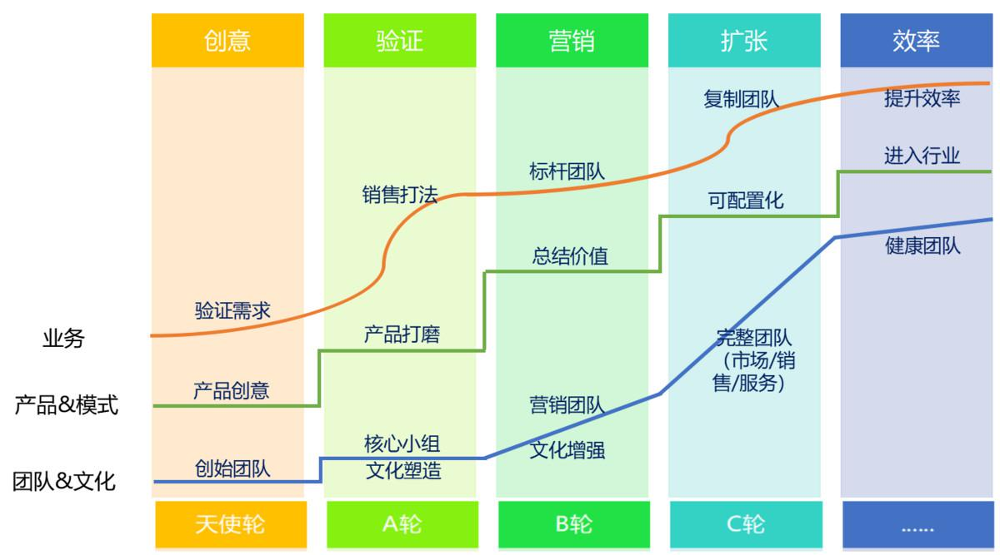
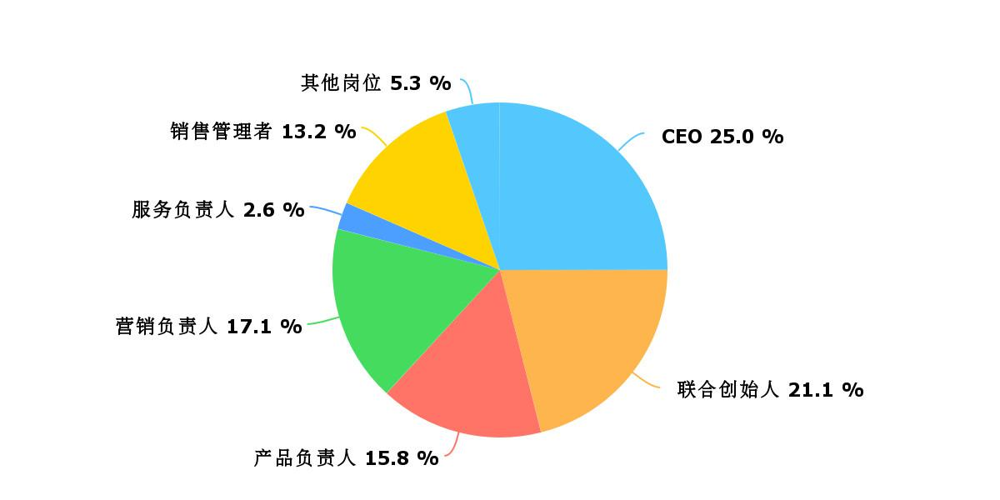
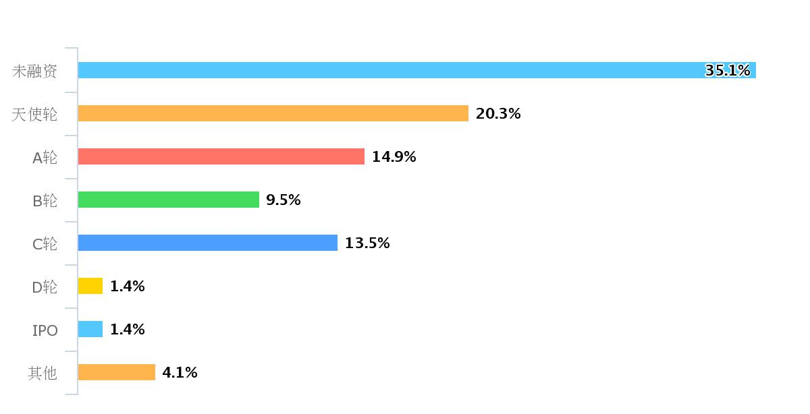
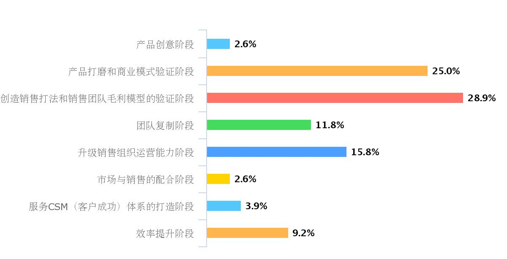
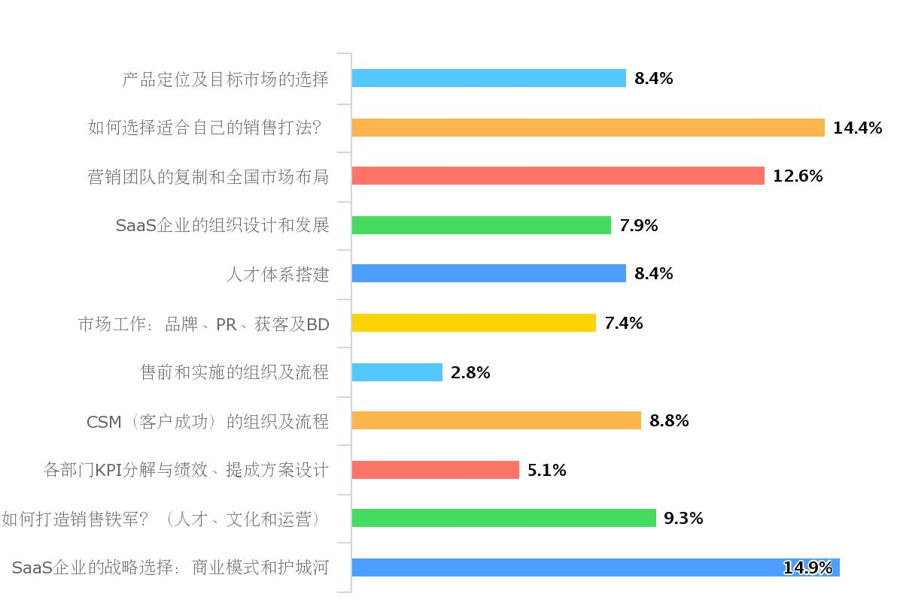

## 如何开一次to B培训公开课？  

> 发布: 吴昊@SaaS  
> 发布日期: 2018-10-23  

“作者介绍 -吴昊，SaaS创业顾问，纷享销客天使投资人、前执行总裁，20年企业信息化和7年SaaS营销团队创新经验。目前在为少量优秀的SaaS公司提供产品市场定位、营销策略及团队建设等战略咨询服务。

不少朋友都知道，我上个周日讲了一堂“SaaS创业路线图”公开课。在SaaS创业这么小众的范围里，能够有125个付费听众到场（其中有12个来自上海、广州、长沙等外地城市），认真听完5个半小时的课程，可谓是非常有效的一次交流体验。

这次培训我做了很多创新。其中有的很有效，有的不成功，没关系，我都和大家分享一下。

首先，我感觉最有意义的是课前调研。

这次我的目标听众群体，90%是看过我的[\#SaaS创业路线图\#系列文章](https://36kr.com/user/1308477002)的（点击查看系列文章），其中有1/5是铁粉 —— 将当时已经发表的19篇全部看完，还有全部打印出来划重点学习的。

目标群体明确后，我仍然非常仔细地设计了调研问卷。包括学员的公司情况及所处阶段（我的路线图把SaaS创业公司分为8个阶段）、个人角色及岗位、最关注的科目（我列了十个），更有意义的是开放性问题。事后证明，开放性问题给我很多启发，也让我调整了培训的重点。

125个同学来自108个公司，绝大部分都是SaaS公司，也有几家投资公司。

其中参与课前调研的有76人（70个公司），统计情况如下：

1、角色：1/2是创始人或联合创始人，1/3是各部分负责人，还有13%是销售管理者。

2、公司融资情况：

3、按“SaaS创业路线图”定义的8阶段：1/2强处于产品打磨和销售打法创造阶段。

4、关注的科目：

我事先没想到“如何打造销售铁军”会是排名第4的科目，所以在调研后把这部分内容加入了课程里。

此外，提出具体问题的有27家，占70家参与课前调研企业的38%。说明很多人是带着困惑来的。根据这些问题我调整了讲课重点，把这些疑问的答案揉进整个课程当中，这样的解答更系统，也更有针对性。

到了现场答疑环节，我首先把这些预先提出的问题再解答了一下。当然，其中也有3个问题是没在课程中覆盖的，我单独做了简要陈述。

其次，在这次课程中我坚持了每15分钟做一次互动。

人的大脑一次能够集中注意力的时间是很有限的。在“自主”作业时，进入“心流”状态可以很高效地工作1小时甚至更长。但对于对于“听课”这个被动场景，一次能连续集中15分钟注意力是一个极限。

所以我每15分钟左右会做个“提问——回答”式地互动，或者讲到有趣的地方能让大家跟着我一起哈哈一笑，这都能起到短暂放松继而再次集中注意力的作用。

虽然，这对于讲师控场能力要求很高，但只要在课件准备阶段，预埋好这些互动的点，并提前预讲和背诵一下，难度并不大。

这也让讲师保持很高的状态。开场时我就会讲清楚，大家互动反应越大，我的积极性越高。因此我才能激情澎湃地讲了5个小时

第三，课件熟悉的过程。

我以前曾经一年做100场演讲，但只有2个课程，一半是每周五上午9点的“招聘宣讲”（详见本系列“招聘”环节文章），另50场是“新人入职文化培训”，所以轻车熟路。

这次课程对我这个演讲老司机的挑战是，5个半小时的课程（速记同学当场帮我记下了5万7千字，语速172字/分钟）。仅我的PPT每页下面的备注加起来就有5000多字。

课前我很担心讲漏重要内容，甚至一度比较焦虑。

好在WPS和PowerPoint都有“屏幕扩展”功能，这个经常演讲的人应该都知道，可以让电脑与投影仪显示的内容有所不同，电脑上可以把备注显示出来。

经过删减，每页的备注减到几个关键词，这样在演讲期间我只要瞄一眼，就不会漏项。

第四，用案例说明理论。

人类的大脑更容易吸收故事背后的理念，而非直接的概念陈述。理解一个概念，很难，其实也需要用类比或故事来解读。

因为最近6个月与90个SaaS创业团队做过深度沟通，我在这次课程中加入了22个案例，在讲到不同阶段时，拿出该阶段其它公司发生的故事分析缘由和后果。我观察到听众在我讲故事时，明显都抬头听地很认真。

第五，用有趣的“理论”让大家记住故事背后的逻辑。

课程过程中，通过总结每个不同阶段的思维框架及故事背后的逻辑，我总结了5个有趣的理论，包括“硬骨头理论”、“推门理论”（这是纷享销客的CEO罗旭同学在4年前提出的）、筛子理论等。

课后第2天及第3天，我与自己做常年战略咨询服务的2个创始人分别聊天，发现他们已经能够很熟练地使用我的这些“筛子理论”、“推门理论”了。这样形象具体的东西，明显更容易被人津津乐道和使用。

第六，“人民币投票”打分和奖励建议。

课程尾声，我又玩了一个新玩法。大家通过赞赏1~100元，分别表示对课程的评价1~100分。共有53人参与了课后调研，结果如下：

1、本次课程对您工作起到的帮助作用 —— 对87%的同学帮助较大。

2、课程内容的实用性：只有3.8%的同学（2人）表示不太适用。

3、讲师的教学方法和形式 —— 看来这种互动式教学很受大家欢迎。

此外，共有32人用人民币投票打分，平均81元，也就是81分。

第六，这次课程的缺憾。

这次课程风评很高，但与会SaaS同行们还是提出了水平非常高的建议，共42条。其中三人得到了“加倍退还学费”的奖励。

我仔细总结了一下，有这样几个主要问题。

1、5个半小时的课程时间太密，应该分2天或半天讲透一个部分。最好组织小组充分讨论，也让SaaS圈里的同学们互相熟悉一下；

2、案例多但深度不够，应该围绕一个点用多个角度的深度案例讲透；同时，把我的咨询业务嵌套进去，这样避免最后做咨询服务广告时太生硬；

3、现场运营方面：课件提纲应该先打印出来、金句同步往外传播等，增强影响力。

这次公开课先总结这么多，欢迎各位参会和未参会的企服同路人在文后回复您对这次培训的感受或对团队培训这件事情的看法。

如需要本次公开课的课件，请加我助理的微信xiaolihunshijie（小莉混世界\)索取。

参考文章：

[SaaS创业路线图（六）如何高效扩张团队？](https://36kr.com/p/5141259.html)

[SaaS创业路线图（十九）做好团队培训的关键是什么？](https://36kr.com/p/5156732.html)
