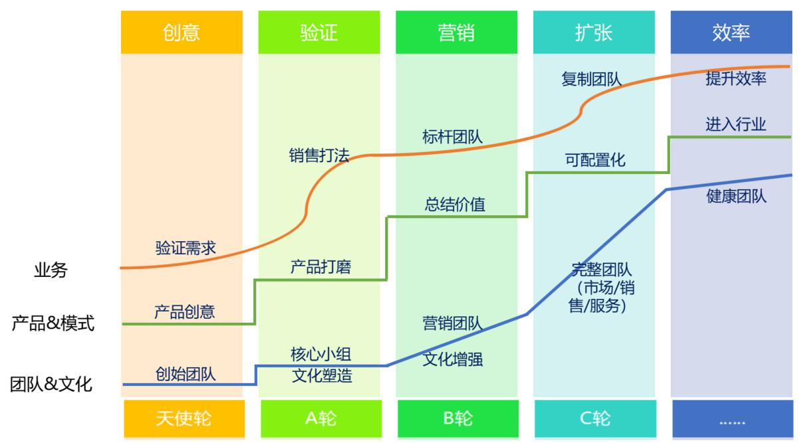

## SaaS创业路线图（19）：做好团队培训的关键是什么？  

> 发布: 吴昊@SaaS  
> 发布日期: 2018-10-11  

“本系列文章作者介绍 - 吴昊，SaaS创业顾问，纷享销客天使投资人、前执行总裁，20年企业信息化和6年SaaS营销团队创新经验。

管理就是让别人把事做好，因为你不想成为鞠躬尽瘁、但大事未成的诸葛亮。

培训的目的是赋能，只有培训和培养出优秀人才，创业团队才可能取得市场上的成功。

培训的第二个目的是筛选出更适合岗位的人才。

### 一、实战案例——新销售员工入职培训

在讲方法论前，我先分享一个实战案例。

作为新员工入职培训，“筛选”是第一目的，比“赋能”更重要。

在[《SaaS创业路线图（六）团队高效扩张的方法》](https://36kr.com/p/5141259.html)（点击查看）里我讲过如何设置一些“筛子”，在“招聘”环节筛掉那些不能吃苦的销售人员。

延续到入职培训环节，我也建议期间设置考核科目，成绩不过关的也坚决淘汰。

具体来说，如果有2周的入职培训（例如，第1周培训产品价值和标准销售打法、第2周培训销售技巧和进行电话邀约等实操比赛），那我们就在第一周的周四下午做一个产品讲解的考试。

不过关的只有2种情况，一是不努力，虽然前3天白天8小时的培训是满的，但8小时外是有时间下功夫背诵和演练的，如果讲地磕磕巴巴、丢三落四，说明这3天他没有付出努力，自然未来大概率也不会是个很努力的人。二是确实太笨：能大段背诵，但缺乏理解力和语言逻辑，这样即使很努力未来也跟不上。

这样我们就又设置了一个“自然淘汰”的筛子。“自然淘汰”永远比人为判断要好。因为它简单直接。考试成绩好就是聪明勤奋的、成绩不好就是不努力或将来也跟不上的。相对人为判断，“自然淘汰”更加有效和有效率。

### 二、内容第一，内容来自需求

优秀的讲师在接到一个培训任务后，问的第一句话就是“谁参加培训？”因为即使定了主题，还要根据培训对象的需求来确定培训内容和培训形式。

**1、参训者需求调研**

不同人参加培训有不同的需求，若想调动学员的积极性，最好先做做需求调研。在官方要求的课程范围内，列出相关的模块由学员选择他们感兴趣的几项，同时也让学员写下自己感兴趣的内容。

有了这个调研，就能掌握参训学员的背景信息和关注点。特别是这样提前搜集问题的方式，远好现场提问，双方思考时间都不足。现场提问环节仍然需要，但只作为“现场产生疑问”的解答。

**2、根据需求定内容**

中国进入移动互联网时代后，商业环境、商业模式每个月都在变化。讲“标准课程”的价值越来越低。这就需要授课者有很强的敏感度，在不断接触一线实战的过程中，能够不断调整培训内容及案例。

通过调研，我可以了解到全部学员的企业情况（发展阶段、融资状况）和关心的问题（重点讲权重前3的科目），据此做备课准备。

同时也针对大家的提问，在课程中穿插最近拜访的90家SaaS企业的典型案例，信息脱敏（隐藏名称信息及行业背景）后分享出来解决大家提出的疑惑。

**3、预读材料**

最近我在中欧商学院上《供应链管理》和《决策分析》两门课。这次4天的课程前，发下来的预读材料有400页，主要内容是十几家企业的真实案例。认真读下来的学员，在课堂上自然更能充分理解教授讲的理论与实际案例之间的关系。

无论是企业内训或外训，准备预读材料压力有点儿大，但提前1、2周推荐一本相关理论结合实际的书籍请大家先行阅读，还是有价值的。在知识水平上拉齐，会让参训学员们有更积极的参与和交流。

**4、PPT**

做PPT有很多误区，我的原则是：把“焦点”让给讲师，不要让大家的视线长时间停留在PPT上，那样很容易走神，讲师也很难掌握观众的状态。

因此，PPT的页面不要太满，只要有关键条目、图形和简单的动画（吸引观众注意力），如果能有关联度很高的影音材料，也可以考虑加入。

**5、结合实战案例**

一个好的培训，一定会结合实际。

由于历史原因，人的大脑也更容易接收“故事”而非“概念”。所以讲了一段“概念”后，一定要穿插“故事”进来，最好是真实的企业、真实的事。实在不行，编个虚拟的企业、虚拟的故事也行，只要逻辑靠谱。

### 三、讲师演练和现场表演

举个例子。我讲地最好的培训课程是“新人入职宣讲”，这门课我讲过50遍。和招聘宣讲一样，这门课的PPT我改过30多个版本，这是由于企业的发展情况在变化，内容自然要随时修改。

同时，因为反复讲了几十遍，我能够很好把握住时长和节奏，知道何时要互动、何时要引起大家轻松笑笑。这样反复练习的结果是非常好的现场表现及感染力。

**1、讲师水准与反复练习**

讲师的基本素质是逻辑清楚、表达清晰、语言有力，讲课时声调要长短不一、抑扬顿挫。（这对我们说话没第四声的湖北人比较难哈）

更重要的是，讲师需要有匠人精神，愿意精益求精地打造自己的“产品”。

一个15分钟的演讲，需要3次以上配合PPT或白板的全程试讲，这样才能保证不超时、且重点突出。

一个40~90分钟的培训，讲师应该提前一周完成PPT，然后花上一些零碎时间，不断补充中间的细节，2个目标：一是逻辑清晰、重点突出，让学员获得清晰的知识框架；二是，现场表现精彩，调动学员积极性。

**2、如何在现场调动学员的注意力**

很遗憾，由于大脑是高消耗组织，大部分人一次只能集中15分钟注意力。然后大脑会走会神儿，再回来。培训现场的关键就是每次大家“走神儿”的时间有多久？

因此讲师要学会掌握整体节奏。困难的“逻辑和概念”部分，一次不要太久，控制在15分钟内告一段落；然后，讲讲轻松的故事，或者做一次现场交互，用这些来作为一次替代性的“走神”。经过这短小、可控的调整，学员的注意力能够再次回到复杂的逻辑上。

什么是现场交互？主要有2种。

一是“提问——回答”。封闭性问题，“大家说是还是不是？”，这样比较快捷。如果停下讲课、向大家提开放性问题，让大家一起思考，也是好的。

二是笑场。一个优秀的演讲，最好10分钟左右能有一个让大家哈哈大笑或莞尔一笑的机会。笑让人放松，然后很快又能回到培训上。

**3、身体语言**

在很多场合，人接受的信息中，手势、表情、语调都比内容更容易理解。

讲师对自己的身体语言要进行专项训练，最好是请人录像。

2015年因为业务需要，我处理大约50场公司内部演讲，还做过十几场外部演讲。有一次竟然通过录像发现自己90分钟里在讲台上走了上百圈。这时候再问同事，他们才告诉我，“眼睛都看晕了”。最近我参加的一些会议上，发现还有个别演讲者有这个问题，估计这都是从来不看自己录像的：）

### 四、培训形式

形式部分点很多，作为“培训”主题的资料也很多，我不一一细讲了，大家可以上网搜搜。框架我简单罗列一下：

1、考虑是否要先“破冰”？如果是团队融合或1天及以上课程，可以考虑先做破冰，让大家熟悉起来效果更好。

2、场地、物料、设备的准备：这里有个关键点，是桌子的摆放方式，“鱼骨式”方便讨论，“电影院式”让听众与讲师距离更近，需要根据培训内容权衡。

3、讨论形式：这里有“头脑风暴”、“分组讨论后轮流上台展示”、“沙盘演练”等多种形式。近年讨论式培训是个趋势。当然相应的问题是，这样做培训深度不错，但能够承载的知识广度就比较有限了，适合时长在3小时以上的培训。

### 五、培训质量评价

在企业里，所有事情都应该有闭环。培训评价就是培训的闭环。

用微信工具打个分很容易，但我觉得更关键的是打分的准确度，这个可以考虑更新颖的方法来得到更准确的分数，而不是谁也不得罪谁的“100%满意”。

培训这一课我就写到这里，欢迎大家一起探讨以下问题：

* 你在企业内部培训中，是否发现大家会用各种原因推脱、不愿意参加培训？

* 培训过程中，一半人会时常拿起手机，怎么办？

* 培训内容重复、过时，讲师是领导，大家又不好提意见，怎么办？

* 如何用经济方式和制度设计来提高内部培训质量？

10月14日（周日）下午，将在北京举办一场“SaaS创业路线图”公开课，欢迎SaaS同路人报名[（点击查看报名链接）](http://pc-shop.xiaoe-tech.com/appBUJrXmrG2030/login)

[SaaS创业路线系列文章地址（点击查看）](https://36kr.com/user/1308477002)
