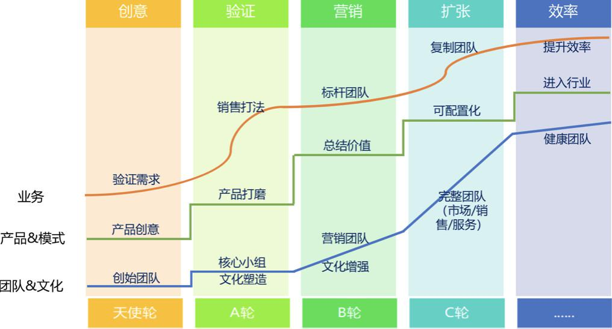
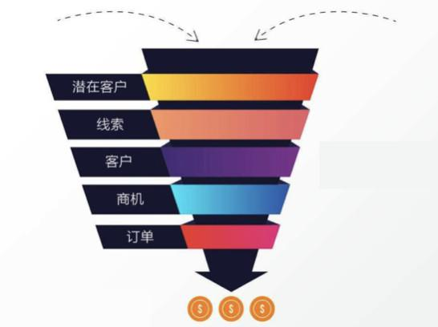
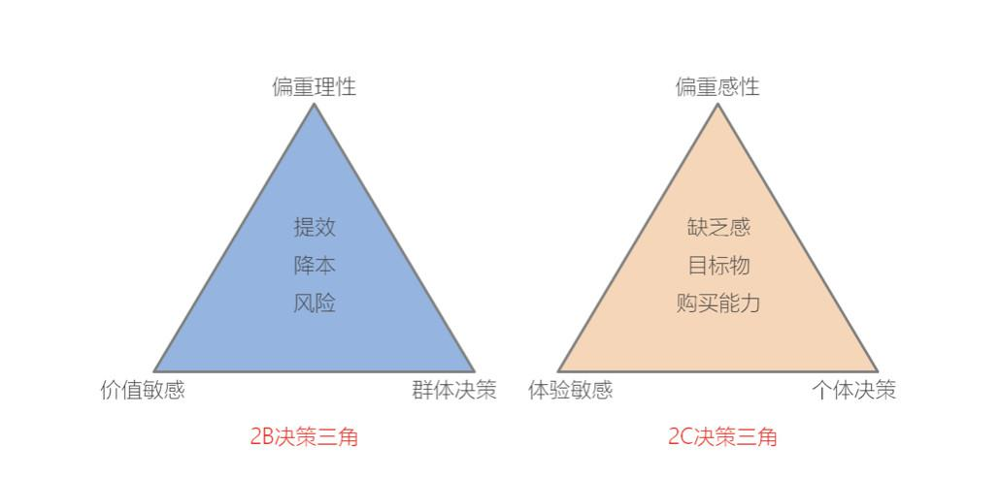
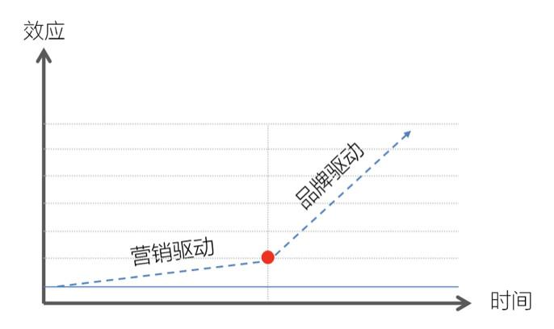

## SaaS创业路线图（21）：SaaS企业营销获客到底路在何方？  

> 发布: 吴昊@SaaS  
> 发布日期: 2018-10-16  

前段时间我参加一个创投集团主办的圆桌论坛，其中主持人问了一个问题：“什么时间中国的toB公司会象toC公司那样出现成批的在NASDAQ或者A股的上市？”与会嘉宾给出的时间预测各有长短，但都有一个普遍共识——国内SaaS企业如果不经历并购重组，仅靠单体的生长，想在短期内批量IPO可能性不大，核心原因是SaaS企业到底该如何突破ARR（年经常性营收）1亿美金大关？目前SaaS领域创业公司的ARR规模进入亿元俱乐部的还寥寥无几。

如何在较短周期内实现营收规模的倍速增长，呈现一条漂亮的增长曲线？相信是所有国内SaaS企业CEO日思夜想的事情。我们暂不论续费及增购带来的影响，在新购收入上实现规模性突破，这是一个必须直面的挑战。

扩增销售团队，招募更多渠道伙伴，这是实现增收的最简单思维。问渠那得清如许，为有源头活水来，然而又该如何保证前端有足够的线索或商机供给？

销售自开源单点而碎片，方法难以批量复制，而且需要销售人员足够的勤奋与自驱。据我所了解，很多大厂出来的高级销售还不屑于搞拓客动作，觉得很Low很苦逼，等着跟进公司分发下来的线索。因此，SaaS创业企业往往会出现扩增了销售团队后，线索喂不饱，速度起不来，最终难以为继的尴尬局面。

在2B企业的职能划分中，获客的重任自然落在了市场营销团队。综观国内SaaS企业，我盘点了一下，在市场营销获客上大致可以分为如下几个帮派——

### 土豪帮

土豪帮顾名思义财大气粗，出手阔绰，不是系出豪门，就是认了有钱的干爹（VC）。年市场预算动辄千万乃至上亿，搞场客户大会就花两三百万。其最擅长的招数就是“满天花雨”——铺天盖地的砸硬广，他们的CEO或CMO是江南春大侠的座上宾。

然而，其直接获客效果如何？谁做谁知道。

### 搜索派

就像练武之人都必须会马步，搜索引擎营销几乎是每家SaaS企业的必学武艺。虽众里“骂”他千百度，搜索引擎营销还是目前业界公认的最直接有效的短周期获客渠道。而搜索派却将此大众武艺修练至炉火纯青，几乎将绝大部分预算都All in在了百度上。据我所知，业界有多家SaaS企业基本就靠SEM获得线索，长期霸占核心关键词的排位。当然SEM也并非无限增长，一旦达到临界点，增长就很乏力。而像DSP、信息流、集客营销、数据增长等这些新鲜招式，在2B领域攻击力尚不明显，还没真正形成气候。

### 活动派

据说SaaS鼻祖Salesforce早年就是开着敞篷卡车拉着物料，一个城市一个城市的搞沙龙搞活动，传经布道，开疆辟土。做2B，活动是绕不开的，围绕垂直行业、围绕目标人群，自己主办、赞助参与……当然，活动的邀约和转化都是大家共同的痛。虽说如今已是移动互联网时代，两个人面对面了都习惯用微信聊天，可线下活动仍生生不息，遍地开花。（市场活动到底该定位于获客行为还是品牌行为？这里暂不铺开讨论）

### 丐帮

漫漫江湖，芸芸众生，有富就有穷。对于大部分处在初级阶段的SaaS创业企业来讲，研发投入仍还捉襟见肘，更别说市场预算了。在丐帮中，比较常见的就是安排三两位年轻小生，运营一下双微，偶尔搞几场小活动。但俗话说的好，虎瘦雄心在，人穷志不短啊，众帮主们在营销风暴会上言必称“杜蕾斯”，寄希望于在社交媒体上搞个创意营销，期待出现一石激起千层浪的蝴蝶效应，然而无可奈何每次面对的却是几百阅读数的惨烈现实。退一步讲，即使阅读数十万+了又能如何呢？结局正像那英的歌词所唱的——你伤害了我，还一笑而过。用2C的思维去做2B的获客，精神诚可嘉，方法许有误，到底效多大，我自拭目待。

好了，盘点咱们就到这里，需要澄清的一点是我本人对上述的任一做法没有些许褒贬之意，因为这就是当前B2B市场营销的常态，包括我自己在内。从务实的角度讲，我对SaaS企业在市场营销维度的建议也无非如此，搭建品牌PR、线上营销、市场活动、数据增长等营销体系，结合公司实际制定行之有效的营销策略。

但我想说的是，在这个维度上优秀与平庸之间可能也就是百步与五十步的差距。当行业处于成长教育期，市场尚未跨越用户鸿沟的阶段，SaaS企业营销获客的增速一定是线性的。即使市场成熟了，也难以出现像2C产品一样的爆发式井喷现象。因此在2B领域，市场部门与销售部门扯不清理还乱的复杂关系将长期存在，难以产生诸如“杜蕾斯”、“褚橙”等现象级的营销事件，即使请江湖当红的杨飞大侠（瑞幸咖啡CMO）亲自操盘，也难以出现2B领域的“瑞幸ERP”。

这就是B2B企业市场营销的宿命，科学点讲这是基本规律。

究其原因，2B营销与2C营销呈现完全不同的客户关系模式与决策心智逻辑（抛开灰色关系不说）。简单展开讲三点：

2B是理性采购而2C是感性消费。以认知心理学的双系统理论（人的大脑有两套思维系统，感性的系统1与理性的系统2）来进行更严谨的概况，那就是2B决策是80%的系统2+20%的系统1,有比较严谨的预算计划和选购流程。而2C决策是80%的系统1+20%的系统2，往往会因为刺激而冲动下单。用户会因为好奇下载子弹短信，但企业不会单纯因为好奇在内部推行一套纷享销客CRM系统。

2B是价值敏感型而2C是体验敏感型。企业采购是内在价值动机，增效、降本、低风险是其形成购买的决策三角模型，而因为企业所处行业、发展阶段、评判标准的不同，就容易呈现服务商多元分立的状况。2C消费大多非常在意外在视角，风格、品位、信誉、面子……而群体从众心理因素容易导致马太效应产生（即个体屈服于群体，容易一边倒的说好或者说不好）。

2B是群体决策而2C是独立决策。在企业里，选型引入一套产品或采购某项服务，一般都是多角色沟通、长链条推进，即使老板一言堂，大多也会征询一下相关业务需求部门的意见。但2C消费基本都是个体决策，除非买房买车这种大件，可能会与家人共同商讨一下。

既然2B企业市场营销受其特殊因素的制约，难以真正在创业及成长期形成指数型的突破，那么SaaS的市场营销到底该何去何从？我觉得有非常重要的两个认知维度。

第一，以务实的态度扎扎实实做好当前能做的，比如上面所述的线上营销、市场活动等等，核心关注精细化的运营与效率的增长，争取更好的投入产出比。在企业的创业及成长期，产品、市场、销售、客户成功、服务等，必定是在煎熬中迭代前行，这就是创业之路。

第二，拉大尺度，基于企业发展的长周期视角去看待与布局市场营销行为，构建长效机制，收割2B市场营销指数式拐点带来的红利。

而这个指数式的拐点到底在哪里？

——那就是从营销驱动转换为品牌驱动（如下图所示）。

我们发现，在一个成熟的2B市场当中，真正在主导流量流向的“指挥棒”却是品牌力。品牌效应引发边际效应递增，即因为企业品牌力的构建，2B服务企业吸聚了更多的客户流量，以获客为目的的营销成本将大幅削减，甚至引发销售说服难度的降低。正因为前面所述的B2B独特的购买决策心智逻辑，企业更愿意选择有品牌力的服务商，品牌意味着能力、信任以及更透明的信息。尤其对于很多预算相对宽松的中大企业采购决策者来讲（比如企业里头负责采购IT系统的CIO们），其普遍心理是不求有功但求无过，如果为了省钱引进了一家名不见经传的小服务商，万一出问题影响了业务，那可是千夫所指百口莫辩了，因此还不如多花点钱引进品牌服务商。

另外，2B的生态法则不像2C领域（721法则），一家独大，老大吃70%的蛋糕。2B领域是28法则，即头部两家服务商共同占据近80%的市场份额，冠亚军之间各有优劣，难分伯仲，比如像软件领域的用友与金蝶、像我之前所在的品牌咨询领域正邦与东道……。更何况在众多垂直细分领域，诸侯们也可能活得非常滋润。

2B对服务商的选型常规做法是货比多家，在邀标中会做一些策略性组合，比如邀请领域中Top2的服务商，再选上一家实力偏中、一家实力偏弱的服务商，而最终的肥肉往往落入Top2的嘴中。因此，对于一个较成熟的市场来讲，Top2的服务商绝大程度上是坐等商机，这就是品牌带来的红利。

对于SaaS创业企业特别是CEO来讲，在市场营销中一定最需改变的一个认知就是切勿极端的追逐短期效应，以单一的以线索或商机产出作为市场营销部门的KPI指标。线索与品牌正像股市投资中的短线与长线，线索是短线，快进快出，看错了马上止损；而品牌是长线，要求很高，一旦成功则收益丰厚。

当然，在企业营销与品牌的运作中，这两者不是二元对立的，营销实则也是塑造品牌的一部分，甚至可以说企业的一切行为最终都在为品牌做加持。我们最应关注的是——无论在哪个阶段，您的企业如何才能跻身行业里的Top2品牌？

关于品牌，咱们下回再分解。

各位toB同行：关于市场部门获客，您赞同上面的观点吗？您自己有哪些独特的看法？欢迎留言交流。

**本文作者：**

黄海钧，现任纷享销客高级副总裁，主管战略及合作、品牌、市场营销。原陆地河品牌顾问机构创始人、CEO，正邦品牌创意集团品牌策略总监，是电信天翼、广汽传祺等品牌的命名者、策划者，先后服务了方正集团、龙湖地产等上百家知名企业，积累了丰富的跨行业品牌管理、营销经验。

**本系列文章作者介绍 ：**

吴昊，SaaS创业顾问，纷享销客天使投资人、前执行总裁，20年企业信息化和7年SaaS营销团队创新经验。

参考文章：

[SaaS创业路线图（二）](https://36kr.com/p/5137220.html)

[SaaS创业路线图（十二）市场、销售、售后（CSM）各部门的配合关系如何设计？](https://36kr.com/p/5148187.html)

[SaaS创业路线系列文章地址（点击查看）](https://36kr.com/user/1308477002)
