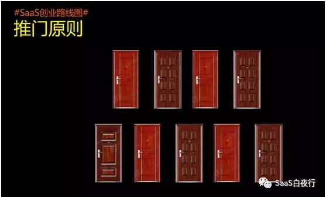

## SaaS创业路线图（23）：to B创业中的5个行动原则  

> 发布: 吴昊@SaaS  
> 发布日期: 2018-10-30  

“作者介绍 -吴昊，SaaS创业顾问，纷享销客天使投资人、前执行总裁，20年企业信息化和7年SaaS营销团队创新经验，目前在为SaaS公司提供产品市场定位、营销策略及团队建设等战略咨询。

上周日的“SaaS创业路线图”公开课后，不少同学在微信上表示对我讲的“5个理论”很有共鸣。

确实，一次课程下来听我讲了20个案例、5.7万字，真用到自己的工作中，还是需要结合实践的思考。所以我在培训尾声说，这次课程听下来，别的没记住，把这5个来自实战、又有指导意义的“5个行动原则”记住，也就会非常有收获了。

今天我结合实际工作为大家解读一下这5个原则。

一、硬骨头原则

很多创业者急于求成，这做不好toB创业。

举例来说，产品价值阶段如果发现效果不明显，硬要推进到营销阶段在销售上想办法，只能事倍功半。

还有个常见问题是，本来想收费，营销中遇到困难，就改免费。貌似得到了在用客户，但这些客户在“真”用吗？客户提出的是真正的需求吗？客户的使用真的没有成本吗？

这样的硬骨头绕过去不啃，最后还会绕回来让你补这一课。如果真这是这样，创业团队损失的就不仅仅是时间和资金，更糟糕的是对时机的浪费。

我还见过不少团队在单兵打法都没做出来，就急于扩张团队，甚至迅速在多个城市铺点。这样只能让销售管理工作非常难做—— 销售没有业绩挣不到钱，业务主管变成了“员工关怀主管”，本来应该花在客户身上的时间，都被迫花在和员工谈心、打鸡血上了。

也许这个创业公司资金充足，可以给大家定个稳定的高底薪。但在一个新市场上，业务员的个人收入中如果主要来自底薪，哪里又会有斗志？说起来，还是前面的“硬骨头”没啃下来，后面只能浪费更多的时间。

### 二、推门原则

这个理论的原创是纷享销客的创始人罗旭。我发现创业过程中，很多地方都应该考虑这个“是否该全力以赴”的问题。

创业有很多困难的关口，如果面前多道门都有可能性，我们该怎么做？—— 最优策略是选中一扇门然后拼尽全力去推，如果这样还推不开就彻底忘记它，赶紧去推下一扇门。如果你推第一扇门时三心二意，推第二扇门再遇到困难时就会想，“是不是第一扇门是对的？”各种犹豫和投机心理，只会让你最终倒在这些门前的概率更高。

这里我也讲讲销售人员的行为方式。一个销售一旦拿到任务，就应该是不达目的誓不罢休的，为了达成目的会想尽一切办法，这才是优秀的销售。

我和一个负责产品的联合创始人交流，他就很困惑销售为啥一根筋，为啥告诉他们要做A类型的客户，还老在B类型的客户身上想办法。这就是推门原则的体现，优秀的销售会非常坚持，会为了业绩不顾一切。所以定下明确的目标很重要，销售会去打B客户，一定是因为公司没有规定B客户成交不算销售业绩，也多半是因为公司没有给出明确的“客户画像”及销售打法。摸索阶段，要对每扇门全力以赴。

### 第三、叠加原则

1.10的11次方是2.85，如果团队在产品、在业绩、在管理上每月能有10%的提升，一年下来就能提升将近3倍！

这也就能够解读为什么SaaS公司应该聚焦做产品的问题。如果做定制开发项目，就要想清楚是否能回得了头做产品？一个个项目做下去，每次都是在同一个方向叠加能力吗？还是被客户的需求带着东一榔锤、西一棒子？要回顾一个项目交付后，还有多少手尾？客户是否还会有新需求？突发Bug的紧急处理消耗了咱们多少时间？

组织管理能力的积累更是这样。业务上可以突然尝试新方法、新通道、新资源，但管理上应该渐进式积累。这样就会慢慢看到进步。特别是要考虑用关键指标体系管理公司，这样才能有保障地应对经营中出现的问题。我有一个数字化管理工具是“每部门TOP3指标体系”，改天再单独写一篇给大家。

有的指标周期太长，对工作指导也不够。例如“续费率”，新创公司前2年该指标没法看，所以要看周期较短的“上月签约客户本月活跃率”指标。周期短，才能快速迭代出需要的能力。

### 第四、筛子原则

举个例子，在招聘过程中，面试官其实很难判断应聘者入职后的投入度如何，口头说的毕竟不那么靠谱。所以要在培训阶段设置“筛子”，培训期间的考试不能太容易通过，难度不用太高，但每个学员要在8小时外投入不少时间才能掌握。这样的筛子可以保障每个过关的新员工都有强烈意愿的。

而且一旦在管理过程中设置了这样的一些筛子，新设立分支结构时，新的管理者也很容易掌握，这会降低对高级别个人能力（例如，快速识人能力）的依赖。

据我所知，不少优秀的投资机构也都有这样的“筛子”逻辑—— 机构通过自然筛选先找到投资标的群体（例如：赛道正确、来自在某领域成功的大企业、连续创业者、海归等），这已经保障投资成功的大概率；再加上每个投资经理的人为判断、人工尽调的手段，做好微观选择。

我目前在做的“SaaS创业战略咨询 + 轻投资”也是这样：第①层，能看到我的文章的，自然是爱学习、能接受外部新事物的SaaS创业者；愿意付费上公开课的，都是有付费习惯、有长远规划、同时又有一些困惑需要解决的创业团队；而我长期提供咨询合作的企业，我也有更大信心在未来尾随做过尽调的VC一起跟投。

所以我说“好筛子优于人为判断”。

### 五、时间管理原则

很多管理者向我抱怨招人难。我只能说，“你没有在最重要的事情上花足够多的时间”。看看我的系列文章中提出过的招聘方法，你会发现大部分方法都是要管理者重度投入时间的，这样人找到了，你今后的时间也可以放到下一件重要的事情上。

我观察了一下，创业初期2、3年必须有很快的节奏，但又不能乱。每个创始人和管理者，应该保障每周的那件“最重要的事”得到完成或实质性推进。

时间管理的书很多，如果你在这方面有很大问题（我感觉到大部分人的时间都管理地不好），可以看看这本很薄的书《最重要的事只有一件》。

“作者介绍 -吴昊，SaaS创业顾问，纷享销客天使投资人、前执行总裁，20年企业信息化和7年SaaS营销团队创新经验，目前在为SaaS公司提供产品市场定位、营销策略及团队建设等战略咨询。
