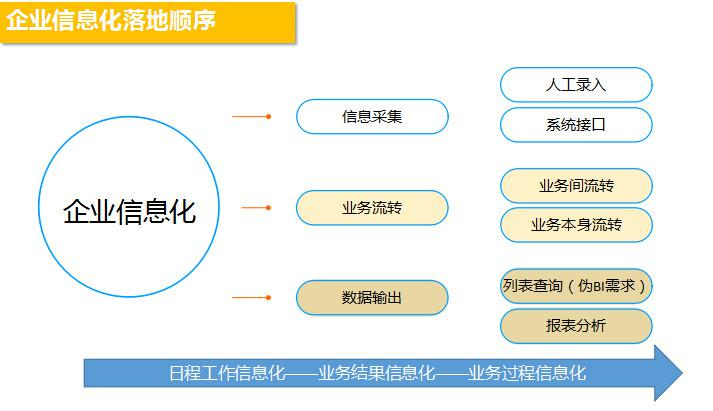
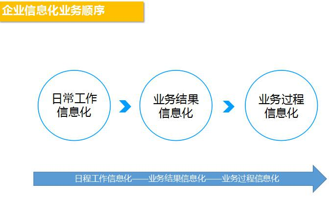
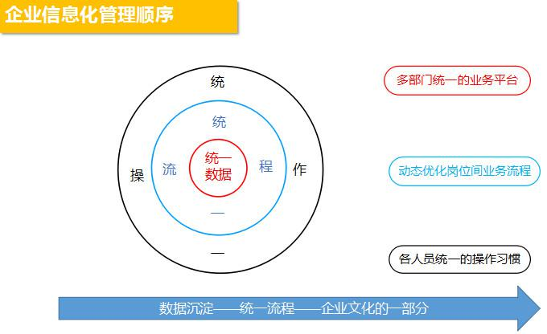

## SaaS售前及实施的实战举例（3）| SaaS创业路线图  

> 发布: 吴昊@SaaS  
> 发布日期: 2018-10-09  

“本文作者介绍：杨康杰，纷享销客前华北区售前及实施部门负责人，国内最早一批CRM从业实践者。

“本系列文章作者介绍- 吴昊，SaaS创业顾问，纷享销客天使投资人、前执行总裁，20年企业信息化和6年SaaS营销团队创新经验。

吴昊：对于较重的SaaS产品来说，售前及实施是非常关键的环节。我一直在考虑如何把这件复杂的事情说清楚，想来想去，还是用一个在运行着的CRM售前及实施体系为例来说明问题，对大家启发更大，也更具实战参考性。因此接下来3篇文章，我请到纷享销客华北大区的售前及实施部门负责人杨康杰为大家讲解此中门道。

本文为杨康杰“售前及实施的实战举例”的第三篇。点击查看：

[《SaaS售前及实施的实战举例（1）》](https://36kr.com/p/5153822.html)

[《SaaS售前及实施的实战举例（2）》
](https://36kr.com/p/5154779.html)

### 五、SaaSCRM的实施交付

#### 1、实施和CSM的二八原则

CRM是厂商和客户双方的婚姻：虽然SaaSCRM的模式核心是存量客户的续费，但也无法突破二八原则让每一个客户都满意续费。第一CRM厂商无法独自完成实施交付，必须需要客户的配合；第二厂商的无论产品研发资源还是实施交付资源都是是有限的；这两者决定了无法做到客户100%的交付和满意。

团队的成熟需要时间\(详细见[“售前实施CSM人员能力模型搭建”\)](https://36kr.com/p/5154779.html)：如果在团队能力模型未成熟之前，在自身能力不支持客户高比例交付和满意的基础上强求，结果可能反而会因为个别项目的资源投入过大，导致公司整体的交付和满意度比例更低。

可以做到的是高比例避免厂商原因带来的项目不成功：通过完整的方法论，随时分析每个客户的交付和满意度，可以100%避免因为厂商的方法不专业带来的交付不成功和客户的不满意。

客户分类的核心：在资源相对不足情况下，对客户分类的核心是根据我们每一个时间结点可匹配的动态资源，而不是根据客户规模或影响力。只有保证最我们动态资源范围之内，才能保证客户能交付和满意。

#### 2、实施黄金周期

客户和用户的分离：决策购买的人和使用的人往往不是同一个角色，决定了实施交付的“黄金周期”理论。

从高层到基层CRM价值的延时性：公司高层决定上CRM系统，一定是看到了CRM系统能给企业带来的价值，但CRM作为管理软件，一线执行人员甚至中层人员都会有天然的不习惯在初期有抵触心理。

价值的延时性对高层推动CRM信心的影响：公司高层在黄金周期内会顶着压力推进CRM的实施落地，但如果在黄金周期内没有体现出系统的价值，公司高层面临越来越多来自一线的抱怨，会逐渐动摇对CRM系统的信心。

高层推动CRM的信心对项目成功的作用：公司高层信息不足会逐渐减少对实施交付的支持，导致一线信息采集的断节和失真，CRM系统更加无法体现价值，进入恶性循环。所以，我们必须在黄金周期内让高层能看到CRM的价值，才能增强高层继续推进CRM的信息，保证一线信息采集的实时和真实，从而不断产生更多的价值，进入良性循环。

SaaSCRM的黄金周期更短，从心态上，客户对SaaSCRM交付的期望更高。所以项目经理需要在最短的时间，根据客户需求以及厂商自身资源，判断出我们能给客户快速带来的价值，才能不断延长黄金周期，避免求全求完美导致在黄金周期无法呈现价值。

#### 3、实施交付应该先有计划还是先需求调研

在实施交付环节，一直以来有两种方法论，第一是项目之初先做客户调研，再根据已经初步明确的需求制定实施计划，目的是保证项目质量；第二是项目之初就根据售前交接和客户规模，根据项目经理的经验先制定项目整理的实施主计划（包括调研计划）并和客户确认，目的是保证项目整体可控。

传统CRM的实施交付很多是第一种，首先项目交付和尾款息息相关，其次因为合同会约定实施人日，超出后客户需要追加实施费用，所以对项目有可控的期望但没有特别强烈的把控欲望。

SaaSCRM因为黄金周期更短，所以更适合第二种，项目可控的前提下排列需求优先级，在最短的时间让CRM有价值输出，坚定客户高层的决心，才有可能进入良性循环，通过不断的优化源源不断产生价值，建立真正的SaaS续费模型。

#### 4、实施交付的规划

企业榨汁机理论：CRM系统作为企业信息榨汁机，信息采集的准确才能保证信息产出的准确，实施过程中任何需求，首先应该落实的就是什么人如何采集进CRM系统，其实是采集进CRM系统的数据如何流转，最后才是企业关心的价值呈现。

企业信息化业务落地顺序：一个日常工作信息化系统都很难执行的企业，直接业务过程信息化带来的后果是信息的断节甚至虚假。

企业信息化管理落地顺序：企业信息化首先要解决的是信息从原来的个人碎片到统一企业化沉淀，其次是信息的流转流程标准化，最后变成企业文化的一部分。

#### 5、CRM实施交付中客户项目经理的重要性

一个企业CRM选型是否成功可能取决于公司高层，一个企业CRM的实施落地是否成功一定取决于企业的CRM项目经理。

企业CRM项目经理必要条件是非常熟悉公司整体业务和各个角色工作流程，其次是在实施交付周期内有充足的时间，最后才是是否有IT能力。

一个被动的CRM项目经理，为了增加字段而增加，一个主动的CRM项目经理，会从领导交代增加一个字段去探寻这个字段背后真正的需求。

#### 6、CRM实施交付中的需求调研

什么人要用：协助客户从业务角度梳理客户组织结构，明确软件应用主体（什么人要用CRM）

做什么事情：协助客户明确每个角色甚至每个人具体需要在CRM中完成的事情（需要权限看的业务、需要处理的业务等）

事情间关系：协助客户明确每个人做的每个事情之间的关联（事和事之间）、流程（一件事之间）、权限（人和事之间）

最后才是具体的表单和字段，以上三项梳理明确的基础上，客户可以自己不断完善。

重点：从高层开始调研，明确信息化应用主体，再根据主题需求细节调研公司各个部门。

#### 7、CRM实施的本质

从医药代表到企业保健医生：首先充分理解客户的需求，其次根据客户需求总结出客户应用场景，最后根据应用场景提供CRM软件功能。而不是直接堆积软件的功能。

从企业的司机到企业的教练：SaaSCRM大部分人认为要提高客户满意度，需要提供保姆式的服务，但最了解企业业务的一定是企业自己，厂商一定要把软件配置及需求分析能力复制给客户，厂商只是教练，真正的司机是客户，企业最明白自己要去哪里。

实施的核心价值：把“客户零散需求”翻译为“解决场景”，再通过“软件配置”落地，实施的增值价值是通过科学规范的“实施过程”让客户具备把“自身需求”翻译为“解决场景”，再通过“软件配置”落地的能力。

### 六、SaaSCRM的CSM

关于CSM的团队能力模型参见上一节，CSM如果和实施、售前部门没有整合，就只是传统的客户服务部门和二次销售部门。

#### 1、CSM的核心价值：

部门定位：CSM部门一定不是业务（销售）部门，而是中台支持部门。

部门职能：客户“续费”和“增购”是CSM的核心价值，也是基本价值；在续费和增购基础上的“客户转介绍”是CSM部门的增值价值。但这些都不是CSM的日常工作。

部门本质：CSM能力模型服务到位，客户自然会续费、增购、转介绍，CSM能力模型服务不到位，续费会事倍功半，增购和转介绍也会比较困难。

关于商务：客户的续费和增购商务职能可以在CSM内部（例如CSM顾问兼任、专职商务经理），也可以放在其他部门（例如销售部、运营部等），只是绩效的规划问题。

#### 2、CSM和实施交付的整合趋势：

1、实施交付和CSM的整合：SaaS业务公司，CSM顾问和实施顾问的岗位重合率比较高，无论从客户应用还是内部效率角度来讲，实施和CSM整合都是趋势。

2、实施交付和CSM整合探索：在真正明确实施和CSM不同岗位的核心职能基础上不断优化探索，在每个阶段让客户都能找到人、能解决自己的问题。

3、关于客户心态：本地部署和SaaS的客户心态有本质区别，不论是1块钱OFO还是600一天租金的奔驰，租用模式会让客户对厂商的容忍度更低，会更容易选择其他类似服务。所以实施交付和CSM的不断优化，在“满意度”基础上给客户不断带来“价值度”是SaaS业务的根本。

### 七、SaaSCRM一些其他思考

如上一节“SaaSCRM客户关系图”所示，CRM的本质决定了第一象限第二象限是CRM的基础，不但绕不过去的必然阶段，且欲速则不达。SaaSCRM厂商需要真正静下心来把第一第二象限能力夯实，才能真正跨入第三第四象限真正SaaS模式的增值价值区域。

2B本身就远比2C复杂，2B的信息化领域更是复杂中的复杂，CRM作为管理外部事务的信息化平台则是2B信息化领域最复杂的部分。

SaaSCRM处于黎明前的黑暗，很多厂商虽然坚信SaaS模式的优势，因为市场的暂时不成熟，在黑暗中不断摸索盈利的模式，都知道黎明一定会来临，但不知道自己是否能坚持到黎明的来临。

这种心态直接导致了在没有熟练掌握SaaSCRM在产品、销售、交付的客观规律情况下，为了尽早跑出效率模型而各种大跃进。在整个售前、实施交付、CSM体系还停留在第一第二象限的阶段，希望能跑出第三第四象限的效率模型。

因为缺乏清晰的符合客观规律的售前、实施、CRM体系的整体过程规划，一旦面临“业绩”和“体系搭建”两者之间的资源冲突，习惯性的选择业绩，导致体系只能不断重启。

很重要的是从销售到实施交付到CSM的人才理论体系搭建，更重要的是有了理论体系之后坚定地完成落地，有了人才理论体系以及落地（自用CRM系统），各个角色就能在做了第一步（积累了很多客户）后，真正进入第二步——沉淀出真正的客户价值和团队能力。

10月14日（周日）下午，将在北京举办一场“SaaS创业路线图”公开课，欢迎SaaS同路人报名[（点击查看报名链接）](http://pc-shop.xiaoe-tech.com/appBUJrXmrG2030/login)

[SaaS创业路线系列文章地址（点击查看）](https://36kr.com/user/1308477002)
