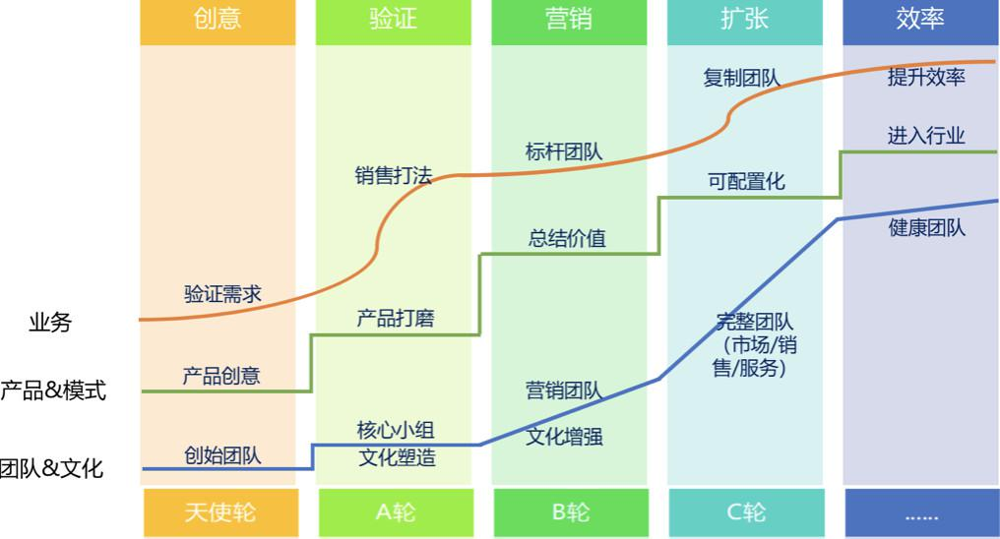

## SaaS创业路线图（24）：商业模式决定了你的天花板  

> 发布: 吴昊@SaaS  
> 发布日期: 2018-11-07  

“作者介绍 - 吴昊，SaaS创业顾问，纷享销客天使投资人、前执行总裁，20年企业信息化和7年SaaS营销团队创新经验，目前在为SaaS公司提供产品市场定位、营销策略及团队建设三方面的战略咨询。

点击查看[\#SaaS创业路线图\#](https://36kr.com/user/1308477002)系列文章

上次在北京公开课上，开场我就讲到“认知边界”的问题。

咱们做一个商业，首先要设法看清楚这件事的天花板在哪里。如果最大是个2亿营收的市场，即使做到第一也就是不到一个亿的营收，这样的商业值不值得做？要先想清楚。

很多人是没看清闷头就做。举例说，IT界著名自媒体“阿朱”亲口告诉我，很多创业者以为未来市场很大，是因为没有从来没有做过“行业第一”。奋斗多年做到细分行业第一后才发现：好不容易牙齿练锋利，却发现池塘没鱼了...... 这就是初期认知不足。

商业模式正是决定这个天花板的决定因素。我先讲几个SaaS相关的商业模式，从表象上看，首先是收费模式不同：

### 一、传统软件买断模式

常见状况是，第一年收30万，包括定制开发费用，以后每年收3万的维保费用。这和卖冰箱一样，卖一次，基本上这个客户未来几年都和你没关系了。

唯一的办法是交叉销售，以客情为中心，不断卖其他IT产品。

但这对很多创业公司和专注一个产品的公司就是问题。代理其他公司的产品（微波炉？），这条路只能把自己变成卖人天的系统集成商。

### 二、SaaS收年费

传统软件的买断模式将来会越来越困难，因为买断后团队缺乏动力去帮助客户用好产品，毕竟没钱收了，即使老板天天让大家朗诵“客户第一”又有什么用呢？最后只有客户经理着急，其它部门却急着做下一单赚钱。

而SaaS的本质是续费。SaaS公司有一个内在的机制，我每年都会找你续费，我就会帮你不断的解决问题，我就有一个CSM团队，专门有一个人就是以“你的续费”为KPI的。她会想尽办法调动产品资源、研发资源、服务资源甚至公司高管资源，去帮你解决问题。

**这就是一个好机制的效果远远超过日常管理的体现。**

### 三、消耗模式

收年费还不是最好的模式。有一个模式比它更好，就是消耗模式。例如百度关键字 —— 你先存4000元，消耗过程带来商机，有效果了再预存1万，带来了一批客户效果不错，再预存2万...

我最近给几个SaaS创业团队做战略咨询。其中就有这样的模式，让客户先付两万、三万、五万，甚至十万。百度给你带来一个客户成本是7000元，我们给你带来一个客户的成本是1000，这就很有意思了。

大家看，这样的情况下，其实是按效果付费，双方的交互频率更高，业务紧密度更高。很明显，消耗模式在商业上更有价值。

为什么这么说呢？因为它会不断的督促服务供应商想办法帮你消耗，比如百度，百度代理商会派人帮你做优化、做消耗、帮你带来更多客户。（这里不是给百度做广告哈，上周的中欧商学院课程上，实战派的王老师还呼吁我们今后投SEM不要只投百度，一定要同时投点儿搜狗和360...\)

大家看，我的评价标准就是产生营收的频率，也可以说是付费的频率。付费频率越高，业务相关度越高，这个商业价值越大。

这个模式非常好，但是还有一个模式比消耗模式更有意思，就是下一个：

### 四、分销售额。

你没看错！

对SaaS公司来说，分销售额听起来是不可能的事。但这就是我文章开头说的“认知边界”，你都想不到，当然不可能做到。

**如果只是按传统做SaaS工具的做法，永远做不到分销售额的模式。一定是有更深地介入客户的业务流程当中的方式才能成就这个模式。**

我认为SaaS公司是有这样的机会的，我们中间也有人做到。8月份我在崔牛会见到一个2004年就做SaaS的老前辈，他做了一个产品，有硬件也有软件，他就跟别人分销售额，你卖多少，我都拿x%。

这个模式最有趣的地方是 —— 从机制上让你的整个体系不断的帮助客户去做更多的销售额，因为客户做了销售额你才有的分。

可能大家会说这事怎么听起来这么遥远？其实一点都不遥远，下面我就讲讲产业+互联网。

### 五、产业互联网

产业互联网是一个大趋势。大家都知道美团刚上市，市值500亿美元。所有人都在讨论美团的边界到底在哪里？美团是一个有边界的公司吗？只要是服务，他就做。

大家光看餐饮这件事，美团其实也收了7家做餐饮SaaS的公司，他现在是带了流量给餐馆，下一步会要求餐厅都用他的SaaS。

你用我们的SaaS，我就知道你一天卖了多少牛排，卖了多少羊肉，卖了多少沙丁鱼，我下面一个阶段就给你供货。

我跟很多家做餐饮SaaS的同学都聊过，他们特别想做成这个事，但是很难，你得有足够的市场占有率，你还要有足够的话语权。美团恰好就有，我给你带来客户，这是无比锋利的话语权。

这个过程是无比艰难的，看过《九败一胜》的人都知道。但是如果达到的话，就有可能建立起惊人庞大的供货体系。给餐馆供货，这就是万亿级的市场。我给你供货之后，大家想象美团以后会干什么？会开农场，从源头控制品质和成本？想象空间非常巨大......

在各个产业+互联网的方向上，有很多的变化是我们这些做SaaS的人应该去关注的，甚至应该想办法抓住的，这是整个商业模式上的升级。

**首先我们SaaS本身是工具。** 但说实话像阿朱说的，你做了一套很牛的软件系统，但那就是铁锹。你卖铁锹给人家，人家挖出来的是金矿还是银矿跟你没有一毛钱关系。

你就是一个卖铁锹的，你怎么能够去跟他的营收有关系呢？你应该做的，就是加入行业的业务层面，帮客户一起找金矿或挖金矿，这样你才有机会和客户一起分挖出来的金矿。

**只有更进一步深入业务的模式才是SaaS的突破口。**

我们如果把SaaS工具这件事做好，当然也有很多机会，象北森、纷享销客等少数几家公司能把成熟的PaaS平台做出来，将来就有可能像Salesforce一样吸引行业ISV，通过平台战略占领企业级市场。

但对大部分目前还在起步阶段的SaaS公司来说，这个机会的时间窗其实已经关闭。他们两家都已经投入4亿以上的研发费用，创业公司没法玩了。

**以前都说“互联网+”，但今天我们觉得应该是产业+互联网。** 这个观点今天已经普遍被接受了。互联网+别的东西太不靠谱了，你怎么可能完全创造新产业呢？这是不现实的。你只能说这个产业用互联网的方式来产生新的业务流程和新的业务模式。

在这个当中，AI、人工智能一定会起到很大的作用，物联网肯定也会起到很大的作用。而在展现层面，在很多对员工、供应商及经销商进行业务赋能的层面，其实就是SaaS。

**我们要摆脱做“铁锹”的命运，就要想清楚如何参与行业的互联网改造。** 如果你是一个行业产品就深扎行业；如果你不是一个行业产品也可以去想想你是否应该找到真正适合你的行业， **实现自己的业务价值，而不是工具价值。** 你真正能够参与一起挖那个金矿，而不止是卖一个铁锹。

### 六、如何参与“产业互联网”？

**首先，我们要懂行业。** 作为行业SaaS公司，我估计大家没有问题。

**其次，你得有行业资源。** 上面说的参与找金矿、挖金矿的事情不是说你想到就能做到，你必须得有资源。我看到一些SaaS公司本身就是这个行业里挺牛的业务公司，你来做这个行业的SaaS，你有天生的优势。

但如果我们只是纯粹是一个技术范的公司， **我建议你要跟行业寡头联盟** 。要去找到行业寡头，能够跟他们交流，一起干产业的互联网改造。这样SaaS就变成了产业互联网的事情，而不仅仅是做工具的事情。

大家可能会说，行业寡头为什么会理你呢？

大家看看我的[\#SaaS创业路线图\#](https://36kr.com/user/1308477002)（点击查看）系列文章，就会发现做SaaS的逻辑跟很多做传统企业的做法是不一样的，这中间从产品打磨到销售打法、到团队复制的逻辑都很特别。行业寡头如果没有SaaS背景自己做，走弯路概率很大。

**第三，数据。**

我们有技术优势、有人才，更重要是的我们有数据。如果我们能够让一些企业客户付费，而且用的很深、很好，你得到的数据将来很有价值。

数据的事情，大家觉得不能动客户的数据，目前确实是这样。

但我回想了一下，这就像客户质疑数据安全的问题。2012年我几乎说服不了任何企业，只要他问我“数据保存在哪儿？”就会遇到一堆困难，只有20%能过关。到2014年50%能过关，到2018年80%的中大企业已经能够接受SaaS的数据云存储方式。目前大部分客户可以接受云计算，他只是要求你专业，他要你给出很完整的数据管理报告。

**我个人判断五年左右就会有很多能让你用脱敏使用数据的机会。**

打一个比方，有一天你可能会跟一个客户讲：我们系统分析出来说你的同行平均成交周期是87天，我不知道你们的成交周期是多久？他回去查了一下，回来说成交周期是120天，他就会问为什么我的单子拖地久一些？

你会说：您是否希望我们经常性提供这样数据和分析报告来帮你们提高销售效率？前提是我不使用你的具体数据，但是我需要脱敏地使用你的数据。

我觉得现在的确实只有10%、20%的企业能接受，但是未来这个比例会越来越高，因为他不用你先进的生产方式就跟不上对手，他会突然在某一天的某一个业务问题上出现困难。

**最后，成为业务运营公司。**

我们在数据上是天然有优势的，我们最后要成为业务运营的公司。我们能够要去参与运转这个行业的业务。

这样，与客户分销售额的商业模式就慢慢地水到渠成。

今天我就简单讲到这里，因为这个商业模式的事情一个问题，每家的商业模式千差万别。所以有兴趣的同行欢迎留言或私下约聊。

参考文章：

[SaaS创业路线图（十六）SaaS产品的定价、折扣和背后商业逻辑](https://36kr.com/p/5152626.html)

[SaaS创业路线图（廿二）- 如何开一次不同的toB培训公开课？](https://36kr.com/p/5158471.html?from=authorlatest)
