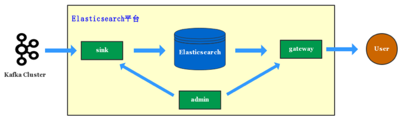
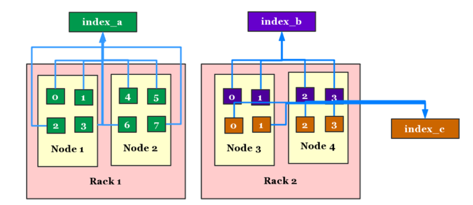
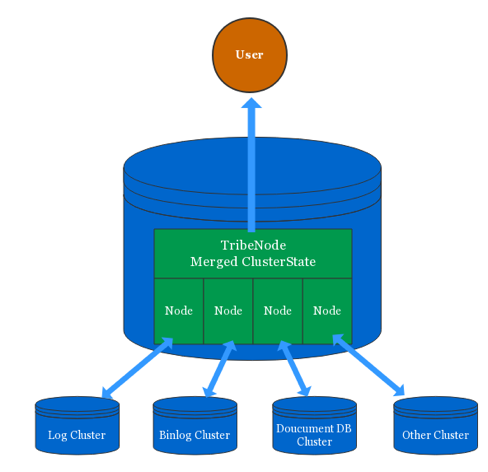
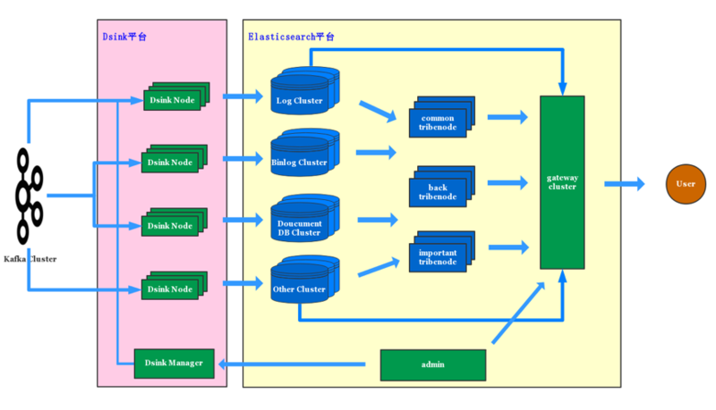

## 滴滴Elasticsearch多集群架构实践  

> 作者: 魏子珺  
> 发布日期: 2018 年 12 月 17 日  

Elasticsearch 是基于 Lucene 实现的分布式搜索引擎，提供了海量数据实时检索和分析能力。Elastic 公司开源的一系列产品组成的 Elastic Stack，可以为日志服务、搜索引擎、系统监控等提供简单、易用的解决方案。

### 滴滴 Elasticsearch 简介

滴滴 2016 年初开始构建 Elasticsearch 平台，如今已经发展到超过 3500+ Elasticsearch 实例，超过 5PB 的数据存储，峰值写入 tps 超过了 2000w/s 的超大规模。

Elasticsearch 在滴滴有着非常丰富的使用场景，例如线上核心的打车地图搜索，客服、运营的多维度查询，滴滴日志服务等近千个平台用户。

超大的规模和丰富的场景给滴滴 Elasticsearch 平台带来了极大的挑战，我们在这期间积累了丰富经验，也取得了一些成果。本文给大家分享下滴滴在 Elasticsearch 多集群架构的实践。

### 单集群架构瓶颈

介绍单集群架构瓶颈前，先来看下滴滴

###### Elasticsearch 单集群的架构。

滴滴在单集群架构的时候，写入和查询就已经通过 Sink 服务和 Gateway 服务管控起来。

###### Sink 服务

滴滴几乎所有写入 Elasticsearch 的数据都是经由 kafka 消费入到 Elasticsearch。kafka 的数据包括业务 log 数据、mysql binlog 数据和业务自主上报的数据，Sink 服务将这些数据实时消费入到 Elasticsearch。

最初设计 Sink 服务是想对写入 Elasticsearch 集群进行管控，保护 Elasticsearch 集群，防止海量的数据写入拖垮 Elasticsearch，之后我们也一直沿用了 Sink 服务，并将该服务从 Elasticsearch 平台分离出去，成立滴滴 Sink 数据投递平台，可以从 kafka 或者 MQ 实时同步数据到 Elasticsearch、HDFS、Ceph 等多个存储服务。

有了多集群架构后，Elasticsearch 平台可以消费一份 MQ 数据写入多个 Elasticsearch 集群，做到集群级别的容灾，还能通过 MQ 回溯数据进行故障恢复。

###### Gateway 服务

所有业务的查询都是经过 Gateway 服务，Gateway 服务实现了 Elasticsearch 的 http restful 和 tcp 协议，业务方可以通过 Elasticsearch 各语言版本的 sdk 直接访问 Gateway 服务，Gateway 服务还实现了 SQL 接口，业务方可以直接使用 SQL 访问 Elasticsearch 平台。

Gateway 服务最初提供了应用权限的管控，访问记录，限流、降级等基本能力，后面随着平台演进，Gateway 服务还提供了索引存储分离、DSL 级别的限流、多集群灾备等能力。

###### Admin 服务

整个 Elasticsearch 平台由 Admin 服务统一管控起来。Admin 服务提供了索引的生命周期管理，索引容量自动规划，索引健康分，集群监控等丰富的平台能力，以及为 Sink、Gateway 服务提供索引、权限等元数据信息。

##### Elasticsearch 单集群瓶颈

随着滴滴 Elasticsearch 平台规模的快速发展，Elasticsearch 集群越来越大，最大的时候，是由几百台物理机组成集群，当时集群共 3000+ 的索引，超过了 50000 个 shard，集群总容量达到了 PB 级别。超大的 Elasticsearch 集群面临了很大的稳定性风险，这些风险主要来自于以下三个方面：

* Elasticsearch 架构瓶颈

* 索引资源共享风险

* 业务场景差异大

###### Elasticsearch 架构瓶颈

Elasticsearch 架构在集群变大到一定的规模会遇到瓶颈，瓶颈主要跟 Elasticsearch 任务处理模型有关。

Elasticsearch 看起来是 p2p 架构，但实际上，仍然是中心化的分布式架构。整个集群只有一个 active master。master 负责整个集群的元数据管理。集群的所有元数据保存在 ClusterState 对象中，主要包括全局的配置信息、索引信息和节点信息。只要元数据发生修改，都得由 master 完成。

Elasticsearch master 的任务处理是单线程完成的，每次处理任务，涉及到 ClusterState 的改动，都会将最新的 ClusterState 对象 publish 给集群的全部节点，并阻塞等待全部节点接受到变更消息，处理完变更任务后，才完成本次任务。
这样的架构模型导致在集群规模变大的时候出现很严重的稳定性风险。

* 如果有节点假死，比如 jvm 内存被打满，进程还存活着，响应 master 任务时间会很长，影响单个任务的完成时间。

* 有大量恢复任务的时候，由于 master 是单线程处理的，所有任务需要排队处理，产生大量的 pending\_tasks。恢复时间变得很长。

* Elasticsearch 的任务分了优先级，例如 put-mapping 任务优先级低于创建、恢复索引，如果一些业务上低优先级索引在恢复，正常索引有新字段写入时会被阻塞。

* master 任务处理模型，在任务执行完成后，会回调大量 listener 处理元数据变更。其中有些回调逻辑在索引、shard 膨胀后，会出现处理缓慢的问题，当 shard 膨胀到 5-6w 时，一些任务处理需要 8-9s 的时间，严重影响了集群的恢复能力。

针对这些问题，Elasticsearch 也在不断优化，针对相同类型的任务，比如 put-mapping 任务，master 会一次性处理所有堆积在队列里的相同任务。ClusterState 对象只传递 diff 内容，优化回调 listener 模块的处理耗时环节等等。

但是由于整个集群的任务都集中在一个 master 的一个线程中处理，在线程中需要同步元数据变更给集群的每个节点，并阻塞等待全部节点同步完成。这个模型在集群规模不断膨胀时，稳定性会不断下降。

###### 索引资源共享风险

Elasticsearch 索引是由多个 shard 组成，master 会动态给这些 shard 分配节点资源。 不同的索引会存在资源混部的情况。

Elasticsearch 通过 Shard Allocation Awareness 的设计，可以将集群的节点按集合划分成不同的 rack。在分配索引时可以指定 rack 列表，这样索引就只会分配在指定 rack 对应的节点列表中，从而做到物理资源的隔离。

但是实际使用中，很多容量小的索引由于占用资源有限，会混部在一些节点中。这种情况下，会因为个别索引的查询、写入量飙升，而影响到其他索引的稳定性。如果出现了节点故障，就会影响到整个集群的稳定性。

整个集群 master、clientnode 资源是共享的，master 风险前面已经单独提及，clientnode 共享带来的 gc、抖动、异常问题都会影响到集群内的全部索引。

###### 业务场景差异大

Elasticsearch 适用的业务场景差异特别大。

* 针对线上核心的入口搜索，一般按城市划分索引后，索引容量不大，数据没有实时写入或者实时写入 tps 很小，比如地图 poi 数据采用离线更新的方式，外卖商家、菜品写入量也很小。但是查询的 qps 很高，查询对 rt 的平均时间和抖动情况要求很高。

* 针对日志检索的的场景，实时写入量特别大，有些索引甚至超过了 100w/s 的 tps，该场景对吞吐量要求很高，但对查询 qps 和查询 rt 要求不高。

* 针对 binlog 数据的检索，写入量相比日志会小很多，但是对查询的复杂度、qps 和 rt 有一定的要求。

* 针对监控、分析类的场景，聚合查询需求会比较多，对 Elasticsearch 内存压力较大，容易引起节点的抖动和 gc。

这些场景各异，稳定性、性能要求各不相同的场景，一个 Elasticsearch 集群即使使用各种优化手段，很难全部满足需求，最好的方式还是按业务场景划分 Elasticsearch 集群。

### 多集群挑战

正是单集群面临了非常大的稳定性风险，我们开始规划多集群的架构。我们在设计多集群方案的时候，期望对业务方是零感知的。

写入还是经过 kafka，Sink 服务可以将不同 topic 的数据入到不同的 Elasticsearch 集群。

查询继续通过 Gateway 服务，而且业务方仍然像之前一样传递索引名称，而无需感知到平台内部的索引分布。所有的索引在不同集群的分布细节，均由 Gateway 服务屏蔽。

整个改造最大的挑战在于查询方式的兼容。Elasticsearch 查询索引的方式非常灵活，可以支持 \* 号作为通配符匹配。这样一个索引 query 可能查询的是多个索引，比如有如下 3 个索引：

* index\_a

* index\_b

* index\_c

使用 index\* 查询的时候，可以同时查询到 index\_a、index\_b、index\_c 三个索引。 Elasticsearch 这种实现方式非常简单，由于一次 query 最终查询的是多个 shard 的数据，所以无论对于具体的索引，还是模糊的索引，都是先根据索引名称得到 shard 列表，再将多个 shard 的 query 结果 merge 到一起返回。

这样的使用方式，对于多集群方案就会遇到问题，比如 index\_a 在 A 集群，index\_b 在 B 集群、index\_c 在 C 集群，对于 index\* 的 query，就无法在一个集群上完成。

##### tribenode 介绍

经过调研，我们发现 Elasticsearch tribenode 特性可以很好的满足多集群查询的特性。
tribenode 的实现非常巧妙。

org.elasticsearch.tribe 包下只有三个文件，核心类是 TribeService。tribenode 的核心原理就是 merge 每个集群的 ClusterState 对象成一个公共的 ClusterState 对象，ClusterState 包含了索引、shard 和节点数据分布表。而 Elasticsearch 的工作逻辑都是基于 ClusterState 元数据驱动的，所以对外看起来就是一个包含全部索引的的 clientnode。

tribenode 通过配置多个 Elasticsearch 集群地址，然后以 clientnode 角色分别连接每个集群，每个集群看起来会多了一个 clientnode。

tribenode 通过该 clientnode 角色获取到集群的 ClusterState 信息，并绑定 listener 监听 ClusterState 变化。tribenode 将获取的所有集群的 ClusterState 信息 merge 到一起，形成一个对外部访问使用的 ClusterState 对象，对外提供服务。tribenode 除了注册 listener 和 merge ClusterState，其他的所有逻辑都是复用了 clientnode 的代码。

可以看到 tribenode 的 **优点** ：

* 能够满足多集群访问的需求，对外使用是透明的。

* 实现的简单、优雅，可靠性有保证。

同时 tribenode 有些 **不足** 的地方：

* tribenode 必须以 clientnode 加入到每个 Elasticsearch 集群，master 的变更任务必须等待 tribenode 的回应才能继续，可能影响到原集群的稳定性。

* tribenode 不会持久化 ClusterState 对象，重启时需要从每个 Elasticsearch 集群获取元数据。而在获取元数据期间，tribenode 就已经能够提供访问，会导致查询到还在初始化中的集群索引访问失败。tribenode 连接的集群多了，初始化会变得很慢。针对该缺陷，我们平台在重启某个 tribenode 集群时，将 Gateway 访问该集群的全部流量切到备份 tribenode 集群解决。

* 如果多个集群有相同的索引名称，tribenode 只能设置一种 perfer 规则：随机、丢弃、prefer 指定集群。这可能带来查到不符合预期的异常。滴滴 Elasticsearch 平台通过统一管控索引，避免了同一个索引名称出现在 tribenode 连接的多个集群中。

正是 tribenode 有了这些瑕疵，Elasticsearch 在高版本引入了 Cross Cluster Search 的设计，Cross Cluster 不会以节点的形式连接到其他集群，只是将请求代理。目前我们还在评估 Cross Cluster 的方案，这里不展开介绍。

##### 多集群架构拓扑

最终改造后，我们的集群架构拓扑如下：

按照不同的应用场景，平台将 Elasticsearch 集群划分成四种类型，Log 集群、Binlog 集群、文档数据集群、独立集群。公共集群一般最多 100 台 datanode 为基准组成一个集群。我们利用滴滴云 实现了集群的自动化部署和弹性扩缩容，可以很方便的水平扩展集群。

Elasticsearch 集群前面是多组 tribenode 集群，主要是为了解决 tribenode 的稳定性问题。
Gateway 会同时连接 tribenode 集群和 Elasticsearch 集群，根据应用访问的索引列表，配置应用访问的集群名称，Gateway 根据集群名称，将请求代理到指定集群访问，如果访问的是 tribenode 集群，则该应用可以访问到多个集群的索引。

Admin 服务则管控了所有的 Elasticsearch 集群，以及索引和集群的对应关系。一系列功能都针对多集群做了改造。

Sink 服务已经从 Elasticsearch 平台分离出去，成立 DSink 数据投递平台，DSink Manager 负责管理 DSink 节点，DSink Manager 从 Elasticsearch Admin 服务获取索引的元数据信息，下发给对应的 DSink 节点。

### 多集群架构实践总结

##### 多集群架构收益

Elasticsearch 多集群架构改造给 Elasticsearch 平台带来了如下收益：

* Elasticsearch 平台的隔离性可以从物理节点级别上升到 Elasticsearch 集群级别。对于核心的线上应用，可以使用独立的 Elasticsearch 集群支持。

* 不同类型的数据按集群划分，避免相互影响，减小了故障的影响面，对平台稳定性带来极大的提升。

* Elasticsearch 平台的扩展能力进一步提升，通过新增集群可以很好的做到水平扩展。

* 多集群架构最终做到了对业务方无感知，业务看起来，Elasticsearch 平台就像一个无限大的 Elasticsearch 集群，而无需感知索引真实的集群分布。

##### 多集群架构实践经验

滴滴 Elasticsearch 平台多集群的架构已经演进了一年半时间，这期间也遇到一些多集群架构带来的挑战。

###### tribenode 稳定性挑战：

* 随着集群数量越来越多，前面提到的 tribenode 不足越来越明显，比如初始化的时间越来越长等等。我们采取的应对策略是部署多组 tribenode 集群，有几组连接全量的集群，互为灾备，有几组只连接核心的一些集群，用作更为重要的跨集群访问场景。

* tribenode 的 ClusterState 元数据包含了太多的索引和 shard，Elasticsearch 的 search 逻辑在有些 case 处理下容易出现耗时过长的情况。Elasticsearch 在 client 接收到 search 请求时，是在 netty 的 io 线程中完成请求转发给每个 shard 的，低版本的 Elasticsearch 还没有限制一次 query 的 shard 数量，在一些复杂的模糊索引匹配 shard 的逻辑中，以及给每个 shard 发送 query 请求时，会出现较高的耗时，可能有超过 1-2s 的 case，这会影响到该 netty worker 上的其他的请求，造成部分响应飙高的情况。我们优化了 tribenode search 流程中一些索引、shard 膨胀之后的耗时逻辑，解决了该问题。

###### 多集群配置、版本统一的挑战：

* 在只有一个集群的时候，平台只用维护一份集群的配置和版本。当集群数量增多后，不同集群间的 \_cluster settings 信息会出现部分差异，这些差异，可能会导致集群间的负载不均，恢复速度过快或者过慢等问题，每个集群还有一份基础的索引模板配置，这里面也出现了部分差异。这个问题目前我们还在解决中，我们计划将 Admin 服务分离成索引管理服务和集群管理服务，集群管理会专注于集群版本、配置、部署、扩容、监控等方面对 Elasticsearch 集群进行更全面的管控。

* 我们做的一些 Elasticsearch 源码优化，会先后在部分集群上线，这样导致了集群间的版本混乱的问题。我们的解决方案是在 Elasticsearch 和 Lucene 内增加内部的版本号，通过公司内部的发布系统，发布 Elasticsearch 的更新，后续集群管理服务会将集群的版本管理起来。

###### 多集群间容量均衡的挑战：

* 我们主要从跨集群索引迁移和容量规划解决集群间容量均衡的挑战，在单 Elasticsearch 集群的时候，数据迁移可以依赖 Elasticsearch 的 rebalance 能力完成。在使用多集群架构后，平台内部的 Elasticsearch 集群会出现资源分配不均的问题，例如有些索引容量增长的很快，导致所在集群的资源紧张，有些索引数据减少，不需要占用太多资源，导致集群资源空闲。于是产生了索引跨集群迁移的需求。针对这个需求，我们通过给索引添加版本号，解决了索引跨集群迁移问题。之后我们有文章会详细的介绍该方案。

* 滴滴 Elasticsearch 平台实现了索引容量的自动规划，解决了集群间的容量均衡。Elasticsearch 平台可以动态的规划索引的容量。当一个集群容量规划不足时，平台可以动态的迁移一部分索引到空闲的集群中。新的索引接入需求会优先接入在空闲的集群资源中。滴滴 Elasticsearch 平台是如何实现索引容量的自动规划，也请期待后续的分享。

### 总结

滴滴的多集群架构，最初是为了解决 Elasticsearch 单集群架构的瓶颈。为了支持多集群架构，后面的很多组件都需要考虑连接多个集群的场景，给平台架构带来了一定的复杂性。但是多 Elasticsearch 集群带来的稳定性和隔离性的提升，它所带来的收益远远大于架构的复杂性。改造成多集群架构后，我们扛住了 Elasticsearch 平台规模爆炸式增长，Elasticsearch 平台的规模翻了 5 倍多，多集群架构很好的支撑了业务的快速发展。
