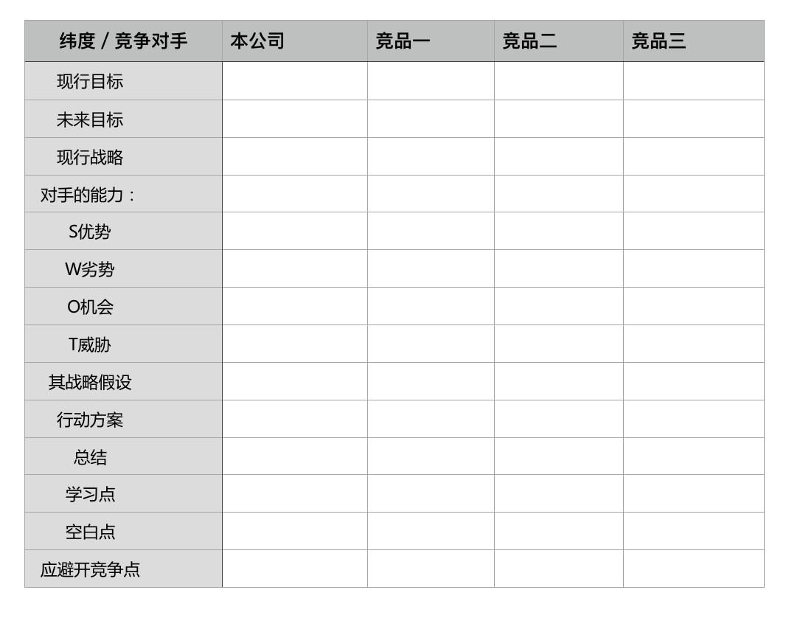
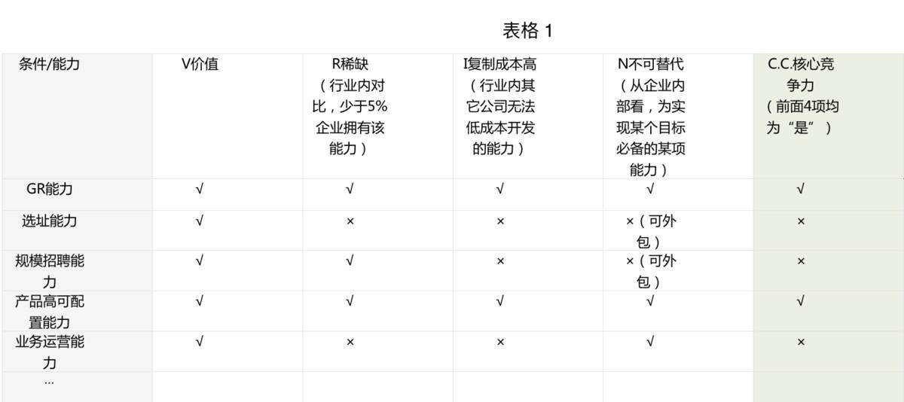

## SaaS公司战略梳理框架 | SaaS创业路线图（36）  

> 发布: 吴昊@SaaS  
> 发布日期: 2019-01-29  

作者介绍 - 吴昊，SaaS创业顾问，纷享销客天使投资人、前执行总裁，7年SaaS营销团队创新、20年企业信息化经验。目前在为SaaS公司提供产品市场定位、营销策略及组织发展三方面的战略咨询。

点击查看[\#SaaS创业路线图\#](https://36kr.com/user/1308477002)系列文章

在大脑中具备一个战略指导框架，每当内外部情况发生变化或者阶段工作完成时，都把这个框架拿出来复盘，以此来保障公司的战略目标能够实际达成，并能够及时为下属做出持续、稳定的指导。

今天我结合SaaS企业实操拿出这个经典战略框架供大家参考。有愿望培养自己战略能力的同学，可以用1、2个小时把自己公司的情况套进来用用。

这个月我在中欧EMBA班上听蔡舒恒教授和Richard Carney教授讲战略管理，蔡教授提出“战略制定6步法”，我收获不小。

想到自己在做SaaS行业的战略咨询，很值得为SaaS创业者们梳理一个“SaaS公司战略框架”出来。

临近春节，各位可以趁难得的清空时间，安安静静做个公司的战略梳理。

### 一、何谓战略？

战略就是与众不同地为客户提供价值。要么做完全不同的事情，要么用完全不同的方式做同样的事情。

简而言之，战略就是“与其更好，不如不同”。

### 二、制定战略的步骤

#### 第一步，发现问题。通过聚焦、收窄，发现公司面临的关键问题。

SaaS公司面临的问题经常是：（初期）客户认可但不愿意付钱、销售打法各式各样难以协同行动、（中期）招不到优秀人才、带不好团队、（成熟期）无法完成自我升级、竞品太多陷入恶性竞争......每家情况不一样，需要聚焦到最想解决的1、2个问题上。

#### 第二步，找到目前的定位。这包括：

1、目标客户群体、特征（用户画像）。

这里我建议越是早期越要聚焦。举例来说，做个通用OA，目标客户确实广阔，但各行各业客户的需求难以聚焦、市场上已经有免费轻量级产品的巨头，也有大量做给大客户做定制开发的项目公司，即便产品做地再牛，未来也是无法开展营销工作的。

2、用户需求：包括当前需求、显性需求、隐性需求、潜在需求（待挖掘）、未来的需求（对趋势的判断）。

对B端客户来说，必须先切客户的痛点，解决痒点爽点的产品在企业采购决策链条中会遇到很大困难。

3、提供的产品服务（与需求对应）。

4、如何触达客户？这里要用到经典4P理论（Product产品\Price价格\Place渠道\Promotion推广），我不详述了。营销方面推荐大家看看最经典的《营销管理》\(科特勒\)。

5、企业DNA：愿景、使命、价值观、文化。

这通常与创始人绑定在一起。创始人除了背景，善于吸纳建议、有敢于决断的性格、正心诚意的品行都很重要。只把创业当做2、3年的生意，这样的人是无法吸引到优秀人才、也无法走长远的。

#### 第三步，分析数据和证据。

A、外部环境分析。

a\)宏观环境：每隔一段时间就需要做一次S.T.E.P.分析。

i.S社会文化：企业数量、行业结构、目标客户群体的采购流程、商业文化、企业整体管理水平。

ii.T技术：IoT、AI等新技术、新技术渗透率、普及率、趋势、生命周期

iii.E经济：社会经济发展情况、支付能力、融资环境

iv.P政治：区域的政策、法规、政府机构执行力

列下相应数据和信息后，要形成“机会”和“威胁”两方面的分析结论。

b\)所在SaaS领域分析（在准备进入、准备退出、或行业政策突变时执行），这里推荐使用“波特五力模型”。

这个波特5力模型分析，得到的结论是关于行业整体利润率的。

举个例子说，从1985~2013近30年的美国各行业盈利能力分析数据可以看到，医药行业利润率一直居于前列（大约是20%）。为什么？因为美国只有几个医药巨头，研发药品的技术和政策门槛很高，缺乏新进入者，而他们面对的客户是大量零散的医院，医药公司掌握了定价权。

再看看这三十年都很悲催的航空业（利润率-7%~1%），他们面对的客户群体倒是很分散，但进入门槛不高，竞争者众多；而上游主要供应商只有两家（波音和空客），航空公司购买主要资产的议价权很弱......

SaaS是横跨所有行业的，所以并不能把SaaS作为一个行业进行分析。但为了引导大家思考，我从通用特征为例分析一下：

1、现有竞争者：比较成熟的B端CRM、C端CRM、HR、OA等领域，每个细分行业大约有1~3个头部SaaS公司和众多中小创业企业。还有大量的其它领域，还没有出现头部企业，但竞争非常激烈。

2、新进入者的威胁：SaaS创业门槛很低，有3、5个工程师就能组局创业。当然，从具体细分领域分析又各不相同。有兴趣的同学可以看看我的另一篇文章《SaaS创业路线图（廿五）护城河在哪里？》。

3、替代品的威胁：传统软件厂商的威胁不大，他们也逐渐往SaaS迁移，但这些企业内部存在新老产品交替的难题，有一个递进过程。

4、买家议价能力：SaaS企业当然希望自己的目标市场呈“橄榄形”，中型买家数量多、需求一致，这样面对买家的议价能力才会更高。如果只有目标行业的几个头部客户，而自己竞争者不少，那议价能力自然很弱。

5、供应商议价能力：SaaS企业的主要成本不是设备费用而是人员成本，和BAT抢人除了薪酬，也要多发挥创业公司自身优势：更多自主决策的机会、更深的股权绑定、更舒适的文化氛围...

原则上波特5力行业分析模型是进入和决策退出时才用，但如果你的公司在进入时没有做过，也可以趁此机会做一次分析。

c\)竞争对手分析

可以列一个表格，将竞争对手的多个维度信息总结出来，更重要的是列出：学习点、空白价值点（或区域）、应避开竞争的价值点（或区域）。给大家一个应用表格：

d\)
区域选择：使用波特钻石模型

该模型用于进入新区域市场，要考虑的要素有：

* 要素条件（基础设施、劳动力等）

* 需求条件（当地需求规模、成熟度）

* 相关行业（供应商及相关行业中企业的实力）

* 当地企业的战略、结构和竞争状况

* 政府因素

* 偶发事件（例如当地将举办大型展会可以带来更多客流等）

B、内部环境分析

每年应进行一次内部资源、能力、核心竞争力的价值链分析。这里给出另一个分析表格：

* V、R、I、N四项均为√的，就是公司的核心竞争力；如果有三项，则要设法努力将另一项也变为“√”。

#### 第四步，战略制定。

基于公司现有资源的限制和公司的核心竞争力，我们来做业务战略、公司战略及合作战略。

1、业务战略

经典战略管理里，业务战略选择有两个维度，聚焦（细分市场）vs不聚焦，成本领先vs 差异化。

我认为在SaaS创业公司里，聚焦很关键。做通用产品的，也要尝试聚焦1、2个行业，在行业应用场景上增强自己产品的价值点；做行业产品的，为了加强自己的护城河，也可以考虑再往下一层，选择更深的头部细分行业。

如何选择行业市场并深入挖掘，可以参考我的同系类文章《SaaS创业路线图（十四）如何开拓行业走的弯路最少？》

差异化与成本领先在一个SaaS公司创业过程中，是有先后关系的。初期建议走差异化路线，如果已经看到一个低门槛的行业SaaS市场里有一堆竞品，那就不要进了。

资源不充足的创业公司一定要找一个新领域。

等到公司发展壮大了，这时候有了产品研发、市场宣传、销售团队的规模效应，再玩“成本领先”，把价格控制到让新进入者无法挣钱，也是个有战略意义的选择。

当然，还是那句话，每家企业及其所在市场情况不同，大家分析后选择。

2、公司战略

公司战略包括对多元化的考虑（分为相关业务多元化和非相关多元化）、资本运作（合并、收购、接管）和国际化战略。

这一块咱们国内SaaS公司涉及的比较少，我就不赘述了。

3、合作战略

如果与外部企业合作，要注意自己前表中的核心竞争力（C.C.）是否会被减弱或外流？

#### 第五步，战略评估。

需要把各个战略任务进行打分评估，考虑条件包括：预算投入、预期回报、实施速度、实施难度、风险、迫切性（每个条件应该有个权重）。选择总分高的作为近期战略工作重点，得分低但确实有必要的，做为中长期战略工作。

#### 第六步，战略实施。

根据SMART原则将战略任务拆解到计划表中（可以用甘特图的形式），然后通过PDCA（计划-实施-监控-调整）的闭环方法不断改进和调整，以期达到战略目标。

#### 结束语：

前2天和老同事聊天，有高人提到这样一个企业高管的思维方式：在大脑中具备一个战略指导框架，每当内外部情况发生变化或者阶段工作完成时，都会把这个框架拿出来复盘，以此来保障能及时发现问题，并能够为下属做出持续、稳定的指导。
