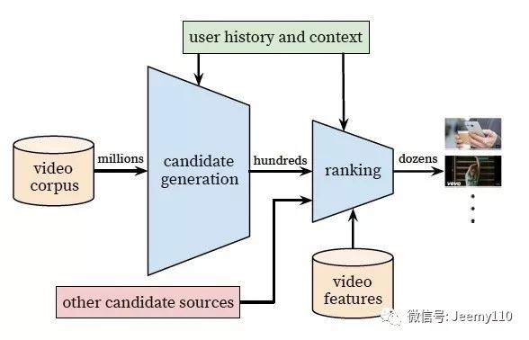

## YouTube深度学习推荐系统的十大工程问题  

> 王喆  
> 作者: 机器学习算法工程师  
> 发布日期: 2019-01-23  

作者：王   喆

编辑：陈人和

**前  言**

这里是王喆的机器学习笔记 的第三篇文章，这篇文章紧接着上篇文章 《重读YouTube深度学习推荐系统论文，字字珠玑，惊为神文》，如果没有读过的同学还是强烈建议从我的专栏中翻出上一篇文章看一下，熟悉文章中抛出的问题。

因为这篇文章主要介绍了YouTube深度学习系统论文中的十个工程问题，为了方便进行问题定位，我们还是简单介绍一下背景知识，简单回顾一下 Deep Neural Networks for YouTube Recommendations 中介绍的YouTube深度学习推荐系统的框架。

简单讲，YouTube的同学们构建了两级推荐结构从百万级别的视频候选集中进行视频推荐，第一级candidate generation model负责“初筛”，从百万量级的视频库中筛选出几百个候选视频，第二级ranking model负责“精排”，引入更多的feature对几百个候选视频进行排序。

不管是candidate generation model还是ranking model在架构上都是DNN的基本结构，不同的是输入特征和优化目标不同。但正如我在上一篇文章中讲的，如果你仅读懂了YouTube的模型架构，至多获得了30%的价值，剩下70%的价值就在于下面的十大工程问题。废话不多说，我们进入问题的解答。

**问题1：**

**文中把推荐问题转换成多分类问题，在预测next watch的场景下，每一个备选video都会是一个分类，因此总共的分类有数百万之巨，这在使用softmax训练时无疑是低效的，这个问题YouTube是如何解决的？**

这个问题原文的回答是这样的

We rely on a technique to sample negative classes from the background distribution \("candidate sampling"\) and then correct for this sampling via importance weighting.

简单说就是进行了负采样（negative sampling）并用importance weighting的方法对采样进行calibration。文中同样介绍了一种替代方法，hierarchical softmax，但并没有取得更好的效果。当然关于采样的具体技术细节以及优劣可能再开一篇文章都讲不完，感兴趣的同学可以参考tensorflow中的介绍（https://www.tensorflow.org/extras/candidate\_sampling.pdf）以及NLP领域的经典论文 （http://www.aclweb.org/anthology/P15-1001）

也欢迎有相关经验的同学在评论中给出简明的回答。

**问题2：**

**在candidate generation model的serving过程中，YouTube为什么不直接采用训练时的model进行预测，而是采用了一种最近邻搜索的方法？**

这个问题的答案是一个经典的工程和学术做trade-off的结果，在model serving过程中对几百万个候选集逐一跑一遍模型的时间开销显然太大了，因此在通过candidate generation model得到user 和 video的embedding之后，通过最近邻搜索的方法的效率高很多。我们甚至不用把任何model inference的过程搬上服务器，只需要把user embedding和video embedding存到redis或者内存中就好了。

但这里我估计又要求助场外观众了，在原文中并没有介绍得到user embedding和video embedding的具体过程，只是在架构图中从softmax朝 model serving module那画了个箭头（如下图红圈内的部分），到底这个user vector和video vector是怎么生成的？有经验的同学可以在评论中介绍一下。

Candidate Generation Model, video vector是如何生成的？

**问题3：**

**Youtube的用户对新视频有偏好，那么在模型构建的过程中如何引入这个feature？**

为了拟合用户对fresh content的bias，模型引入了“Example Age”这个feature，文中其实并没有精确的定义什么是example age。按照文章的说法猜测的话，会直接把sample log距离当前的时间作为example age。比如24小时前的日志，这个example age就是24。在做模型serving的时候，不管使用那个video，会直接把这个feature设成0。大家可以仔细想一下这个做法的细节和动机，非常有意思。

当然我最初的理解是训练中会把Days since Upload作为这个example age，比如虽然是24小时前的log，但是这个video已经上传了90小时了，那这个feature value就是90。那么在做inference的时候，这个feature就不会是0，而是当前时间每个video的上传时间了。

我不能100%确定文章中描述的是那种做法，大概率是第一种。还请大家踊跃讨论。

文章也验证了，example age这个feature能够很好的把视频的freshness的程度对popularity的影响引入模型中。

从上图中我们也可以看到，在引入“Example Age”这个feature后，模型的预测效力更接近经验分布；而不引入Example Age的蓝线，模型在所有时间节点上的预测趋近于平均，这显然是不符合客观实际的。

**问题4：**

**在对训练集的预处理过程中，YouTube没有采用原始的用户日志，而是对每个用户提取等数量的训练样本，这是为什么？在对训练集的预处理过程中，YouTube没有采用原始的用户日志，而是对每个用户提取等数量的训练样本，这是为什么？**

原文的解答是这样的，

****Another key insight that improved live metrics was to generate a xed number of training examples per user, e ectively weighting our users equally in the loss function. This prevented a small cohort of highly active users from dominating the loss.

理由很简单，这是为了减少高度活跃用户对于loss的过度影响。

**问题5：**

**YouTube为什么不采取类似RNN的Sequence model，而是完全摒弃了用户观看历史的时序特征，把用户最近的浏览历史等同看待，这不会损失有效信息吗？**

这个原因应该是YouTube工程师的“经验之谈”，如果过多考虑时序的影响，用户的推荐结果将过多受最近观看或搜索的一个视频的影响。YouTube给出一个例子，如果用户刚搜索过“tayer swift”，你就把用户主页的推荐结果大部分变成tayer swift有关的视频，这其实是非常差的体验。为了综合考虑之前多次搜索和观看的信息，YouTube丢掉了时序信息，讲用户近期的历史纪录等同看待。

但RNN到底适不适合next watch这一场景，其实还有待商榷，@严林 大神在上篇文章的评论中已经提到，youtube已经上线了以RNN为基础的推荐模型， 参考论文如下：

https://static.googleusercontent.com/media/research.google.com/en//pubs/archive/46488.pdf

看来时隔两年，YouTube对于时序信息以及RNN模型有了更多的掌握和利用。

**问题6：**

**在处理测试集的时候，YouTube为什么不采用经典的随机留一法（random holdout），而是一定要把用户最近的一次观看行为作为测试集？**

这个问题比较好回答，只留最后一次观看行为做测试集主要是为了避免引入future information，产生与事实不符的数据穿越。

**问题7：**

**在确定优化目标的时候，YouTube为什么不采用经典的CTR，或者播放率（Play Rate），而是采用了每次曝光预期播放时间（expected watch time per impression）作为优化目标？**

这个问题从模型角度出发，是因为 watch time更能反应用户的真实兴趣，从商业模型角度出发，因为watch time越长，YouTube获得的广告收益越多。而且增加用户的watch time也更符合一个视频网站的长期利益和用户粘性。

这个问题看似很小，实则非常重要，objective的设定应该是一个算法模型的根本性问题，而且是算法模型部门跟其他部门接口性的工作，从这个角度说，YouTube的推荐模型符合其根本的商业模型，非常好的经验。

我之前在领导一个算法小组的时候，是要花大量时间与Business部门沟通Objective的设定问题的，这是路线方针的问题，方向错了是要让组员们很多努力打水漂的，一定要慎之又慎。

**问题8：**

**在进行video embedding的时候，为什么要直接把大量长尾的video直接用0向量代替？**

这又是一次工程和算法的trade-off，把大量长尾的video截断掉，主要还是为了节省online serving中宝贵的内存资源。当然从模型角度讲，低频video的embedding的准确性不佳是另一个“截断掉也不那么可惜”的理由。

当然，之前很多同学在评论中也提到简单用0向量代替并不是一个非常好的选择，那么有什么其他方法，大家可以思考一下。

**问题9：**

**针对某些特征，比如\#previous impressions，为什么要进行开方和平方处理后，当作三个特征输入模型？**

这是很简单有效的工程经验，引入了特征的非线性。从YouTube这篇文章的效果反馈来看，提升了其模型的离线准确度。

**问题10：**

**为什么ranking model不采用经典的logistic regression当作输出层，而是采用了weighted logistic regression？**

因为在第7问中，我们已经知道模型采用了expected watch time per impression作为优化目标，所以如果简单使用LR就无法引入正样本的watch time信息。因此采用weighted LR，将watch time作为正样本的weight，在线上serving中使用e\(Wx+b\)做预测可以直接得到expected watch time的近似，完美。

十个问题全部答完，希望对大家有帮助。其实在上一篇文章抛出这十个问题的时候，已经有诸位大神做出了很好的回答，感谢 @做最闲的咸鱼@严林@吴海波。最后增加一个思考环节，大家可以讨论一下下面的问题：

1. 本论文中，用于 candidate generation网络serving部分的user embedding vector和video embedding vector是怎么生成的？

2. Example age这个feature的定义到底是什么？

3. 除了用0向量embedding替代长尾内容，有没有其他好的方法？

这里是 王喆的机器学习笔记 的第三篇文章，水平有限，不对之处欢迎吐槽、拍砖。下一篇文章我们一起讨论一下Airbnb的搜索推荐系统和embedding方法，如果大家有兴趣欢迎点赞鼓励。

**END**

往期回顾

【1】 [为什么说算法工程师的面试是一门玄学？](http://mp.weixin.qq.com/s?__biz=MzUyMjE2MTE0Mw==&mid=2247487346&idx=1&sn=8e5f958d5af9b02aca3f57988961751e&chksm=f9d151eacea6d8fcb68e86c2d738ad7a59a2c7091791380061aa0fdedac9083b5f3372ee2a1e&scene=21#wechat_redirect)

【2】[万物皆Embedding，从经典的word2vec到深度学习基本操作item2vec](http://mp.weixin.qq.com/s?__biz=MzUyMjE2MTE0Mw==&mid=2247487329&idx=1&sn=93d559017e3f3637547d7600a3c82df3&chksm=f9d151f9cea6d8efa28cfa92aa25560d6989993de36452a4c12b8108b5f63d5351c7de299f24&scene=21#wechat_redirect)

【3】[《Computer&nbsp;vision》笔记-GoodLeNet（3）](http://mp.weixin.qq.com/s?__biz=MzUyMjE2MTE0Mw==&mid=2247487349&idx=2&sn=06016388e317e06da8ccc581c59a9c08&chksm=f9d151edcea6d8fb1c791a341adea98b45604caf6f508632632b4b39cf567ee85830e70457fc&scene=21#wechat_redirect)

【4】[《从零开始学习自然语言处理\(NLP\)》&nbsp;-基础准备\(0\)](http://mp.weixin.qq.com/s?__biz=MzUyMjE2MTE0Mw==&mid=2247487336&idx=1&sn=199e6a3be565fd81bda7a4bf29e873d4&chksm=f9d151f0cea6d8e639ecec9413386cd2ecc25fb771a2a9ebc3a216712838fd2828b03933c909&scene=21#wechat_redirect)

【5】 [GAN--提升GAN训练的技巧汇总](http://mp.weixin.qq.com/s?__biz=MzUyMjE2MTE0Mw==&mid=2247487298&idx=1&sn=15ee936369ec1ea329fda7ebd0aaa7de&chksm=f9d151dacea6d8cc80ec3f1de7b4de9da5c801dcdc9abad577032e83213798447a9aea007361&scene=21#wechat_redirect)

