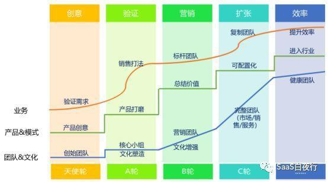

## 再谈商业模式：SaaS公司应该做IT工具还是业务运营？  

> 发布: 贾强@36氪陕西  
> 发布日期: 2019-01-02  

编者按：本文来自“[人人都是产品经理](http://www.woshipm.com/chuangye/1797104.html)”，作者：吴昊@SaaS；36氪经授权转载。

都说所有行业都将被互联网思维重写，具体怎么做？本文从SaaS领域的角度做出实操性探讨。

但通往成功的门都是窄的，能够钻过去的都要脱几层皮，就如蝴蝶破茧。围绕既有优势，补齐不足能力，完成自己的使命，不断挣扎、不断进取，这正是创业者的宿命。

SaaS创业路线图：

原计划这篇应该接着第29篇，以“决策会”为例写“不同阶段的管理方式升级”。但我突然决定这第30篇写点儿更high level（顶层设计）的东西。

事情源于前2天晚上，我和一个朋友吃饭聊了2个半小时。他有一个SAP实施及定制开发IT公司，手里有某行业的几个头部客户，营收、利润都比咱们大部分SaaS公司强。

现在有大客户希望能和他做IT外包的合作，拿出每年营收的2%，将全公司的IT系统开发、IT运营都包给他。这个行业的腰部及以上公司营收在20亿到200亿之间，所以这2%意味着4000万~4亿的客单收入（当然体量大的客户议价能力强，并且IT投入增长速度比营收规模增长速度慢，所以大客户的IT外包费用比例可能会低不少）。

我今年一直在观察和参与SaaS领域的新模式设计，对这事儿非常感兴趣。当晚我就隐藏了该公司的敏感信息，和SaaS圈的大神们聊了起来。

首先大家担忧的是，不仅国内没有，美国也没有这样的模式。那我们先谈第一个问题：

### 一、为什么CopytoChina在SaaS领域失效？

因为商业环境、企业管理水平明显不同。

在美国企业里，大量员工有IT基础，他们会自己找SaaS工具来用。所以SaaS公司做好产品就行了，做得好自然会有增长。

而中国企业里的做法一般是，有需求后很快找来几个熟悉的供应商或系统集成商，要求他们提供解决方案，做一个“交钥匙”工程。我们看到SaaS圈里做工具SaaS的大部分明星企业，无论是北森、纷享销客，还是神策数据现在都走这条解决方案之路。（这条路是否会成功，我今天不展开，今后找机会单独写一篇。）

所以我说，美国成功的模式在中国未必成功，美国尚未出现的模式其实在中国可能会超前出现。toC领域这个现象已经有不少案例，toB领域里也必然会出现。

举个例子：对大宗IT采购来说，中国与美国商业环境上最大的不同是潜规则泛滥（我瞎估计的，如果有人能证明不是这样，欢迎提供证据）。这样的情况下，按企业营收固定比例作为IT外包的费用，也许未来是一个可行的趋势。

可以想象，营收20亿的公司，拿出4000万给IT公司，IT公司自己已经装到兜里的钱自己不会浪费，反而会都花到刀刃上，不断提供更好的服务。因为这时IT公司关注的不再是“如何让使用者满意？如何能够通过验收？”，而是“如何让客户公司的营收增长？”

这个服务如果仅仅是IT服务，客户营收增长到200亿时，肯定是不会再给2%的，这个服务一定是与业务紧紧绑定在一起的业务+IT运营服务。这正是我要谈的第2点：

### 二、IT公司业务化的问题

这也和商业环境及企业管理水平有关。我认为IT公司业务化也是一个大趋势。

中国软件行业苦B这么多年，应该醒过来了。你只是个卖“铲子”的，凭什么和客户分挖出来的金矿？不去帮助企业多赚钱的模式，在中国明显发展速度有限。

那些“管理工具SaaS”只有走到平台阶段才有爆发增长的机会。如何爆发？还是因为你的PaaS上长出了能帮企业增加客户、增加营收的SaaS。PaaS做平台的不会做深行业，但PaaS上面长出的行业SaaS可以。

所以，如果有一个坚持在同一个行业里做ERP实施和定制开发十几年的公司，她的团队非常懂这个行业的业务，为什么不能做业务运营呢？

有朋友提出，这会不会越界了？你一个做IT的，跑去做运营，不专业嘛。那我要谈第3点：

### 三、未来企业里，IT技术就是核心竞争力

这一点在阿里、京东、美团、今日头条都可以看到，他们不是电商公司、不是外卖公司、不是媒体公司，从大量研发人员构成看，他们都是IT（信息技术）公司！

未来的趋势是AI、物联网、SaaS等技术与业务运营的结合，新技术将带来新竞争力。

可以预见，未来我们大量需要一种人，就是既懂业务，又懂IT技术的人。目前这样的人很稀少。

有两个途径获得他们：要么让懂IT的学业务，要么让懂业务的学IT（这个貌似更难）。不仅仅是上课学，得在实战中学。

从这个角度说，一个懂行业业务的IT公司，参与到企业运营中，意义巨大。

回到我们这个实际案例上。我是做战略及营销顾问的，咨询过程中我提供了这样的建议：

* 我觉得他们最大的风险就是拿客户营收的2%，到底能否提供足够价值？有没有能力持续提供这样的价值？不能延续的收入对企业意义甚小。

* 至于初期投入方面，肯定是需要资金的，要有好的资本运作方式，保障初期资金够用。（这家企业在资本方面已经有很好的机遇）。

* 另外，感谢SaaS圈大神们的建议，他们提醒在与客户的合同中约定好解约和退出条件。

* 从上帝视角观察，一个这样的IT代运营公司如果能服务5家企业，每家4000万，就能拿2亿，这可以做很多业务与技术结合的创新。这5家企业得到的就不是4000万的价值，而是1~2亿的价值了。那些没有加入进来的企业，会有陷入技术竞争劣势的紧迫感。

* 从更长远考虑，该行业的客户会逐渐只管设计、制造和品牌了，销售渠道、销售人员和IT其实都可以外包。能够承担这个使命的公司（明显这已经不是个IT公司），将会用新技术重新改写这个行业。

最后，我们再思考一下标题里这个问题：SaaS公司应该做IT工具还是业务运营？

如果有机会做业务运营，我认为不应该放弃这样的机会，当然商业风险要具体评估。

如果目前的能力只擅长做工具SaaS，也有很多其它的成功可能性，也许有机会做成通用PaaS或其他类型行业内的小平台，也许可以做一些增值业务以辅助者的角色出现在客户业务中（常见的是金融业务），也许可以一直做一个小而美的公司。

所有行业都将被互联网思维重写。但通往成功的门都是窄的，能够钻过去的都要脱几层皮，就如蝴蝶破茧。围绕既有优势，补齐不足能力，完成自己的使命，不断挣扎、不断进取，这正是创业者的宿命。
