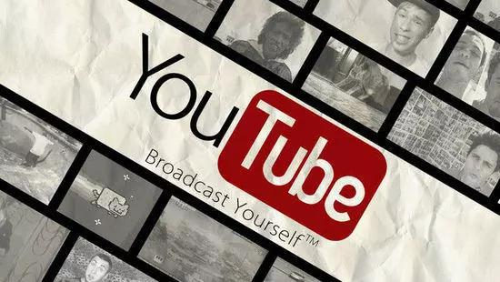
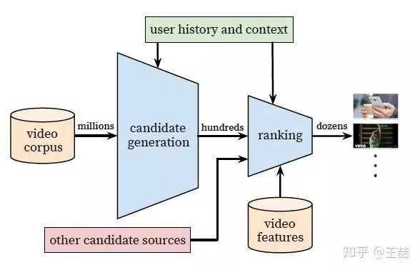
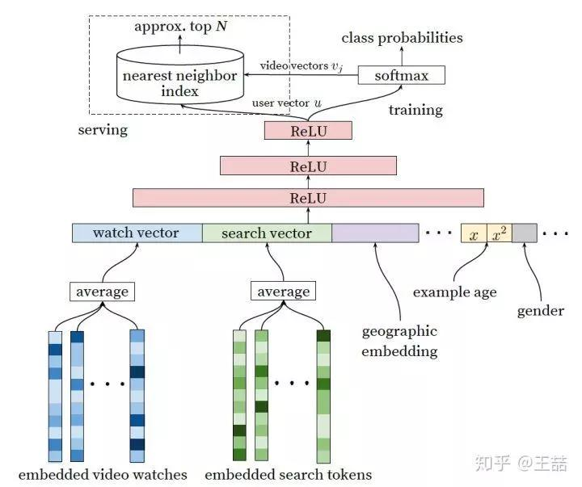
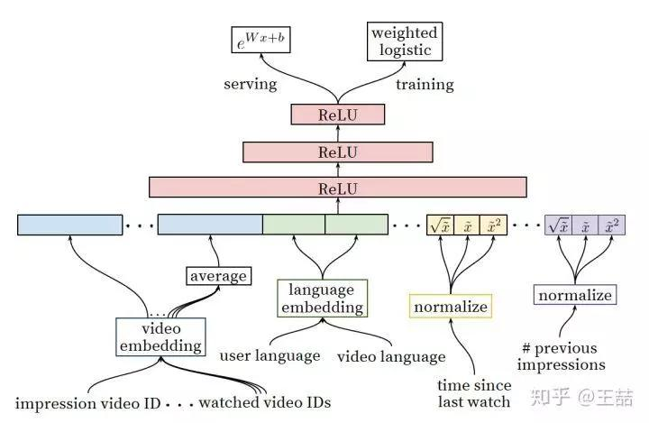

## 重读Youtube深度学习推荐系统论文，字字珠玑，惊为神文  

> 论文导读  
> 作者: AI前线  
> 发布日期: 2019-01-06  

 来源 | 授权转载自王喆的机器学习笔记  作者 | 硅谷高级机器学习工程师 王喆  编辑 | Vincent  **AI 前线导读：** 2016 年，Youtube 发布了一篇深度推荐系统论文《Deep Neural Networks for YouTube Recommendations》，按照今天的标准来看，已经没有什么新颖的地方。但是本文作者在重读这篇论文之后，竟然再次发现了诸多亮点，AI 前线论文导读第 64 篇，来自硅谷的高级机器学习工程师王喆将为你解析这篇论文的亮点所在。

**更多优质内容请关注微信公众号“AI 前线”（ID：ai-front）**

这周我们一起讨论一下 Youtube 的深度推荐系统论文《Deep Neural Networks for YouTube Recommendations》，这是 2016 年的论文，按照今天的标准来看，已经没有什么新颖的地方，我也是两年前读过这篇文章之后就放下了，但前几天重读这篇文章，竟让发现了诸多亮点，几乎处处是套路，处处是经验，不由惊为神文。这篇神文给我留下的深刻印象有两点：

* 这毫无疑问是工业界论文的典范，是我非常推崇的工程导向的，算法工程师必读的文章；

* 我以为毫不起眼的地方，也藏着 Youtube 工程师宝贵的工程经验，相比上周介绍的阿里的深度兴趣网络 DIN，最重要的价值就在于 Attention 机制，这篇文章你应该精确到句子来体会，这是我惊为神文的原因。

废话不多说，下面就跟大家分享一下两次拜读这篇论文的不同体验和收获。

> 论文地址：https://github.com/wzhe06/Reco-papers/blob/master/Recommendation/Deep%20Neural%20Networks%20for%20YouTube%20Recommendations.pdf

第一遍读这篇论文的时候，我想所有人都是冲着算法的架构去的，在深度学习推荐系统已经成为各大公司“基本操作”的今天，Youtube 在算法架构上并无惊奇之处，我们来快速介绍一下文章中的深度学习推荐系统的算法架构。

Youtube 的用户推荐场景自不必多说，作为全球最大的 UGC 的视频网站，需要在百万量级的视频规模下进行个性化推荐。由于候选视频集合过大，考虑 online 系统延迟问题，不宜用复杂网络直接进行推荐，所以 Youtube 采取了两层深度网络完成整个推荐过程：

* 第一层是 Candidate Generation Model 完成候选视频的快速筛选，这一步候选视频集合由百万降低到了百的量级。

* 第二层是用 Ranking Model 完成几百个候选视频的精排。

首先介绍 candidate generation 模型的架构

Youtube Candidate Generation Model

我们自底而上看这个网络，最底层的输入是用户观看过的 video 的 embedding 向量，以及搜索词的 embedding 向量。至于这个 embedding 向量是怎么生成的，作者的原话是这样的

> Inspired by continuous bag of words language models, we learn high dimensional embeddings for each video in a xed vocabulary and feed these embeddings into a feedforward neural network

> 所以作者是先用 word2vec 方法对 video 和 search token 做了 embedding 之后再作为输入的，这也是做 embedding 的“基本操作”，不用过多介绍；当然，除此之外另一种大家应该也比较熟悉，就是通过加一个 embedding 层跟上面的 DNN 一起训练，两种方法孰优孰劣，有什么适用场合，大家可以讨论一下。

特征向量里面还包括了用户的地理位置的 embedding，年龄，性别等。然后把所有这些特征 concatenate 起来，喂给上层的 ReLU 神经网络。

三层神经网络过后，我们看到了 softmax 函数。这里 Youtube 的同学们把这个问题看作为用户推荐 next watch 的问题，所以输出应该是一个在所有 candidate video 上的概率分布，自然是一个多分类问题。

好了，这一套深度学习的“基本操作”下来，就构成了 Youtube 的 candidate generation 网络，看似平淡无奇，其实还是隐藏着一些问题的，比如：

1. 架构图的左上角，为什么在 online serving 的时候不直接用这套网络进行预测而要使用 nearest neighbor search 的方法？

2. 多分类问题中，Youtube 的 candidate video 有百万之巨，意味着有几百万个分类，这必然会影响训练效果和速度，如何改进？

这些问题在读第一遍的时候我也没有深想深看，但却是工程实现中必然会遇到的问题，我们随后再深入介绍论文中的解决方法。

既然得到了几百个候选集合，下一步就是利用 ranking 模型进行精排序，下面是 ranking 深度学习网络的架构图。

Youtube Ranking Model

乍一看上面的 ranking model 似乎与 candidate generation 模型没有什么区别，模型架构还是深度学习的“基本操作”，唯一的区别就是特征工程，那么我们就讲讲特征工程。

事实上原文也明确说明了，引入另一套 DNN 作为 ranking model 的目的就是引入更多描述视频、用户以及二者之间关系的特征，达到对候选视频集合准确排序的目的。

> During ranking, we have access to many more features describing the video and the user's relationship to the video because only a few hundred videos are being scored rather than the millions scored in candidate generation.

> 具体一点，从左至右的特征依次是：

1.  **impression video ID embedding** ：当前要计算的 video 的 embedding；

2.  **watched video IDs average embedding** ：用户观看过的最后 N 个视频 embedding 的 average pooling；

3. language embedding：用户语言的 embedding 和当前视频语言的 embedding；

4.  **time since last watch** ：自上次观看同 channel 视频的时间；

5. \#previous impressions：该视频已经被曝光给该用户的次数。

上面五个特征中，我想重点谈谈第 4 个和第 5 个。因为这两个很好的引入了对用户行为的观察。

第 4 个特征背后的思想是

> We observe that the most important signals are those that describe a user's previous interaction with the item itself and other similar items.

> 有一些引入 attention 的意思，这里是用了 time since last watch 这个特征来反应用户看同类视频的间隔时间。从用户的角度想一想，假如我们刚看过“DOTA 经典回顾”这个 channel 的视频，我们很大概率是会继续看这个 channel 的视频的，那么该特征就很好的捕捉到了这一用户行为。

第 5 个特征 \#previous impressions 则一定程度上引入了 exploration 的思想，避免同一个视频持续对同一用户进行无效曝光。尽量增加用户没看过的新视频的曝光可能性。

至此，我的第一遍论文阅读就结束了，对 Youtube 的算法框架有了概念，但总觉得不过如此，没什么太多新颖的地方。。

但如果真这么想，还是太 naive 了，与上一篇阿里的深度兴趣网络 DIN 不同的是，你读懂了 DIN 的 attention 机制，你就抓住了其论文 70% 的价值，但这篇文章， **如果你只读懂了 Youtube 的推荐系统架构，你只抓住了 30% 的价值** 。那么剩下的 70% 的价值在哪里呢？

在重读这篇文章的时候，我从一个工程师的角度，始终绷着“如何实现”这根弦，发现这篇论文的工程价值之前被我大大忽略了。下面我列出十个文中解决的非常有价值的问题：

1. 文中把推荐问题转换成多分类问题，在 next watch 的场景下，每一个备选 video 都会是一个分类，因此总共的分类有数百万之巨，这在使用 softmax 训练时无疑是低效的，这个问题 Youtube 是如何解决的？

2. 在 candidate generation model 的 serving 过程中，Youtube 为什么不直接采用训练时的 model 进行预测，而是采用了一种最近邻搜索的方法？

3. Youtube 的用户对新视频有偏好，那么在模型构建的过程中如何引入这个 feature？

4. 在对训练集的预处理过程中，Youtube 没有采用原始的用户日志，而是对每个用户提取等数量的训练样本，这是为什么？

5. Youtube 为什么不采取类似 RNN 的 Sequence model，而是完全摒弃了用户观看历史的时序特征，把用户最近的浏览历史等同看待，这不会损失有效信息吗？

6. 在处理测试集的时候，Youtube 为什么不采用经典的随机留一法（random holdout），而是一定要把用户最近的一次观看行为作为测试集？

7. 在确定优化目标的时候，Youtube 为什么不采用经典的 CTR，或者播放率（Play Rate），而是采用了每次曝光预期播放时间（expected watch time per impression）作为优化目标？

8. 在进行 video embedding 的时候，为什么要直接把大量长尾的 video 直接用 0 向量代替？

9. 针对某些特征，比如 \#previous impressions，为什么要进行开方和平方处理后，当作三个特征输入模型？

10. 为什么 ranking model 不采用经典的 logistic regression 当作输出层，而是采用了 weighted logistic regression？

因为我也是在视频推荐领域工作，所以可以很负责任的说以上的十个问题都是非常有价值的。

参考资料

*  **Deep Neural Networks for YouTube Recommendation** ：https://github.com/wzhe06/Reco-papers/blob/master/Recommendation/Deep%20Neural%20Networks%20for%20YouTube%20Recommendations.pdf

*  **Recommender System Paper List** ：https://github.com/wzhe06/Reco-papers

*  **推荐系统中的注意力机制——阿里深度兴趣网络（DIN）** ：https://zhuanlan.zhihu.com/p/51623339
