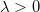

## GAN模式崩溃的理论解释  

> 顾险峰  
> 作者: 老顾谈几何  
> 发布日期: 2019-02-12  

【2019年1月18-21日，丘成桐先生和老顾在哈佛大学数学科学与应用中心组织题为“人工智能的几何分析方法”的会议。会议对外免费开放，欢迎注册参加。会议网址为：http://cmsa.fas.harvard.edu/geometric-analysis-ai/，多数演讲者的演讲稿已经放在网页上。

哈佛大学数学科学与应用中心（Harvard University， Center of Mathematical Sciences and Applications）目前正在招聘AI方向的博士后。敬请各位老师、同学们推荐和自荐，与老顾直接联系：gu@cmsa.fas.harvard.edu. 】

春节前夕，北美遭遇极端天气，在酷寒中老顾来到哈佛大学探望丘成桐先生。新春佳节，本是普天同庆的日子，但对于孤悬海外的游子而言，却是最为凄凉难耐。远离父母亲朋，远离故国家园，自然环境寒风凛冽，飞雪漫天，社会环境疏离淡漠，冷清寂寥。在波士顿见到导师和朋友，倍感欣慰。老顾曾经辅导过的Kylie刚刚从哈佛毕业。哈佛本科生的主流一般选择进入华尔街的金融公司，Kylie却特立独行地选择了教育。老顾辅导过的Simon刚刚被哈佛录取，矢志投身数学。在查尔斯河畔的LegalSeafood, Kylie给了Simon很多在哈佛求学的建议。看到弟子们的茁壮成长，老顾不禁感慨万千：时光荏苒，昭华流逝，人生苦短，择英才而教之，生命才会更有意义！

老顾和哈佛大学统计系的刘军教授交流，刘教授告诉老顾最近有麻省理工的学者来哈佛寻求教职，求职学术演讲的主题就是最优传输理论在深度学习中的应用。由此可以，深度学习的最优传输理论解释逐渐被广泛接受。在哈佛大学的数学科学与应用中心（Harvard CMSA），丘先生和老顾进一步探讨深度学习中对抗生成网络和蒙日-安培方程理论的关系。遥想二十多年前，老顾刚刚投到丘先生门下的时候，丘先生教给老顾的第一个几何分析的利器就是蒙日-安培方程理论（Monge-Ampere Equation）。那时，老顾在麻省理工大学学习机器视觉课程，需要求解闵科夫斯基（Minkowski）问题，即利用高斯曲率反求曲面形状。丘先生指导老顾用蒙日-安培方程来解决这一问题。当时无论如何也无法想象二十多年后，这一理论会在深度学习领域发挥重要作用。近些年来，深度学习的革命几乎席卷了整个计算机科学领域，尤其是这两年来对抗生成网络模型（GAN）石破天惊、一骑绝尘，而蒙日-安培理论恰好可以为GAN提供强有力的理论支持。多少年来，丘先生一直强调基础理论的重要性，他曾经多次说道：“人类历史上技术的本质发展都是来自基础理论的重大突破，基础理论突破后往往经过数十年才会被工程技术领域所领会吸收。因此，对于科学的发展应该持有长远的观点，不能急功近利。”在老顾数十年的学术生涯中，多次见证了丘先生所预言的情形发生，例如陈类之于拓扑绝缘体，证明庞加莱猜测的黎奇曲率流（Ricci FLow）之于医学图像。目前，老顾和很多合作者们倾向于认为蒙日-安培理论，最优传输理论对深度学习的发展会起到实质性作用，并为之孜孜以求。这次和丘先生主要讨论蒙日-安培方程正则性理论关于GAN模型中模式崩溃（Mode Collapse）的解释，细节请见论文【1】。

**模式崩溃 （Mode Collapse）
**

对抗生成网络被广泛应用于图像生成领域，比较常用的有超分辨率，图像翻译，卡通人物生成，人体姿态生成，年龄变换，风格变换等等，超乎想象，精彩纷呈。另一方面，GAN模型训练困难，变化无常，神秘莫测。由于其强烈的不稳定性，目前难以大规模实用。

图1. MNIST数据集 tSNE 嵌入在平面上，10个团簇对应着10个模式（modes）。模式崩溃（Mode Collapse）指生成模型只生成其中的几种模式。

如图1所示，给定数据集合，我们用编码映射将其映入隐空间中，每个数字对应一个团簇，即MNIST数据的概率分布密度函数具有多个峰值，每个峰值被称为是一个模式（mode）。理想情况下，生成模型应该能够生成10个数字，如果只能生成其中的几个，而错失其它的模式，则我们称这种现象为模式崩溃（mode collapse）。

具体而言，GAN训练中经常出现如下三个层次的问题：

1. 训练过程难以收敛，经常出现震荡；实验结果随机，难以复现；

2. 训练收敛，但是出现模式崩溃（Mode Collapse）。例如，我们用MNIST数据集训练GAN模型，训练后的GAN只能生成十个数字中的某一个；或者在人脸图片的实验中，只生成某一种风格的图片。

3. 用真实图片训练后的GAN模型涵盖所有模式，但是同时生成一些没有意义、或者现实中不可能出现的图片。

我们将这些现象笼统称为广义的模式崩溃问题。如何解释模式崩溃的原因，如何设计新型算法避免模式崩溃，这些是深度学习领域的最为基本的问题。我们用最优传输中的Brenier理论，和蒙日-安培方程（Monge-Ampere）的正则性（regularity）理论来解释模式崩溃问题。

**GAN和蒙日-安培方程
**

我们以前讨论过对抗生成网络的[最优传输观点](http://mp.weixin.qq.com/s?__biz=MzA3NTM4MzY1Mg==&mid=2650814604&idx=1&sn=2c8765becfe9df06e33ee6c4ed59792f&chksm=8485ce87b3f24791707d181b9aabda2f4a7b3a027f5912592aee329607f19549c4a8374ebdbd&scene=21#wechat_redirect)：生成器（Generator）将隐空间的高斯分布变换成数据流形上一个分布，判别器（Discriminator）计算生成分布和真实数据分布之间的距离，例如Wasserstein距离。这些操作本质上都可以用[最优传输理论来解释](http://mp.weixin.qq.com/s?__biz=MzA3NTM4MzY1Mg==&mid=2650814604&idx=1&sn=2c8765becfe9df06e33ee6c4ed59792f&chksm=8485ce87b3f24791707d181b9aabda2f4a7b3a027f5912592aee329607f19549c4a8374ebdbd&scene=21#wechat_redirect)，并且加以改进。以欧氏距离平方为代价函数的最优传输问题归结为Brenier理论，并且等价于凸几何中的Alexandrov理论，最终归结为蒙日-安培方程。

假设在隐空间中，在源区域上定义了概率测度，在目标区域上定义了概率测度，，。同时存在，满足，由Brenier定理，存在全局Lipschitz凸函数，其梯度映射给出最优传输映射，即保持测度：对于任意Borel集合，

,

，

同时极小化传输代价

.

这里凸函数
被称为是Brenier势能函数。Brenier势能函数给出蒙日-安培方程（Monge-Ampere Equation\)
的弱解：

.

在工程计算中，我们通常用Alexandrov弱解来逼近真实解，我们以前讨论过Alexandrov弱解的[存在性和唯一性](http://mp.weixin.qq.com/s?__biz=MzA3NTM4MzY1Mg==&mid=2650814657&idx=1&sn=17f28cc888815b9e0fad74fa6c5939d7&chksm=8485cecab3f247dc0aacb5b6e00db39b1955c9f7b5545beb288ec022824202c754e23f601ab4&scene=21#wechat_redirect)。

**蒙日-安培方程的正则性理论
**

Brenier势能函数是蒙日-安培方程的解，其光滑性是一个错综复杂的问题。汪徐家教授是这一领域的国际权威之一，给了老顾很多帮助。我们假设源域是凸区域，如果

也是凸区域，那么Caffarelli理论给出了Brenier势能函数的正则性。我们回忆赫德尔系数（Holder coefficient）为

,

赫德尔空间定义为：

如果密度函数，,那么Brenier势能函数，这里并且

。

但是，如果目标概率分布的支集非凸，那么即便密度函数光滑，蒙日-安培方程的解有可能不可微，，进一步最优传输映射

非连续。

由Brenier定理，Brenier势能函数为整体Lipschitz，因此几乎处处可导。我们称可求导的点为正常点（regular point），不可求导的点为奇异点（singular point），则奇异点集合为零测度。我们考察每一点处的次微分，

定义（ **次微分** ）一个凸函数在

点的次微分（subdifferential）定义为集合

.

正常点的次微分只包含函数的梯度，即 

，奇异点的次微分是一个无穷集合。我们定义集合，

显然，是正常点集合，是奇异点集合，这里

。每一个奇异点都可以用正常点的Cauchy序列来逼近，由此，我们可以定义可达次微分，

,

可以证明：次微分等于可达次微分的凸包（convex hull），

.

图2. 最优传输映射中的奇异点集合，（苏科华作）。

如图2所示，目标测度的支集具有两个联通分支，我们稠密采样目标测度，表示成定义在两个团簇上面的狄拉克测度。我们然后计算蒙日-安培方程的Alenxandrov解。依随采样密度增加，狄拉克测度弱收敛到目标测度，Alenxandrov解收敛到真实解。我们看到Brenier势能函数的Alenxandrov解可以表示成一张凸曲面，图曲面中间有一条脊线（ridge），脊线的投影是最优传输映射的奇异点集

。

图3. GPU版本的最优传输映射（郭洋、Simon Lam 作）。

图3显示了基于GPU算法的从平面长方形上的均匀分布到两个半圆盘上的均匀分布的最优传输映射，长方形的中线显示了最优传输映射的奇异点集

。

图4. GPU版本的最优传输映射（郭洋、Simon Lam作）。

图4从平面长方形上的均匀分布到哑铃形状上的均匀分布的最优传输映射，仔细观察，我们可以看出最优传输映射的奇异点集

是中线上的两条线段，介于红蓝斑点之间。

图5. 最优传输映射的奇异点结构（齐鑫、苏科华作）。

图5显示了二维最优传输映射的奇异点结构：这里源区域是单位圆盘，目标区域是平面上非凸区域，带有一个孔洞。Breinier势能函数的奇异点集标注在左帧，，每个奇异点的次微分覆盖一个二维区域，覆盖的孔洞，

覆盖右侧的灰色三角形；

每一条曲线覆盖边界处的一个“豁口”，上的任意一点，次微分是外、联结着边界上两点的直线段，可达次微分是边界上的那两点。奇异点的测度为0，Brenier势能函数几乎处处可微，最优传输映射在上几乎处处连续，在

上间断。

图6. 实心兔子和实心球之间的最优传输映射，表面皱褶结构，\(苏科华作\)。

最优传输映射的奇异点结构理论在高维空间依然成立，如图6所示，实心球体和实心兔子体之间的最优传输映射诱导了兔子表面上的大量皱褶，最优传输映射在皱褶处间断。

最优传输映射具有奇异点，那么一般传输映射又会如何？假设我们有映射，将概率测度推前到概率测度，Brenier极分解定理断言，存在唯一的分解， 这里是最优传输映射，

是雅可比行列式处处为1的自映射。由此，一般的传输映射也存在奇异点，映射在奇异点处间断。

**模式崩溃的理论解释
**

目前的深度神经网络只能够逼近连续映射，而传输映射是具有间断点的非连续映射，换言之，GAN训练过程中，目标映射不在DNN的可表示泛函空间之中，这一显而易见的矛盾导致了收敛困难；如果目标概率测度的支集具有多个联通分支，GAN训练得到的又是连续映射，则有可能连续映射的值域集中在某一个连通分支上，这就是模式崩溃（mode collapse）；如果强行用一个连续映射来覆盖所有的连通分支，那么这一连续映射的值域必然会覆盖

之外的一些区域，即GAN会生成一些没有现实意义的图片。这给出了GAN模式崩溃的直接解释。

那么，如何来用真实数据验证我们的猜测呢？我们用CelebA数据集验证了传输映射的非连续性。

图7. AE-OT体系结构。

如图7所示我们认为人脸图片在图像空间中的分布集中在某个低维流形附近，我们用自动编码器（Autoencoder），将流形映入到隐空间中，编码映射记为，解码映射记为。编码映射将分布推前到隐空间的分布，的支集为。商空间中的最优传输映射为，这里是单位立方体，为均匀分布。我们在中随机采样，那么

是生成的人脸图片。

图8. AE-OT生成的人脸图像。

图10. 在隐空间进行插值的结果。

如图10所示，我们在隐空间中任选两点，然后画一条直线段，那么给出了一系列人脸图像，即人脸图像流形上的一条曲线。如果最优传输映射非连续，有可能和奇异点集相交，即直线段和某个皱褶相交，不妨设交点为，那么在人脸图像流形之外，即是一幅真实生活中不可能出现的人脸。图10中心显示了一幅人脸图像，左眼为棕色，右眼为蓝色，这是现实世界中几乎不可能的人脸。这意味着和奇异点集相交，传输映射

非连续，存在间断点。

那么如何避免模式崩溃呢？通过以上分析我们知道，深度神经网络只能逼近连续映射，传输映射本身是非连续的，这一内在矛盾引发了模式崩溃。但是最优传输映射是Brenier势能函数的梯度，Brenier势能函数本身是连续的，因此深度神经网络应该来逼近Brenier势能函数，而非传输映射。更进一步，我们应该判断Brenier势能函数的奇异点，即图2中的脊线和图6中的皱褶。

**小结
**

基于真实数据的流形分布假设，我们将深度学习的主要任务分解为学习流形结构和概率变换两部分；概率变换可以用最优传输理论来解释和实现。基于Brenier理论，我们发现GAN模型中的生成器D和判别器G计算的函数彼此可以相互表示，因此生成器和判别器应该交流中间计算结果，用合作代替竞争。Brenier理论等价于蒙日-安培方程，蒙日-安培方程正则性理论表明：如果目标概率分布的支集非凸，那么存在零测度的奇异点集，传输映射在奇异点处间断。而传统深度神经网络只能逼近连续映射，这一矛盾造成了模式崩溃。

通过计算Brenier势能函数，并且判定奇异点集，我们可以避免模式崩溃。这些算法存在GPU实现方式。这种方法更为稳定，鲁棒，训练效率大为提升，并且用透明的理论模型部分取代了经验的黑箱。

* * *

References

1\. Na Lei, Yang Guo, Dongsheng An, Xin Qi, Zhongxuan Luo, Shing-Tung Yau, Xianfeng Gu. "Mode Collapse and Regularity of Optimal Transportation Maps", ArXiv:1902.02934

* * *

**请长按下方二维码，选择** **“识别图中二维码”** ， **即可** **关注。**

【老顾谈几何】邀请国内国际著名纯粹数学家，应用数学家，理论物理学家和计算机科学家，讲授现代拓扑和几何的理论，算法和应用。
