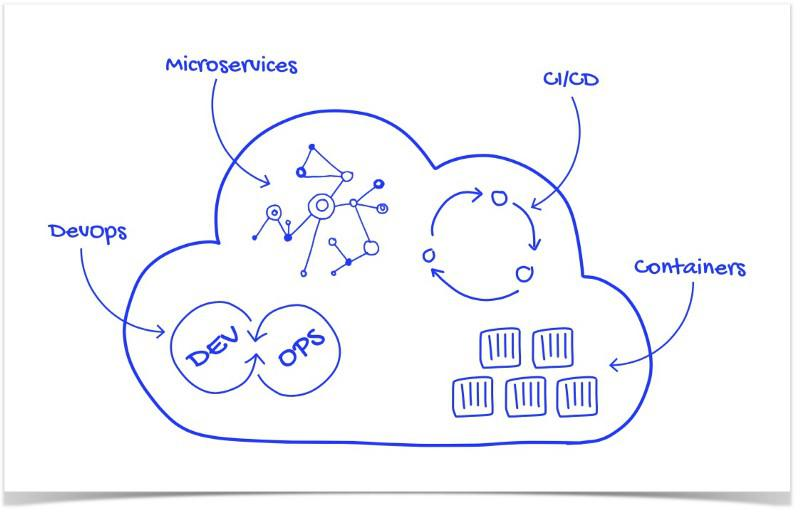
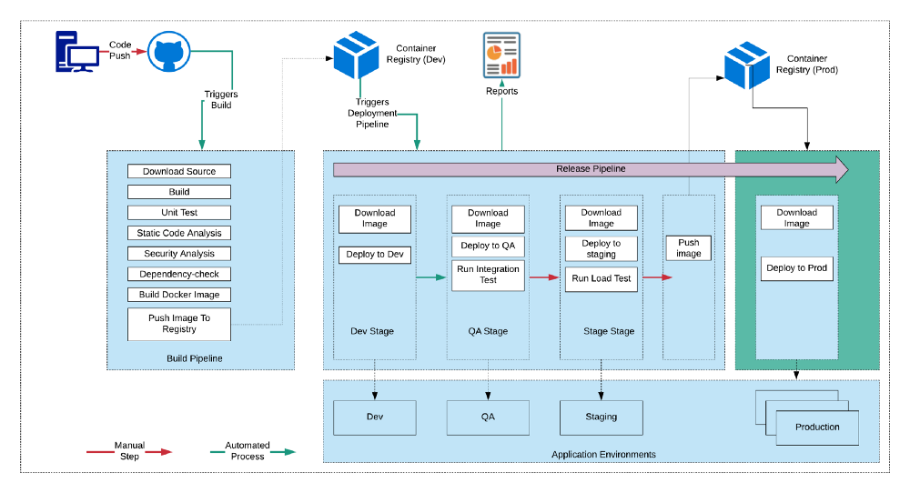

## 云原生应用程序的架构应该怎么设计？-InfoQ  

> 作者: Siddharth Patnaik  
> 译者: 覃璐  
> 发布日期: 2019 年 2 月 25 日 17:53  

### 介绍

云原生是一种将应用程序构建为微服务并在容器化和动态编排平台上进行运行的方法，这些平台充分利用了云计算模型的优势。云原生关注的是如何创建和部署应用程序，而不是在哪里运行。这些技术使组织能够在现代的动态环境（如公有云、私有云和混合云）中构建和运行可扩展的应用程序。这些应用程序是从头开始构建的，设计为松散耦合系统，针对云规模和性能进行了优化，使用托管服务并利用持续交付来实现可靠性和更快的上市时间。总体目标是提高速度、可扩展性和提高利润率。

速度。各种规模的公司现在都看到了一个战略优势，即能够快速行动并快速将创意推向市场。通过这种方式，意味着以前需要几个月时间才能将想法转化为生产，现在则变成了数天甚至数小时。这一目标的实现部分是因为企业内部的文化转变，从大爆炸项目转变为更多的渐进式改进。从本质上讲，Cloud Native 策略是关于处理技术风险的。过去，我们避免危险的标准方法是缓慢而谨慎地行动。Cloud Native 方法则是通过采取小型、可逆和低风险的步骤来快速实现。

可扩展性。随着企业的发展，战略上必须在更多地点为更多用户提供更广泛的设备支持，同时保持响应能力，管理成本而不会失败。

利润。在云基础设施的新世界中，战略目标是仅在需要时为新客户上线支付额外资源。消费从前期 CAPEX（购买新机器以预期成功）转移到 OPEX（按需支付额外服务器）。

### CNCF 的角色

[云原生计算基金会](https://www.cncf.io/)是一个开源软件基金会，归属于 Linux 基金会，包括谷歌、IBM、英特尔、Box、思科和 VMware 等大公司，致力于使云原生计算具有普遍性和可持续性。云原生计算使用开源软件技术栈将应用程序部署为微服务，将每个部分打包到自己的容器中，并动态编排这些容器以优化资源利用率。

“为什么需要 CNCF “的常见 QA：

* 公司意识到他们需要成为一家软件公司，即使他们没有软件业务。例如，Airbnb 正在改变酒店业，并且更多传统酒店正在努力竞争。
* 云原生允许 IT 和软件更快地移动。
* 采用云原生技术和实践使公司能够在内部创建软件，使业务人员能够与 IT 人员密切合作，不落后于竞争对手，并为客户提供更好的服务。

### 云原生设计原则

#### 设计为松散耦合的微服务

微服务是一种将单个应用程序开发为一套小型服务的方法，每个小型服务都在自己的进程中运行，并使用 HTTP 等轻量级协议进行通信。这些服务围绕业务功能构建，可通过全自动部署机制独立部署。

#### 使用最佳语言和框架开发

云原生应用程序的每个服务都是使用最适合该功能的语言和框架开发的。云原生应用程序是多语言的。服务使用各种语言、运行时和框架。例如，开发人员可以使用 Node.js 开发基于 WebSocket 的实时流服务，同时选择 Python 来构建机器学习基础服务，并选择 spring-boot 来暴露 REST API。开发微服务的最佳方式是为特定工作选择最佳语言和框架。

#### 以互动和协作为中心的 API

云原生服务使用轻量级 API，这些 API 基于表述性状态转移（REST）等协议来公开其功能。内部服务使用 Thrift、Protobuff、GRPC 等二进制协议相互通信，以获得更好的性能。

#### 无状态且可大规模扩展

云原生应用程序将其状态存储在数据库或其他外部实体中，因此实例可以弹性伸缩。任一实例都可以处理请求。它们与底层基础架构无关，后者允许应用程序以高度分布的方式运行，并且仍然保持其状态，而与底层基础架构的弹性机制无关。从可伸缩性的角度来看，架构就像向集群添加商品服务器节点一样简单，能够扩展应用程序。

#### 健壮性作为架构核心

根据墨菲定律 - “凡是可能出错的事就一定会出错”。当我们将其应用于软件系统时，在分布式系统中，故障会发生。硬件可能会失败。网络可能会出现瞬态故障。甚至整个服务或地区可能会出现中断，但即使是这样也必须进行规划。健壮性是指系统从故障中恢复并继续运行的能力。它不是避免故障，而是以避免停机和数据丢失的方式响应故障。健壮性的目标是在发生故障后将应用程序恢复到完全正常运行的状态。健壮性提供以下内容：

* 高可用性 - 应用程序在健康状态下继续运行的能力，无需大量停机
* 灾难恢复 - 应用程序从罕见但重大事件中恢复的能力：非瞬态、大规模故障，例如影响整个区域的服务中断

使应用程序更健壮的主要方法之一是通过冗余。HA 和 DR 使用多节点集群、多区域部署、数据复制、无单点故障、持续监控等实现。

以下是实现健壮性的一些策略：

* 重试瞬态故障 - 瞬时故障可能是由于网络连接暂时丢失、数据库连接中断或服务繁忙时超时造成的。通常只需简单重试请求即可解决瞬时故障；
* 跨实例的负载平衡 - 在任何地方实施集群。无状态应用程序应该能够通过向集群添加更多节点来扩展；
* 优雅降级 - 如果服务失败且没有故障转移路径，应用程序可以优雅降级，同时仍然提供可接受的用户体验；
* 限流高并发租户 / 用户 - 有时少数用户会产生过多的负载。这可能会对其他用户产生影响，从而降低应用程序的整体可用性；
* 使用断路器 - 断路器模式可以防止应用程序反复尝试可能发生故障的操作。断路器封装对服务的调用并跟踪最近的故障数。如果故障数超过阈值，则断路器开始返回错误代码而不调用服务
* 采用补偿事务。补偿事务是指撤销另一个已完成事务的影响的事务。在分布式系统中，实现强大的事务一致性可能非常困难。补偿事务是一种通过使用一系列较小的单个事务来实现一致性的方法，这些事务可以在每个步骤中撤消。

测试健壮性：通常健壮性测试不能像测试应用程序功能一样（通过运行单元测试、集成测试等）。相反，你必须在间歇发生故障的情况下测试端到端工作负载的执行情况。例如：通过崩溃进程注入失败、过期证书、使相关服务不可用等。像[ chaos monkey ](https://github.com/Netflix/chaosmonkey)这样的框架可以用于这种混沌测试。

#### 打包成轻量级容器并编排

容器可以将应用程序隔离到共享操作系统内核的小型轻量级执行环境中。通常以 MB 为单位测量，容器使用的资源远远少于虚拟机，并且几乎瞬间启动。Docker 已成为容器技术的标准。它们提供的最大优势是便携性。

使用 Kubernetes 部署云原生应用程序，Kubernetes 是一个开源平台，旨在自动部署、扩展和管理容器化应用程序。Kubernetes 最初由谷歌开发，现在已经成为部署云原生应用程序的操作系统。它也是首批毕业于 CNCF 的项目之一。

#### 使用 CI/CD 进行敏捷开发和自动化

DevOps，“开发”和“运维”的融合描述了实现快速敏捷开发和可扩展、可靠运维所需的组织结构、实践和文化。DevOps 是关于协调开发和运维团队的文化、协作实践和自动化，这样他们对改善客户体验、更快地响应业务需求以及确保安全性和运维需求平衡的新方法能够统一思想。现代组织相信合并开发和运维的人员和责任，可以让 DevOps 团队承担这两项责任。通过这种方式，你只需要一个团队负责开发、部署和在生产环境的运行软件。

持续集成（CI）和持续交付（CD）是一组操作原则，使应用程序开发团队能够更频繁、更可靠地交付代码更改。CI 的技术目标是建立一致的和自动化的方法来构建、打包和测试应用程序。通过集成过程的一致性，团队能够更频繁地提交代码更改，从而实现更好的协作和软件质量。

持续交付是持续集成的后续工作。CD 自动的将应用程序交付到选定的基础设施环境。它选择 CI 构建的软件包，部署到 Dev、QA、Performance 等各种环境中，分阶段运行各种测试，如集成测试、性能测试等，最后部署到生产环境中。通常持续交付在流水线中几乎没有手动步骤，因为持续部署是一个完全自动化的流水线，可以自动执行从代码签入到生产部署的整个过程。

#### 伸缩 - 动态扩容 / 缩容

云原生应用程序通过在高峰期增加资源来获取云的弹性优势。如果你的基于云的电子商务应用程序使用频繁，可以将其设置为使用额外的计算资源，直到高峰期消退，然后关闭这些资源。云原生应用可以根据需要调整增加的资源和规模。

查看英文原文：[ Cloud Native Application Architecture ](https://medium.com/walmartlabs/cloud-native-application-architecture-a84ddf378f82)
