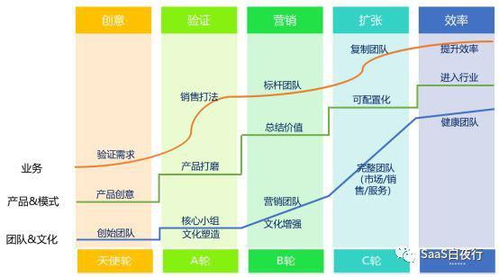

## 拜访杭州SaaS圈的一些共识  

> 发布: 吴昊@SaaS  
> 发布日期: 2019-03-12  

编者按：本文来自微信公众号“SaaS白夜行”（ID：SaaSKnight），作者 吴昊SaaS，36氪经授权发布。

作者介绍 - 吴昊，SaaS创业顾问，纷享销客天使投资人、前执行总裁，7年SaaS营销团队创新、20年企业信息化经验。目前在为SaaS公司提供产品市场定位、营销策略及组织发展三方面的战略咨询。

本文为SaaS创业路线图系列文章（38），点击查看[\#SaaS创业路线图\#](https://36kr.com/user/1308477002)系列文章

这次来杭州连续拜访了上上签、有赞、阿里钉钉、网易七鱼4家SaaS圈公司，做了三场主题“可复制的市场成功”的分享，5次与创始团队的深度交流。

过程中我发现SaaS圈的头部公司已经能够就很多关键抉择达成共识，我也抓紧分享出来供大家思考。

### 一、产品：定制大单来了，接还是不接？

这次离开北京前我也在和一个很优秀的SaaS公司交流这个问题。有钱的公司“站着说话不腰疼”，但真放到某个具体场景下看看？一方面，公司现金流已经高风险，接个100万的单子，大家都能看到希望。

另一方面，客户需求并不复杂且稳定，个性需求中还有一部分将来可以做到通用需求里，余下部分CTO有信心hold地住不会对未来产品和研发资源造成大的影响......

我深深理解，面对“定制OR挂掉”的问题时，创业者也没有其它选择......

但如果还有别的选择，SaaS圈内对这个问题是有深刻共识的。我常说，一旦产品版本发生分叉，永远不能回头。业内已经有不少公司已经在此事上栽了跟头，为什么？客户新需求没完没了、研发资源被分散、CEO及产品负责人的精力被分散。

创业公司除了专注，别无选择。

应对方法有几个：用可配置方式将通用需求放到下一个版本中，先帮客户上线基础功能；尽早完成API开放平台；PaaS（长期）。更重要的是，CEO和产品负责人一定要明确自己的产品方向，对偏离方向的单点客户需求要慎重、再慎重。

### 二、市场：建立SDR部门

我看到不少SaaS公司都在近1年开始启动归属在市场部下的SDR团队，这个团队的任务是对市场线索进行分类分级，然后按预定规则分发给合适的销售团队及Sales。

这个“规则”可能是依据客户规模（分给电销、面销及渠道）分、可能依据按行业分（引导在行业有成交客户的Sales不断加深对该行业的理解），也可能是按客户的业态分（一般方式是合并几个使用场景类似的行业）。

只有可数字化管理的，才能找到基线，并在这个基础上不断提高。举个例子，如果市场线索不评级打分（或分层），即便后续各个销售团队跟进转化率差异很大，转化率低的部门也会抱怨线索质量不均衡，没有办法评判他们销售管理能力的差异。

市场部分，通过与大家的交流，我认为除了懂得常规的PR、BD合作资源、SEM/SEO，最能突显CMO能力的是下面这2个方面：

1、对外-内容深度创新：能为目标客户群体在专业领域写深度文章（非软文）甚至可以出电子书，进行内容引流，并且在落地传播中细节把握到位；

2、对内-线索转化情况跟进：定期跟进线索转化情况，对被Sales放弃的线索进行抽查跟进，并据此优化流程。

都说toB公司市场部难做，但也有做的真正好的，关键是懂产品、懂客户需求，能做好产品、销售、客户之间的桥梁。

### 三、销售：重视构建自开拓能力

市场做地再好，市场线索数量质量的天花板始终在那里。

我认为，创业公司营销体系构建的过程中，要考虑好2对平衡：市场线索vs销售自开拓，直销vs渠道。

渠道业绩比例如果太低，很容易被直销或电销吃掉，这个不是利益问题，而是优胜劣汰的自然规律。

而市场线索与自开拓的关系也是这样：市场能力强的公司（当然，这也很可能与客户特点、产品单价等有关），市场线索转化的客户占营收80%以上，Sales的自开拓意愿就会很低，毕竟自开拓要辛苦地多（很多自开拓为主的Sales团队，开源工作会占到工作时间的30~50%）。

而自开拓业绩占比超过80%的这些公司，我看到市场部长期不受重视、投入不足，也没有能力对销售部门提出线索精细管理的要求。随之而来的问题是CEO问CMO为什么要增加投放时，CMO又拿不出各个线索通道转化率的数据...于是就恶性循环......

市场是长期投入，销售是临门一脚，两者投入平衡是CEO必须考虑清楚的。

说回销售自开拓，虽说具体情况具体分析，但我的建议通常会是走行业路线。ToB业务都会走到应用场景上，场景都在行业（或几个行业共同的业态）里。

有兴趣的同学可以看看我另一篇文章：SaaS创业路线图（十四）如何开拓行业走的弯路最少？（偷懒的同学就记住一句话：行业开拓靠引导而非强制，后端指导前端）。

### 四、CSM：续费率的责任主体

这个我解读一下。不少SaaS公司还在由销售来负责续费，会有几个问题：

1、销售的职责本该是获新客户，结果那些没新客户的同学都把心思放在老客户身上，这样同样有业绩，Leader们也很无奈...

2、销售的KPI是销售业绩绝对值，如果这个月他手上有3个有点难度的客户都要续费，一个20万，另外2个3万，他会管哪个客户？

3、销售岗位的要求和业务员的特性都不是做服务的。他们经常要冲刺，无法持续关注老客户的使用情况。

因此我见的大部分SaaS公司都是能达成共识的，CSM应该背负续费率KPI。这样公司的总体续费率才有保障。

产品、市场、销售、CSM，今天讲的哪个点让你有所收获？欢迎留言交流。
