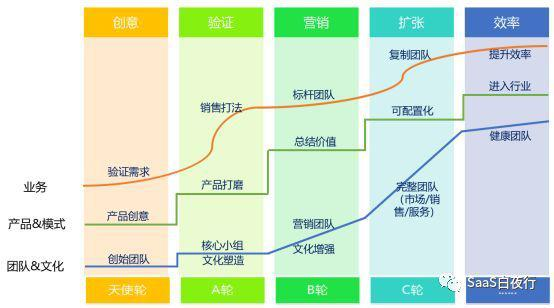
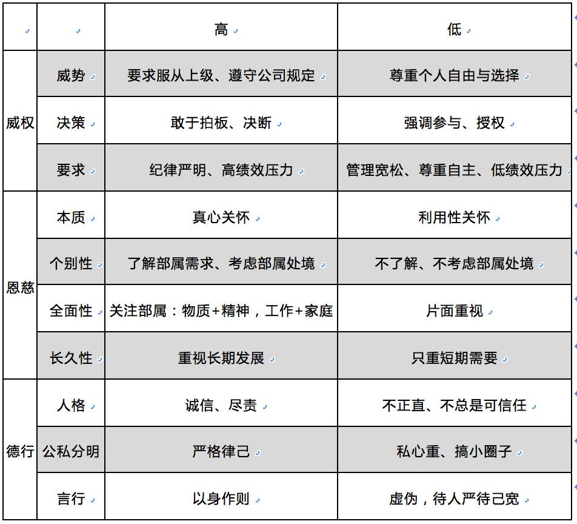

## 创业者如何打造领导力？  

> 发布: 吴昊@SaaS  
> 发布日期: 2019-03-28  

> 我个人很崇拜能用《论语》、《孙子兵法》指导现代企业管理的大神；但落实到具体可复制的管理方法，我还是更相信西方对管理科学的态度和方法论。
>
>
> “西学中用”有一个困难，就是文化差异太大。

作者介绍 - 吴昊，SaaS创业顾问，纷享销客天使投资人、前执行总裁，7年SaaS营销团队创新、20年企业信息化经验。目前在为SaaS公司提供产品市场定位、营销策略及组织发展三方面的战略咨询。

本文是[\#SaaS创业路线图\#](https://36kr.com/user/1308477002)系列文章（40），点击查看[\#SaaS创业路线图\#](https://36kr.com/user/1308477002)系列文章

大部分管理者感觉“领导力”是个很抽象的概念。领导力是一次CEO挽救颓势的重要演讲？还是一次会议上的力排众议、杀伐果决？抑或一次面对面的坦诚沟通谈心？恐怕都不全面。

我多次推荐过拉姆·查兰的《领导梯队》，这本书把一个管理者的成长阶梯谈地很清楚。但可惜还不够接中国的地气。

趁着这次刚在中欧上完4天的《领导力》课程，我将学到的核心知识框架为大家分享一下。（金教授说：“知识”与“观点”不同，知识是得到科学验证的观点）

我这次课程由樊景立教授、金台烈教授分别授课。虽然我这篇只是自媒体文章，还是声明一下：本文知识部分内容来自这2位教授的课程。他们在OB（组织行为）和HR（人力资源）领域著作颇丰，被国际上其他学者大量引用。

两位教授的研究对象是中国企业。

### 一、领导力包含的内容

领导力有8个关键能力，大家可以对照自己的能力模型看一下：

* 传达愿景

* 解决问题

* 分配资源

* 激励与鼓舞

* 组建团队

* 打造核心价值

* 管理变化

* 培养接班人

其中，传达愿景与培养接班人是很多领导者的短板。

#### 1、传达愿景

讲愿景前，我们先分析一下被“领导”的员工。

根据“激励理论”，员工有3个方面的动力：

①外在激励：薪酬、晋升、公平

②内在激励：工作本身的趣味或挑战，自己的掌控感

③亲社会动机：渴望对他人、群体和组织产生正面影响（这个是比较新的一条，大家自己琢磨）

外在激励的作用更直接和可控，但大家都知道“幸福感”是相对的，这次奖励“销冠们”去新马泰，下次就得韩国日本了，再下次呢？

内在激励则能更长期、更深刻地激发员工的积极性和创造力。因此“传达愿景”非常重要，每个人都希望获得自己人生的意义感。

穿插一下，正好最近在“得到”上听完了杏树林CEO张遇升的《怎样成为精力管理的高手？》，他提出一个金字塔模型：想成为精力旺盛的人，底子是体能，中间是情绪和注意力，最上面就是“意义感”。

员工的工作也需要意义感，领导者应该强调企业的愿景、对部属交待清楚做每个任务的价值在哪里。

举个课堂上看到的视频案例，我们看了丽思卡尔顿的CEO（ Horst Schulze）关于领导力的演讲。他提到表达员工重要性的例子。每个新酒店开张前，Schulze都会飞到现场给新员工做一个培训。

他讲到，开张那天，你（前台接待）不在场会是个灾难，你（客房清洁工）不在场会是个灾难......但如果我不在场，没人会受影响，对客户来说你们都比我重要

故事只是故事，但一个这么成功的CEO到处做新员工培训，表现出他对员工的态度。

我见过几次企业创始人在自己思考改变战略的过程中，没有带全体VP一起参与，这样战略出来后，负责各条线的VP对战略目标和路径的理解很模糊，行动中就可能错误百出。

#### 2、再说说带“接班人”的问题。

我06~07年在华为时，公司就有一个原则：没有合格接班人的干部不得晋升。这个道理我不说大家应该也能理解。开个玩笑说，这也许正是任老板不能退休的原因

有不少管理者缺少培养接班人的意识，甚至从意识上不愿意培养下属“接替自己”的能力。这样的情况CEO要考虑如何在组织内避免发生。

我以前评价下属中层干部时，会把“过去是否带出了不错的基层干部”作为一个重要的考评因素。

### 二、东方领导者的“三元领导模型”

樊教授对领导风格做了三个维度的解读，分别是：威权（高/低）、恩慈（高/低）、德行（高/低）。

1、德行 ：我就不多说了，带团队的人首先要正心诚意。歪心思的干部上面一时发现不了，下面的人却看地清清楚楚，几个月下来整个团队的风气如何大家都看得到。

除了德行，威权和恩慈的高低没有好坏之分。

2、恩慈领导力则是不少管理者都缺乏的。对部属是真心诚意，还是“利用性”关怀，表面上看不出来，一到关键时刻，例如重大利益或高压情况下就会暴露。

但高恩慈领导，确实不是每个领导者都能做到的，因为性格、细心程度、时间投入、管理经验等方面的影响，不是想“高恩”就能“高恩”的。

我认为创业公司应该尽可能做到“高恩慈”，关心部属的生活、重视他们的个别需求及长期发展。当然，实际情况是经常996、资金不足也不能给大家发高薪，所以至少在人文关怀上多做一些吧！

即便做不到，也要知道自己在部属眼中是“高恩”还是“低恩”。这对绩效会有影响。

3、威权领导

有的干部更强势一些（高威），这样团队执行力强，但决策时容易“一言堂”，部属有执行困难反映出来也被“拍死”，团队有犯错概率更大；

有的干部更尊重部属的参与和授权（低威），团队做事情决策和行动都慢一些，但人才更有机会成长。

4、组合及选择

根据樊教授在中欧学员（8成是民营企业法人或高管）范围内进行的调研统计，同样在“高恩慈”情况下：在威权方面无论高低，员工满意度差别不大；绩效方面则是“高威权”的领导风格更有可能取得好业绩。

这个我们可以理解为，“高恩”意味部属得到了真诚的关怀，因此进行高压管理员工也能接受。

但如果是“低恩慈”情况下，高威权领导的业绩就明显比低威权的领导业绩差一些。可以理解为，员工没有得到足够关怀，对高威权会更加排斥。

此外，高威权领导风格下，要更加重视“信息沟通”；信息沟通不到位部属的业绩只有沟通到位部属的一半。

### 三、领导力的自我检查

最后，作为企业中的领导者，我们应该时常问自己以下4个问题：

* 我是否足够关注：团队和组织中的价值观和文化

* 我是否能让他人发挥最佳表现、尊重他们的差异，激励并鼓舞他们？

* 我是否属于发展型领导，会不断地辅导他人？

* 我对待变革的态度？我是否有效地掌控变革？

关于中欧商学院学到的“领导力”就暂时写到这里。以上这些内容，请各位结合公司阶段、员工情况、管理层的成熟度来抉择。
