## 服务平台化，知乎 HBase 实践  

> 作者: 张宇（知乎）  
> 发布日期: 2019 年 3 月 29 日  


### 前言

HBase 是一个基于 Hadoop 面向列的非关系型分布式数据库 \(NoSQL\), 设计概念来源于谷歌的 BigTable 模型，面向实时读写、随机访问大规模数据集的场景，是一个高可靠性、高性能、高伸缩的分布式存储系统，在大数据相关领域应用广泛. HBase 系统支持对所存储的数据进行透明切分，从而使得系统的存储以及计算具有良好的水平扩展性.

知乎从 2017 年起开始逐渐采用 HBase 系统存储各类在线业务数据，并在 HBase 服务之上构建各类应用模型以及数据计算任务；伴随着知乎这两年的发展，知乎核心架构团队基于开源容器调度平台 Kubernetes 打造了一整套 HBase 服务平台管理系统，经过近两年的研发迭代，目前已经形成了一套较为完整的 HBase 自动化运维服务体系，能够完成 HBase 集群的快捷部署，平滑扩缩容，HBase 组件细粒度监控，故障跟踪等功能.

### 背景

知乎对 HBase 的使用经验不算太长，在 2017 年初的时候，HBase 服务主要用于离线算法，推荐，反作弊，还有基础数据仓库数据的存储计算，通过 MapReduce 和 Spark 来进行访问. 而在当时知乎的在线存储主要采用 MySQL 和 Redis 系统，其中：

* MySQL: 支持大部分的业务数据存储，当数据规模增大后有一些需要进行扩容的表，分表会带来一定的复杂性，有些业务希望能屏蔽这个事情，还有一些是因为历史原因在表设计的时候用 rmsdb 的形式存了一些本该由列存储的数据，希望做一下迁移. 此外 MySQL 基于 SSD，虽然性能很好，花销也比较大 ;

* Redis: 可以提供大规模的缓存，也可以提供一定的存储支持. Redis 性能极好，主要的局限是做数据 Resharding 较为繁琐 ，其次是内存成本较高 ;

针对以上两种在线存储所存在的一些问题，我们希望建立一套在线存储 NoSQL 服务，对以上两种存储作为一个补充；选型期间我们也考虑过 Cassandra, 早期一些业务曾尝试使用 Cassandra 作为存储，隔壁团队在运维了一段时间的 Cassandra 系统之后，遇到不少的问题，Cassandra 系统可操作性没有达到预期，目前除了 Tracing 相关的系统，其他业务已经放弃使用 Cassandra.

我们从已有的离线存储系统出发，在衡量了稳定性，性能，代码成熟度，上下游系统承接，业界使用场景以及社区活跃度等方面之后，选择了 HBase，作为知乎在线存储的支撑组件之一.

### HBase On Kubernetes

初期知乎只有一套进行离线计算的集群，所有业务都跑在一个集群上，并且 HBase 集群和其他离线计算 yarn 以及 Impala 混合部署，HBase 的日常离线计算和数据读写都严重受到其他系统影响；并且 HBase 的监控都只停留在主机层面的监控，出现运行问题时，进行排查很困难，系统恢复服务时间较长，这种状态下，我们需要重新构建一套适用于在线服务的系统.

在这样的场景下，我们对在线 HBase 服务的需求是明确的：

* 隔离性:
* 从业务方的视角来说，希望相关的服务做到环境隔离，权限收归业务，避免误操作和业务相互影响 ;
* 对于响应时间，服务的可用性，都可以根据业务的需要指定 SLA;
* 对于资源的分配和 blockcache 等参数的配置也能够更加有适应性，提供业务级别的监控和报警，快速定位和响应问题；
* 资源利用率：从运维的角度，资源的分配要合理，尽可能的提升主机 cpu，内存包括磁盘的有效利用率 ;
* 成本控制： 团队用最小的成本去得到最大的运维收益，所以需要提供便捷的调用接口，能够灵活的进行 HBase 集群的申请，扩容，管理，监控. 同时成本包括机器资源，还有工程师. 当时我们线上的这套系统是由一位工程师独立去进行维护.
综合以上需求，参考我们团队之前对基础设施平台化的经验，最终的目标是把 HBase 服务做成基础组件服务平台向提供给上游业务，这个也是知乎技术平台部门工作思路之一，尽可能的把所有的组件对业务都黑盒化，接口化，服务化. 同时在使用和监控的粒度上尽可能的准确，细致，全面. 我们构建在线 HBase 管理运维系统的一个初衷.

### Why Kubernetes?

前文说到我们希望将整个 HBase 系统平台服务化，那就涉及到如何管理和运维 HBase 系统，知乎在微服务和容器方面的工作积累和经验是相当丰富的，在当时我们所有的在线业务都已经完成了容器化的迁移工作，超万级别的业务容器平稳运行在基于 mesos 的容器管理平台 Bay 上 \(参见 \[1\]\)；与此同时，团队也在积极的做着 Infrastructure 容器化的尝试，已经成功将基础消息队列组件 Kafka 容器化运行于 Kubernetes 系统之上 \(参见 \[2\]\)，因此我们决定也将 HBase 通过 Kubernetes 来进行资源的管理调度.

Kubernetes\[3\] 是谷歌开源的容器集群管理系统，是 Google 多年大规模容器管理技术 Borg 的开源版本. Kubernetes 提供各种维度组件的资源管理和调度方案，隔离容器的资源使用，各个组件的 HA 工作，同时还有较为完善的网络方案. Kubernetes 被设计作为构建组件和工具的生态系统平台，可以轻松地部署、扩展和管理应用程序. 有着 Kubernetes 大法的加持，我们很快有了最初的落地版本 \(\[4\]\).

### 初代

最初的落地版本架构见下图，平台在共享的物理集群上通过 Kubernetes\(以下简称 K8S\) API 建立了多套逻辑上隔离的 HBase 集群，每套集群由一组 Master 和若干个 Regionserver \(以下简称 RS\) 构成, 集群共享一套 HDFS 存储集群，各自依赖的 Zookeeper 集群独立；集群通过一套管理系统 Kubas 服务来进行管理 \(\[4\]\).

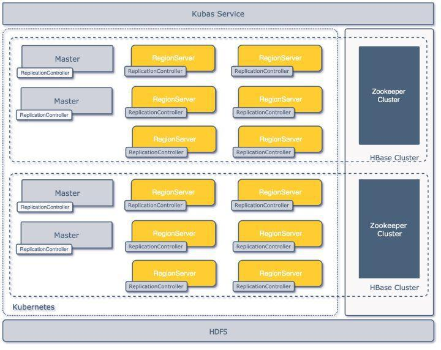

第一代架构

#### 模块定义

在 K8S 中如何去构建 HBase 集群，首先需要用 K8S 本身的基础组件去描述 HBase 的构成；K8S 的资源组件有以下几种:

* Node: 定义主机节点，可以是物理机，也可以是虚拟机 ;
* Pod: 一组紧密关联的容器集合，是 K8S 调度的基本单位 ;
* ReplicationController: 一组 pod 的控制器，通过其能够确保 pod 的运行数量和健康，并能够弹性伸缩 ;

结合之前 Kafka on K8S 的经验，出于高可用和扩展性的考虑，我们没有采用一个 Pod 里带多个容器的部署方式，统一用一个 ReplicationController 定义一类 HBase 组件，就是上图中的 Master，Regionserver 还有按需创建的 Thriftserver；通过以上概念，我们在 K8S 上就可以这样定义一套最小 HBase 集群：

* 2 \* Master ReplicationController;
* 3 \* Regionserver ReplicationController;
* 2 \* Thriftserver ReplicationController \(可选\);

### 高可用以及故障恢复

作为面向在线业务服务的系统，高可用和故障转移是必需在设计就要考虑的事情，在整体设计中，我们分别考虑组件级别，集群级别和数据存储级别的可用性和故障恢复问题.

#### 组件级别

HBase 本身已经考虑了很多故障切换和恢复的方案：

* Zookeeper 集群：自身设计保证了可用性；
Master: 通过多个 master 注册在 Zookeeper 集群上来进行主节点的 HA 和更新；
* RegionServer: 本身就是无状态的，节点失效下线以后会把上面的 region 自动迁走，对服务可用性不会有太大影响；
* Thriftserver: 当时业务大多数是 Python 和 Golang，通过用 Thrift 对 HBase 的进行，Thriftserver 本身是单点的，这里我们通过 HAProxy 来代理一组 Thriftserver 服务；
* HDFS：本身又由 Namenode 和 DataNode 节点组成，Namenode 我们开启 HA 功能, 保证了 HDFS 的集群可用性 ;

#### 集群级别

* Pod 容器失效: Pod 是通过 ReplicationController 维护的， K8S 的 ControllerManager 会在它 的存储 etcd 去监听组件的失效情况，如果副本少于预设值会自动新的 Pod 容器来进行服务；
* Kubernetes 集群崩溃: 该场景曾经在生产环境中出现过，针对这种情况，我们对 SLA 要求较高的业务采用了少量物理机搭配容器的方式进行混合部署，极端场景出现时，可以保证重要业务收到的影响可控；

#### 数据级别

* 所有在 K8S 上构建的 HBase 集群都共享了一套 HDFS 集群，数据的可用性由 HDFS 集群的多副本来提供.

### 实现细节

#### 资源分配

初期物理节点统一采用 2\*12 核心的 cpu，128G 内存和 4T 的磁盘，其中磁盘用于搭建服务的 HDFS，CPU 和内存则在 K8S 环境中用于建立 HBase 相关服务的节点.

Master 组件的功能主要是管理 HBase 集群，Thriftserver 组件主要承担代理的角色，所以这两个组件资源都按照固定额度分配.

在对 Regionserver 组件进行资源分配设计的时候，考虑两种方式去定义资源:

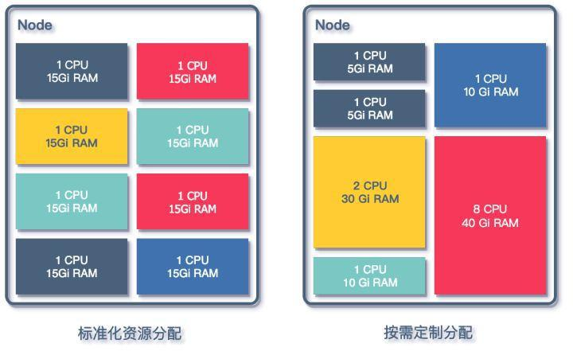

资源分配方式

* 按照业务需求分配:
* 根据业务方对自身服务的描述，对相关的 QPS 以及 SLA 进行评估，为业务专门配置参数，包含 blockcache, region 大小以及数量等；
* 优点是针对业务优化，能够充分的利用资源，降低业务的资源占用成本 ;
* 管理成本增加，需要对每一个业务进行评估，对平台维护人员非常不友好，同时需要业务同学本身对 HBase 有理解 ;
* 统一规格的资源分配:
* CPU 以及 MEM 都按照预先设定好的配额来分配, 提供多档的配置，将 CPU 和 MEM 的配置套餐化 ;
* 方便之处在于业务扩容时直接增加 Regionserver 的个数，配置稳定，运维成本较低，遇到问题时排障方便 ;
* 针对某些有特有访问方式的业务有局限性，如 CPU 计算型，大 KV 存储，或者有 MOB 需求的业务，需要特殊的定制 ;

介于当时考虑接入的在线业务并不多，所以采用了按业务定制的方式去配置 Regionserver, 正式环境同一业务采用统一配置的一组 Regionserver，不存在混合配置的 Regionserver 组.

#### 参数配置

基础镜像基于 cdh5.5.0-hbase1.0.0 构建

复制代码

```
### Example for hbase dockerfile

### install cdh5.5.0-hbase1.0.0

ADD hdfs-site.xml /usr/lib/hbase/conf/

ADD core-site.xml /usr/lib/hbase/conf/

ADD env-init.py /usr/lib/hbase/bin/

ENV JAVA_HOME /usr/lib/jvm/java-8-oracle

ENV HBASE_HOME /usr/lib/hbase

ENV HADOOP_PREFIX /usr/lib/hadoop

ADD env-init.py /usr/lib/hbase/bin/

ADD hadoop_xml_conf.sh /usr/lib/hbase/bin/
```

* 固定的环境变量，如 JDK\_HOME, HBASE\_HOME, 都通过 ENV 注入到容器镜像中 ;
* 与 HDFS 相关的环境变量，如 hdfs-site.xml 和 core-site.xml 预先加入 Docker 镜像中，构建的过程中就放入了 HBase 的相关目录中，用以确保 HBase 服务能够通过对应配置访问到 HDFS;
* 与 HBase 相关的配置信息, 如组件启动依赖的 Zookeeper 集群地址，HDFS 数据目录路径, 堆内存以及 GC 参数等，这些配置都需要根据传入 Kubas Service 的信息进行对应变量的修改, 一个典型的传入参数示例:

复制代码

```
REQUEST_DATA = {

"name": 'test-cluster',

"rootdir": "hdfs://namenode01:8020/tmp/hbase/test-cluster",

"zkparent": "/test-cluster",

"zkhost": "zookeeper01,zookeeper02,zookeeper03",

"zkport": 2181,

"regionserver_num": '3',

"codecs": "snappy",

"client_type": "java",

"cpu": '1',

"memory": '30',

"status": "running",

}
```

通过上面的参数 Kubas Service 启动 Docker 时，在启动命令中利用 hadoop\_xml\_conf.sh 和 [env-init.py](http://env-init.py) 修改 hbase-site.xml 和 [hbase-env.sh](http://hbase-env.sh) 文件来完成最后的配置注入，如下所示:

复制代码

```
source /usr/lib/hbase/bin/hadoop_xml_conf.sh

&& put_config --file /etc/hbase/conf/hbase-site.xml --property hbase.regionserver.codecs --value snappy

&& put_config --file /etc/hbase/conf/hbase-site.xml --property zookeeper.znode.parent --value /test-cluster

&& put_config --file /etc/hbase/conf/hbase-site.xml --property hbase.rootdir --value hdfs://namenode01:8020/tmp/hbase/test-cluster

&& put_config --file /etc/hbase/conf/hbase-site.xml --property hbase.zookeeper.quorum --value zookeeper01,zookeeper02,zookeeper03

&& put_config --file /etc/hbase/conf/hbase-site.xml --property hbase.zookeeper.property.clientPort --value 2181

&& service hbase-regionserver start && tail -f /var/log/hbase/hbase-hbase-regionserver.log
```

##### 网络通信

网络方面，采用了 Kubernetes 上原生的网络模式，每一个 Pod 都有自己的 IP 地址，容器之间可以直接通信，同时在 Kubernetes 集群中添加了 DNS 自动注册和反注册功能， 以 Pod 的标识名字作为域名，在 Pod 创建和重启和销毁时将相关信息同步全局 DNS.

在这个地方我们遇到过问题，当时我们的 DNS 解析不能在 Docker 网络环境中通过 IP 反解出对应的容器域名，这就使得 Regionserver 在启动之后向 Master 注册和向 Zookeeper 集群注册的服务名字不一致，导致 Master 中对同一个 Regionserver 登记两次，造成 Master 与 Regionserver 无法正常通信，整个集群无法正常提供服务.

经过我们对源码的研究和实验之后，我们在容器启动 Regionserver 服务之前修改 /etc/hosts 文件，将 Kubernetes 对注入的 hostname 信息屏蔽；这样的修改让容器启动的 HBase 集群能够顺利启动并初始化成功，但是也给运维提升了复杂度，因为现在 HBase 提供的 Master 页现在看到的 Regionserver 都是 IP 形式的记录，给监控和故障处理带来了诸多不便.

##### 存在问题

初代架构顺利落地，在成功接入了近十个集群业务之后，这套架构面临了以下几个问题:

* 管理操作业务 HBase 集群较为繁琐:
* 需要手动提前确定 HDFS 集群的存储，以及申请独立 Zookeeper 集群，早期为了省事直接多套 HBase 共享了一套 Zookeeper 集群，这和我们设计的初衷不符合 ;
* 容器标识符和 HBase Master 里注册的 regionserver 地址不一致，影响故障定位；
* 单 Regionserver 运行在一个单独的 ReplicationController \(以下简称 RC \), 但是扩容缩容为充分利用 RC 的特性，粗暴的采用增加或减少 RC 的方式进行扩容缩容 ;
* HBase 配置：
* 最初的设计缺乏灵活性，与 HBase 服务配置有关的 hbase-site.xml 以及 hbase-env.sh 固化在 Docker Image 里，这种情况下， 如果需要更新大量配置，则需要重新 build 镜像 ;
* 由于最初设计是共享一套 HDFS 集群作为多 HBase 集群的存储，所以与 HDFS 有关的 hdfs-site.xml 和 core-site.xml 配置文件也被直接配置进了镜像. 如果需要在 Kubas service 中上线依赖其他 HDFS 集群的 HBase，也需要重新构建镜像 ;
* HDFS 隔离:
* 随着接入 HBase 集群的增多，不同的 HBase 集群业务对 HDFS 的 IO 消耗有不同的要求，因此有了分离 HBase 依赖的 HDFS 集群的需求；
* 主要问题源自 Docker 镜像对相关配置文件的固化，与 HDFS 有关的 hdfs-site.xml 和 core-site.xml 配置文件与相关 Docker 镜像对应，而不同 Docker 镜像的版本完全由研发人员自己管理，最初版本的实现并未考虑到这些问题 ;
* 监控运维:
* 指标数据不充分，堆内堆外内存变化，region 以及 table 的访问 信息都未有提取或聚合
* region 热点定位较慢，无法在短时间内定位到热点 region;
* 新增或者下线组件只能通过扫 kubas service 的数据库来发现相关变更，组件的异常如 regionserver 掉线或重启，master 切换等不能及时反馈 ;

#### 重构

为了进一步解决初版架构存在的问题，优化 HBase 的管控流程，我们重新审视了已有的架构，并结合 Kubernetes 的新特性，对原有的架构进行升级改造，重新用 Golang 重写了整个 Kubas 管理系统的服务 \(初版使用了 Python 进行开发\) ，并在 Kubas 管理系统的基础上，开发了多个用于监控和运维的基础微服务，提高了在 Kubernetes 上进行 HBase 集群部署的灵活性，架构如下图所示：

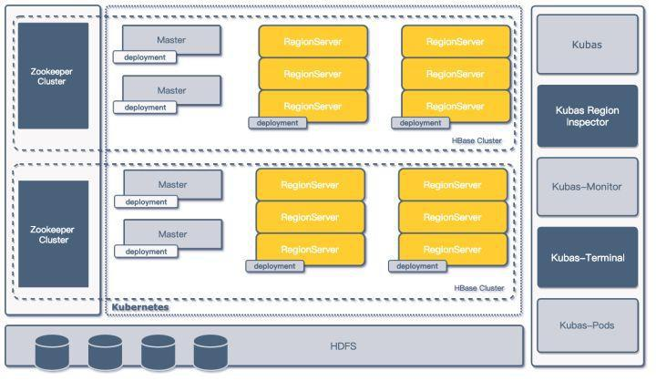

二代架构图

##### Deployment & Config Map

* Deployment
* Deployment \(部署\) 是 Kubernetes 中的一个概念，是 Pod 或者 ReplicaSet 的一组更新对象描述，用于取代之前的 ReplicationController. Deployment 继承了 ReplicationController 的所有功能，并拥有更多的管理新特性；
* 在新的 Kubas 管理系统中，新设计用 Deployment 代替 ReplicationController 做 Pod 的管理，使用一个 Deployment 部署一组 Regionservers 的方式来代替单 Regionserver 对应一个 ReplicationController 的设计，提升集群部署扩缩容管理的灵活性 ;
* 每一组 Deployment 都会注入各类信息维度的标签，如相关集群的信息就，服务类型，所属应用等 ;

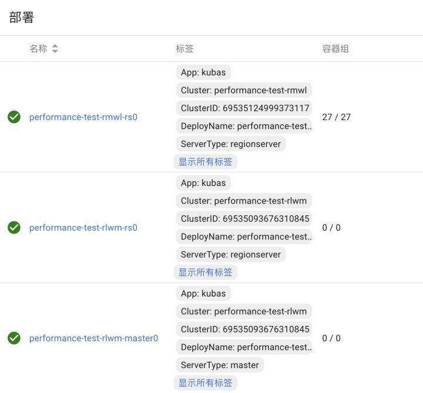

Deployment 部署

* ConfigMap
* ConfigMap 是 Kubernetes 用来存储配置文件的资源对象，通过 ConfigMap 可以将外部配置在启动容器之前挂载到容器中的指定位置，并以此为容器中运行的程序提供配置信息；
* 重构之后管理系统中，所有 HBase 的组件配置都存放至 ConfigMap 之中，系统管理人员会根据需 - 要预先生成若干 HBase 的配置模板存放到 K8S 系统的 ConfigMap 中；
* 在业务方提供出 HBase 服务申请时，管理人员通过业务资源的需求结合配置模板，为申请的 HBase 集群组件渲染具体的 hbase-site.xml 以及 [hbase-env.sh](http://hbase-env.sh) 等 HBase 配置相关的文件再存放到 ConfigMap 中 ;
* 最后在容器启动时，k8s 会根据 deployment 将 ConfigMap 中的配置文件 Mount 到配置中指定的路径中 ;
* 和 Deployment 的操作类似，每一份 ConfigMap 也都会标记上标签，将相关的 ConfigMap 和对应的集群和应用关联上 ;

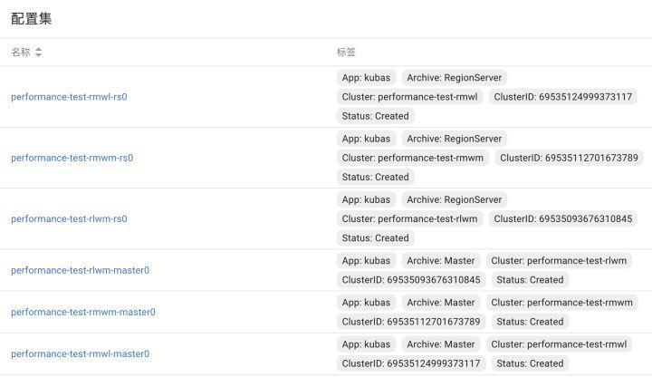

ConfigMap 存档

##### 组件参数配置

在引入了 ConfigMap 功能之后，之前创建集群的请求信息也随之改变.

复制代码

```
RequestData

{

"name": "performance-test-rmwl",

"namespace": "online",

"app": "kubas",

"config_template": "online-example-base.v1",

"status": "Ready",

"properties": {

"hbase.regionserver.codecs": "snappy",

"hbase.rootdir": "hdfs://zhihu-example-online:8020/user/online-tsn/performance-test-rmwl",

"hbase.zookeeper.property.clientPort": "2181",

"hbase.zookeeper.quorum": "zookeeper01,zookeeper02,zookeeper03",

"zookeeper.znode.parent": "/performance-test-rmwl"

},

"client_type": "java",

"cluster_uid": "k8s-example-hbase---performance-test-rmwl---example"

}
```

其中 config\_template 指定了该集群使用的配置信息模板，之后所有和该 HBase 集群有关的组件配置都由该配置模板渲染出具体配置.

config\_template 中还预先约定了 HBase 组件的基础运行配置信息，如组件类型，使用的启动命令，采用的镜像文件，初始的副本数等.

复制代码

```
servers:

{

"master": {

"servertype": "master",

"command": "service hbase-master start && tail -f /var/log/hbase/hbase-hbase-master.log",

"replicas": 1,

"image": "dockerimage.zhihu.example/apps/example-master:v1.1",

"requests": {

"cpu": "500m",

"memory": "5Gi"

},

"limits": {

"cpu": "4000m"

}

},

}
```

Docker 镜像文件配合 ConfigMap 功能，在预先约定的路径方式存放配置文件信息，同时在真正的 HBase 配置路径中加入软链文件.

复制代码

```
RUN mkdir -p /data/hbase/hbase-site

RUN mv /etc/hbase/conf/hbase-site.xml /data/hbase/hbase-site/hbase-site.xml

RUN ln -s /data/hbase/hbase-site/hbase-site.xml /etc/hbase/conf/hbase-site.xml

RUN mkdir -p /data/hbase/hbase-env

RUN mv /etc/hbase/conf/hbase-env.sh /data/hbase/hbase-env/hbase-env.sh

RUN ln -s /data/hbase/hbase-env/hbase-env.sh /etc/hbase/conf/hbase-env.sh
```

##### 构建流程

结合之前对 Deployment 以及 ConfigMap 的引入，以及对 Dockerfile 的修改，整个 HBase 构建流程也有了改进:

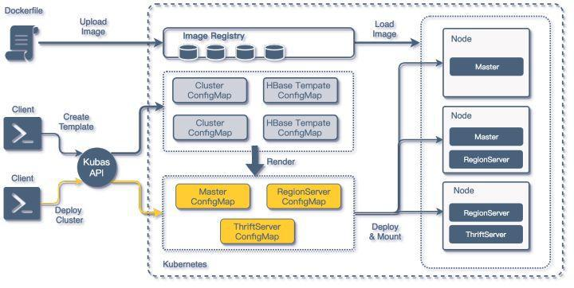

HBase on Kubernetes 构建流程

* 编制相关的 Dockerfile 并构建基础的 HBase 组件镜像 ;
* 为将要创建的 HBase 构建基础属性配置模板，订制基础资源，这部分可以通过 Kubas API 在 Kubernetes 集群中创建 ConfigMap;
* 具体创建部署集群时，通过调用 Kubas API, 结合之前构建的 ConfigMap 模板，渲染出 HBase 集群中各类组件的详细 ConfigMap, 然后在 Kubernetes 集群中构建 Deployment;
* 最终通过之前构建好的镜像加载组件 ConfigMap 中的配置，完成在 Kubernetes Node 中运行的一个 HBase 组件容器 ;

通过结合 K8S 的 ConfigMap 功能的配置模板，以及 Kubas API 调用，我们就可以在短时间部署出一套可用的 HBase 最小集群 \(2Master + 3RegionServer + 2Thriftserver\), 在所有宿主机 Host 都已经缓存 Docker 镜像文件的场景下，部署并启动一整套 HBase 集群的时间不超过 15 秒.

同时在缺少专属前端控制台的情况下，可以完全依托 Kubernetes dashboard 完成 HBase 集群组件的扩容缩容，以及组件配置的查询修改更新以及重新部署.

##### 资源控制

在完成重构之后，HBase 服务面向知乎内部业务进行开放，短期内知乎 HBase 集群上升超过 30+ 集群，伴随着 HBase 集群数量的增多，有两个问题逐渐显现：

1. 运维成本增高: 需要运维的集群逐渐增高 ;
2. 资源浪费：这是因为很多业务的业务量并不高，但是为了保证 HBase 的高可用，我们至少需要提供 2 个 Master + 3 个 Region Server，而往往 Master 的负载都非常低，这就造成了资源浪费.

为了解决如上的两个问题，同时又不能打破资源隔离的需求，我们将 HBase RSGroup 功能加入到了 HBase 平台的管理系统中.

优化后的架构如下:
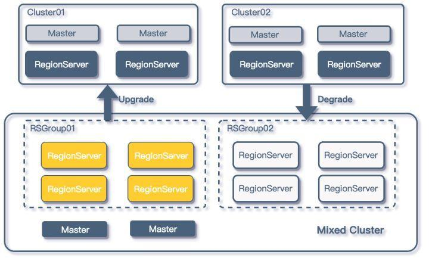

RSGroup 的使用

由于平台方对业务 HBase 集群的管理本身就具有隔离性，所以在进行更进一步资源管理的时候，平台方采用的是降级的方式来管理 HBase 集群，通过监听每个单独集群的指标，如果业务集群的负载在上线一段时间后低于阈值，平台方就会配合业务方，将该 HBase 集群迁移到一套 Mixed HBase 集群上.

同时如果在 Mixed HBase 集群中运行的某个 HBase 业务负载增加，并持续一段时间超过阈值后，平台方就会考虑将相关业务提升至单独的集群.

#### 多 IDC 优化

随着知乎业务的发展和扩大，知乎的基础架构逐渐升级至多机房架构，知乎 HBase 平台管理方式也在这个过程中进行了进一步升级，开始构建多机房管理的管理方式；基本架构如下图所示:

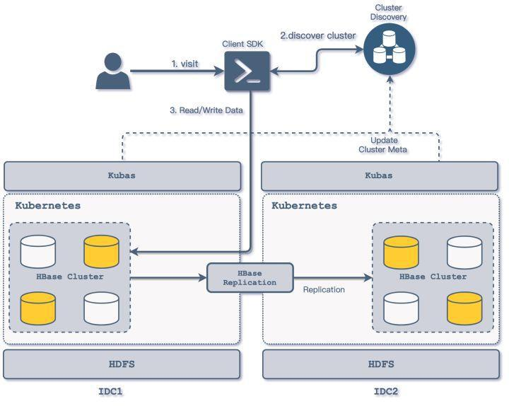

多 IDC 访问方式

* 业务 HBase 集群分别在多个 IDC 上运行，由业务确定 IDC 机房的主从方式，业务的从 IDC 集群数据通过平台方的数据同步组件进行数据同步 ;
* 各 IDC 的 Kubas 服务主要负责对本地 Kubernetes 集群的具体操作，包括 HBase 集群的创建删除管理，regionserver 的扩容等 HBase 组件的管理操作，Kubas 服务部署与机房相关，仅对接部署所在机房的 K8S 集群 ;
* 各 IDC 的 Kubas 服务向集群发现服务上报本机房集群信息，同时更新相关集群主从相关信息 ;
* 业务方通过平台方封装的 Client SDK 对多机房的 HBase 集群进行访问，客户端通过集群发现服务可以确定 HBase 集群的主从关系，从而将相关的读写操作分离，写入修改访问可以通过客户端指向主 IDC 的集群 ;
* 跨机房间的数据同步采用了自研的 HBase Replication WALTransfer 来提供增量数据的同步 ;

#### 数据同步

在各类业务场景中，都存在跨 HBase 集群的数据同步的需求，比如数据在离线 HBase 集群和在线集群同步，多 IDC 集群数据同步等；对于 HBase 的数据同步来说，分为全量复制和增量复制两种方式 ;

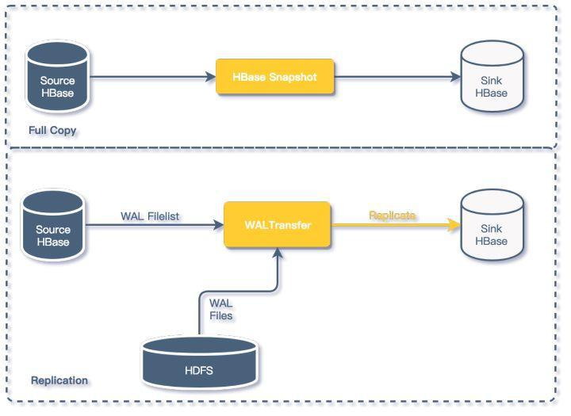

HBase 数据同步

在知乎 HBase 平台中，我们采用两种方式进行 HBase 集群间的数据同步

* HBase Snapshot：

全量数据复制我们采用了 HBase Snapshot 的方式进行；主要应用在离线数据同步在线数据的场景；

* WALTransfer:

主要用于 HBase 集群之间的的增量数据同步；增量复制我们没有采用 HBase Replication，相关同步方式我们通过自研的 WALTransfer 组件来对 HBase 数据进行增量同步；

WALTransfer 通过读取源数据 HBase 集群提供 WAL 文件列表，于 HDFS 集群中定位对应的 WAL 文件，将 HBase 的增量数据按序写入到目的集群，相关的细节我们会在以后的文章中详细解析

#### 监控

从之前重构后的架构图上我们可以看到，在 Kubas 服务中我们添加了很多模块，这些模块基本属于 HBase 平台的监控管理模块.

**Kubas-Monitor 组件**

基本的监控模块，采用轮询的方式发现新增 HBase 集群，通过订阅 Zookeeper 集群发现 HBase 集群 Master 以及 Regionserver 组.

采集 Regionserver Metric 中的数据，主要采集数据包括：

* region 的信息，上线 region 数量，store 的数量、storefile 的大小、storefileindex 的大小，读取时 memstore 命中的次数和缺失次数 ;
* blockcache 的信息，例如 blockcache 中使用多少、空闲多少、累计的缺失率、命中率等.
* 读写请求的统计信息，例如最大最小读写响应时间，读写的表分布、读写数据量、读写失败次数等 ;
* compact 与 split 的操作信息，例如队列的长度、操作次数和时间等 ;
* handler 的信息，例如队列长度、处于活跃 handler 的数量以及活跃的 reader 数量 ;

其他维度的指标如容器 CPU 以及 Mem 占用来自 Kubernetes 平台监控，磁盘 IO，磁盘占用等来自主机监控

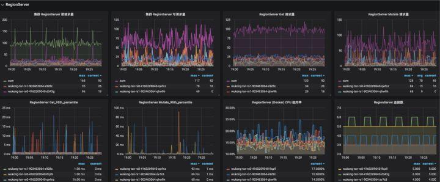

HBase 部分监控

**Kubas-Region-Inspector 组件**

* 采集 HBase 表 Region 信息，通过 HBase API 接口，获取每个 HBase Region 的数据统计信息，并将 Region 数据聚合成数据表信息 ;
* 通过调用开源组件形成 HBase 集群 Region 分布的图表，对 Region 热点进行定位 ;

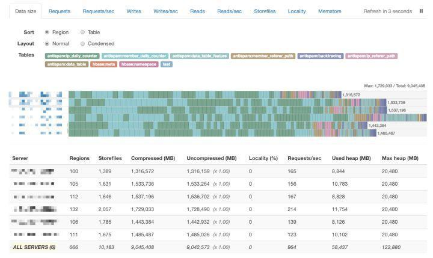

HBase Region 分布监控

通过以上模块采集的监控信息，基本可以描述在 Kubernetes 上运行的 HBase 集群的状态信息，并能够辅助运维管理人员对故障进行定位排除.

#### Future Work

随着公司业务的快速发展，知乎的 HBase 平台业务同时也在不断的迭代优化，短期内我们会从以下几个方向进一步提升知乎 HBase 平台的管理服务能力:

* 提升集群安全稳定性. 加入 HBase 权限支持，进一步提升多租户访问下的安全隔离性；
* 用户集群构建定制化. 通过提供用户数据管理系统，向业务用户开放 HBase 构建接口，这样业务用户可以自行构建 HBase 集群，添加 Phoniex 等插件的支持；
* 运维检测自动化. 自动对集群扩容，自动热点检测以及转移等；

**Reference** ：
\[1\] 知乎基于 Kubernetes 的 Kafka 平台的设计和实现

\[2\] 知乎容器平台演进及与大数据融合实践

\[3\] Kubernetes

\[4\] Building online hbase cluster of zhihu based on kubernetes

**作者简介** ：张宇，毕业于北京邮电大学，先后在百度、搜狐从事搜索、分布式存储、分布式离线计算等方向的工作。目前在知乎负责 HBase 存储平台服务。
