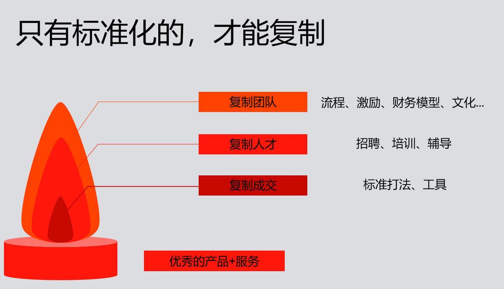

## 可复制的市场成功 | SaaS创业路线图（39）  

> 发布: 吴昊@SaaS  
> 发布日期: 2019-03-25  

“作者介绍 - 吴昊，SaaS创业顾问，纷享销客天使投资人、前执行总裁，8年SaaS营销团队创新+13年企业信息化经验。目前在为SaaS公司提供战略咨询，重点是销售团队的规模化。

> 内容提要：A/B轮前后的创业公司，大多面临如何高效复制局部市场成功的难题。从0到1靠产品和冲击力，从1到1000更依赖于知识框架和诸多细节上的经验。

（SaaS创业路线图）

我经常与SaaS企业的创始人交流，发现到了B轮前后，大家普遍对营销组织的发展很头疼：

* “招了一堆业务员无法独立成单，CEO和CTO常被叫去帮忙”\(这朋友的公司一年做2000多万，竟然有80%的单子是CEO参与的）

* “业务员人数增加了，业绩却没有同比增长，人均月产出不断下降”

* “缺乏标准的打单套路和管理方式，销售业绩忽高忽低”

* “销售合伙人没有带大营销团队的经验，但决策失误代价巨大、耽误抢占市场的机会，都是兄弟希望他能够和公司一起成长......”

前几天我去杭州拜访几家知名的SaaS公司时，分别为4个团队做了分享，主题就是《可复制的市场成功》。里面有这样一页：

下面我给大家详解一下这个方法的思维框架。

复制营销团队的前提，我在前面的文章中说过了，首先还是要有“产品价值闭环”产品。在服务方面则要考虑一个很关键的问题：销售人才的复制周期是2~6个月，相同产品的服务人才（客户成功经理）的复制周期是6~12个月（复杂产品更长），因此要考虑销售快速增长的情况下，服务力量是否能够跟上的问题。

SaaS的本质是续费。没有这些服务资源，销售一年增长5倍、10倍，只能带来灾难。

### 一、复制成交

那些到了A轮、B轮，还需要CEO、CTO出面打单的公司，应该是这一关都没过。

如何能让优秀的Sales持续出单？如果只靠个人能力，个人状态也不能持久。如果是一个长远打算的SaaS公司，应该考虑：标准化的销售打法和销售工具。

这包括销售全流程的方法、话术和完整的销售工包。

A、从简单的“快单”面销开始说，销售的基本工作流程是：

①找“潜在客户”（SUSPECT）资料（分 市场线索和业务员自开拓2种，这里就是营销策略的一个重要分叉，以后专题写）

②潜在客户培育：一般有市场部完成，业务员能力强的也会针对部分客户做一些

③电话邀约拜访：目的是见面（辅以短信、微信、邮件等方式）

④拜访流程：破冰——需求及痛点挖掘——产品价值陈述——解决信任问题——回答客户疑问——商务环节

⑤回款动作：不要认为签了合同就会回款，快单销售是要盯回款的

⑥培训及服务：销售与CSM（客户成功）的交接

以上“快单销售”指的是：客单价1~5万，成交周期1~4周，成交前拜访次数1~4次的产品销售模式。

需要标准化的内容不少，我根据上面6个步骤罗列一下：

①销售找客户的方法，公司可以统一确定3种以上，并鼓励Sales不断创新；

②市场部制定3~10套短信及邮件模板，每季度设计统一的DM单，由市场部统一培育（短信、公众号内容营销）或由每个业务员定向发送给自己的潜在客户；

③统一的3~5套邀约电话的话术、短信及邮件模板；

④统一破冰能力培训（茶、琴棋书画...）、目标客户常见痛点总结、统一产品价值讲述模板、建立信任的标准语言逻辑、客户十大常见问题标准答案、推进成交的标准思路。其中还要配套挖掘痛点的PPT、客户鉴证视频等销售工具。

⑤盯回款标准做法；

⑥服务交接流程、表单、考评方法。

以上内容形成标准文档，应该不会少于15000字。

B、如果是解决方案销售，这涉及MDR（市场开发代表）、SDR（销售开发代表）、AE（电话销售）、KA（大客户经理）、售前支持、实施、CSM（客户成功经理）多个岗位以及他们的管理者。

解决方案销售的业务流程设计、组织设计、各个环节转化率的监控更加重要，管理难度也更高。这个流程和逻辑很有意思，我另外再写专题。

今天只说一下解决方案型销售组织的关键点，就是市场与销售的线索传递关系。上篇《SaaS创业路线图（38）拜访杭州SaaS圈的一些共识》也说到，SDR进行分类分级是很关键的，否则后面无法对销售团队考评转化能力。没有考核，就很难通过管理手段介入提高。

### 二、复制人才

以上市场、销售套路标准化后，我们会发现还是不容易复制到每个人身上。

这次在杭州交流时，有个培训部门负责人就问我该不该搞“新兵训练营”。我说，如果上规模复制，当然应该搞；可是，你得先确认培训课程、培训组织的质量都能过80分。

另外，如果一个销售全流程对业务员基本素质和销售经验要求太高，是无法规模复制的。这时候你要考虑的，就是把这套打法的人才要求降下来。举例来说，如果你需要5年以上软件销售背景的人，这在一线城市都很稀缺。但如果你能把这套打法的难度降下来（例如通过更直击痛点的PPT、更有效的客户鉴证视频...），把对人员的要求降到“2年toB销售经验”，那你要招100人也难度不大。

复制人才本身也是有套路的。我有一套“集中面试-集中入职-集中培训”的标准方法论，感兴趣的同学可以看看我同系列的另一篇文章[《SaaS创业路线图（六）如何高效扩张团队？》](https://www.36kr.com/p/5141259)。（点击查看）

如果你有一套方法，可以让合格的业务员在2周内完成基础产品和销售技能培训，2个月后60%的新业务员出单数目能够达标，那恭喜你，你的团队复制就走上正轨了。

后面的工作就是不断优化，建立学习型组织，让大部分业务员积极参与自我学习和不断改进标准打法的过程中。

这也是标准化打法对跨区域团队的重要价值——大家有共同的工作语言，沟通成本大幅下降；升级后的方法和工具，又能够低成本快速落地。

关于复制人才，还得多说一点，要为员工职业发展做总体组织设计。快单型简单销售组织，要设计成长路径（设置多个级别）和晋升通道。解决方案销售组织，要设计MDR —> SDR —> AE —> KA/CSM 或类似这样的成长通道。特别是80、90后，他们喜欢更快的变化，厌恶重复。

### 三、复制团队

更难的是复制团队。你如何能够把一个城市团队的成功，复制到其它区域？如何把让每个团队都拥有高昂的士气和战斗状态？如何避免亚文化的产生？

我常说，营销在于创新，管理在于积累。

营销创新多么天马行空、弥天大勇都行，反正试了不行我们再换下一个招。可是管理不行 —— 提成政策一旦公布，就不能因为一个没有预想的特殊情况而朝令夕改，公司不但得多背成本，还会引起对管理公平的质疑......一个错误的干部任命则会让一个团队连续多月萎靡不振......

虽然管理可以学习，但试错成本太高，激烈的竞争环境下机会稍纵即逝\!

我给大家一个建设“可复制团队”的Check List，大家可以看看自己公司在各项任务上得分如何：

1.关键业务流程的建设：清晰、有效、可数字衡量、可不断改善

2.提成、激励制度的建设：在财务核算模型上，基于公司当前战略目标，设计匹配的提成及激励制度，激发一线团队的工作热情，正确平衡好内部竞争与合作的关系

3.建立部门日常工作规范：周报/日志、CRM使用、例会制度

4.人才培养机制：如何设计公司的领导梯队？如何通过公司的目标引导和机制设计，让各级干部都愿意对自己提出更高成长要求、愿意招募更优秀的人才、愿意培养下属？

5.文化传播机制：一个区域优秀的创业文化能否复制到其他团队？公司及团队活动：是否能够展现公司的VMV（使命愿景价值观）？是否能够沉淀成文字和标准化？

6.建立关键指标体系：实现数字化管理，坚持月度数据例会

7.公司营收模型搭建及年度预算：控制现金流，抓住发展机遇

当然，标准化方法相对让销售团队各自“散打”有更高的风险，如果标准套路本身不完善，复制只能出更多问题。因此，要确保“标准”的质量很高，经过充分的打磨和验证。

从0到1靠产品和冲击力，从1到1000更依赖于知识框架和诸多细节上的经验。

今天的内容也希望和同学们互动互动 —— 从创业公司融资阶段和市场复制阶段两个维度考虑，你所在的公司处于哪个阶段？（投票后可以看到咱们这个读者群的统计结果）

投票项：

1、 天使轮及之前，“复制成交”阶段（标准打法打磨中）

2、 A轮，“复制成交”阶段（标准打法打磨中）

3、 A轮，“复制人才”阶段（区域市场扩张期）

4、 B轮，“复制人才”阶段

5、 B轮，“复制团队”阶段（全国市场覆盖期）

6、 C轮及以上，“复制人才”阶段

7、 C轮及以上，“复制团队”阶段

相关文章：

[SaaS创业路线图（一）](https://www.36kr.com/p/5136068)

[SaaS创业路线图（六）如何高效扩张团队？](https://www.36kr.com/p/5141259)

[SaaS创业路线图（37）如何培养基层干部及管理者的能力模型](https://www.36kr.com/p/5182374)

[SaaS创业路线图（38）拜访杭州SaaS圈的一些共识](https://www.36kr.com/p/5184217)
