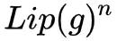

## 可逆ResNet：极致的暴力美学  

> 原创：  
> 苏剑林  
> 作者: PaperWeekly  
> 发布日期: 2019-03-26  

作者丨苏剑林

单位丨广州火焰信息科技有限公司

研究方向丨NLP，神经网络

个人主页丨kexue.fm

今天我们来介绍一个非常“暴力”的模型：可逆 ResNet。

为什么一个模型可以可以用“暴力”来形容呢？当然是因为它确实非常暴力： **它综合了很多数学技巧，活生生地（在一定约束下）把常规的 ResNet 模型搞成了可逆的！**

**▲** 标准ResNet与可逆ResNet对比图。可逆ResNet允许信息无损可逆流动，而标准ResNet在某处则存在“坍缩”现象。

模型出自  _ **Invertible Residual Networks**_ ，之前在[机器之心也报导过](https://mp.weixin.qq.com/s?__biz=MzA3MzI4MjgzMw==&mid=2650756763&idx=3&sn=f7868fa0d2eab102aadebf794a6ecf73&scene=21#wechat_redirect)。在这篇文章中，我们来简单欣赏一下它的原理和内容。

### 可逆模型的点滴

为什么要研究可逆 ResNet 模型？它有什么好处？以前没有人研究过吗？

**可逆的好处**

可逆意味着什么？

意味着它是 **信息无损** 的，意味着它或许可以用来做更好的分类网络，意味着可以直接用最大似然来做生成模型，而且得益于 ResNet 强大的能力，意味着它可能有着比之前的 [Glow 模型](http://mp.weixin.qq.com/s?__biz=MzIwMTc4ODE0Mw==&mid=2247491113&idx=1&sn=4b185eb6985fc747a071d00d37d3ed3c&chksm=96e9c1a9a19e48bfc93e0a1252d18c3ce98e7495bc1d05ae93e6bf0354d737c897dd64ec3188&scene=21#wechat_redirect)更好的表现。

总而言之，如果一个模型是可逆的，可逆的成本不高而且拟合能力强，那么它就有很广的用途（分类、密度估计和生成任务，等等）。

而本文要介绍的可逆 ResNet 基本上满足这几点要求，它可逆起来比较简单，而且基本上不改变 ResNet 的拟合能力。因此，我认为它称得上是“美”的模型。

**旧模型的局限**

可逆模型的研究由来已久，它们被称为“流模型（flow-based model）”，代表模型有 [NICE](http://mp.weixin.qq.com/s?__biz=MzIwMTc4ODE0Mw==&mid=2247490842&idx=1&sn=840d5d8038cd923af827eef497e71404&chksm=96e9c29aa19e4b8c45980b39eb28d80408632c8f9a570c9413748b2b5699260190e0d7b4ed16&scene=21#wechat_redirect)、[RealNVP](http://mp.weixin.qq.com/s?__biz=MzIwMTc4ODE0Mw==&mid=2247491113&idx=1&sn=4b185eb6985fc747a071d00d37d3ed3c&chksm=96e9c1a9a19e48bfc93e0a1252d18c3ce98e7495bc1d05ae93e6bf0354d737c897dd64ec3188&scene=21#wechat_redirect) 和 [Glow](http://mp.weixin.qq.com/s?__biz=MzIwMTc4ODE0Mw==&mid=2247491113&idx=1&sn=4b185eb6985fc747a071d00d37d3ed3c&chksm=96e9c1a9a19e48bfc93e0a1252d18c3ce98e7495bc1d05ae93e6bf0354d737c897dd64ec3188&scene=21#wechat_redirect)，笔者曾撰文介绍过它们，另外还有一些自回归流模型。除了用来做生成模型，用可逆模型来做分类任务的也有研究，代表作是 _**RevNet**_ \[1\] 和 **_i-RevNet_** \[2\]。

这些流模型的设计思路基本上都是一样的： **通过比较巧妙的设计，使得模型每一层的逆变换比较简单，而且雅可比矩阵是一个三角阵，从而雅可比行列式很容易计算。**

这样的模型在理论上很优雅漂亮，但是有一个很严重的问题：由于必须保证逆变换简单和雅可比行列式容易计算，那么 **每一层的非线性变换能力都很弱** 。事实上像 Glow 这样的模型，每一层只有一半的变量被变换，所以为了保证充分的拟合能力，模型就必须堆得非常深（比如 256 的人脸生成，Glow 模型堆了大概 600 个卷积层，两亿参数量），计算量非常大。

**硬“杠”残差模型**

而这一次的可逆 ResNet 跟以往的流模型不一样，它就是在普通的 ResNet 结构基础上加了一些约束，就使得模型成为可逆的，实际上依然保留了 ResNet 的基本结构和大部分的拟合能力。这样一来，以往我们在 ResNet 的设计经验基本上还可以用，而且模型不再需要像 Glow 那样拼命堆卷积了。

**当然，这样做是有代价的，因为没有特别的设计，所以我们需要比较暴力的方法才能获得它的逆函数和雅可比行列式。所以，这次的可逆 ResNet，很美，但也很暴力，称得上是“极致的暴力美学”。**

**可逆“三要素”  **

ResNet 模型的基本模块就是：

也就是说本来想用一个神经网络拟合 y 的，现在变成了用神经网络拟合 y−x 了，其中 x,y 都是向量（张量）。这样做的好处是梯度不容易消失，能训练深层网络，让信息多通道传输，等等。可逆的意思就是 x+g\(x\) 是一个一一映射，也就是说每个 x 只有一个 y 与之对应，反过来也是，换言之我们理论中可以从中解出反函数 x=h\(y\) 来。

背景就不多说了，但是要说明一点，我们在分类问题中用的广义上的 ResNet，是允许通过 1×1 卷积改变维度的，但这里的 ResNet 指的是不改变维度的 ResNet，也就是说 **x,y 的大小保持一样** 。

对于一个号称“可逆”的模型，必须要回答三个问题：

* 什么时候可逆？

* 逆函数是什么？

* 雅可比行列式怎么算？

从难度上来看，这三个问题是层层递进的。当然，如果你只关心做分类问题，那么事实上保证第一点就行了；如果你关心重构图片，那么就需要第二点；如果你还想像 Glow 那样用最大似然来训练生成模型，那么就需要第三点。

下面按照原论文的思路，逐一解决这三个问题（三道“硬菜”），来一场暴力盛宴。

**什么时候可逆？**

第一道硬菜是三道硬菜中相对容易啃的，当然只是“相对”，事实上也都用到了泛函分析的一些基础知识了。

因为 \(1\) 是 ResNet 的基本模块，所以我们只需要保证每个模块都可逆就行了。而 \(1\) 可逆的一个充分条件是：

其中：

是函数 g 的 Lipschitz 范数。也就是说， **g 的 Lipschitz 范数小于 1，就能保证 \(1\) 可逆了。**

那什么时候 g 的 Lipschitz 范数才会小于 1 呢？因为 g 是神经网络，卷积和全连接都无妨，神经网络是由矩阵运算和激活函数组合而成的，即代表结构是：

那么由链式法则，“g 的 Lipschitz 范数小于 1”的一个充分条件是“Activation 的 Lipschitz 范数不超过 1”且“Wx+b 的 Lipschitz 范数小于 1”。而 Activation 只是个标量函数，“Lipschitz 范数不超过 1”意味着导数不超过 1 就行了，目前我们常用的激活函数（sigmoid、tanh、relu、elu、swish 等）都满足，所以这一点不用管它；而“Wx+b 的 Lipschitz 范数小于 1”，意味着矩阵 W 的 Lipschitz 范数小于 1。

矩阵 W 的 Lipschitz 范数其实也就是“谱范数”，记为 Lip\(W\) 或

一文中我们讨论 Lipschitz 约束的时候就出现过，两者结合起来，结论就是：

对模型 g 的所有核权重 W 做谱归一化，然后乘上一个大于 0 小于 1 的系数 c（即
），就可以使得 x+g\(x\)
 可逆了。

**逆函数是什么？**

为什么这样就可逆了？证明过程可以直接回答第二个问题，也就是说，我们直接把逆函数求出来，然后就知道什么条件下可逆了。

假如 y=x+g\(x\) 是可逆的，那么我们要想办法求出逆函数 x=h\(y\)，这其实就是解一个非线性方程组。简单起见，我们考虑迭代：

显然，迭代序列 \{Xn\} 是跟 y 有关的，而一旦 \{Xn\} 收敛到某个固定的函数：

那么我们就有，这意味着
就是我们希望求的 x=h\(y\)
。

换句话说，如果迭代 \(5\) 收敛，那么收敛的结果就是 x+g\(x\) 的逆函数。所以我们只需要搞清楚 \(5\) 什么时候收敛。这时候前面的条件 Lip\(g\)<1 就能用上了，我们有：

所以：

可以看到，
的充分条件是 Lip\(g\)
<1。

**附：** 单纯指出
并不能说明序列 \{Xn\} 收敛，比如 \{lnn\} 这个序列也满足这个条件，但发散。所以，为了证明 Lip\(g\)
<1 时 \{Xn\} 收敛，我们还需要多做一些工作。不过这是比较数学的部分了，考虑到部分读者可能不感兴趣，因此作为附注。

对于任意正整数 k，我们继续考虑

：

可以看到我们得到了的一个上界，它只与 n 有关，且可以任意小。也就是说，对于任意 ε>0，我们可以找到一个 n，使得对于任意的正整数 k 都有

。这样的数列我们称为 Cauchy 列，它是必然收敛的。

至此，我们终于证明了 \{Xn\} 的收敛性。顺便一提的是，在 \(9\) 中，取 k→∞，我们得到：

也就是说，这个迭代算法的收敛速度跟正比于
，那么自然是 Lip\(g\) 越小收敛越快，但是 Lip\(g\)
 越小模型的拟合能力越弱，原论文中它的范围是 0.5~0.9。

说宏大一点，其实这就是泛函分析中的 **“巴拿赫不动点定理”** ，又称 **“压缩映射定理”** （因为 Lip\(g\) 小于 1，所以 g 被称为一个压缩映射）。

这样一来，我们已经回答了为什么 Lip\(g\)<1 就有 x+g\(x\) 可逆了，同时已经给出了求逆函数的方法——就是通过 \(5\) 迭代到足够的精度：

当做好归一化操作使得 x+g\(x\) 可逆后，它的逆函数为

的不动点。数值计算时，只需要迭代一定步数，使得满足精度要求即可。

终于，我们啃下了第二道硬菜。

**雅可比行列式怎么算？**

下面来到三个问题中最“硬核”的一个问题：雅可比行列式怎么算？为了解决它， **作者综合了数学分析、矩阵论、概率论、统计采样等多方面数学工具，堪称“暴力之最”、“硬菜之最”。**

首先，为什么要算雅可比行列式？前面已经说了，只有做生成模型时才有这个必要，具体细节请参考笔者最早的对流模型的介绍[《细水长flow之NICE：流模型的基本概念与实现》](http://mp.weixin.qq.com/s?__biz=MzIwMTc4ODE0Mw==&mid=2247490842&idx=1&sn=840d5d8038cd923af827eef497e71404&chksm=96e9c29aa19e4b8c45980b39eb28d80408632c8f9a570c9413748b2b5699260190e0d7b4ed16&scene=21#wechat_redirect)。接着，我们知道雅可比行列式就是雅可比矩阵的行列式，所以要把雅可比矩阵算出来：

再次提醒，虽然我偷懒没有加粗，但这里的 g 输出是一个向量，x 也是一个向量，∂g/∂x 实际上就是输入和输出两两配对求偏导数，结果是一个矩阵（雅可比矩阵）。

然后，雅可比行列式就是

，但事实上，在做生成模型的时候，我们真正要算的，是“雅可比行列式的绝对值的对数”，即：

最后一个恒等号，是因为 det\(I+Jg\) 一定是正数，所以可以去掉绝对值。这是可以证明的，但只是细节部分，我们就不纠结了，读者自行去看作者提供的参考文献吧。

然后呢？直接按定义来计算雅可比行列式？不行，因为这样子计算量实在是太大了，而且反向传播的时候，还要算行列式的导数，那就更复杂了。作者们想出了繁琐但有效的解决方法，利用恒等式（参考 **《恒等式 det\(exp\(A\)\) = exp\(Tr\(A\)\) 赏析》** \[3\]）：

我们得到：

如果能求出 ln\(I+Jg\) 来，然后求迹（trace，对角线元素之和）就行了。怎么求 ln\(I+Jg\) 呢？还是参考 **《恒等式 det\(exp\(A\)\) = exp\(Tr\(A\)\) 赏析》** \[3\]，暴力展开：

注意这个级数收敛的条件是
，这正好意味着 Lip\(g\)
<1，而这正是可逆 ResNet 的约束，前后完全自洽。

现在 ln\(I+Jg\) 变成了一个无穷级数，如果截断 n 项，那么误差也正比于
，所以我们要看 Lip\(g\)
 来决定截断的数目。于是我们可以写出：

问题解决了吗？上式需要我们去计算

，注意 Jg 是一个矩阵，我们要算矩阵的 n 次方（想想算两个矩阵乘法的工作量）。于是作者们想： **既然分析的工具用完了，那我们就上概率统计吧。**

假设 p\(u\) 是一个多元概率分布，其均值为 0、协方差为单位矩阵（显然标准正态分布符合要求），那么对于任意矩阵 A，我们有：

利用“均值为 0、协方差为单位矩阵”这个性质，直接按定义就可以证明上式了，并不困难。然后，作者提出了一个显得“既无赖又合理”的方法：对于每次迭代，我只从 p\(u\) 中随机选两个向量 u1,u2 出来，然后认为
就是 Tr\(A\)
，即：

读者可能就有意见了，不是要对所有向量求平均吗？只随机挑两个就行了？其实还真的是可以了，理由如下：

1\. 我们优化都是基于随机梯度下降的，本来就带有误差，而只随机挑两个也有误差，而每步迭代都重新挑不同的 u1,u2，在一定程度上就能抵消误差；

2\. 更重要的原因是，我们要算雅可比行列式的对数，只是用它来做一个额外的 loss，来保证模型不会坍缩，简单来讲，可以将它看称一个正则项，而既然是一个正则项，有点误差也无妨。

所以，

的计算就被作者用这么粗暴（又有效）的方案解决了。注意到：

所以不需要把

算出来，而是每步只需要算一个矩阵与一个向量的乘法，并且每步计算可以重复利用，因此计算量是大大减少的。

所以，最终可以总结为：将雅可比矩阵做对数级数展开 \(15\)，然后将行列式计算转化为迹的计算 \(16\)，并且利用概率采样的方式 \(18\)，就可以最高效地计算雅可比行列式。

### 纵观实验效果

其实笔者一开始是就被“可逆 ResNet”这么美好的构思吸引过来的，但是看到这里，我发现我也怂了，这绝对对得起“硬杠 ResNet”的评价呀。本来想对照着好歹实现个 mnist 的生成来玩玩，后来确认有这么多技巧，如此之暴力，我也放弃了。

所以，还是来看看原论文的实验结果好了。

**Toy数据集**

首先是一个人造的 Toy 数据集，也就是构造一些有规律的随机点来，然后用生成模型去拟合它的分布，GAN 中也常做这样的实验。

从下图可以看到可逆 ResNet 的效果比 Glow 好得多，归根结底，我觉得是因为可逆 ResNet 是一个很对称的、没有什么偏置的模型，而 Glow 则是有偏的，它需要我们以某种方式打乱输入，然后对半切分，对半之后两部分的运算是不一样的，这就带来了不对称。

**▲** ** ** 可逆ResNet实验：Toy数据集

**类任务实验  **

一开始我们就说了，既然是 ResNet 的一种，最基本的用途就是分类了。下表表明用可逆 ResNet 做分类任务，效果也是很不错的，Lipschitz 约束的存在不会明显影响分类结果（表中的 c 就是 Lip\(g\)）。

**▲** ** ** 可逆ResNet实验：分类效果

**生成模型实验**

其实流模型系列在生成复杂图片方面还远比不上 GAN，但相互之间的定量对比倒没有问题。下图也表明可逆 ResNet 作为一个基于流的生成模型方面也是很优秀的。

**▲** ** ** 可逆ResNet实验：生成模型效果

### 终于可以收工了

这样活生生地取硬杠 ResNet 可真是一件苦力活，我就单纯的解读就已经这么累了，真佩服作者的数学功底。当然，最后作者终究还是成功了，想必成功的喜悦也是很丰盛的。总的来说， **整个工作很暴力，但细细品味之下并没有什么违和感，反倒是有一种浑然的美感在里边，并非简单的堆砌数学公式。**

唯一的问题是，整个“硬杠”的流程还是挺复杂的，因此要推广使用还是得有好的封装，而这往往就让很多人望而却步了。还有一个问题，就是流模型系列为了保证可逆，自然是不能降维的，但不降维必然就导致计算量大，这是个矛盾的地方。

一个有趣的想法是，对于降维的情形， **能不能搞个类似矩阵的“伪逆”那样的模型** ，来达到类似可逆ResNet的效果呢？非方阵也可以搞个行列式出来的（比如 **《再谈非方阵的行列式》** \[4\]），因此降维变换也应该能够搞个雅可比行列式的对数出来。貌似不少地方是可以推广过来的。

流模型后面的方向究竟如何呢？让我们拭目以待。

### 参考文献

\[1\] Aidan N. Gomez, Mengye Ren, Raquel Urtasun, Roger B. Grosse. The Reversible Residual Network: Backpropagation Without Storing Activations. arXiv preprint arXiv:1707.04585, 2017. 7

\[2\] Jörn-Henrik Jacobsen, Arnold Smeulders, Edouard Oyallon. i-RevNet: Deep Invertible Networks. In Proceedings of the International Conference on Learning Representations \(ICLR\), 2018.

\[3\] https://kexue.fm/archives/6377

\[4\] https://kexue.fm/archives/6096

**点击以下标题查看作者其他文章：**

* [变分自编码器VAE：原来是这么一回事 | 附源码](http://mp.weixin.qq.com/s?__biz=MzIwMTc4ODE0Mw==&mid=2247487949&idx=1&sn=e09391933f3c4493cfb737b0ea2cf0af&chksm=96e9ce4da19e475b0c789088d403a0f49449b8ba0c43734aa835c5d2a7cb69c3d839c7ce056c&scene=21#wechat_redirect)

* [再谈变分自编码器VAE：从贝叶斯观点出发](http://mp.weixin.qq.com/s?__biz=MzIwMTc4ODE0Mw==&mid=2247488093&idx=1&sn=08a77550c0cc7309c34a0a38bad0bcba&chksm=96e9cddda19e44cb7ce6143a7990eb4fc47d114b55b564e727a014538402f7218fc89bf1f3c0&scene=21#wechat_redirect)

* [变分自编码器VAE：这样做为什么能成？](http://mp.weixin.qq.com/s?__biz=MzIwMTc4ODE0Mw==&mid=2247488238&idx=1&sn=06ffb033332a54279e600c511e1c5c5f&chksm=96e9cd6ea19e44781ee1313b349e0e77631781a2a163e2fd845c841dc2200d988424bd73c4c7&scene=21#wechat_redirect)

* [简单修改，让GAN的判别器秒变编码器](http://mp.weixin.qq.com/s?__biz=MzIwMTc4ODE0Mw==&mid=2247495491&idx=1&sn=978f0afeb0b38affe54fc9e6d6086e3c&chksm=96ea30c3a19db9d52b735bdfee3f535ce68bcc6ace230b452b2ef8d389e66d32bba38e1574e3&scene=21#wechat_redirect)

* [深度学习中的互信息：无监督提取特征](http://mp.weixin.qq.com/s?__biz=MzIwMTc4ODE0Mw==&mid=2247492040&idx=1&sn=f90a6b899e62748c4db489ce06276869&chksm=96ea3e48a19db75e8c07d942a4772bb6c784fac7bcb117da2023186546cfe1876b121a8121cc&scene=21#wechat_redirect)

* [全新视角：用变分推断统一理解生成模型](http://mp.weixin.qq.com/s?__biz=MzIwMTc4ODE0Mw==&mid=2247490514&idx=1&sn=c066be4f8d2ac3afa8378d180864eed0&chksm=96e9c452a19e4d44eb6a879c5eb4a1426d6de370a0f3c5b6a27c6b8dfc6a938a3851baa258e5&scene=21#wechat_redirect)

* [细水长flow之NICE：流模型的基本概念与实现](http://mp.weixin.qq.com/s?__biz=MzIwMTc4ODE0Mw==&mid=2247490842&idx=1&sn=840d5d8038cd923af827eef497e71404&chksm=96e9c29aa19e4b8c45980b39eb28d80408632c8f9a570c9413748b2b5699260190e0d7b4ed16&scene=21#wechat_redirect)

* [细水长flow之f-VAEs：Glow与VAEs的联姻](http://mp.weixin.qq.com/s?__biz=MzIwMTc4ODE0Mw==&mid=2247491695&idx=1&sn=21c5ffecfd6ef87cd4f1f754795d2d63&chksm=96ea3fefa19db6f92fe093e914ac517bd118e80e94ae61b581079023c4d29cedaaa559cb376e&scene=21#wechat_redirect)

* [深度学习中的Lipschitz约束：泛化与生成模型](http://mp.weixin.qq.com/s?__biz=MzIwMTc4ODE0Mw==&mid=2247492180&idx=1&sn=3ea92a3a9f1306efde89ce1777b80da6&chksm=96ea3dd4a19db4c20dcbc9627b0eb307672b4d61008a93c42814fa6728ca7b6f7c293cff1d80&scene=21#wechat_redirect)
