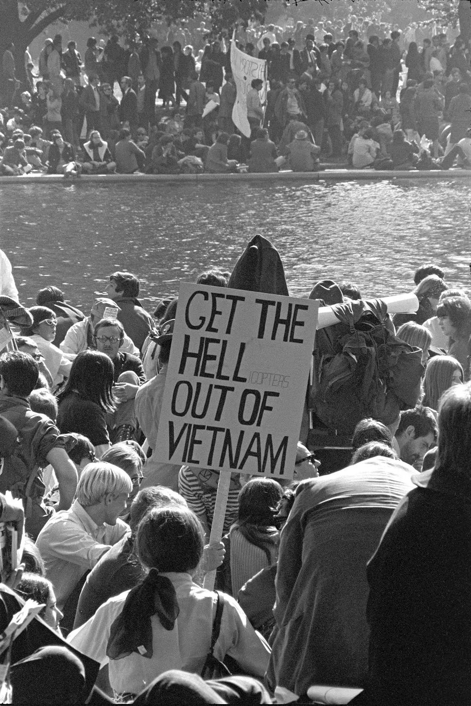

## 历史上的三次从美国涌入加拿大的难民潮  

> 原创：  
> 美华  
> 作者: 美国华人  
> 发布日期: 2019-03-08  

**美国华人
**

第1468篇文章

特朗普极右的移民政策，使得成千上万的身份未定的美国居民，如同逃避战争逃避灾荒一样，越过加美边境，逃到加拿大，成为避难寻求者。而加拿大历史上，曾有三次因美国而起的难民潮。前事不忘，后事之师, 我们现在移民加拿大，成为加拿大人，有义务主动接受加拿大人人平等的理念。

正文共：4210字

预计阅读时间：11分钟

撰文：多伦多cici

所谓三十年河东三十年河西，美国总统宝座轮流坐，这会子轮到一个叫特朗普的大忽悠当总统了......

本来，作为一个加拿大人，本人既没那心思干涉美国人民的内政，又没美国投票权，特朗普上台，额手称庆普大喜奔也好，抚胸跺脚痛心疾首也好，都轮不我吧？

《福布斯》报道：“越来越多的来自美国的非法移民跨越边境进入加拿大”。（《福布斯》网站截屏）

偏偏，特朗普上台之后的新官上任三把火，把把火都和咱加拿大相关。别的不说，光是他极其右倾的移民政策，就使许多美国的无证移民，如同逃避战争逃避灾荒一样，越过加美边境，逃到加拿大，成为避难寻求者。

闹得加拿大的华人社区也不得安宁了。一向以“合法”移民自居高高在上居高临下的部分华人右派，思维方式上没有一星半点的加拿大人人平等理念，对所谓人上人歧视人下人的歧视链，融入骨髓，应用自如，而不自知。

本来自己族裔华人身份，已经是加拿大右派排外歧视链的底端，现在这些华人右派眼中看到“非法”难民涌入，立马找到底端的底端，转身就打压这些避难寻求者——这也是一种优越感爆棚的表现吧？

闲话少叙，作为铁杆左派的我给读者们聊一聊历史上，因美国而起的三起涌入加拿大的难民潮。

**第一波：保皇党（loyalists）**

这个英文单词loyalists翻译成保皇党，汉化倒是蛮地道的，让汉语读者们联想丰富，回忆起康有为梁启超之类的历史人物，但含义上还是少点火候，跟加拿大特色不符。

加拿大虽然至今仍然留在英联邦之内，尊从英国王室为国家元首，但只有国王或女王，没有皇帝，保皇党的皇，从何而来？

回顾美国独立战争（1775年到1783年）这一段历史，很有“历史是任人打扮的小姑娘”的感觉。

高大上而言，战争中诞生的美国《独立宣言》，政教分离原则，人人平等，自由，民主，民意代表选举，联邦制，各州自主权，这一套国家政府理念，和现实制度实践，跟固步自封的老牌欧洲世袭王国相比，历史进步意义非常重大，自然是民主灯塔自由标杆。

低小下而言，独立战争的前因后果，都实在找不出多少拿得出手摆得上台面的冠冕堂皇。仔细审查一番历史记载，那些动武起义暴动的契机，那些历史书上记载的事件——波士顿倾茶事件，茶党，冲击海关死人事件，拿现在的标准来看，说句不客气的话，很有点泼皮无赖的做法。

无代表，不纳税。不自由，毋宁死。口号都不错，都挺让人热血沸腾的。不过，只要不是无政府主义教条的信奉者，就知道一个政府的存在，必然需要纳税人的钱来运转。国会需要代表，殖民地需要更多自主权，都是可以“商议”的议题，而不是非要发起“战争”不可的缘由。

历史无法假设，反正美国独立战争仗也打了，大英帝国有点不明不白地也输了，巴黎条约（1783年）也签了，美国独立了。

现在美国早已取代大英帝国，成为全球首款盗版帝国，美国人也成为最为自己国家成功自豪的国民。

遥想当年，美国宣布独立（1776年）之后，特别是英国正式签订巴黎条约（1783年），准许美国独立之后，大约有10万效忠大英帝国的保皇党人，挥泪辞别初生新生的美国国土。

这些保皇党人，要不海归英国本土继续做大英帝国的子民，要不南下去了英国在加勒比海上的殖民地海岛。其中大约一半从美国逃离的保皇党人，收拾自家细软，拖家带口，最后北上到现在的加拿大境内定居。

找到一篇网文，翻译了一位保皇党初到加拿大国土的观感：“我爬上山顶看到船只消失在远方的地平线上，孤独悲凉的感觉顿时涌上心头，战争期间我没有流过一滴眼泪。此时此刻坐在潮湿的苔藓之上抱着我的孩子，眼泪禁不住滚滚而下。”这样的状述，活生生难民形象哦。

独立战争期间逃亡的保皇党人。（图片来自维基百科）

如果当年有新闻照片传世，这样穿越边境线的逃离景象，会跟如今华人右派眼中的非法入境者，非常相似。

有一个细节我可以透露给华人右派们，你知道你们现在拥戴的加拿大保守党，外号叫啥？叫tories，知道来龙去脉吗？这明显是一个送分题哦，当年保皇党的别称很多，king’s men, royalists,  其中之一正是tories。

真是风水轮流转啊，当年的tories因为政见不合，自己成为逃到加拿大的难民，现在的保守党政客和保守党拥趸，居然成为反难民反移民反一切外来人口的主力军。

**第二波：奴隶（slaves）**

因美国总统特朗普而起的加拿大难民难题，我聊tories挥泪北上加拿大的历史掌故，字里行间看得出我对美国建国史的热嘲冷讽，连泼皮无赖的说法，都冒出来了，不过，如果要说我看不起美国，讨厌美国，憎恨美国，那你又大错特错了。

要知道，美国不仅仅是右派红脖子的美国，不仅仅是右派特朗普总统的美国，美国也是华人右派口中白左遍地的美国哦，时不时冒出一个两个白左感人肺腑的事例，你们热嘲冷讽，可是，这样的白左事迹，有成千上万个噢，你们华人右派，估计怒骂“圣母婊”你们都骂不过来！

美国之所以伟大，不一定都是白左的功劳，但美国的确有那么一群有担当有道义的美国人，无时无刻不在监督自己的国家，自己的政府，甚至，说句政治非常不正确的话，也在监督自己的人民，整个国家在不断地反省，不断地修正，也因此，不断地进步，不断地前进，不断地提升。

这样不断向前的美国历史，最让我震憾的典型例子，就是美国黑奴解放运动，左右两派，蓄奴州，废奴州，为了各自的政治理念，甚至不惜诉诸武力，发动南北战争（1861年4月12日至1865年5月13日），直到枪杆子里头出正义公平，才让野蛮的奴隶制度，在美国全境，成为非法。

在这个漫长的黑暗奴隶时代，本来美国自己本土因为合众国的国体特色，各州各自为政，南方数州是铁杆蓄奴州，北方自由派当道多半是废奴州，同情奴隶遭遇的美国人，帮助逃跑的奴隶，进入北方自由州，就算到了安全地带。

你们美国人自己，因为一个奴隶议题，闹腾来折腾去，本来跟加拿大没多大的关系，没加拿大什么事儿。

结果是到了美国本土左右手互搏拉锯战最紧张最剧烈的历史时期，美国南方蓄奴州有一段时间占据联邦国会优势，1850年强行通过一项臭名昭著的联邦法律 ——《逃亡奴隶法案》\(Fugitive Slave Act\)，容许南方的奴隶主，有权“维护私有财产神圣不可侵犯”的美国立国之天条，跨州抓捕逃跑的奴隶，甚至由此产生一种新的职业，专门抓捕逃跑奴隶以获取赏金的奴隶猎人。

也就是说，按照美国联邦法律，那些哪怕是逃到美国北方废奴州的奴隶们，现在生活在北方州，也不再安全不再自由了！随时随地，都有可能被南方奴隶主抓住，遣送回南方的奴隶庄园，重回暗无天日的奴隶生涯。

《为奴十二年》剧照。

奥斯卡获奖电影，《为奴十二年》，说的就是这段悲惨历史。

也就是在这样美国黑暗历史的衬托之下，加拿大人救助逃亡奴隶，并对逃跑奴隶敞开国门的光辉历史，才显得如此熠熠生辉。

此处应该有一段煽情的文字，英文记载也写到，在最深最黑的夜里逃亡的奴隶们，不得不再次从美国北方州仓皇起程，抬头望见北斗星，向北，向北，北方的加拿大，才是自由的安全国度啊！

请原谅我的多愁善感，一百多年之后的今天，我用手机屏幕键盘敲击写下这些文字，我都忍不住热泪盈眶。

加拿大人救助美国逃跑奴隶的感人事例，绝对不是一个两个白左个体事迹，而是有一个专门的历史名词，来描述当年加拿大人冒死救助美国奴隶的历史功绩，这个专门术语，叫“通向加拿大的地下铁路”\(Underground Railroad to Canada\)。

如果此时，设想一下，你们华人右派动用来之不易自由表达的民主权力，你们上街游行示威，你们打出标语，号称对非法入境者说“不”，不用担心，正如历史记住了加拿大人救助奴隶的地下铁路一样，历史会记住你们的。

**第三波：越战美军**

正如我在第一波从美国逃到加拿大难民潮所叙，美国这个国家，脱离老东家大英帝国，是独立战争打下来的。从成立的第一天起，效忠美国自己国家的美国人，就跟北边效忠大英帝国的保皇党大本营英属殖民地上下加拿大人，有那么一丢丢的南辕北辙哦。用俺们古典中国的比喻说法，加拿大和美国有点欢喜冤家的味道。

举一个最近的例子吧。

九一一大变之后，美国出头，要打阿富汗，加拿大作为邻家小弟，义不容辞，派兵派物资，参与阿富汗反恐战争\(2001年\)。

后来美国又要以反恐名义打伊拉克\(2003年\)，加拿大就完全不看隔壁老大哥的眼色行事，死活不参与不出兵，再怎么哥俩好，毕竟加拿大是一个主权独立的国家啊！

非常近似的例子，离我们这一代中国移民也很近。

眼看着金日成在大佬苏联明帮暗助之下，就要把大韩民国的李承晚赶到太平洋里面去了，美国出头，要打北韩，加拿大作为邻家小弟，义不容辞，派兵派物资，参与战争（1950年）。

后来美国又要以几乎同样的名义打胡志明的北越\(1955年至1975年\)，加拿大就完全不看隔壁老大哥的眼色行事，死活不出兵，再怎么哥俩好，毕竟加拿大是一个主权独立的国家啊！（编者注：加拿大政府从未正式参加越南战争，有部分民间志愿者加入美军参战。）

1967年10月21日，首都华盛顿的反越战抗议示威。（图片来自维基百科）

美国发动越南战争，加拿大不掺合，立马就在加拿大美国边境，涌起一股非法越境者，就是我现在介绍的第三波难民潮，反抗越南战争的美国人，“非法”越境寻求庇护。这些美国人主要是当时美国政府实行义务兵役制度下，反抗强制征兵参战的美国年轻人，用汉语的贬义词来讲，实打实临阵脱逃的逃兵。

历史真是惊人相似地重复哦，加拿大当时也是自由党政府，政府首脑正是现任特鲁多总理的老爹老特鲁多，一个华人右派眼中典型的白左，按照白左习以为常的做法，由政府出面，积极处理和审核来自美国的避难寻求者，也就是华人右派分子肯定会做道德评判的这些越战逃兵。

加拿大统计局的资料显示，从反越战运动开始之后的1966年到1975年，共有24万美国人移居加拿大。

1969年，加拿大甚至专门通过法律，一点面子也不给美国政府，允许美国军人移民，这为美国反抗越战的逃兵打开了大门。

据维克托·莱万特《安静的同盟：越战中的加拿大》\( _Quiet Complicity Canadian Involvement in the Vietnam War, by Victor Levant, 1986_ \) 一书估计，越战期间大约有两万名美国逃兵，和一万二千名其他武装力量人员，“非法”越境穿越加拿大美国边境，寻求战争避难。

在加拿大政府的积极处理应对之后，这些“非法”越境者的绝大多数，都获得了加拿大政府的庇护，最终成为合法难民。

**结 语**

前事不忘，后事之师。我们现在移民加拿大，成为加拿大人，拥有对国家大事说三道四自由表达的民主权力，作为铁杆左派，我一向对右派朋友行使游行示威的民主权力举双手赞成支持。

只不过，咱汉语古典智慧有云：三思而后行，复习回顾一下加拿大历史上，从美国涌进来的“非法”越境寻求庇护的三次难民潮，看看谁是谁非，仔细看看大浪淘沙之后，历史的正义，站在哪一边，然后再上街，再举标语，再喊口号，再对民选市长议员总理说yes还是说no，行不？

撰文：多伦多cici

编辑：Jing

本文由作者授权原创首发于《美国华人》公众号

━━━━━━━━━━━━━━━━━━━━

请加小编微信号 | CAeditor

广告、转载、投稿、读者讨论群

━━━━━━━━━━━━━━━━━━━━

推荐阅读

《[捐款1美元！支持杨安泽！华人要服务、激励，更要去领导](http://mp.weixin.qq.com/s?__biz=MjM5NDE1NTc4Nw==&mid=2655641974&idx=1&sn=dd59e6073b2c205b55c76cfa2c92ea60&chksm=bd315d128a46d4045f37256ce05bdc81edb6af040fe5dab4ea3ad135d037f699c81f519eaac9&scene=21#wechat_redirect)》

《[三张图告诉你华裔总统候选人Andrew Yang不是疯子](https://mp.weixin.qq.com/s?__biz=MjM5NDE1NTc4Nw==&mid=2655641858&idx=1&sn=c97a72617c03d38b12c4521893ca9612&chksm=bd315d668a46d4707edc3c0e407f7ff8a941d6b86763c0ea904a85cbb58c98c0ed10282b302f&token=1002113808&lang=zh_CN&scene=21#wechat_redirect)》

《[特朗普要废除出生公民权，必将引发反移民和各种歧视浪潮](http://mp.weixin.qq.com/s?__biz=MjM5NDE1NTc4Nw==&mid=2655639798&idx=2&sn=2586fef93c3969fd07a4021722949757&chksm=bd3164928a46ed84233304dc2066bec106192dbc1643570b9572f1a659be720b0c04c30df255&scene=21#wechat_redirect)》

《[又一次命案警察不被指控——揭开警察正当自卫的“科学”面纱](http://mp.weixin.qq.com/s?__biz=MjM5NDE1NTc4Nw==&mid=2655641987&idx=1&sn=db8d034fa055694a9cf34962de8f3073&chksm=bd315de78a46d4f12aa03715e2e700c711f0437a571ea3b5ee683438c8d55f9d334ac8c4500b&scene=21#wechat_redirect)》

《[孟晚舟正式起诉加拿大政府，一场旷世法律角力拉开帷幕](http://mp.weixin.qq.com/s?__biz=MjM5NDE1NTc4Nw==&mid=2655641968&idx=1&sn=2db2b01ba526fa202563ff04c99ad5d2&chksm=bd315d148a46d402ad3417d48d2c65ebce87f62a23063390f91ea9169046e9174dcea3818dc4&scene=21#wechat_redirect)》

本文由作者投稿，内容不一定代表“美国华人”微信公众号立场。

**美国华人**

客观、理性、包容

微信公众号：ChineseAmericans

微博：@美国华人传媒

网站：ChineseAmerican.org

投稿/转载：editor@ChineseAmerican.org

点击下方
阅读原文 Read more

更多精彩内容

** **点赞就点“好看”**** ** 

**
