## Netty防止内存泄漏措施  

> 原创：  
> 李林锋  
> 发布: InfoQ  
> 发布日期: 2019-03-05  


 谨以此文献给李林锋即将新生的爱女。  1\.  背景 1.1 直播平台内存泄漏问题

某直播平台，一些网红的直播间在业务高峰期，会有 10W+ 的粉丝接入，如果瞬间发生大量客户端连接掉线、或者一些客户端网络比较慢，发现基于 Netty 构建的服务端内存会飙升，发生内存泄漏（OOM），导致直播卡顿、或者客户端接收不到服务端推送的消息，用户体验受到很大影响。

1.2 问题分析

首先对 GC 数据进行分析，发现老年代已满，发生多次 Full GC，耗时达 3 分多，系统已经无法正常运行（示例）：

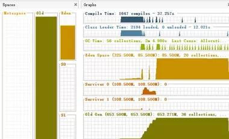

Dump 内存堆栈进行分析，发现大量的发送任务堆积，导致内存溢出（示例）：


通过以上分析可以看出，在直播高峰期，服务端向上万客户端推送消息时，发生了发送队列积压，引起内存泄漏，最终导致服务端频繁 GC，无法正常处理业务。

1.3 解决策略

服务端在进行消息发送的时候做保护，具体策略如下：

1. 根据可接入的最大用户数做客户端并发接入数流控，需要根据内存、CPU 处理能力，以及性能测试结果做综合评估。

2. 设置消息发送的高低水位，针对消息的平均大小、客户端并发接入数、JVM 内存大小进行计算，得出一个合理的高水位取值。服务端在推送消息时，对 Channel 的状态进行判断，如果达到高水位之后，Channel 的状态会被 Netty 置为不可写，此时服务端不要继续发送消息，防止发送队列积压。

服务端基于上述策略优化了代码，内存泄漏问题得到解决。

1.4. 总结

尽管 Netty 框架本身做了大量的可靠性设计，但是对于具体的业务场景，仍然需要用户做针对特定领域和场景的可靠性设计，这样才能提升应用的可靠性。

除了消息发送积压导致的内存泄漏，Netty 还有其它常见的一些内存泄漏点，本文将针对这些可能导致内存泄漏的功能点进行分析和总结。

2\.  消息收发防内存泄漏策略 2.1. 消息接收 2.1.1 消息读取

Netty 的消息读取并不存在消息队列，但是如果消息解码策略不当，则可能会发生内存泄漏，主要有如下几点：

1. 畸形码流攻击：如果客户端按照协议规范，将消息长度值故意伪造的非常大，可能会导致接收方内存溢出。

2. 代码 BUG：错误的将消息长度字段设置或者编码成一个非常大的值，可能会导致对方内存溢出。

3. 高并发场景：单个消息长度比较大，例如几十 M 的小视频，同时并发接入的客户端过多，会导致所有 Channel 持有的消息接收 ByteBuf 内存总和达到上限，发生 OOM。

避免内存泄漏的策略如下：

无论采用哪种解码器实现，都对消息的最大长度做限制，当超过限制之后，抛出解码失败异常，用户可以选择忽略当前已经读取的消息，或者直接关闭链接。

以 Netty 的 DelimiterBasedFrameDecoder 代码为例，创建 DelimiterBasedFrameDecoder 对象实例时，指定一个比较合理的消息最大长度限制，防止内存溢出：

```
/**

* Creates a new instance.

*

* @param maxFrameLength  the maximum length of the decoded frame.

*                        A {@link TooLongFrameException} is thrown if

*                        the length of the frame exceeds this value.

* @param stripDelimiter  whether the decoded frame should strip out the

*                        delimiter or not

* @param delimiter  the delimiter

*/

public DelimiterBasedFrameDecoder(

int maxFrameLength, boolean stripDelimiter, ByteBuf delimiter) {

this(maxFrameLength, stripDelimiter, true, delimiter);

}
```

需要根据单个 Netty 服务端可以支持的最大客户端并发连接数、消息的最大长度限制以及当前 JVM 配置的最大内存进行计算，并结合业务场景，合理设置 maxFrameLength 的取值。

2.1.2 ChannelHandler 的并发执行

Netty 的 ChannelHandler 支持串行和异步并发执行两种策略，在将 ChannelHandler 加入到 ChannelPipeline 时，如果指定了 EventExecutorGroup，则 ChannelHandler 将由 EventExecutorGroup 中的 EventExecutor 异步执行。这样的好处是可以实现 Netty I/O 线程与业务 ChannelHandler 逻辑执行的分离，防止 ChannelHandler 中耗时业务逻辑的执行阻塞 I/O 线程。

ChannelHandler 异步执行的流程如下所示：

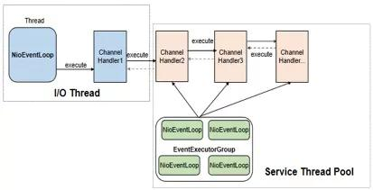

如果业务 ChannelHandler 中执行的业务逻辑耗时较长，消息的读取速度又比较快，很容易发生消息在 EventExecutor 中积压的问题，如果创建 EventExecutor 时没有通过 io.netty.eventexecutor.maxPendingTasks 参数指定积压的最大消息个数，则默认取值为 0x7fffffff，长时间的积压将导致内存溢出，相关代码如下所示（异步执行 ChannelHandler，将消息封装成 Task 加入到 taskQueue 中）：

```
public void execute(Runnable task) {

if (task == null) {

throw new NullPointerException("task");

}

boolean inEventLoop = inEventLoop();

if (inEventLoop) {

addTask(task);

} else {

startThread();

addTask(task);

if (isShutdown() && removeTask(task)) {

reject();

}

}
```

解决对策：对 EventExecutor 中任务队列的容量做限制，可以通过 io.netty.eventexecutor.maxPendingTasks 参数做全局设置，也可以通过构造方法传参设置。结合 EventExecutorGroup 中 EventExecutor 的个数来计算 taskQueue 的个数，根据 taskQueue \* N \* 任务队列平均大小 \* maxPendingTasks < 系数K（0 < K < 1）\* 总内存的公式来进行计算和评估。

2.2. 消息发送 2.2.1 如何防止发送队列积压

为了防止高并发场景下，由于对方处理慢导致自身消息积压，除了服务端做流控之外，客户端也需要做并发保护，防止自身发生消息积压。

利用 Netty 提供的高低水位机制，可以实现客户端更精准的流控，它的工作原理如下：

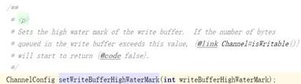

当发送队列待发送的字节数组达到高水位上限时，对应的 Channel 就变为不可写状态。由于高水位并不影响业务线程调用 write 方法并把消息加入到待发送队列中，因此，必须要在消息发送时对 Channel 的状态进行判断：当到达高水位时，Channel 的状态被设置为不可写，通过对 Channel 的可写状态进行判断来决定是否发送消息。

在消息发送时设置高低水位并对 Channel 状态进行判断，相关代码示例如下：

```
public void channelActive(final ChannelHandlerContext ctx) {

**ctx.channel().config().setWriteBufferHighWaterMark(10 \* 1024 * 1024);**

loadRunner = new Runnable() {

@Override

public void run() {

try {

TimeUnit.SECONDS.sleep(30);

} catch (InterruptedException e) {

e.printStackTrace();

}

ByteBuf msg = null;

while (true) {

**if (ctx.channel().isWritable()) {**

msg = Unpooled.wrappedBuffer("Netty OOM Example".getBytes());

ctx.writeAndFlush(msg);

} else {

LOG.warning("The write queue is busy : " + ctx.channel().unsafe().outboundBuffer().nioBufferSize());

}

}

}

};

new Thread(loadRunner, "LoadRunner-Thread").start();

}
```

对上述代码做验证，客户端代码中打印队列积压相关日志，说明基于高水位的流控机制生效，日志如下：

**警告: The write queue is busy : 17**

通过内存监控，发现内存占用平稳：


在实际项目中，根据业务 QPS 规划、客户端处理性能、网络带宽、链路数、消息平均码流大小等综合因素计算并设置高水位（WriteBufferHighWaterMark）阈值，利用高水位做消息发送速率的流控，既可以保护自身，同时又能减轻服务端的压力，防止服务端被压挂。

2.2.2 其它可能导致发送队列积压的因素

需要指出的是，并非只有高并发场景才会触发消息积压，在一些异常场景下，尽管系统流量不大，但仍然可能会导致消息积压，可能的场景包括：

1. 网络瓶颈，发送速率超过网络链接处理能力时，会导致发送队列积压。

2. 对端读取速度小于己方发送速度，导致自身 TCP 发送缓冲区满，频繁发生 write 0 字节时，待发送消息会在 Netty 发送队列排队。

当出现大量排队时，很容易导致 Netty 的直接内存泄漏，示例如下：

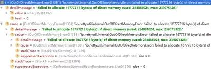

我们在设计系统时，需要根据业务的场景、所处的网络环境等因素进行综合设计，为潜在的各种故障做容错和保护，防止因为外部因素导致自身发生内存泄漏。

3\.  ByteBuf 的申请和释放策略 3.1 ByteBuf 申请和释放的理解误区

有一种说法认为 Netty 框架分配的 ByteBuf 框架会自动释放，业务不需要释放；业务创建的 ByteBuf 则需要自己释放，Netty 框架不会释放。

事实上，这种观点是错误的，即便 ByteBuf 是 Netty 创建的，如果使用不当仍然会发生内存泄漏。在实际项目中如何更好的管理 ByteBuf，下面我们分四种场景进行说明。

3.2 ByteBuf 的释放策略 3.2.1 基于内存池的请求 ByteBuf

这类 ByteBuf 主要包括 PooledDirectByteBuf 和 PooledHeapByteBuf，它由 Netty 的 NioEventLoop 线程在处理 Channel 的读操作时分配，需要在业务 ChannelInboundHandler 处理完请求消息之后释放（通常是解码之后），它的释放有 2 种策略：

* 策略 1：业务 ChannelInboundHandler 继承自 SimpleChannelInboundHandler，实现它的抽象方法 channelRead0\(ChannelHandlerContext ctx, I msg\)，ByteBuf 的释放业务不用关心，由 SimpleChannelInboundHandler 负责释放，相关代码如下所示（SimpleChannelInboundHandler）：


```
@Override

public void channelRead(ChannelHandlerContext ctx, Object msg) throws Exception {

boolean release = true;

try {

if (acceptInboundMessage(msg)) {

I imsg = (I) msg;

channelRead0(ctx, imsg);

} else {

release = false;

ctx.fireChannelRead(msg);

}

} finally {

**if (autoRelease && release) {**

**ReferenceCountUtil.release(msg);**

**}**

}

}
```

如果当前业务 ChannelInboundHandler 需要执行，则调用完 channelRead0 之后执行 ReferenceCountUtil.release\(msg\) 释放当前请求消息。如果没有匹配上需要继续执行后续的 ChannelInboundHandler，则不释放当前请求消息，调用 ctx.fireChannelRead\(msg\) 驱动 ChannelPipeline 继续执行。

```
继承自 SimpleChannelInboundHandler，即便业务不释放请求 ByteBuf 对象，依然不会发生内存泄漏，相关示例代码如下所示：

public class RouterServerHandlerV2 **extends SimpleChannelInboundHandler<ByteBuf>** {

// 代码省略...

@Override

public void channelRead0(ChannelHandlerContext ctx, ByteBuf msg) {

byte [] body = new byte[msg.readableBytes()];

executorService.execute(()->

{

// 解析请求消息，做路由转发，代码省略...

// 转发成功，返回响应给客户端

ByteBuf respMsg = allocator.heapBuffer(body.length);

respMsg.writeBytes(body);// 作为示例，简化处理，将请求返回

ctx.writeAndFlush(respMsg);

});

}
```

对上述代码做性能测试，发现内存占用平稳，无内存泄漏问题，验证了之前的分析结论。

* 策略 2：在业务 ChannelInboundHandler 中调用 ctx.fireChannelRead\(msg\) 方法，让请求消息继续向后执行，直到调用到 DefaultChannelPipeline 的内部类 TailContext，由它来负责释放请求消息，代码如下所示（TailContext）：


```
protected void onUnhandledInboundMessage(Object msg) {

try {

logger.debug(

"Discarded inbound message {} that reached at the tail of the pipeline. " +

"Please check your pipeline configuration.", msg);

**} finally {**

**ReferenceCountUtil.release(msg);**

**}**

}
```

3.2.2 基于非内存池的请求 ByteBuf

如果业务使用非内存池模式覆盖 Netty 默认的内存池模式创建请求 ByteBuf，例如通过如下代码修改内存申请策略为 Unpooled：

```
// 代码省略...

.childHandler(new ChannelInitializer<SocketChannel>() {

@Override

public void initChannel(SocketChannel ch) throws Exception {

ChannelPipeline p = ch.pipeline();                     ch.config().setAllocator(UnpooledByteBufAllocator.DEFAULT);

p.addLast(new RouterServerHandler());

}

});

}
```

也需要按照内存池的方式去释放内存。

3.2.3 基于内存池的响应 ByteBuf

只要调用了 writeAndFlush 或者 flush 方法，在消息发送完成之后都会由 Netty 框架进行内存释放，业务不需要主动释放内存。

它的工作原理如下：

调用 ctx.writeAndFlush\(respMsg\) 方法，当消息发送完成之后，Netty 框架会主动帮助应用来释放内存，内存的释放分为两种场景：

* 如果是堆内存（PooledHeapByteBuf），则将 HeapByteBuffer 转换成 DirectByteBuffer，并释放 PooledHeapByteBuf 到内存池，代码如下（AbstractNioChannel 类）：


```
protected final ByteBuf newDirectBuffer(ByteBuf buf) {

final int readableBytes = buf.readableBytes();

if (readableBytes == 0) {

**ReferenceCountUtil.safeRelease(buf);**

return Unpooled.EMPTY_BUFFER;

}

final ByteBufAllocator alloc = alloc();

if (alloc.isDirectBufferPooled()) {

ByteBuf directBuf = alloc.directBuffer(readableBytes);

directBuf.writeBytes(buf, buf.readerIndex(), readableBytes);

**ReferenceCountUtil.safeRelease(buf);**

return directBuf;

}        }

// 后续代码省略

}
```

如果消息完整的被写到 SocketChannel 中，则释放 DirectByteBuffer，代码如下（ChannelOutboundBuffer）所示：

```
public boolean remove() {

Entry e = flushedEntry;

if (e == null) {

clearNioBuffers();

return false;

}

Object msg = e.msg;

ChannelPromise promise = e.promise;

int size = e.pendingSize;

removeEntry(e);

if (!e.cancelled) {

**ReferenceCountUtil.safeRelease(msg);**

safeSuccess(promise);

decrementPendingOutboundBytes(size, false, true);

}

// 后续代码省略

}
```

对 Netty 源码进行断点调试，验证上述分析：

断点 1：在响应消息发送处打印断点，获取到 PooledUnsafeHeapByteBuf 实例 ID 为 1506。

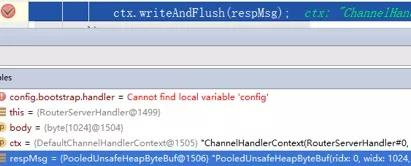

断点 2：在 HeapByteBuffer 转换成 DirectByteBuffer 处打断点，发现实例 ID 为 1506 的 PooledUnsafeHeapByteBuf 被释放。

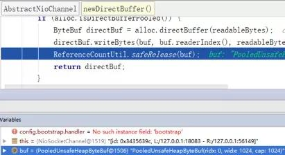

断点 3：转换之后待发送的响应消息 PooledUnsafeDirectByteBuf 实例 ID 为 1527。


断点 4：响应消息发送完成之后，实例 ID 为 1527 的 PooledUnsafeDirectByteBuf 被释放到内存池。

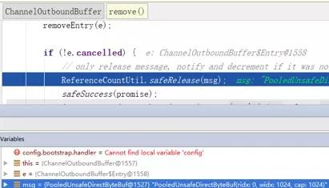

如果是 DirectByteBuffer，则不需要转换，当消息发送完成之后，由 ChannelOutboundBuffer 的 remove\(\) 负责释放。

3.2.4 基于非内存池的响应 ByteBuf

无论是基于内存池还是非内存池分配的 ByteBuf，如果是堆内存，则将堆内存转换成堆外内存，然后释放 HeapByteBuffer，待消息发送完成之后，再释放转换后的 DirectByteBuf；如果是 DirectByteBuffer，则无需转换，待消息发送完成之后释放。因此对于需要发送的响应 ByteBuf，由业务创建，但是不需要业务来释放。

4\.  Netty 服务端高并发保护 4.1 高并发场景下的 OOM 问题

在 RPC 调用时，如果客户端并发连接数过多，服务端又没有针对并发连接数的流控机制，一旦服务端处理慢，就很容易发生批量超时和断连重连问题。

以 Netty HTTPS 服务端为例，典型的业务组网示例如下所示：

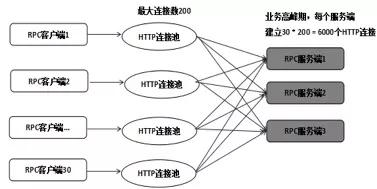

客户端采用 HTTP 连接池的方式与服务端进行 RPC 调用，单个客户端连接池上限为 200，客户端部署了 30 个实例，而服务端只部署了 3 个实例。在业务高峰期，每个服务端需要处理 6000 个 HTTP 连接，当服务端时延增大之后，会导致客户端批量超时，超时之后客户端会关闭连接重新发起 connect 操作，在某个瞬间，几千个 HTTPS 连接同时发起 SSL 握手操作，由于服务端此时也处于高负荷运行状态，就会导致部分连接 SSL 握手失败或者超时，超时之后客户端会继续重连，进一步加重服务端的处理压力，最终导致服务端来不及释放客户端 close 的连接，引起 NioSocketChannel 大量积压，最终 OOM。

通过客户端的运行日志可以看到一些 SSL 握手发生了超时，示例如下：

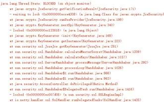

服务端并没有对客户端的连接数做限制，这会导致尽管 ESTABLISHED 状态的连接数并不会超过 6000 上限，但是由于一些 SSL 连接握手失败，再加上积压在服务端的连接并没有及时释放，最终引起了 NioSocketChannel 的大量积压。

4.2.Netty HTTS 并发连接数流控

在服务端增加对客户端并发连接数的控制，原理如下所示：

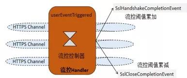

基于 Netty 的 Pipeline 机制，可以对 SSL 握手成功、SSL 连接关闭做切面拦截（类似于 Spring 的 AOP 机制，但是没采用反射机制，性能更高），通过流控切面接口，对 HTTPS 连接做计数，根据计数器做流控，服务端的流控算法如下：

1. 获取流控阈值。

2. 从全局上下文中获取当前的并发连接数，与流控阈值对比，如果小于流控阈值，则对当前的计数器做原子自增，允许客户端连接接入。

3. 如果等于或者大于流控阈值，则抛出流控异常给客户端。

4. SSL 连接关闭时，获取上下文中的并发连接数，做原子自减。

在实现服务端流控时，需要注意如下几点：

1. 流控的 ChannelHandler 声明为 @ChannelHandler.Sharable，这样全局创建一个流控实例，就可以在所有的 SSL 连接中共享。

2. 通过 userEventTriggered 方法拦截 SslHandshakeCompletionEvent 和 SslCloseCompletionEvent 事件，在 SSL 握手成功和 SSL 连接关闭时更新流控计数器。

3. 流控并不是单针对 ESTABLISHED 状态的 HTTP 连接，而是针对所有状态的连接，因为客户端关闭连接，并不意味着服务端也同时关闭了连接，只有 SslCloseCompletionEvent 事件触发时，服务端才真正的关闭了 NioSocketChannel，GC 才会回收连接关联的内存。

4. 流控 ChannelHandler 会被多个 NioEventLoop 线程调用，因此对于相关的计数器更新等操作，要保证并发安全性，避免使用全局锁，可以通过原子类等提升性能。

5\.  总结 5.1. 其它的防内存泄漏措施 5.1.1 NioEventLoop

执行它的 execute\(Runnable task\) 以及定时任务相关接口时，如果任务执行耗时过长、任务执行频度过高，可能会导致任务队列积压，进而引起 OOM：


建议业务在使用时，对 NioEventLoop 队列的积压情况进行采集和告警。

5.1.2  客户端连接池

业务在初始化连接池时，如果采用每个客户端连接对应一个 EventLoopGroup 实例的方式，即每创建一个客户端连接，就会同时创建一个 NioEventLoop 线程来处理客户端连接以及后续的网络读写操作，采用的策略是典型的 1 个 TCP 连接对应一个 NIO 线程的模式。当系统的连接数很多、堆内存又不足时，就会发生内存泄漏或者线程创建失败异常。问题示意如下：

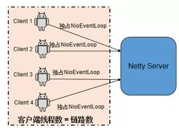

优化策略：客户端创建连接池时，EventLoopGroup 可以重用，优化之后的连接池线程模型如下所示：

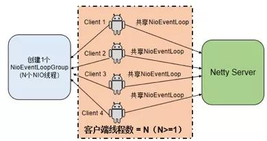

5.2 内存泄漏问题定位 5.2.1 堆内存泄漏

通过 jmap -dump:format=b,file=xx pid 命令 Dump 内存堆栈，然后使用 MemoryAnalyzer 工具对内存占用进行分析，查找内存泄漏点，然后结合代码进行分析，定位内存泄漏的具体原因，示例如下所示：

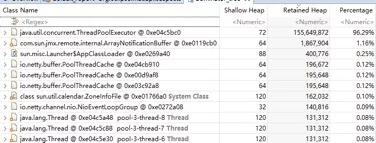

5.2.2 堆外内存泄漏

建议策略如下：

1. 排查下业务代码，看使用堆外内存的地方是否存在忘记释放问题。

2. 如果使用到了 Netty 的 TLS/SSL/openssl，建议到 Netty 社区查下 BUG 列表，看是否是 Netty 老版本已知的 BUG，此类 BUG 通过升级 Netty 版本可以解决。

3. 如果上述两个步骤排查没有结果，则可以通过 google-perftools 工具协助进行堆外内存分析。

6\.  作者简介

李林锋，10 年 Java NIO、平台中间件设计和开发经验，精通 Netty、Mina、分布式服务框架、API Gateway、PaaS 等,《Netty 进阶之路》、《分布式服务框架原理与实践》作者。目前在华为终端应用市场负责业务微服务化、云化、全球化等相关设计和开发工作。

联系方式：新浪微博 Nettying 微信：Nettying

Email：neu\_lilinfeng@sina.com

