## 前深度学习时代CTR预估模型的演化之路：从LR到FFM  

> 作者: 王喆 ​  
> 发布日期: 2019 年 3 月 24 日  

> 本文是王喆在 AI 前线 开设的原创技术专栏“深度学习 CTR 预估模型实践”的第二篇文章（以下“深度学习 CTR 预估模型实践”简称“深度 CTR 模型”）。专栏第一篇文章回顾：[《深度学习 CTR 预估模型凭什么成为互联网增长的关键？》](https://mp.weixin.qq.com/s?__biz=MzU1NDA4NjU2MA==&mid=2247495560&idx=2&sn=094e3a79085898ce881f64e6232fcdd6&chksm=fbea5647cc9ddf5180be52c2e26f08a4c3f7d5ca0f45f0e72bfbe80db69b73853b8c737ea187&token=1198573375&lang=zh_CN#rd)。重看王喆老师过往精彩文章：[《重读 Youtube 深度学习推荐系统论文，字字珠玑，惊为神文》](https://mp.weixin.qq.com/s?__biz=MzU1NDA4NjU2MA==&mid=2247494669&idx=2&sn=b1ca666f647373b0de4be5da388e53bc&chksm=fbea55c2cc9ddcd4f909dd2ea65102d9e0637857dac813d35f71229d0c897a435077c987418f&scene=21#wechat_redirect)、[《YouTube 深度学习推荐系统的十大工程问题》](https://mp.weixin.qq.com/s?__biz=MzU1NDA4NjU2MA==&mid=2247494791&idx=2&sn=643df72a5116807136e07a82db83b9cd&chksm=fbea5548cc9ddc5e07baffe20d23003227371c9a8f2dd515e60345a9f1775d079082bcbf2976&scene=21#wechat_redirect)。

上篇专栏文章我们说清楚了一件事情“CTR 预估模型是互联网的增长之心”，在互联网永不停歇的增长需求的驱动下，CTR 预估模型（以下简称 CTR 模型）的发展也可谓一日千里，从 2010 年之前千篇一律的逻辑回归（Logistic Regression，LR），进化到因子分解机（Factorization Machine，FM）、梯度提升树（Gradient Boosting Decision Tree，GBDT），再到 2015 年之后深度学习的百花齐放，各种模型架构层出不穷。

我想所有从业者谈起深度学习 CTR 预估模型都有一种莫名的兴奋，但在这之前，认真的回顾前深度学习时代的 CTR 模型仍是非常必要的。原因有两点：

1、即使是深度学习空前流行的今天，LR、FM 等传统 CTR 模型仍然凭借其可解释性强、轻量级的训练部署要求、便于在线学习等不可替代的优势，拥有大量适用的应用场景。模型的应用不分新旧贵贱，熟悉每种模型的优缺点，能够灵活运用和改进不同的算法模型是算法工程师的基本要求。

2、传统 CTR 模型是深度学习 CTR 模型的基础。深度神经网络（Deep Nerual Network，DNN）从一个神经元生发而来，而 LR 模型正是单一神经元的经典结构；此外，影响力很大的 FNN，DeepFM，NFM 等深度学习模型更是与传统的 FM 模型有着千丝万缕的联系；更不要说各种梯度下降方法的一脉相承。所以说传统 CTR 模型是深度学习模型的地基和入口。

下面，我们用传统 CTR 模型演化的关系图来正式开始技术部分的内容。

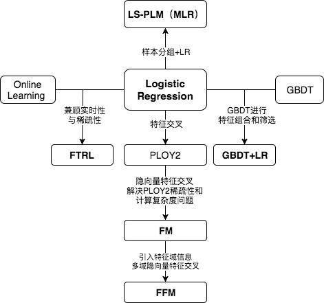

看到上面的关系图，有经验的同学可能已经对各模型的细节和特点如数家珍了。中间位置的 LR 模型向四个方向的延伸分别代表了传统 CTR 模型演化的四个方向。

1. 向下为了解决特征交叉的问题，演化出 PLOY2，FM，FFM 等模型；

2. 向右为了使用模型化、自动化的手段解决之前特征工程的难题，Facebook 将 LR 与 GBDT 进行结合，提出了 GBDT+LR 组合模型；

3. 向左 Google 从 online learning 的角度解决模型时效性的问题，提出了 FTRL；

4. 向上阿里基于样本分组的思路增加模型的非线性，提出了 LS-PLM（MLR）模型。

### LR——CTR 模型的基础

位于正中央的是当之无愧的 Logistic Regression。仍记得 2012 年我刚进入计算广告这个行业的时候，各大中小公司的主流 CTR 模型无一例外全都是 LR 模型。LR 模型的流行是有三方面原因的，一是数学形式和含义上的支撑；二是人类的直觉和可解释性的原因；三是工程化的需要。

1. **逻辑回归的数学基础**

逻辑回归作为广义线性模型的一种，它的假设是因变量 y 服从伯努利分布。那么在点击率预估这个问题上，“点击”这个事件是否发生就是模型的因变量 y。而用户是否点击广告这个问题是一个经典的掷偏心硬币问题，因此 CTR 模型的因变量显然应该服从伯努利分布。所以采用 LR 作为 CTR 模型是符合“点击”这一事件的物理意义的。
与之相比较，线性回归（Linear Regression）作为广义线性模型的另一个特例，其假设是因变量 y 服从高斯分布，这明显不是点击这类二分类问题的数学假设。
在了解 LR 的数学基础后，其目标函数的形式就不再是空中楼阁了，具体的形式如下：

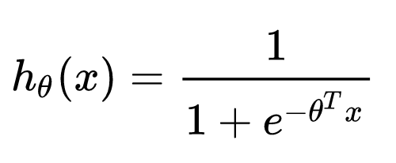

其中 x 是输入向量，θ 是我们要学习的参数向量。结合 CTR 模型的问题来说，x 就是输入的特征向量，h\(x\) 就是我们最终希望得到的点击率。

**2\. 人类的直觉和可解释性**

直观来讲，LR 模型目标函数的形式就是各特征的加权和，再套上 sigmoid 函数。我们忽略其数学基础（虽然这是其模型成立的本质支撑），仅靠人类的直觉认知也可以一定程度上得出使用 LR 作为 CTR 模型的合理性。
使用各特征的加权和是为了综合不同特征对 CTR 的影响，而由于不同特征的重要程度不一样，所以为不同特征指定不同的权重来代表不同特征的重要程度。最后要套上 sigmoid 函数
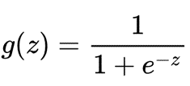
，正是希望其值能够映射到 0-1 之间，使其符合 CTR 的物理意义。

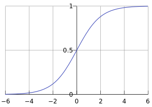
LR 如此符合人类的直觉认知显然有其他的好处，就是模型具有极强的可解释性，算法工程师们可以轻易的解释哪些特征比较重要，在 CTR 模型的预测有偏差的时候，也可以轻易找到哪些因素影响了最后的结果，如果你有跟运营、产品一起工作的经验的话，更会知道可解释性强是一个模型多么优秀的“品质”。

**3\. 工程化的需要**

在互联网公司每天动辄 TB 级别的数据面前，模型的训练开销就异常重要了。在 GPU 尚未流行开来的 2012 年之前，LR 模型也凭借其易于并行化、模型简单、训练开销小等特点占据着工程领域的主流。囿于工程团队的限制，即使其他复杂模型的效果有所提升，在没有明显 beat LR 之前，公司也不会贸然加大计算资源的投入升级 CTR 模型，这是 LR 持续流行的另一重要原因。

### POLY2——特征交叉的开始

但 LR 的表达能力毕竟是非常初级的。在“辛普森悖论”现象的存在下，只用单一特征进行判断，甚至会得出错误的结论。我们用一个简单的“辛普森悖论”的例子来解释一下为什么特征交叉是重要的。

假设下面是某 APP 男性用户和女性用户点击广告的数据：

男性用户

点击 曝光 点击率
广告位 A 8 530 1.51%
广告位 B 51 1520 3.36%

女性用户

点击 曝光 点击率
广告位 A 201 2510 8.01%
广告位 B 92 1010 9.11%

透过上面两个表格的数据来看，广告位 B 无论在男性用户还是女性用户中的点击率都高于广告位 A，如果我们作为广告需求方构建的 CTR 模型够精准，理所应当会把广告预算分配给广告位 B，而不是广告位 A。

那么我们如果去掉性别这个维度，把数据汇总后会得出什么结论呢？

广告位 点击 总曝光 点击率
广告位 A 209 3040 6.88%
广告位 B 143 2530 5.65%

在汇总结果中，广告位 A 的点击率居然比广告位 B 高。我们如果据此进行广告预算的分配，将得出完全相反的结论。可这个结论明显是错误的，广告位 A 的综合点击率高仅仅是因为其女性用户更多，提高了整体点击率。如果你构建的 CTR 模型的表达能力不够，很可能被数据“欺骗”。

因此，从“辛普森悖论”中我们能够得出一个结论，低维特征由于对高维特征进行了合并，丢失掉了大量信息。而 LR 由于只是对单一特征做简单加权，不具备进行特征交叉生成高维特征的能力，所以表达能力是非常初级的。

针对这个问题，当时的算法工程师们经常采用手动组合特征，再通过各种分析手段筛选特征的方法。但这个方法无疑是残忍的，完全不符合“懒惰是程序员的美德”这一金科玉律。更遗憾的是，人类的经验往往有局限性，程序员的时间和精力也无法支撑其找到最优的特征组合。因此采用 PLOY2 模型进行特征的“暴力”组合成为了可行的选择。

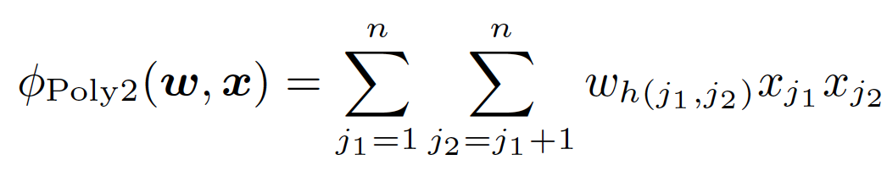

在上面 POLY2 二阶部分的目标函数中（上式省略一阶部分和 sigmoid 函数的部分），我们可以看到 POLY2 对所有特征进行了两两交叉，并对所有的特征组合赋予了权重 wh\(j1, j2\)。POLY2 无疑通过暴力组合特征的方式一定程度上解决了特征组合的问题。并且由于本质上仍是线性模型，其训练方法与 LR 并无区别，便于工程上的兼容。

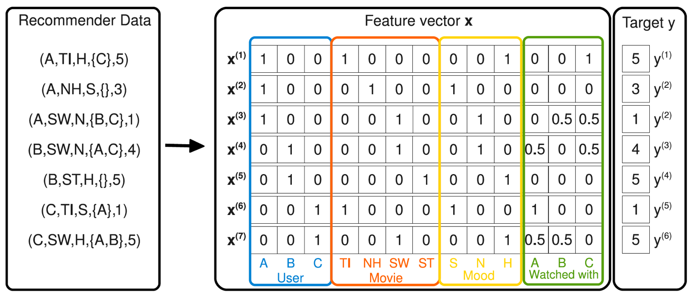

但 POLY2 这一模型同时存在着两个巨大的缺陷：

1. 由于在处理互联网数据时，经常采用 one-hot 的方法处理 id 类数据，致使特征向量极度稀疏，POLY2 进行无选择的特征交叉使原本就非常稀疏的特征向量更加稀疏，使得大部分交叉特征的权重缺乏有效的数据进行训练，无法收敛。

2. 权重参数的数量由 n 直接上升到 n2，极大增加了训练复杂度。

### FM——隐向量特征交叉

为了解决 POLY2 模型的缺陷，2010 年 Rendle 提出了 FM（Factorization Machine）。

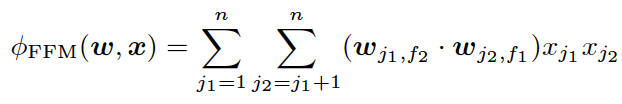

从 FM 的目标函数的二阶部分中我们可以看到，相比 POLY2，主要区别是用两个向量的内积（wj1 · wj2）取代了单一的权重 wh\(j1, j2\)。具体来说，FM 为每个特征学习了一个隐权重向量（latent vector），在特征交叉时，使用两个特征隐向量的内积作为交叉特征的权重。

通过引入特征隐向量的方式，直接把原先 n2 级别的权重参数数量减低到了 n _k（k 为隐向量维度，n >>k）。在训练过程中，又可以通过转换目标函数形式的方法，使 FM 的训练复杂度减低到 n_k 级别。相比 POLY2 极大降低训练开销。

隐向量的引入还使得 FM 比 POLY2 能够更好的解决数据稀疏性的问题。举例来说，我们有两个特征，分别是 channel 和 brand，一个训练样本的 feature 组合是 \(ESPN, Adidas\)，在 POLY2 中，只有当 ESPN 和 Adidas 同时出现在一个训练样本中时，模型才能学到这个组合特征对应的权重。而在 FM 中，ESPN 的隐向量也可以通过 \(ESPN, Gucci\) 这个样本学到，Adidas 的隐向量也可以通过 \(NBC, Adidas\) 学到，这大大降低了模型对于数据稀疏性的要求。甚至对于一个从未出现过的特征组合 \(NBC, Gucci\)，由于模型之前已经分别学习过 NBC 和 Gucci 的隐向量，FM 也具备了计算该特征组合权重的能力，这是 POLY2 无法实现的。也许 FM 相比 POLY2 丢失了某些信息的记忆能力，但是泛化能力大大提高，这对于互联网的数据特点是非常重要的。

工程方面，FM 同样可以用梯度下降进行学习的特点使其不失实时性和灵活性。相比之后深度学习模型复杂的网络结构导致难以线上 serving 的问题，FM 比较容易实现的 inference 过程也使其没有 serving 的难题。因此 FM 在 2012-2014 年前后逐渐成为业界 CTR 模型的主流。

### FFM——引入特征域概念

2015 年，基于 FM 提出的 FFM（Field-aware Factorization Machine ，简称 FFM）在多项 CTR 预估大赛中一举夺魁，并随后被 Criteo、美团等公司深度应用在 CTR 预估，推荐系统领域。相比 FM 模型，FFM 模型主要引入了 Field-aware 这一概念，使模型的表达能力更强。

上式是 FFM 的目标函数的二阶部分。其与 FM 目标函数的区别就在于隐向量由原来的 wj1 变成了 wj1,f2，这就意味着每个特征对应的不是一个隐向量，而是对应着不同域的一组隐向量，当 xj1 特征与 xj2 特征进行交叉时，xj1 特征会从 xj1 的一组隐向量中挑出与特征 xj2 的域 f2 对应的隐向量 wj1,f2 进行交叉。同理 xj2 也会用与 xj1 的域 f1 对应的隐向量进行交叉。
那么这里所说的“域”代表着什么呢？
简单来讲“域”代表着特征域，域内的特征一般会采用 one-hot 编码形成 one-hot 特征向量。
我们通过 Criteo FFM 论文的中一个例子来更具体的说明 FFM 的过程。假设我们在训练 CTR 模型过程中接收到下面这个样本。

其中，Publisher，Advertiser，Gender 就是三个特征域。ESPN、NIKE、Male 分别是这三个特征域的特征。那么，如果按照原 FM 的原理，ESPN 与 NIKE、以及 ESPN 与 Male 做交叉的权重应该是

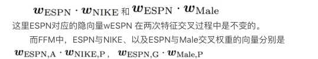

大家肯定已经注意到，由于交叉特征域的改变，ESPN 的隐向量由 wESPN,A 换成了 wESPN,G 。

FFM 模型学习每个特征在 f 个域上的 k 维隐向量，交叉特征的权重由特征在对方特征域上的隐向量内积得到，权重数量共 n _k_ f 个。在训练方面，由于 FFM 的二次项并不能够像 FM 那样简化，因此其复杂度为 kn2。

相比 FM，FFM 由于引入了 field 这一概念，为模型引入了更多有价值信息，使模型表达能力更强，但与此同时，FFM 的计算复杂度上升到 kn2，远远大于 FM 的 k\*n。

### CTR 模型特征交叉方向的演化

本章我们沿着传统 CTR 模型演化图中黄色的部分，朝着特征交叉的演化方向，依次介绍了 LR、POLY2，FM 和 FFM 四个模型。

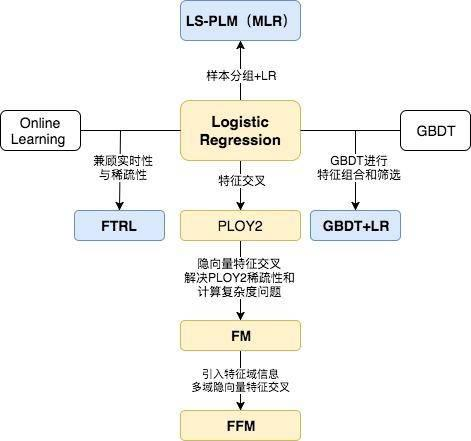

我们再用图示方法回顾一下从 POLY2 到 FM，再到 FFM 进行特征交叉方法的不同。

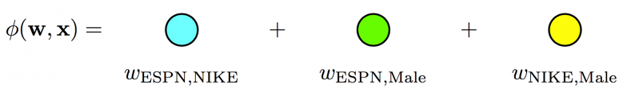

POLY2 模型直接学习每个交叉特征的权重，权重数量共 n2 个。

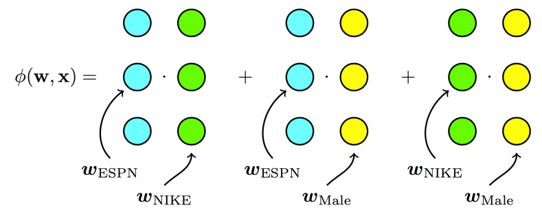

FM 模型学习每个特征的 k 维隐向量，交叉特征由相应特征隐向量的内积得到，权重数量共 n\*k 个。

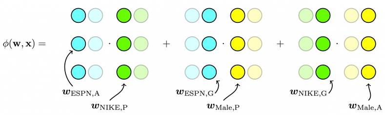

FFM 模型引入了特征域这一概念，在做特征交叉时，每个特征选择与对方域对应的隐向量做内积运算得到交叉特征的权重。参数数量共 n _k_ f 个。

但无论怎样 FFM 只能够做到二阶的特征交叉，如果要继续提高特征交叉的维度，不可避免的会发生组合爆炸和计算复杂度过高的情况。

下一节的专栏文章将回顾模型演化图中蓝色部分的模型。我将沿着特征工程的角度带大家一起回顾 Facebook 的 CTR 模型 GBDT+LR，并从时效性的角度看看 Google 是如何使用 FTRL 解决模型 online learning 问题的，最后介绍阿里的 LS-PLM，看其是如何从样本聚类的动机出发为传统线性模型引入非线性能力的。期待与大家继续探讨 CTR 预估模型的内容。

**《深度学习 CTR 预估模型实践》专栏内容回顾：**

1. [深度学习 CTR 预估模型凭什么成为互联网增长的关键？](https://mp.weixin.qq.com/s?__biz=MzU1NDA4NjU2MA==&mid=2247495560&idx=2&sn=094e3a79085898ce881f64e6232fcdd6&chksm=fbea5647cc9ddf5180be52c2e26f08a4c3f7d5ca0f45f0e72bfbe80db69b73853b8c737ea187&token=1198573375&lang=zh_CN#rd)

##### 作者介绍

王喆，毕业于清华大学计算机系，现在美国最大的 smartTV 公司 Roku 任 senior machine learning engineer，曾任 hulu senior research SDE，7 年计算广告、推荐系统领域业界经验，相关专利 3 项，论文 7 篇，《机器学习实践指南》、《百面机器学习》作者之一。知乎专栏 / 微信公众号：王喆的机器学习笔记。

