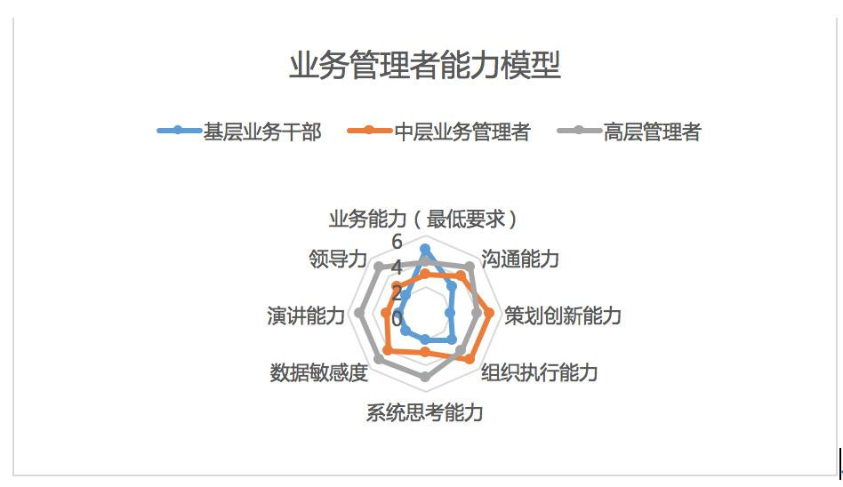

## 如何培养基层干部及管理者的能力模型？| SaaS创业路线图（37）  

> 发布: 吴昊@SaaS  
> 发布日期: 2019-03-05  

编者按：本文来自微信公众号“SaaS白夜行”（ID：SaaSKnight），作者 吴昊SaaS，36氪经授权发布。

作者介绍 - 吴昊，SaaS创业顾问，纷享销客天使投资人、前执行总裁，7年SaaS营销团队创新、20年企业信息化经验。目前在为SaaS公司提供产品市场定位、营销策略及组织发展三方面的战略咨询。

**点击查看**[ **\#SaaS创业路线图\#**](https://36kr.com/user/1308477002) **系列文章**

上个月写了《销售十级》很受大家欢迎，最近正好遇到一个相关案例，借此再拔高一下。

上周我拜访了一个SaaS产品销售团队，销售VP非常优秀，团队战斗力也超强，人均月产出是SaaS圈里平均水平的2~3倍。

他有件事情很苦恼 —— 基层干部的业务能力不错，但管理能力成长不起来。个别后期招聘的管理基础强的干部，业务能力增长又没那么快。可以预判，目前的人才结构将限制今后的业绩增长。

我详细了解他们组织发展各方面的情况后，愕然发现：公司从愿望上期待基层干部能成长起来，但大部分力量还是用在让他们更偏重业务的方向上。

###  **一、这个现象在很多公司都常见 —— 管理措施与管理目标背道而驰！**

我们在探讨中罗列了其中3个突出问题：

####  **1、销售主管带着10个员工，自己还做单、拿销售提成。**

这就是牵引Leader们更偏重自己做销售，而不是一个彻底的销售管理者。

我们可以通过文化引导Leader们多支撑一线销售、更重视组织内的资源公平分配，但实际工作中他们经常要与自己的人性作斗争：一个10万的单子明明是自己的客户介绍的，自己做能拿1万的提成，帮业务员做要费力指导、自己却只拿3千......

这样的薪酬和提成结构不利于Leader们成长。

我常说 **“机制胜过日常管理”** ，目前这个机制牵引的方向是错误的。

####  **2、管理能力不足，用其他资源来替代。**

公司中业务出身的主管们招聘能力不行，就由销售部门抽出业务能手建立了培训部。培训部专职负责招聘新业务员、完成基础培训然后把人交到销售团队的主管们手上。

结果是，主管们对部分新员工不满意，部分费力培养出来的新人没有部门可去，极大影响新兵营的士气，最后形成资源浪费，对这些新人也不公平。

发现这些情况后，我问了一个问题：公司希望这些主管到了年底能带多少人？

答案是20~30人。

也就是说，公司需要这些基层业务干部能够在一年内成长为中层管理者。 **中层管理者除了完成业务目标，他最重要的任务是什么？是培养基层干部。** 如果连招聘、培训新员工的门槛都过不去，何谈培养干部？

可见，在对“基层管理者”的要求上，咱们的做法也是与目标背道而驰的。

####  **3、这还会造成“劣币”驱逐“良币”的后果...**

如果我们在日常工作中，没要求管理能力，而只考核直观的销售业绩，那这个组织未来选拔人才时，始终都是只看业务能力的。管理能力弱、业务能力强的Leader能够得到额外的管理支持，一心只做业务就行了；而管理能力强的Leader优势显现不出来，给高层看到的都是短板。

结果呢？当然是“种瓜得瓜、种豆得豆”了。

真到该提拔干部的时候，高层自己都头疼为啥明明适合被提拔的对象却不符合公司要求和员工预期......

###  **二、直接说干货，我对培养基层业务干部的建议如下：**

1、所有绩效、激励设计上，要引导基层干部承担管理职责；

2、具体工作要求上，也要让基层干部把管理类工作（招聘、培训、培养骨干、人才盘点、员工谈心、数据管理、团队建设...）做好，要例行做结果检查，形成闭环；

3、公司考虑为基层管理者提供参加内、外部管理培训机会，推荐阅读书目，最好是形成跨部门的自发学习虚拟组织。

4、中层和高层要经常对基层干部的能力成长进行管理，多利用用餐、8小时外的时间做“成长意愿”的沟通和成长问题的辅导。

###  **三、我讲个具体的例子来说明如何培养管理者。**

举个直观的例子。你请12岁的孩子为家里做早餐。开始几次，要说清楚，早上让家里人（客户）吃上热包子和牛奶（目标）、蒸包子要用蒸锅（工具）、蒸熟需要上汽后10分钟（方法）。

怎么提高他的能力呢？

####  **1、容忍**

你会告诉他，“煮牛奶要看着”。如果没说清楚为什么要看着，那他第一次牛奶开锅时肯定是要满出来一次的。这个作为“教练”，你必须容忍。如果这都不容忍，以后都自己亲自做早餐，那孩子（下属）就再没成长机会了。

####  **2、激发自我思考**

即便说清楚“不看着牛奶会满出来”，但早上时间很紧张啊，他还是会边煮牛奶，边做厨房里其它事情，直到连续几次出现问题。

这时候你就发现人分2种，一种人是以后每次都会老老实实地在灶台边守5~6分钟，效率一直很低；一种人是继续找方法，发现定时4分钟，4分钟后回来看着也能保障不出问题。

后一种人显然是更值得培养的。我们要多激励基层管理者自己思考，自己找办法。

#### 3、 **对客户需求的理解**

做早餐也有客户。做早餐的人需要提前了解大家想吃什么，提高“客户满意度”。

业务部门有外部客户，职能部门有内部客户。

我们要引导管理者去贴近外部客户（增加业务能力），并善于获得内部客户的真实需求（沟通协调能力）。

#### 4、 **对资源的组织**

掌握需求后，“做早餐”就不仅仅是早上的事情了，负责人要提前安排食材购买，以及面对临时出现的需求（例如，妹妹早上突然想吃煎饼果子）。

所以如何组织资源，也是管理者要面对的核心问题。 **“凡事预则立不预则废”，有计划地把“重要不紧急”的事情做好，是其中关键。**

#### 5、 **对人的组织**

如果是给几十人做饭呢？要就要有组织分工了。协调不同岗位的人配合工作，要约定好如何奖惩、如何沟通，更重要的是逐渐找到把事情做到90分的流程，并把流程标准化。

#### 6、 **规模扩大**

如果是给上千人做饭呢？那就要能够复制团队了。

**业绩的复制（标准打法）、人的复制（招聘培训辅导）、团队的复制（流程制度、激励考核、文化氛围），各个阶段有不同的企业运营管理目标和方法。** 这个我今后再单独写。

###  **四、那么，各层级业务管理者的能力模型究竟有什么差异呢？**

一图胜千言，我简单画了一个能力模型雷达图，共有8项能力（0~5分）：

#### 我强调几个关键点：

* 从“业务员”（以“业务能力”为主）到“基层干部”从能力模型上来说是一个艰难的跨越，同时需要在沟通、策划、组织、领导力多方面的成长，具体要求大家可以看看拉姆·查兰的《领导梯队》。

* 基层干部“销售业务能力”排首位，他/她得帮助业务员理单、打样。

*  **从中层干部的能力模型看，业务能力不再排到首位，更重要的是策划、组织能力。**

*  **中层干部如想成为高层管理者，则需在系统思考（总结、预测）能力、数据能力、领导力、演讲能力上有长足进步。**

* 对每个管理者来说，这8大能力当然是越高越好，但每个阶段自己要“补短板”的紧急程度是不同的；从遴选干部的角度说，也不能求全责备，要明确自己招募岗位需要哪些重点能力。

最后再讲个成长的小故事。我上周也和一个能力和意愿都不错的一线业务员聊，他在混沌大学、得到上学很多东西，但自己压力很大，工作上进展也不好。

我提醒他， **每个阶段要有学习重点（参考上面的能力模型），最好的学习是“学以致用”，不用脱离自己的当前阶段；长期高压学习而不见效果，反而影响自己的状态。**

今天讲的也是很实用的内容，大家可以给自己8个维度的能力打个分，看看自己适合哪个层级的管理岗位？
