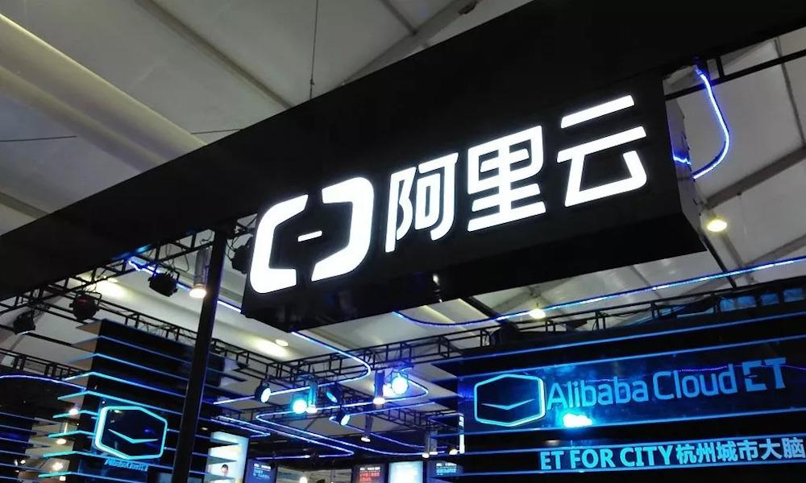
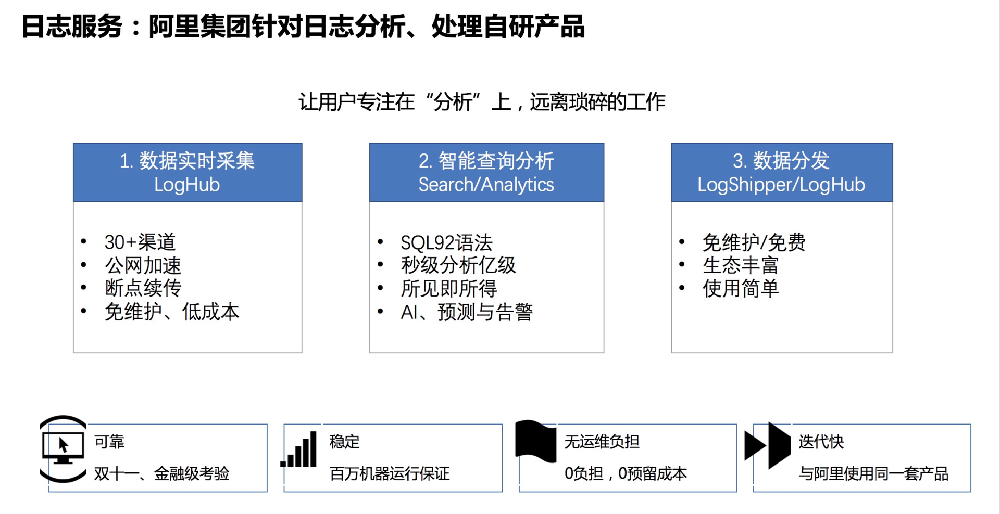
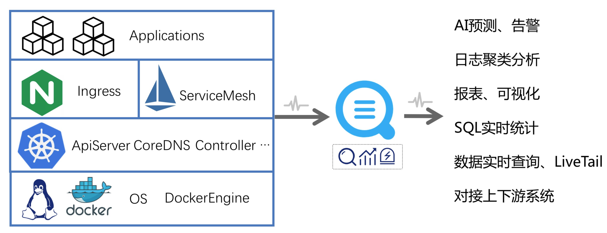
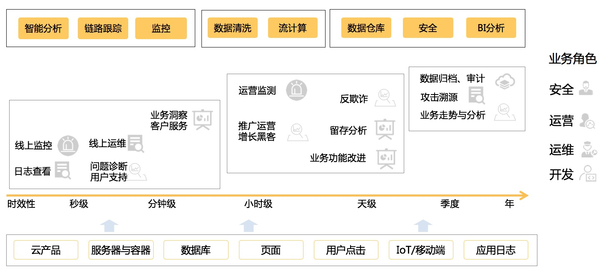
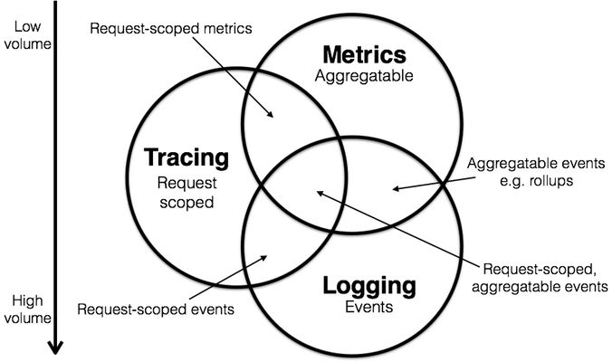

## 阿里云PB级Kubernetes日志平台建设实践  

> 作者: 元乙  
> 发布日期: 2019 年 4 月 23 日  

### 前言

阿里云日志服务是阿里集团针对日志分析、处理的自研产品。Kubernetes 近两年来发展十分迅速，已经成为容器编排领域的事实标准，但是 Kubernetes 中日志采集相对困难，阿里云日志服务技术专家元乙即将在 QCon 北京 2019 分享[Kubernetes 日志平台建设最佳实践](https://2019.qconbeijing.com/presentation/1448?utm_source=infoq&utm_campaign=full&utm_medium=article&utm_term=0422k8s)，借此机会我们采访了元乙老师阿里云 Kubernetes 日志平台是如何建设的。

### 背景

阿里云日志服务是阿里集团针对日志分析、处理的自研产品，最根本的目的是让用户专注在“分析”上，远离琐碎的工作。日志服务整体功能分为 3 个部分：日志采集、智能查询分析和数据分发。相比其他日志系统，阿里云日志服务有以下几个特点：

1. 采集范围广，支持 30+ 种的数据采集通道，包括服务器、交换机、容器、移动端、IOT 等各类设备；支持全球加速、断点续传等功能，使全球化数据高可靠采集成为可能。
2. 数据规模大，支持单用户日 PB 级数据写入，提供数据通道横向自动扩展能力，可根据数据流量进行自动扩容。
3. 查询能力强，提供 SQL92 标准的分析语法，秒级即可分析 10 亿条数据，同时提供丰富的数据图表，提供所见即所得的数据分析能力。
4. 下游渠道多，日志服务支持对接各类下游的数据处理、分析系统，包括 Flink、Storm、Spark 等各类流计算系统，同时也支持 Hadoop、MaxCompute 等离线分析系统。

### Kubernetes 日志采集难点                                     ​

Kubernetes 近两年来发展十分迅速，已经成为容器编排领域的事实标准。Kubernetes 是一个大的生态系统，围绕着 Kubernetes 我们需要去解决很多问题，例如 CI/CD、可扩展性、安全性、可观察性等等。日志是可观察性中必不可少的一部分，而在 Kubernetes 中日志采集相对更加困难，难点主要体现在：

1. 采集目标多，Kubernetes 平台运行着多种系统组件以及众多应用，这些日志由多种日志格式（分隔符、json、Java、Nginx 等）和多种日志形式（宿主机文件、容器 stdout、容器文件、syslog、journal 等）组成，通常主流的 Agent 很难支持各种数据的采集。
2. 环境动态性强，在 Kubernetes 中，各类服务都会进行自动的缩扩容，应用也会进行动态迁移，日志采集很难适应环境动态性强的系统，尤其是日志的完整性很难得到保证。
3. 使用负担大，随着集群规模、使用人数、应用种类的逐渐增长，日志采集的集中式管理、采集可靠性的监控等需求就显得尤其重要。更进一步，如何基于 Kubernetes 的扩展能力让日志采集也能和 Kubernetes 资源一样进行统一的管理？

### 阿里云 Kubernetes 日志平台的整体功能和核心技术

                                        ​
阿里云 Kubernetes 日志平台为 Kubernetes 日志提供接入、查询、分析、可视化、下游对接等日志分析整个生命周期的完整方案，并针对 Kubernetes 的组件日志提供通用的解决方案，例如审计日志、Ingress 日志、系统组件日志等。这里的核心技术主要有以下几点：

1. 全方位日志采集，能够支持 Kubernetes 各类日志的实时采集，并兼顾低资源消耗、高性能、高可靠性。同时基于 CRD 扩展，实现采集与 Kubernetes 的无缝集成。
2. 超大规模数据量，Kubernetes 可轻松管理数万台机器的集群，日数据量可能会达到数百 TB 甚至 PB 级，日志平台能够支撑海量的数据规模，同时保证可扩展性和可靠性。
3. 实时分析能力，日志最常用的场景是监控和问题调查，因此实时的查询 / 分析能力尤其重要，平台能够在秒级内实现对亿级数据任意条件、任意维度组合的分析。
4. 超高性价比，针对日志特点进行针对性系统优化，降低海量数据的存储、处理成本，最大化利用机器资源，在成本控制上对开源方案形成压倒性优势。
5. 通用方案打通，基于日志平台的通用能力，对 Kubernetes 的通用方案进行整体封装，并打通采集、存储、分析、可视化、告警等整个流程，实现通用方案的开箱即用。

### 平台设计难点

阿里云在通用日志平台的建设方面有着 10 年的经验，针对 Kubernetes 场景平台整体的复杂性增加很多，难点主要有：

1. 支持各类采集需求，需支持采集多种日志形式和日志格式，不同的使用场景对日志采集的需求不同，需要保证数据采集具备高可靠、高性能、低资源占用、可监控的能力。
2. Kubernetes 集成，日志的采集和管理需要和 Kubernetes 平台进行无缝兼容，因此需要提供 CRD 的扩展方式，尤其在多种方式同时操作、集群不可用等复杂场景下，CRD 与服务端的同步与协调关系较难维护。
3. 多租户隔离，Kubernetes 日志平台的使用方较多，平台需保证从日志采集、处理、查询、消费等各个环节的多租户隔离，不能让部分用户的大量请求或非法使用而导致整个集群不可用。
4. 超大流量压力，在阿里内部，即使最大规格的 VIP 也无法承受所有日志的流量，双 11、春节红包等流量高峰瞬间可能会打爆集群，因此减少数据回路、削峰填谷、降级方案、系统兜底方案等尤其重要。

### 日志数据的使用

Kubernetes 中存在各种日志，包括内核日志、系统组件日志、Ingress、ServiceMesh、中间件、应用日志等，每种日志都会有不同人员在不同的场景中应用。例如 APIServer 的审计（Audit）日志，安全同学会用来做入侵检测、账号操作审计等，运维同学会基于审计日志做变更管理、核心组件监控、节点监控等，开发同学会使用审计日志检查变更是否生效；例如 Ingress 的访问日志，运营同学会用来做用户行为分析、业务走势分析、运营检测等；运维同学会用来做集群 / 服务监控；开发同学会基于 Ingress 访问日志进行发布前后的指标对比…

从日志平台角度来看，平台需要为不同的业务角色、不同的使用场景提供通用的数据处理 / 分析能力，包括但不限于：智能分析、链路跟踪、监控、数据清洗、流计算、数据仓库、安全分析、BI 分析等。

                                       ​

### Kubernetes 日志平台与可观察性的关系

“可观察性”（Observability）从电气角度上的解释是：“若所有的内部状态都可以输出到输出信号，此系统即有可观察性”。CNCF-Landscape 首次将“可观察性”（Observability）引入到了 IT 领域。可观察性相关的工具主要包括 Logging、Metric、Tracing 三大类，这三者之间有很多重叠部分，从表现力上来看，Metrics 最弱、Tracing 其次、Logging 最强。Metric 主要记录了一些聚合的指标信息，例如 CPU/Mem 利用率、请求成功率、请求延迟等；Tracing 记录从请求发起到响应完毕的整个流程；而日志相对范畴最大，日志记录了系统运行期间所有的信息，而从日志的字段中可以聚合出 Metric、从日志的 RequestID 中可以提取出整个 Tracing 链路。

在 Kubernetes 中，通常通过 Metric 发现问题，然后通过 Tracing 定位问题模块，最后根据日志中的详细信息诊断错误。而在阿里云 Kubernetes 日志平台中可通过智能分析的功能直接基于日志发现、定位并诊断问题，大大减少问题调查时间。智能分析的能力主要有：

1. 日志聚类，根据日志的相似性进行智能归类，秒级即可实现亿级数据自动归类，快速掌握日志整体状态。
2. 异常检测，基于变点检测、折点检测、多周期检测、时序聚类等机器学习方法，自动检测时序中的异常。
3. 日志模式对比，通过前后两个时间段 / 版本的日志模式对比，快速发现当前时间 / 版本的日志差异。
4. 知识库匹配，将问题调查经验以知识库形式保存下来，将日志与知识库内容进行匹配，快速得到具体日志对应的问题和解决方案。

                                     ​

### 阿里云 Kubernetes 日志平台的借鉴意义

阿里云 Kubernetes 日志平台建设过程中考虑的很多问题对于大家都有一定的借鉴意义，例如：

1. 采集方案选择，Kubernetes 中采集通常会使用 DaemonSet 和 Sidecar 两种方式，日志也会分为 stdout 和文件两种形式，文件也分为容器内文件和宿主机挂载文件等不同方式，需根据业务场景特点选择合适的日志采集方案。
2. 平台高可用建设，随着应用场景的逐渐扩展，对于日志平台的可用性要求也越来越高，我们在高可靠日志采集、日志平台自监控、异常自动屏蔽与恢复、高效运维等方面积累了很多宝贵的经验与教训。
3. 生态对接，平台不可能实现日志生命周期中所需的所有系统和功能，很大一部分功能需要上下游的生态来完成（例如流计算、离线计算、Trace 系统、告警系统等），因此生态的对接成为了日志平台能够覆盖所有日志场景必不可少的一个部分。
4. 性能与成本取舍，成本是每个公司都需要考虑的一点，通常日志的开销只占 IT 支出的 1-3% 左右，日志的采集、存储、查询等各个环节需尽可能的节省资源，同时还需保证整体性能在可接受范围内。

