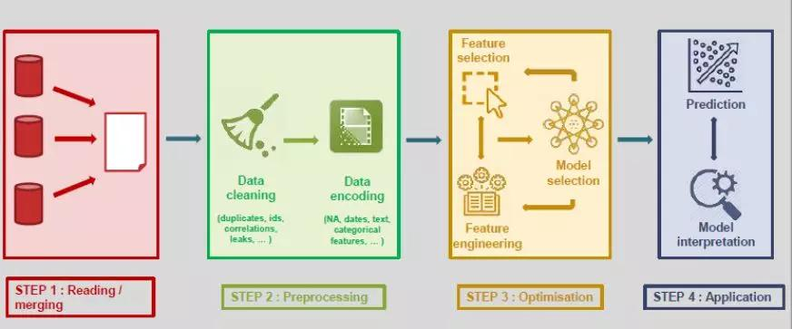
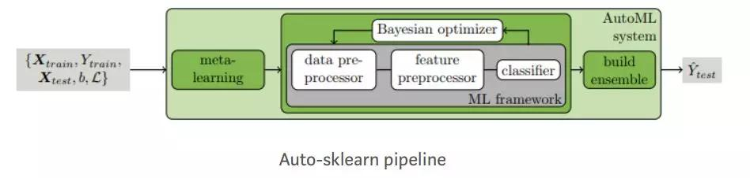
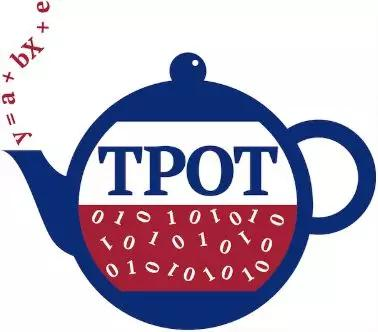
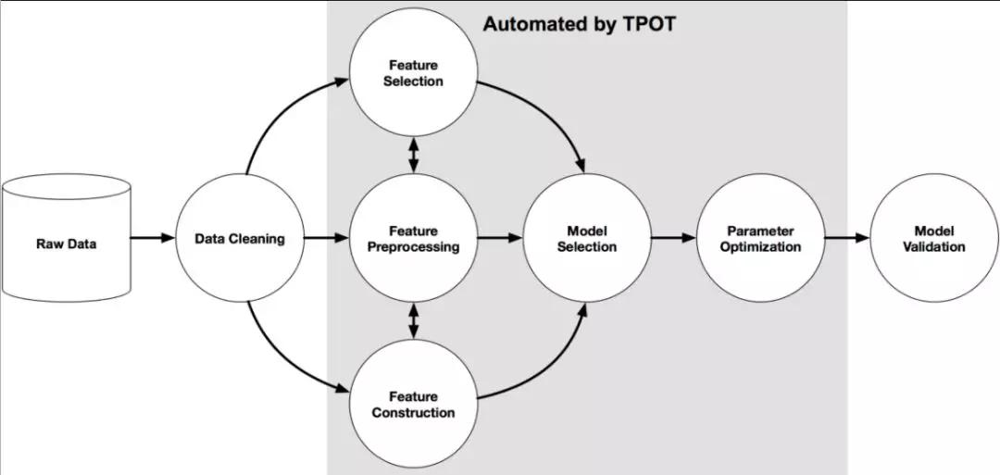
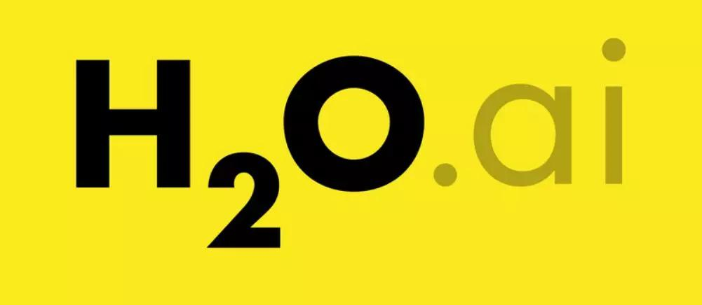
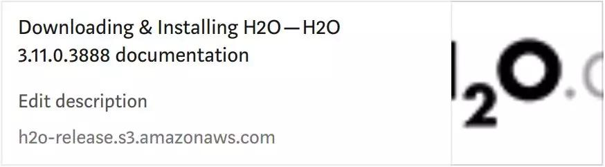
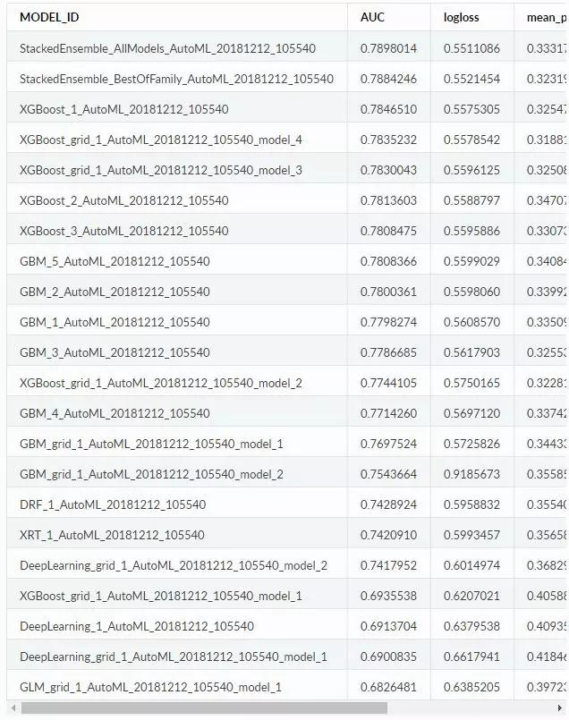
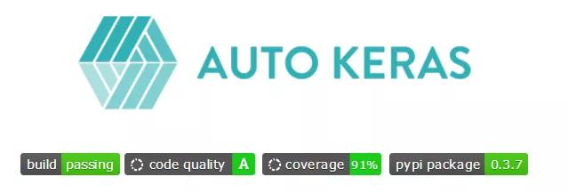
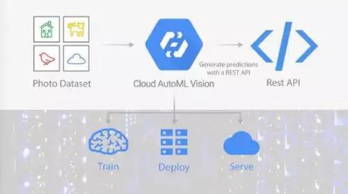
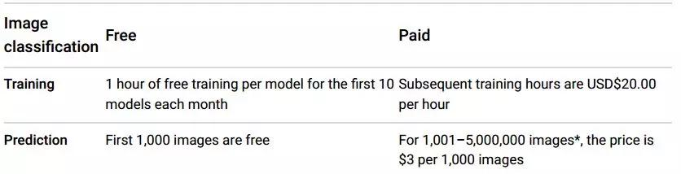

## AutoML：机器学习的下一波浪潮  

> 原创：  
> AI前线小组 译  
> 作者: AI前线  
> 发布日期: 2019-04-30  


 作者 | Parul Pandey  译者 | 杨雷  编辑 | Natalie **AI 前线导读：** 人工智能和机器学习仍然是一个进入门槛较高的领域，需要专业的知识和资源，很少有公司可以自己承担。—— 李飞飞

**自动机器学习** （ **AutoML** ）是将机器学习应用于现实问题的端到端流程自动化的过程。AutoML 使真正意义上的机器学习成为可能，即使对于没有该领域专业知识的人也是如此。本文介绍了一些流行的 AutoML 框架，这些框架的趋势是自动化部分或整个机器学习的管道。

**更多优质内容请关注微信公众号“AI 前线”（ID：ai-front）**

Mercari 是一款在日本很受欢迎的购物应用程序，它一直使用 AutoML Vision（谷歌的 AutoML 解决方案）对图像进行分类。根据 Mercari 的说法，他们一直在“开发自己的 ML 模型，在照片上传的用户界面上推荐 12 个主要品牌的品牌名称。”

虽然他们自己在 TensorFlow 上训练的模型达到了 75% 的精度，但 AutoML Vision 的高级模式因为拥有 50,000 张训练图像，所以精度更是高达 91.3％，提升了竟有 15％。基于如此惊人的结果，Mercari 已经将 AutoML 集成到他们的系统中。

AutoML 通过使不同背景的人能够演进机器学习模型来解决复杂的场景，正在从根本上改变基于 ML 的解决方案给人们的印象，以上仅是说明它如何改变的其中一例。

自动机器学习：AutoML

近年来，机器学习在各个领域都取得了重大突破。金融服务、医疗保健、零售、交通等领域一直在以某种方式使用机器学习系统，而且取得了很好的效果。

今天的机器学习不仅限于研发应用，而且已经进入了企业领域。不过，传统的 ML 流程仍依赖于人力，但并非所有企业都有资源来投资经验丰富的数据科学团队，AutoML 可能正是这种困境的一个答案。

**自动机器学习** （ **AutoML** ）是将机器学习应用于现实问题的端到端过程自动化的过程。AutoML 使机器学习真正意义上成为可能，即使对于在该领域没有专业知识的人也是如此。

典型的机器学习模型包括以下四个过程：



如何自动化机器学习管道：Axel de Romblay

从摄取数据到 预处理、优化，然后预测结果，每个步骤都由人来控制和执行。AutoML 主要关注两个主要方面：数据采集 / 收集和预测。中间发生的所有其他步骤都可以轻松实现自动化，同时提供经过优化并准备好进行预测的模型。

为什么需要 AutoML

在过去几年中，对机器学习系统的需求飙升。这是因为 ML 如今在广泛的应用中取得了成功。然而，即使有这种明确的迹象表明机器学习可以为某些企业提供支持，但很多公司仍在为部署 ML 模型而艰难地努力着。

首先，他们需要建立一支由经验丰富的数据科学家组成的团队，这些科学家都要拿丰厚的薪水。其次，即使你拥有一支优秀的团队，往往需要更多的经验来 决定哪种模式 最适合你的问题，而不是知识。

机器学习在各种应用中的成功，导致了对机器学习系统不断增长的需求，这些系统可以由非专家使用¹。AutoML 倾向于尽可能多地自动化 ML 管道中步骤，在只需最少人力的情况下仍保持模型的性能。

好处

AutoML 的优点可归纳为三大要点：

* 通过自动执行的重复性任务来 **提高工作效率** 。这使得数据科学家能够更多地关注问题而不是模型。

* 自动化 ML 管道还有助于 **避免** 可能因手动引入的 **错误** 。

* 最后，AutoML 是向 **机器学习民主化** 迈出的一步，它使所有人都能使用 ML 的功能。

AutoML 框架

让我们来看看一些流行的框架，这些框架的趋势是自动化部分或整个机器学习的管道。这个清单不可能太详尽，我尽力涵盖那些正在被大规模使用的框架。

1\. MLBox


MLBox 是一个功能强大的自动化机器学习 Python 库。根据官方文档，该库提供以下功能：

* 快速读取，分布式数据预处理 / 清洗 / 格式化。

* 高可靠性的特征选择，泄漏检测，准确的 超参数优化

* 用于分类和回归的最先进的预测模型（深度学习，堆叠，LightGBM，......）

* 具有模型解释的预测

* 已经在 Kaggle 上进行了测试并且表现良好。（参见 Kaggle “Two Sigma Connect：Rental ListingInquiries”| Rank： **85/2488** ）

管道

MLBox 的主程序包包含 3 个子包，用于自动执行以下任务：

*  **预处理** ：用于读取和预处理数据

*  **优化：** 用于测试和 交叉验证 模型

*  **预测：** 用于预测。

安装

目前，MLBox 仅兼容 Linux，很快就会支持 Windows 和 MacOS。

```
#gcc
sudo apt-get install build-essential

#cmake
pip install cmake
pip install mlbox
```

演示

在著名的 房价 回归（House Prices Regression）问题上运行“MLBox”的自动 ML 包。

完整的源代码：https://www.kaggle.com/axelderomblay/running-mlbox-auto-ml-package-on-house-prices

2\. Auto-Sklearn

Auto-Sklearn 是一个基于  Scikit-learn 构建的自动化机器学习软件包。Auto-Sklearn 让机器学习的用户从算法选择和超参数调整中解放出来。它包括 特征工程 方法，如独热编码（One-Hot）、数字特征标准化、PCA 等。该模型使用 sklearn 估计器处理分类和回归问题。



Auto-sklearn 管道

Auto-sklearn 创建了一个管道，并使用贝叶斯搜索对其进行优化。在 ML 框架的贝叶斯超参数优化中，添加了两个组件： **元学习** 用于初始化贝叶斯优化器，从优化过程中评估配置的 **自动集合构造** 。

Auto-sklearn 在中小型数据集上表现良好，但它还无法在大型数据集上产生性能最先进的现代深度学习系统。

安装

Auto-sklearn 目前仅适用于 Linux 系统的机器。

```
#dependencies
curl https://raw.githubusercontent.com/automl/auto-sklearn/master/requirements.txt | xargs -n 1 -L 1 pip install

#auto-sklearn
pip install auto-sklearn
```

演示

以下示例显示如何使用 Auto-Sklearn 拟合简单回归模型。

```
import sklearn.model_selection
import sklearn.datasets
import sklearn.metrics

import autosklearn.regression

def main():
X, y = sklearn.datasets.load_boston(return_X_y=True)
feature_types = (['numerical'] * 3) + ['categorical'] + (['numerical'] * 9)
X_train, X_test, y_train, y_test = \
sklearn.model_selection.train_test_split(X, y, random_state=1)

automl = autosklearn.regression.AutoSklearnRegressor(
time_left_for_this_task=120,
per_run_time_limit=30,
tmp_folder='/tmp/autosklearn_regression_example_tmp',
output_folder='/tmp/autosklearn_regression_example_out',
)
automl.fit(X_train, y_train, dataset_name='boston',
feat_type=feature_types)

print(automl.show_models())
predictions = automl.predict(X_test)
print("R2 score:", sklearn.metrics.r2_score(y_test, predictions))

if __name__ == '__main__':
main()
```

资源：https://automl.github.io/auto-sklearn/stable/examples/example\_regression.html\#sphx-glr-examples-example-regression-py

3\. 基于树的管道优化工具（TPOT）



TPOT 是一个 Python 自动化机器学习工具，利用遗传算法来优化机器学习管道。TPOT 扩展了 Scikit-learn 框架，使用了自己的回归器和分类器方法。TPOT 的工作原理是探索数千条可能的管道，并为数据找到最好的一个。



TPOT 自动化的机器学习过程

TPOT 无法自动处理自然语言输入。此外，它还无法处理分类字符串，在作为数据传入之前，这些字符串必须进行整数编码。

安装

```
pip install tpot
```

有关详细说明，请访问 TPOT 安装说明。

演示

演示 TPOT 用于分类 MNIST 数字的工作。

gif

MNIST 数据库上的 TPOT 演示开源代码：https://epistasislab.github.io/tpot/

4\. H2O



H2O 是  H20.ai 公司的完全开源的分布式内存机器学习平台。H20 同时支持 R 和 Python，支持最广泛使用的统计和机器学习算法，包括梯度提升（Gradient Boosting）机器、广义线性模型、深度学习模型等。

H2O 包括一个自动机器学习模块，使用自己的算法来构建管道。它对特征工程方法和模型超参数采用了穷举搜索，优化了管道。

H2O 自动化了一些最复杂的数据科学和机器学习工作，例如特征工程、模型验证、模型调整、模型选择 和 模型部署。除此之外，它还提供了自动可视化以及机器学习的解释能力（MLI）。

安装

请按照以下链接下载并安装 H2O。



下载和安装 H2O - H2O 3.11.0.3888 文档：https://h2o-release.s3.amazonaws.com/h2o/master/3888/docs-website/h2o-docs/downloading.html\#downloading-installing-h2o

演示

以下是一个 Python 示例，展示了 H2OAutoML 类的基本用法：

```
import h2o
from h2o.automl import H2OAutoML

h2o.init()

### Import a sample binary outcome train/test set into H2O
train = h2o.import_file("https://s3.amazonaws.com/erin-data/higgs/higgs_train_10k.csv")
test = h2o.import_file("https://s3.amazonaws.com/erin-data/higgs/higgs_test_5k.csv")

### Identify predictors and response
x = train.columns
y = "response"
x.remove(y)

### For binary classification, response should be a factor
train[y] = train[y].asfactor()
test[y] = test[y].asfactor()

### Run AutoML for 20 base models (limited to 1 hour max runtime by default)
aml = H2OAutoML(max_models=20, seed=1)
aml.train(x=x, y=y, training_frame=train)

### View the AutoML Leaderboard
lb = aml.leaderboard
lb.head(rows=lb.nrows) # Print all rows instead of default (10 rows)

### model_id auc logloss mean_per_class_error rmse mse
### --------------------------------------------------- -------- --------- ---------------------- -------- --------
### StackedEnsemble_AllModels_AutoML_20181212_105540 0.789801 0.551109 0.333174 0.43211 0.186719
### StackedEnsemble_BestOfFamily_AutoML_20181212_105540 0.788425 0.552145 0.323192 0.432625 0.187165
### XGBoost_1_AutoML_20181212_105540 0.784651 0.55753 0.325471 0.434949 0.189181
### XGBoost_grid_1_AutoML_20181212_105540_model_4 0.783523 0.557854 0.318819 0.435249 0.189441
### XGBoost_grid_1_AutoML_20181212_105540_model_3 0.783004 0.559613 0.325081 0.435708 0.189841
### XGBoost_2_AutoML_20181212_105540 0.78136 0.55888 0.347074 0.435907 0.190015
### XGBoost_3_AutoML_20181212_105540 0.780847 0.559589 0.330739 0.43613 0.190209
### GBM_5_AutoML_20181212_105540 0.780837 0.559903 0.340848 0.436191 0.190263
### GBM_2_AutoML_20181212_105540 0.780036 0.559806 0.339926 0.436415 0.190458
### GBM_1_AutoML_20181212_105540 0.779827 0.560857 0.335096 0.436616 0.190633
### GBM_3_AutoML_20181212_105540 0.778669 0.56179 0.325538 0.437189 0.191134
### XGBoost_grid_1_AutoML_20181212_105540_model_2 0.774411 0.575017 0.322811 0.4427 0.195984
### GBM_4_AutoML_20181212_105540 0.771426 0.569712 0.33742 0.44107 0.194543
### GBM_grid_1_AutoML_20181212_105540_model_1 0.769752 0.572583 0.344331 0.442452 0.195764
### GBM_grid_1_AutoML_20181212_105540_model_2 0.754366 0.918567 0.355855 0.496638 0.246649
### DRF_1_AutoML_20181212_105540 0.742892 0.595883 0.355403 0.452774 0.205004
### XRT_1_AutoML_20181212_105540 0.742091 0.599346 0.356583 0.453117 0.205315
### DeepLearning_grid_1_AutoML_20181212_105540_model_2 0.741795 0.601497 0.368291 0.454904 0.206937
### XGBoost_grid_1_AutoML_20181212_105540_model_1 0.693554 0.620702 0.40588 0.465791 0.216961
### DeepLearning_1_AutoML_20181212_105540 0.69137 0.637954 0.409351 0.47178 0.222576
### DeepLearning_grid_1_AutoML_20181212_105540_model_1 0.690084 0.661794 0.418469 0.476635 0.227181
### GLM_grid_1_AutoML_20181212_105540_model_1 0.682648 0.63852 0.397234 0.472683 0.223429
###
### [22 rows x 6 columns]

### The leader model is stored here
aml.leader

### If you need to generate predictions on a test set, you can make
### predictions directly on the `"H2OAutoML"` object, or on the leader
### model object directly

preds = aml.predict(test)

### or:
preds = aml.leader.predict(test)
```

资源：http://docs.h2o.ai/h2o/latest-stable/h2o-docs/automl.html

输出

AutoML 对象包括在过程中训练的模型的“排行榜”，根据问题类型（排行榜的第二列）按默认度量排名。以下是 二进制分类 任务的排行榜示例：



5\. AutoKeras



Auto-Keras 是 DATA Lab 构建的一个用于自动化机器学习的开源软件库。基于  Keras 深度学习框架，Auto-Keras 提供了自动搜索深度学习模型的体系结构和超参数的功能。

API 的设计遵循 Scikit-Learn API 的经典设计，因此使用起来非常简单。当前版本提供了在深度学习过程中自动搜索超参数的功能。

Auto-Keras 的趋势是通过使用自动 神经架构搜索（NAS）算法简化 ML 过程。NAS 基本上用一组自动调整模型的算法，替代了深度学习工程师 / 从业者。

安装

安装 部分也很简单：

```
pip install autokeras #only comptible with Python 3.7
```

演示

以下是 MNIST 数据集上 Auto-Keras 库的演示：

```
from keras.datasets import mnist
from autokeras import ImageClassifier
from autokeras.constant import Constant

if __name__ == '__main__':
(x_train, y_train), (x_test, y_test) = mnist.load_data()
x_train = x_train.reshape(x_train.shape + (1,))
x_test = x_test.reshape(x_test.shape + (1,))
clf = ImageClassifier(verbose=True, augment=False)
clf.fit(x_train, y_train, time_limit=30 * 60)
clf.final_fit(x_train, y_train, x_test, y_test, retrain=True)
y = clf.evaluate(x_test, y_test)

print(y * 100)
```

资源：https://github.com/keras-team/autokeras/blob/master/examples/a\_simple\_example/mnist.py

6\. Cloud AutoML

Cloud AutoML 是来自 Google 的一套机器学习产品，利用 Google 最先进的 迁移学习 和神经架构搜索（NAS）技术，让具有有限的机器学习专业知识的开发人员能够训练出特定的业务需求的高质量模型。

Cloud AutoML 提供了一个简单的图形用户界面（GUI），可根据自己的数据来训练、评估、改进和部署模型。目前，该套件提供以下 AutoML 解决方案：



Google 的 AutoML 类别下提供的产品

**谷歌 AutoML** 的缺点是 **非开源的** ，因此需要付钱购买。对于 AutoML Vision，成本既取决于培训模型所花费的时间，也取决于发送给 AutoML Vision 进行预测的图像数量。定价如下：



AutoML Vision 定价

7\. TransmogrifAI


TransmogrifAI 是  Salesforce 的一个开源自动化机器学习库。该公司的旗舰 ML 平台名为 爱因斯坦，也由 TransmogrifAI 驱动。它是一个端到端的 AutoML 库，用于 Scala 编写的结构化数据，运行在  Apache Spark 之上。在以下场景中，TransmogrifAI 特别有用：

* 快速训练高质量机器学习模型，只需极少的手动调节

* 构建模块化、可重用、强类型的机器学习工作流

安装

先决条件是需要安装 Java 和 Spark：

```
###Install JAVA 1.8
###Get Spark 2.3.x
git clone https://github.com/salesforce/TransmogrifAI.git
cd TransmogrifAI && ./gradlew compileTestScala installDist
```

阅读文档（https://docs.transmogrif.ai/en/stable/installation/index.html\#installation ），获取完整的安装说明。

演示

用 TransmogrifAI 预测泰坦尼克号幸存者，在 https://transmogrif.ai/ 查看整个示例。

```
import com.salesforce.op._
import com.salesforce.op.readers._
import com.salesforce.op.features._
import com.salesforce.op.features.types._
import com.salesforce.op.stages.impl.classification._
import org.apache.spark.SparkConf
import org.apache.spark.sql.SparkSession

implicit val spark = SparkSession.builder.config(new SparkConf()).getOrCreate()
import spark.implicits._

// Read Titanic data as a DataFrame
val passengersData = DataReaders.Simple.csvCase[Passenger](path = pathToData).readDataset().toDF()

// Extract response and predictor features
val (survived, predictors) = FeatureBuilder.fromDataFrame[RealNN](passengersData, response = "survived")

// Automated feature engineering
val featureVector = predictors.transmogrify()

// Automated feature validation and selection
val checkedFeatures = survived.sanityCheck(featureVector, removeBadFeatures = true)

// Automated model selection
val (pred, raw, prob) = BinaryClassificationModelSelector().setInput(survived, checkedFeatures).getOutput()

// Setting up a TransmogrifAI workflow and training the model
val model = new OpWorkflow().setInputDataset(passengersData).setResultFeatures(pred).train()

println("Model summary:\n" + model.summaryPretty())
```

AutoML 的未来

从本质上讲，AutoML 的目的是自动化重复的任务，如管道创建和超参数调整，以便数据科学家在实际中可以将更多的时间花在手头的业务问题上。

AutoML 还在于让所有人都能使用这项技术，而不仅仅少数人才能用。AutoML 和数据科学家可以联合起来加速 ML 的发展过程，从而实现机器学习的真正效率。

AutoML 是否成功取决于它的使用率和在这个领域所取得的进展。很明显，AutoML 是机器学习未来的一个重要组成部分。

参    考

1. https://ml.informatik.uni-freiburg.de/papers/15-NIPS-auto-sklearn-preprint.pdf

2. 自动机器学习框架的基准（https://arxiv.org/pdf/1808.06492v1.pdf）

**查看原文链接** ：

https://heartbeat.fritz.ai/automl-the-next-wave-of-machine-learning-5494baac615f
