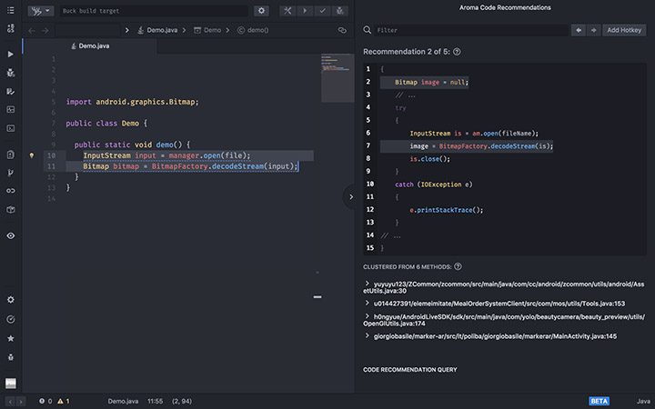
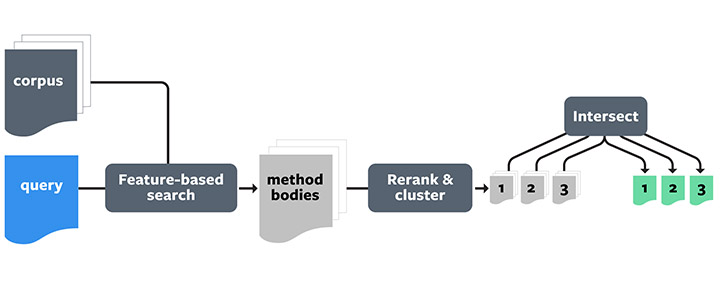
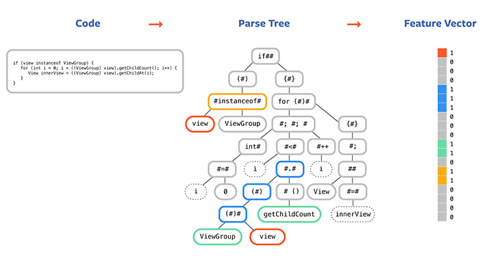
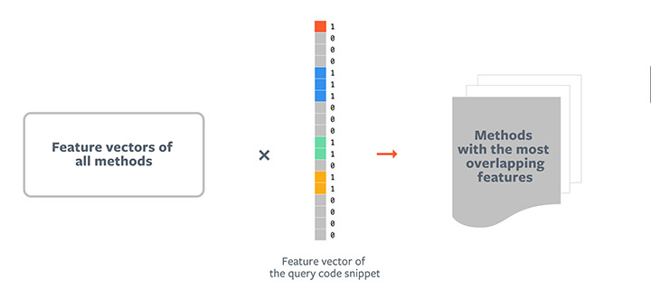

## 编程神器！Facebook推出代码智能搜索与推荐工具Aroma  

> 作者: Frank Luan  
> 译者: 核子可乐  
> 发布日期: 2019 年 4 月 10 日  


> 工程师创造了丰富的软件与应用，但是工程师本身却被复杂繁琐的代码所束缚，面对动辄上百万行的代码，如何提升编程效率就成为了头号难题。为了解决这一问题，Facebook 推出了 Aroma，这是一款代码到代码型搜索与推荐工具，利用机器学习技术，降低从大型代码库当中获取洞察见解的难度。简而言之就是：当你编写代码时，AI 会为你推荐一种最佳写法。本文将详细解释代码建议的含义，并对 Aroma 的工作原理进行解析。

成千上万的工程师们正通过编写代码创造人们耳熟能详的各类应用程序，并借此为全球数十亿人提供服务。这绝对是一项规模浩大的任务——时至今日，人们享受的服务正变得愈发多样也愈发复杂，而这些服务当中往往包含着数百万行代码，这些代码与消息以图像的形式传递，并在各类不同系统之间相互交叉。

为了简化并加快可能对众多系统产生影响的代码编写流程。工程师们往往需要一种可行的方法，用于查找其他人如何处理类似的任务。为此，Facebook 创建了 Aroma，这是一款代码到代码型搜索与推荐工具。其采用机器学习（简称 ML）技术，旨在降低从大型代码库当中获取洞察见解的难度。

在 Aroma 出现之前，各类原有工具一直无法彻底解决这个问题。文档工具往往可用性较差且严重过时，代码搜索工具通常会返回无数个匹配结果，而用户却很难立即从其中找到自己习惯的使用模式。 **通过 Aroma，工程师们现在能够轻松发现常见的编码模式，而不再需要手动浏览数十个代码段** ，这将显著节约日常开发工作所耗费的时间与精力。

除了将 Aroma 部署到我们的内部代码库内之外，我们还开发出 Aroma 的开源版本。本文所提到的全部示例皆来自 GitHub 上的一套包含 5000 个开源 Android 项目的集合。

### 代码建议是什么，其意义何在？

下面，让我们思考一下 Android 工程师打算参考其他人如何编写类似代码时的情景。假设工程师编写以下内容来解码 Android 手机上的 bitmap 文件：

复制代码

```
Bitmap bitmap = BitmapFactory.decodeStream(input);
```

这确实可行，但工程师希望了解其他人如何在相关项目当中实现此项功能，特别是他们具体设置了哪些常用选项、可能遭遇到哪些常见错误，以及如何避免应用程序在生产环境中出现崩溃。

Aroma 使得工程师们能够利用代码片段本身进行搜索查询。结果将以代码建议的形式返回。每一项代码建议都创建自存储在代码库中的类似代码片段集群，并以最常见的使用模式呈现。以下为 Aroma 在此示例当中返回的第一条建议：

##### 代码示例 1

复制代码

```
final BitmapFactory.Options options = new BitmapFactory.Options();

options.inSampleSize = 2;

// ...

Bitmap bmp = BitmapFactory.decodeStream(is, null, options);
```

这段代码建议为存储库集合当中五种类似方法的综合产物。此处仅显示了方法集群当中的共有代码，并在不同代码片段间（即…部分）删除了各方法的具体细节。

这段代码表达出了怎样的含义？可以看到，其本质上就是工程师们在五种不同的情况下，如何为解码 bitmap 任务设置额外的选项。设置样本大小，将有助于减少解码大型 bitmap 文件时的内存消耗量。实际上，Stack Overflow 上的一篇热门帖子就曾经提到这种模式。Aroma 通过发现包含此种模式的代码片段集自动生成了这条建议。

下面让我们看看另一条代码建议。

##### 代码示例 2

复制代码

```
try {

InputStream is = am.open(fileName);

image = BitmapFactory.decodeStream(is);

is.close();

} catch (IOException e) {

// ...

}
```

这段代码由另外四种方法聚类而来。它显示了 InputStream 在代码 bitmap 当中的常规作法。此外，这条建议还展示了在打开 InputStream 时捕捉潜在 IOEception 的良好实践。如果此异常在运行过程中发生且未被捕获，则应用程序将立即崩溃。负责任的工程师应当利用此项建议进行代码扩展，并正确处理这一异常问题。



与传统的代码搜索工具相比，Aroma 的代码建议功能主要具有以下几项优点：

* Aroma 在语法树上执行搜索。Aroma 并非立足字符串或者令牌级别进行匹配，而是能够真正找到在语法层面与查询代码类似的实例，并通过对不相关的语法结构进行剪枝来突出显示切实匹配的代码。

* Aroma 能够自动将类似的搜索结果聚合在一起以生成代码建议。这些建议体现出惯用的编码模式，且易用性也远远高于非聚合搜索匹配结果。

* Aroma 的速度表现也相当出色，可支持用户的实时使用。在实践当中，即使面对规模非常庞大的代码为，其也能够在几秒钟之内创建代码建议，且不需要提前进行任何模式挖掘。

* Aroma 的代码算法与语言无关。我们已经在 Hack、JavaScript、Python 以及 Java 的内部代码库中部署了 Aroma。

### Aroma 的工作原理



Aroma 的代码建议创建流程主要分为三个阶段：

1. 基于特征的搜索

首先，Aroma 将代码语料库索引为稀疏矩阵。具体来讲，它通过解析语料库中的每一种方法并创建对应解析树实现这一任务。接下来，它会从每个方法的解析树当中提取一组结构特征。认真选择这些特征并捕获相关变量用法、方法调用与控制结构信息，它即可最终根据每种方法的特征为其创建一个稀疏向量。所有方法的该特征向量将共同组成索引矩阵，以供搜索检索使用。



当工程师们编写新的代码片段时，Aroma 即以上述方式创建稀疏向量，并将该向量的点积与包含所有现有方法的特征向量矩阵相乘。此后，点积当中最高的前 1000 条方法检索即为推荐结果的候选集。尽管代码语料库当中可能包含数百万种方法，但由于能够有效实现稀疏向量与矩阵的点积，整个检索过程仍能够快速完成。



2. 重新排名与聚类

在 Aroma 对具有相似特征的方法进行检索并创建出候选集之后，下一阶段即是对结果进行聚类。为了实现这一点，Aroma 首先需要通过这些候选结果与查询代码片段间的相似性来对其进行重新排名。由于稀疏向量当中仅包含关于存在哪些特征的抽象信息，所以点积分往往会低估代码片段与查询结果之间的实际相似性。因此，Aroma 在方法语法树上应用剪枝以丢弃方法体当中不相关的部分，并仅保留与查询片段匹配度最高的部分，从而根据它们与查询代码的实际相似性进行候选代码片段的重新排名。

在获得一份与查询代码相似的降序候选代码片段清单之后，Aroma 会运行迭代聚类算法以找出彼此相似、且包含可用于创建代码建议的额外语句的代码片段构成的集群。


3. 交叉：代码建议的创建过程

代码片段 1（改编自此项目）：

复制代码

```
InputStream is = ...;

final BitmapFactory.Options options = new BitmapFactory.Options();

options.inSampleSize = 2;

Bitmap bmp = BitmapFactory.decodeStream(is, null, options);

ImageView imageView = ...;

imageView.setImageBitmap(bmp);

// some more code
```

代码片段 2（改编自此项目）：

复制代码

```
BitmapFactory.Options options = new BitmapFactory.Options();

while (...) {

in = ...;

options.inSampleSize = 2;

options.inJustDecodeBounds = false;

bitmap = BitmapFactory.decodeStream(in, null, options);

}
```

代码片段 3（改编自此项目）：

复制代码

```
BitmapFactory.Options bmpFactoryOptions = new BitmapFactory.Options();

// some setup code

try {

options.inSampleSize = 2;

loadedBitmap = BitmapFactory.decodeStream(inputStream, null, bmpFactoryOptions);

// some code...

} catch (OutOfMemoryError oom) {

}
```

交叉算法的工作原理，是将第一个代码片段作为“基础”代码，而后针对集群当中的每一种其它方法以迭代方式对其进行剪枝。剪枝过程之后的剩余代码将成为所有方法中的共有代码，并成为代码建议中的组成部分。其它细节请参阅我们的相关论文。

在本示例当中，每个代码片段都包含特定于其项目的代码，但它们各自都具有着相同的代码，专门用于设置 bitmap 的解码选项。如上所述，Aroma 首先对第一个代码片段进行剪枝，即去掉没有出现在第二个片段中的行，从而最终找出共有代码。其中间结果如下所示：

复制代码

```
InputStream is = ...;

final BitmapFactory.Options options = new BitmapFactory.Options();

options.inSampleSize = 2;

Bitmap bmp = BitmapFactory.decodeStream(is, null, options);
```

代码片段 1 中关于 ImageView 的代码并未出现在代码片段 2 当中，因此其会被移除。现在，Aroma 利用这一中间片段与代码片段 3 进行比对，对不存在的行进行剪枝；而后是代码片段 4，重复这一操作。最终生成的代码将以代码建议的形式返回。如代码示例 1 所示，利用这套集群所创建的代码建议恰好包含所有方法体当中所常见的三行代码。

大家也可以使用其它集群以同样的方式创建代码建议，Arom 的算法将确保提供多种不同的建议，从而帮助工程师通过查看多个代码片段了解各种各样的编码模式。举例来说，代码示例 2 就是由另一集群计算得出的建议结果。

这正是 Aroma 的真正优势所在。如今，您不再需要以手动方式筛选数十条代码搜索结果并逐个寻找其中的常见使用模式——Aroma 能够在几秒钟之内自动完成整个流程！

### 展望未来

考虑到目前的代码储备已经非常丰富，我们相信工程师应该拥有这种立足大型代码库发现重复编码模式，并从中学习的能力。而这，也正是 Aroma 项目的核心赋能目标。Aroma 与 Getafix 只是我们正在开发的一系列大型代码项目中的代表，它们利用机器学习技术改进软件工程水平。随着我们在这一领域中的不断进步，相信最终编程工作将成为一种半自由化任务，允许人类表达更高层次的想法，并由计算机本身负责完成具体的实现步骤。

原文链接：

<https://ai.facebook.com/blog/aroma-ml-for-code-recommendation/>
