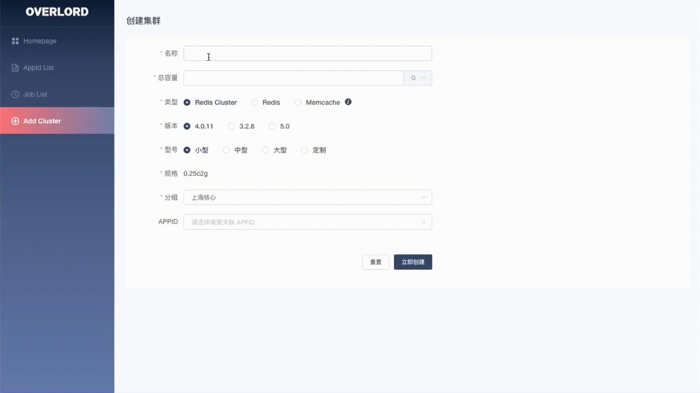
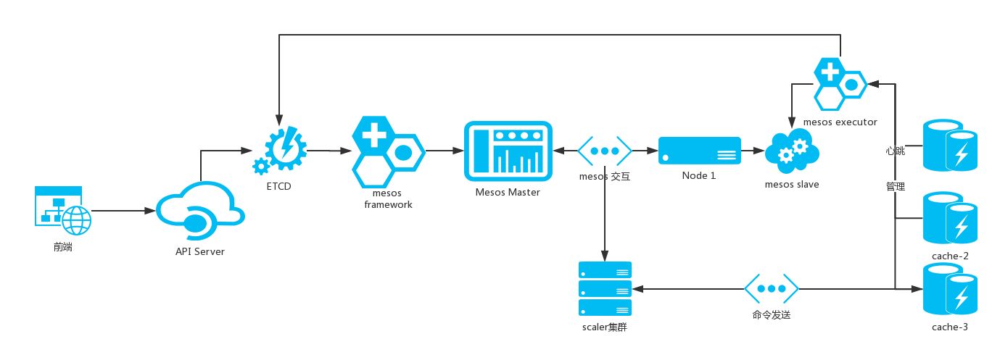

## bilibili 缓存解决方案（一）： overlord-platform介绍  

> 作者: 林堂辉  
> 发布日期: 2019 年 4 月 30 日  


随着 b 站业务的高速发展，对于缓存的依赖也变得越来越大，缓存集群的规模也跟随这业务的发展而告诉增长。随之也带来了一系列的问题。对于高速增长的缓存集群，如何高效地进行运维管理成为了一个迫在眉睫的问题。

对于缓存的管理，主要面临如下几个问题。

**如何快速部署新集群** ：业务新接入集群时，如何在现有的缓存机器集群里面挑选合适的机器进行部署，目前的做法是人工查询机器的剩余内存容量，然后手动选择空闲的机器进行新集群的部署。随着机器规模的增大，这种方式显然没法满足需求，而且对于运维人员也是一种负担。

**集群扩容** ：随着业务量请求量的增大，现有的缓存集群无论是从内存容量还是单节点 qps 上都已无法满足现在业务的需求，因此必须对集群进行扩容操作。如何挑选合适的机器部署新节点，对于 redis-cluster，部署新增节点的机器还必须满足 cluster 的规则，即不能超过半数节点部署在一台机器上。同样这一过程目前也是通过人肉解决。

**缓存故障** : 服务在线上运行时，发生故障是在所难免的，当缓存节点发生故障时，如何快速自动拉起新节点， 服务如何自动感知到新节点的 ip 并自动完全切换。当机器故障宕机时，如何将故障机器的缓存实例快速迁移至新机器，并对业务生效。之前都还是手动创建新实例，更改配置文件，并寻找相关业务方进行发版使配置生效，整个故障处理的流程相当的冗长。

overlord 的诞生就是为了解决如上一些问题。

[overlord](https://github.com/bilibili/overlord)是 bilibili 自研的一套缓存解决方案, 致力于提供轻量级高可用的缓存代理模式，以及自动高效的自动化缓存管理平台。overlord 主体分为两个部分，分别是缓存代理 overlord-proxy 以及缓存管理平台 overlord-platform, 本篇文章将主要对 overlord-platform 进行介绍。

overlord-platform 是自动化的缓存管理平台，提供了资源的统一接入管理。支持自动化快速创建部署集群，支持自动扩缩容以及快速故障转移。



### platform 总体架构设计



platform 包括如下几个模块

* scheduler: 资源调度模块，即 mesos framework，负责资源的分配获取以及调度任务的下发
* executor：资源部署模块，负责拉起缓存节点以及缓存实例的健康检查
* api-server: 管理后台模块，通过后台 dashboard 进行资源的监控管理以及任务的下发

同时 platform 依赖了一些第三方开源组件

* etcd：存储节点元信息以及部署任务信息，api-server 将部署任务写入 etcd，scheduler 监听 etcd 拿到部署任务信息执行集群创建部署计划，并将最终集群分布信息写入 etcd
* mesos：机器资源管理框架，每一台缓存机器部署一个 mesos-agent，并将机器资源信息上报给 mesos-master，mesos-master 将机器资源信息通过 offer 下发给 scheduler，由 scheduler 进行二次调度部署集群实例。

### 资源调度

platform 使用 mesos 进行资源的管理，通过定制的 scheduler framework 对 mesos 提供的资源进行二次分发。我们使用chunk对资源进行分发调度，chunk 算法保证了资源的分布符合预定的约束条件。

#### chunk 算法

chunk 算法参考了[饿了么](https://zhuanlan.zhihu.com/p/44886959)的实现, 保证了机器资源的负载均衡以及集群的高可用。

针对 redis-cluster 集群，chunk 算法提出了以下几个约束条件：

1. 主从不在同一个物理节点
2. 任意一个物理节点分配的节点数少于总数的一半
3. 尽可能部署在资源最充足的物理节点

对于非 cluster 模式的集群（memcache 或 redis singleton）由于不存在主从的概念，因此约束条件可以简化为 2 和 3。

同时为了实现上的方便，对 chunk 算法还有以下约定：

1. master 数量必须为偶数
2. 可用机器数必须不小于三
3. 机器节点数不能为 3 且 master 数量不能为 4

**chunk go 实现**

* 把 offer 根据节点 mem cpu 的需求转换成对应的可用资源单元

复制代码

```
func mapIntoHostRes(offers []ms.Offer, mem float64, cpu float64) (hosts []*hostRes) {

// 具体实现 chunk.go/mapIntoHostRes

}

type hostRes struct {

name  string  // 机器名

count int // 当前机器可分配的节点数

}
```

* 按每台机器可部署的节点数进行降序排序
* 填充每台机器应部署的节点数

复制代码

```
func dpFillHostRes(chunks []*Chunk, disableHost map[string]struct{}, hrs []*hostRes, count int, scale int) (hosts []*hostRes) {

for {

// 寻找已部署该集群节点数最少的机器

i := findMinHrs(hrs, hosts, disableHost, all, scale)

if left == 0 {

return

}

hosts[i].count += scale

left -= scale

}

}
```

* 根据 hostRes 寻找 chunk 组

复制代码

```
for {

// 找到剩余资源最多的机器

name, count := maxHost(hrs)

if count == 0 {

break

}

m := hrmap[name]

// 寻找与该机器 chunk 对最少的对端机器，组成一组 chunk

llh := findMinLink(linkTable, m)

if hrs[llh].count < 2 {

linkTable[llh][m]++

linkTable[m][llh]++

continue

}

llHost := hrs[llh]

links = append(links, link{Base: name, LinkTo: llHost.name})

linkTable[llh][m]++

linkTable[m][llh]++

hrs[m].count -= 2

hrs[llh].count -= 2

}
```

* 把 chunk 组转化为最终的主从分布关系

复制代码

```
func links2Chunks(links []link, portsMap map[string][]int) []*Chunk {

// ...

}
```

### 集群部署

万事俱备只欠东风，当环境资源准备完毕后，如何快速创建一套集群呢，从资源的分配，获取到集群的部署交付是怎样一个流程。同时这一部分还会介绍一种快速创建 redis cluster 的方法

#### 资源获取

当 framework 收到集群创建任务的时候，首先要向 mesos 请求恢复资源 \(call.Revive），确保 mesos 集群有足够的资源能够部署当前任务。收到 revice 后，mesos 会向 framework 回复当前平台可用的资源 offer，scheduler 根据当前 offer 判断是否满足集群部署的需求。

#### 资源分布

当获取到的 offer 有足够的资源可以部署当前创建任务时，scheduler 根据算法规则chunk进行集群节点分布规划。节点分布规划包括两部分 每个主机上应该部署几个节点；cluster 的主从要如何分布。规划节点分布的同时，scheduler 会生成具体的节点创建计划，并下发到 executor 创建具体的节点实例。

#### 集群一致性校验

redis cluster 启动后，为了保证集群的真实可用，以及集群的分布的确服务预先创建的 chunk 规则，我们还需要对进群进行一致性校验，确保所有节点已经通过 gossip 达成了最终一致，并且 cluster status 处于 ok 状态。

#### 一种利用 nodes.conf 快速创建集群的办法

传统的 redis cluster 创建方式是各个节点以 cluster 的模式启动，节点启动完毕后，通过 redis-trib.rb 工具进行节点间的握手。redis-trib 通过向每一个节点发送 CLUSTER MEET 请求，来进行节点间的握手，节点握手成功后，通过 Gossip 协议进行集群间 nodes 节点信息的同步。但是，单节点数增长到一定程度的时候，通过 CLUSTER MEET 进行集群握手将会有巨大的效率问题，由于 O\(n^2\) 的复杂度，当节点数量进一步增长时，握手效率也会急速下降。

为了解决这一问题，我们模拟了集群恢复的流程，通过 mock nodes.conf 的方式提前创建好 nodes 文件。通过 mock nodes.conf 同样是创建 600 个主节点，使用新方法仅仅需要 10s 的时间，速度提升了百倍不止。

以下是一个 mock nodes.conf 的例子

复制代码

```
0000000000000000000000000000000000225157 172.22.33.199:31000@41000 master - 0 0 0 connected 0-4096

0000000000000000000000000000000000225158 172.22.33.199:31001@41001 myself,slave 0000000000000000000000000000000000225159 0 0 0 connected

0000000000000000000000000000000000225159 172.22.33.184:31000@41000 master - 0 0 0 connected 4097-8193

0000000000000000000000000000000000225160 172.22.33.184:31001@41001 slave 0000000000000000000000000000000000225157 0 0 0 connected

0000000000000000000000000000000000225161 172.22.33.192:31000@41000 master - 0 0 0 connected 8194-12290

0000000000000000000000000000000000225162 172.22.33.192:31001@41001 slave 0000000000000000000000000000000000225163 0 0 0 connected

0000000000000000000000000000000000225163 172.22.33.187:31000@41000 master - 0 0 0 connected 12291-16383

0000000000000000000000000000000000225164 172.22.33.187:31001@41001 slave 0000000000000000000000000000000000225161 0 0 0 connected

vars currentEpoch 0 lastVoteEpoch 0
```

通过提前为每一个节点生成 runnid，并渲染 nodes.conf 模板，节点启动时，只需要根据 nodes.conf 进行集群的恢复，而无需进行漫长的 meet 握手，大大提升了集群创建的速度。

### 集群伸缩

随着业务的发展，集群资源往往无法满足业务增长的需求，因此对集群进行扩容操作在所难免。对于集群的扩容操作，我们使用了如下三种方式。

1. 调整单节点容量
2. 修改节点数
3. 大集群换集群

#### 调整单节点容量

调整单节点容量分为两步：

1. 首先需要修改从 mesos 获取的资源 offer，保证资源的充足可用。

首先需要判断当前机器是否还有剩余足够的资源满足扩容，通过 mesos 获取当前机器的 offer 判断剩余资源是否充足，并重新 accept 更大的 offer。

2. 修改缓存服务的最大内存限制。因为我们的缓存服务同时使用了 redis 和 memcache，因此修改缓存的容量限制又的细化为修改 memcache 限制和 redis 限制：

**修改 memcache 内存限制** : 修改 memcache 的容量需要对 memcache 进行重启，并通过设置–memory-limit 来指定最大使用的内存

**修改 redis 内存限制** : 可以通过修改配置文件的 maxmemory 并重启服务，也可以通过 redis client 下发 config set maxmemory $bytes 来进行修改而无需重启服务

#### 修改节点数

对于大多数的线上业务场景，我们大多使用的是动态增加节点数进行集群的扩容。对于单节点 qps 过高的情况，增加节点数还能分担业务请求降低单节点负载。通过增加节点数进行扩容的缺点就是新增的节点会导致部分的缓存 miss，因此新增节点的时候需要控制新节点的加入速度，防止一次性增加大量节点导致了缓存的大量 miss。

对于 redis-cluster，则不存在新增节点导致缓存 miss 的问题，因为 redis-cluster 会自动进行 slot 的 rebalance 以及 key 的迁移。通过 cluster meet 将新节点加入集群，再通过[集群管理工具](https://github.com/bilibili/overlord/tree/master/enri)进行 key 以及槽位的迁移即可实现 cluster 集群的平滑扩容。

#### 大集群换小集群

对于非 cluster 集群，这是最推荐的一种扩容方式，通过新建一套容量更大的集群，并将旧集群的数据导入新集群来实现集群的扩容。使用这种方式进行扩容有如下几个优点:

1. 对比增删节点，不会出现缓存的 miss 回源
2. 对比第一种，无需对节点进行重启，造成节点访问的短暂失效。
3. 不存在历史数据的增删操作，新建的集群内存碎片更小。

需要注意的是，大集群换小集群的做法需要对集群数据进行迁移导入，对于 redis，我们使用[数据迁移工具](https://github.com/bilibili/overlord/tree/master/anzi)进行数据的同步迁移。但是对于 mc 并不存在数据迁移的工具。为了解决这种情况，我们参考[mcrouter cold cache warm up](https://github.com/facebook/mcrouter/wiki/Cold-cache-warm-up-setup)的方式进行缓存的集群迁移，业务访问时，首先访问新增的 cold 集群，如果 miss 则访问旧的 warm 集群并将数据写会新的 cold 集群。通过这种方式可以避免对 db 的大量回源。

### 故障恢复

服务运行过程中，可能会出现各种异常，比如节点实例挂掉，机器宕机，mesos 服务异常等。为了保证服务的高可用以及故障的快速恢复容灾。我们针对各种异常情况进行了如下处理:

* 节点本身故障

服务实例启动的后，executor 会启动一个单独线程对服务进行 health check，当 health check 连续多次出现失败的时候，executor 会认为当前服务不可用，并向 shceduler 发送 task fail 消息。scheduler 收到 task fail 消息后及进入 failover 流程。

* 服务实例所在机器故障或网络故障导致机器失联
如果是机器故障（如机器宕机）导致机器上所有的服务节点都退出，framewrok 会收到 agent fail 事件，进入 failover 流程。如果只是 mesos-ageng 故障，由于开启了 checkpoint，只要及时恢复对服务无影响, 如果是网络分区导致的失联，mesos-master 会在 agent\_ping\_timeout 时间后把 agent 以及 agent 所在机器上的所有 task 设置为 lost，并进入 fail\_over。

###### failover 策略

scheduler 检测到服务故障后会进行 failover 流程，整个 failover 流程分为三种情况

对于故障的恢复，采取了以下恢复策略:

1. 原地重启；
2. 寻找新机器恢复；
3. 原有集群机器里恢复。

三种恢复策略的优先级为 1>2>3, 每一种恢复策略都会累计故障重试次数，当故障重试次数超过 6 次后，则会认为该故障无法自动 failover，scheduler 会停止自动重试，需要由人工介入

* 原地重启

scheduler 收到 task 失败的消息后，首先会尝试从 task 原先所在机器恢复 task，并将 task id 加 1，用于表示 task 历史失败的次数。如果从原机器恢复 task 成功并成功重启服务节点，则 failover 流程结束。

* 寻找新机器恢复

如果无法从原机器恢复节点，则 scheduler 会尝试寻找当前节点所在集群没有使用过的机器，并将故障节点部署在该机器上。如果从 mesos 获取到的 offer 所在机器都已经部署有该集群的节点，那么则进入下一步。

* 原有集群机器里恢复

当无法找到该集群未部署任何节点的机器的时候，scheduler 会尝试从现在集群所在机器里寻找最合适的机器部署新节点，新机器的寻找必须依然遵循 chunk 算法约束。

### 总结

overlord-platfrom 是 b 站为了面对高速发展的业务对缓存的需求而自研的一套自动化的缓存管理平台，目前已经托管了 b 站内部缓存资源的运维管理，支持 redis，memcache 缓存集群的创建及动态伸缩。更多详细信息参见[overlord](https://github.com/bilibili/overlord)。
