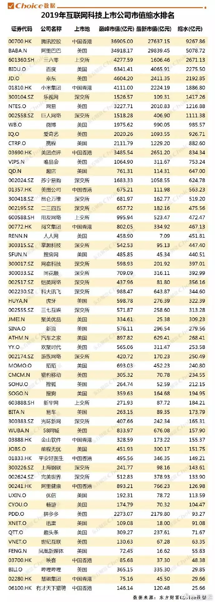
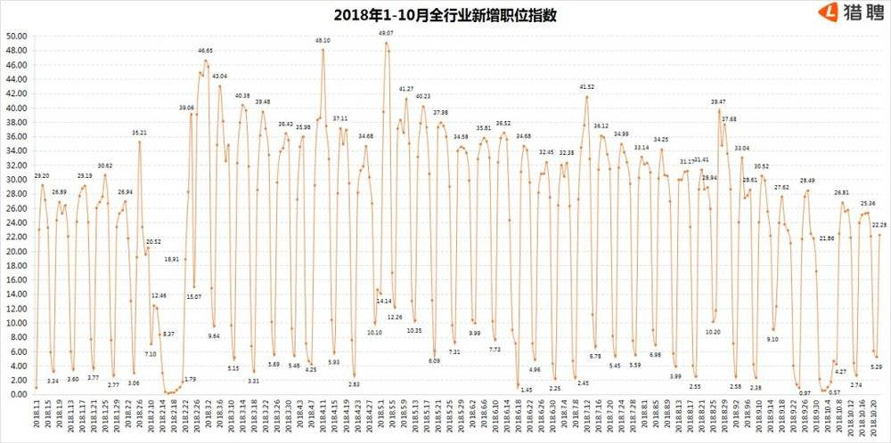
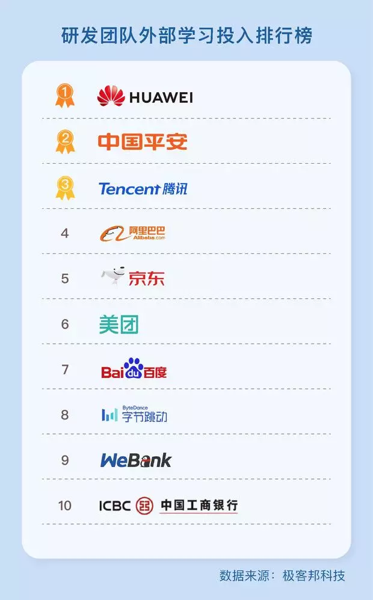
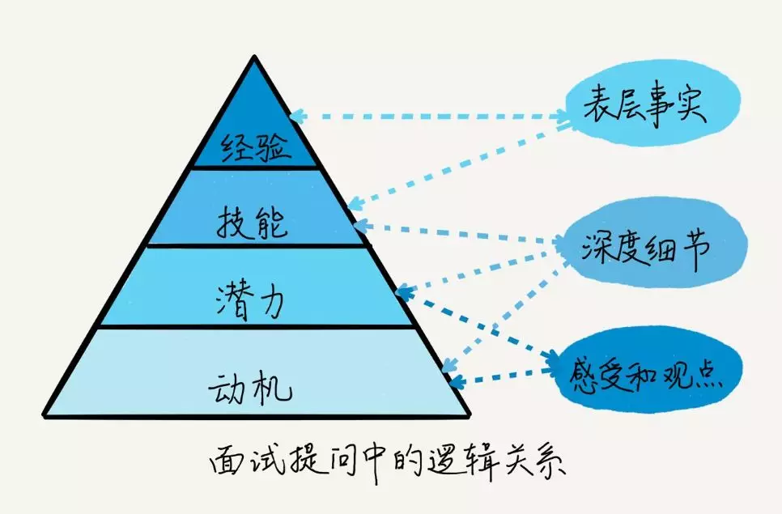

## 裁员过后，找不到工作的程序员们  

> 作者: 小智  
> 发布日期: 2019 年 4 月 25 日  

> 谈裁员的时候，还在开心拿到的 N+1 补偿款。等到金三银四都快过完了，才发现这个招聘热潮是假的。

### “送达”与“已读”

> “找工作 3 个多月了，还没有遇到合适的，坐标杭州。”
>
> “坐标北京，2 年工作经验，裸辞 1 个月了，Java/Python 方向都在找，投的简历都石沉大海了。”
>
> “金三银四找的全是 996 的，双休只有外企和非互联网行业。”
>
> “去年冬天被裁员的，今年到现在还没找着像样的工作。”
>
> “投了半个多月简历，一个面试机会都没有，送达，已读。”

过去的半个多月时间里，笔者跟十余位程序员聊了聊找工作的事情，行情并不乐观。这些人里，不乏多年工作经验的资深程序员，也有入行不久的新人程序员。有些人是生态最好的 Java 技术栈从业者，有的是自信满满直接裸辞的年轻人。

最终，都在金三银四这个每年的招聘旺季里，遭遇了“送达”与“已读”。

为什么这个金三银四，变成了假的？我们试图探究这背后的原因。

### “寒冬”背后，还有“倒春寒”

时针拨回一年前。

2018 年的春天，堪称近年来最暖的春天。彼时人工智能领域风起云涌，AI 创业公司们纷纷高薪疯抢 AI 开发者，月薪动辄 10 万级别。人工智能的流行还未结束，一个名叫区块链的技术突然又火爆了起来，一时间，“凡人饮水处，皆言区块链”。那是程序员们最甜蜜的一段时间。

这一年的上半年，互联网公司们扎堆上市，蔚为壮观：哔哩哔哩、爱奇艺、美团、小米、拼多多、趣头条……上市后的互联网新兴巨头、独角兽公司为了攻城略地，开启了全面的整军备战：

* 滴滴与美团战作一团，美团要做打车，滴滴要送外卖。

* ofo、摩拜们的共享单车大战打到了下半场，刀刀见红。

* 今日头条与腾讯展开了轮番大战，从唇枪舌剑到诉诸法庭。

* 拼多多异军突起，剑指阿里电商、京东商城。

战争是靠人打的，商战亦如此。于是，离职的程序员们不愁找不到工作，在职的程序员们经常收到猎头的私信：约吗？

谁能想到，仅仅半年时间，形势急转直下。

2018 年下半年，也正是资本大战的下半场。共享单车们倒闭的倒闭，收购的收购。互联网巨头如阿里、华为、京东等大厂也开始传出停止社招、缩招的消息。官方辟谣的声明还未广为传播，裁员消息又接踵而至：锤子、知乎、美团、摩拜、滴滴、斗鱼、美图……

> “被裁员的好歹还有补偿，我们在职的连年终奖都没发。”

Winter is coming……

同样是这些上市公司，期待中的上市后身价暴涨、股票飘红并没有出现，反而上市一个破发一个，股价蒸发最高者甚至达到 80%。事实上，除了新上市的科技公司以外，其他上市互联网公司同样惨淡经营。

出处见水印

于互联网公司而言，招聘即是市场的信号，这透露出互联网公司在快速成长后，资本趋于理性，在这样的大环境影响下，直接导致了招聘市场从 2018 年下半年延绵至今的寒冬。

根据猎聘大数据“2018 年 1-10 月全行业新增职位指数”，从 2018 年 9 月中旬以来，全行业新增职位指数呈现较明显下降。

数据来源猎聘

与 2017 年同期对比，2018 年三、四季度全行业招聘增长需求有所放缓，且第四季度相比于第三季度招聘需求减少的占比明显增加，为近 8 个季度中的最低点。

**“去年三月 Boss 上面收到简历上百封，今年不到 30 封。”** 一位技术负责人向笔者透露。

招聘渠道已经是这样的行情了，猎头市场又是如何的呢？笔者采访了国内知名猎头公司 Dolphin 的负责人 Nick，他表示：

> “今年大环境确实不好，求职者也会更加谨慎，优质的人出来看机会的意愿低了。目前各大公司要人也会越来越挑剔，薪资给得也会更保守，所以求职者拿到的 offer 也会更少些。个人感觉今年猎头成了的数据没有明显下滑，但是客户回款的速度明显慢了。”

当笔者问起去年同期火爆的人工智能和区块链领域行情如何时，他表示：

> “人工智能还是很火，区块链不行了。国内很多区块链创业项目都是为了圈钱，太浮躁。”

### 程序员该怎么找好工作？

虽然是近年罕见的招聘寒冬，但好的机会永远不会缺少，区别只在于找到并抓住其的难度。

#### 去最愿意为程序员花钱的科技公司

从筛选公司的角度，InfoQ 此前收集了一些科技公司的数据，汇总了这些企业在技术研发资本、科研人才培养及团队建设方面的投入，我们来看看国内最愿意为程序员花钱的科技公司有哪些？

根据统计，2018 年，中国公司科技研发总费用为 712 亿欧元，平均每家公司投入 1.6 亿欧元（数据来自上榜《2018 年欧盟工业研发投资排名》的 438 家国内企业）。

其中，华为 2018 全年研发投入为 113.34 亿欧元，占销售比为 14.7%；阿里巴巴研发投入为 29.14 亿欧元，占比 9.1%；腾讯研发投入 22.35 亿欧元，占比 7.3%；百度研发投入为 16.58 亿欧元，占比 15.3%… 这些公司不仅在技术研发层面投入重金，在技术人才培养方面同样下了不少功夫。

从国外的经验来看，位列员工满意度榜单排名前十的科技企业，其年营收情况都不错。一家公司之所以优秀是有原因的。只有重视技术投入和研发人才培养，才可能获得更优质的产出和更丰厚的回报。愿意为程序员花钱的企业，通常也是值得程序员任职的梧桐木。

除此之外，可以考虑一些比较具有发展潜力的创业公司，如何去辨别一个公司是否有发展潜力呢？建议去了解下比较知名的 PE 或者 VC 投了哪些公司，因为投资人是很聪明的一个群体，他们希望投入的钱有所回报，所以被知名投资人选中的公司成功的几率也会大一些。

#### 磨砺自身的简历水平与面试技巧

##### 简历篇

简历是面试的敲门砖，面试是通往心仪 offer 的必经之路。越是门槛高、福利好、待遇佳的岗位，其简历筛选到轮轮面试必然难上加难。如果不好好准备，天上又怎会掉馅饼？

对于简历来说，最重要的关键词是“价值”，只有体现价值的简历，才有可能通过 HR 的层层筛选进入到面试环节。价值体现的维度可以总结为：经验、技能、潜力、动机。这同样是面试官眼中应聘者的素质模型，前三点很好理解，最后一点动机指做事的内因，招聘人员通过对动机的考查，来看其稳定性和工作意愿。也是职业描述中的可选内容，比如“愿意尝试新事物”“有工作热情”等。某些招聘文案中提及团队文化的内容，含蓄地表达了对新成员做事动机的要求。

除此之外，简历的内容是撑起整个简历的关键：内容上，要恰当地结构化，详略得当，层次有序。其中最重要的内容是：技能和项目经历。技能，需要按照领域分类，以列表的形式呈现在简历里。同时，要标明技能等级。等级可以用“精通”“熟练”等词标识，或者用工作年数标识。项目经历可参考：

图片：极客时间《面试现场》专栏

##### 面试技巧篇

面试官一旦开始提问，成组的问题之间是有逻辑关系的。

图片：极客时间《面试现场》专栏

在这种分层问题模式中，面试官以考查经验或者技能开始，首先问一系列表层事实，来“扫描”你的知识面和经验范围。在面试官基本了解了你的经验面和技能体系之后，就会挑一些职位需要的关键技能问深度细节了。最后考察的是你的感受和观点，以看出你的潜力和动机。

了解了面试官的提问逻辑，有针对性地进行准备，就可以达到事半功倍的技巧。

### 写在最后

在你看来，今年的就业环境不好的原因是什么呢？程序员群体应该如何应对？
