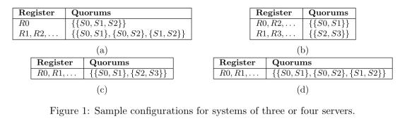
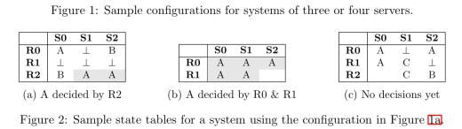
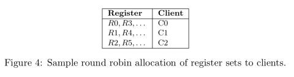
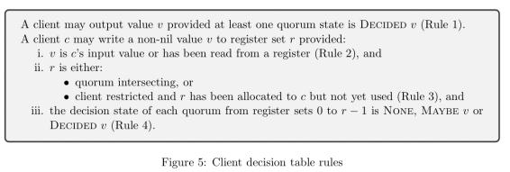
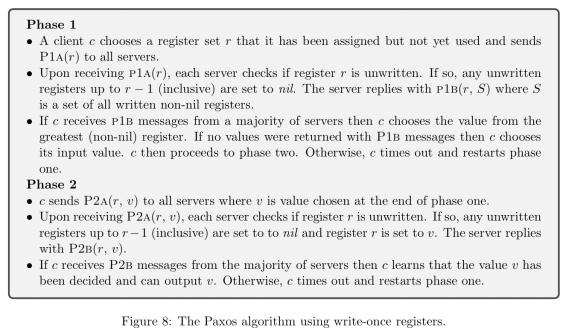

## Jeff Dean点赞共识论文：一种通用的分布式一致性方案  

> 作者: Adrian Colyer  
> 译者: 平川  
> 发布日期: 2019 年 4 月 19 日  

Heidi Howard 是剑桥大学计算机科学与技术系系统研究小组的分布式系统研究员，最近通过推特与全世界分享了一篇论文草稿。这篇文章引起了众多读者的注意，因为它承诺为一致性问题提供一个通用的解决方案，而且还利用了对不可变状态的推理来实现这一点。每个服务器维护的状态都是单调的。

4 月 16 日，Heidi 的博士论文《一种通用的分布式一致性方案》公开，发在 Twitter 上之后 Google 大神 Jeff Dean 还点了个赞。

在论文中 Heidi 对分布式共识的代表算法 Paxos 提出了质疑，并证明了当前分布式共识很多未解决的问题只是 Paxos 这个算法的问题，而不是因为分布式共识本身的问题。InfoQ 的《The Morning Paper 》Adrian Colyer 博士于 3 月份时就给我们做了一个非常详细的论文解读。

### 解读

Heidi Howard 最近通过推特与全世界分享了一篇[论文草稿](https://twitter.com/heidiann360/status/1098167557792718849?s=21)，这里是相对应的[博文](https://hh360.user.srcf.net/blog/2019/02/towards-an-intuitive-high-performance-consensus-algorithm/)。这篇文章引起了我的注意，因为它承诺为一致性问题提供一个通用的解决方案，而且还利用了对不可变状态的推理来实现这一点。每个服务器维护的状态都是[单调的](https://blog.acolyer.org/2019/03/06/keeping-calm-when-distributed-consistency-is-easy/)。

一致性问题是一个[出了名的难题](https://blog.acolyer.org/2015/03/01/cant-we-all-just-agree/)，Howard 已经对这个领域进行了好几年的深入研究。例如，它 2016 年发表的关于[Flexible Paxos](https://blog.acolyer.org/2016/09/27/flexible-paxos-quorum-intersection-revisited/)的论文。这里追求的目标是找到一种统一的、易于理解的协议，它可以在不同的配置中实例化，允许根据情况做出不同的权衡。

> 本文重新研究了分布式一致性问题，旨在改进性能和协议。我们是按如下方式开展工作的。一旦我们定义了一致性问题，我们就提出了一个通用一致性解决方案，它只使用不可变的状态来实现关于正确性的更直观的推理。随后，我们证明了，Paxos 和 Fast Paxos 都是通用一致性算法的实例，进而表明这两种算法在方法上都是保守的。

#### 分布式一致性问题

我们有一组服务器（至少两台）需要就一个值达成一致。客户端将要写入的值作为输入，将服务器同意的值作为输出。

* 输出值必须是客户端的输入值（例如，排除了总是输出固定值的简单解决方案）；
* 所有生成输出的客户端都必须输出相同的值；
* 如果系统在足够长的时间内是可靠和同步的，那么所有客户端最终都必须生成输出。

请注意，我们在这里讨论的是“内部博弈”——这只是就单个值达成一致，而在实际部署中，我们可能会运行多轮协议来就一系列值达成一致。此外，我们在这里假设客户端集合和服务器都是固定的，并且客户端知道服务器的存在。“客户端”可能不是最终用户客户端，而更可能是使用一致性服务的系统流程。配置更改和成员资格时间段是我们可能会在实际部署中添加的另一个层，但在这里超出了我们的讨论范围。

#### 构建块：不可变寄存器与仲裁

我们有一个固定的服务器集合，其中包含 _n_ 台服务器 S0,S1,…,SnS0,S1,…,Sn 。每台服务器都一个它可以写入的磁带，即一个 **一次写入** 的持久性寄存器无限阵列：R0,R1,…R0,R1,….

最初，磁带是空白的——所有寄存器都未写入数据。一旦我们在寄存器槽中写入一个值，它就永远不会被更改。除了由客户端提供的值，系统还有一个特殊值 _nil_ 或 ⊥⊥。

我们感兴趣的是所有服务器上相同寄存器槽中的值集。寄存器集合 ii 是所有服务器上所有寄存器 RiRi 的集合。

如果一个寄存器集合中有足够多的寄存器具有相同的（非 ⊥⊥）值，那么，我们会说服务器依据那个值做了决策。然而，一个寄存器集中有多少个寄存器就足够了？这是我们需要作为协议配置的一部分进行确定的。事实上，我们不仅要指定必须一致的寄存器值的 _数量_ ，还要指定它们属于哪个服务器。可以在服务器之间确定值的（非空）服务器子集称为“ _仲裁（quorum）_ ”。更准确地讲，“ _仲裁 Q 是一个（非空）服务器子集，这样，如果所有服务器的同一个寄存器都有相同的（非空）值_ vv _，就可以说_ vv _就是决策值_ 。”

仲裁这个词通常与“大多数（majority）”这个词紧密相关，但请注意，不一定非得如此。如果需要，该规范允许我们声明只包含单个服务器的仲裁。词典对“法定人数（quorum）”的定义是“议会或社团的最低成员人数，该成员必须出席其任何会议，以使该会议的会议记录有效。”请注意，这里也没有仲裁成员资格部分重叠的要求（稍后将详细介绍）。

一个寄存器可以关联一组仲裁。也就是说，我们可以以寄存器集为单位，准确地指定允许哪些服务器子集来决定一个值。例如：

我们究竟为什么要为不同的寄存器集使用不同的仲裁集呢？我们最终会在单一值上达成一致。当我们研究如何在寄存器之上增加一个一致性协议层时，其原因就变得更加明显了。

给定仲裁配置和寄存器集的寄存器值，我们就可以查看是否满足任何仲裁并达成决策。

> 所有寄存器的状态都可以用一个表表示，称为状态表，其中每一列表示一个服务器的状态，每一行表示一个寄存器集。通过一个状态表把配置组合起来，我们就可以确定是否已经做出任何决策。

现在，我们要细心一点，记住状态表是一个逻辑结构。每个服务器都知道自己寄存器的值，客户端可以在从服务器接收信息时维护自己的全局状态表视图。但是，对于不可变的构造，我们知道，一旦客户端收集了足够的信息来判定一个值已确定，它就做出最终决策了。

#### 四个规则

要遵守一些规则才能使其作为一个协商一致的系统发挥作用。

1. **“仲裁一致（ ** **Quorum agreement**** ）”**：如果客户端从仲裁服务器的相同寄存器集中读取了 vv，那么它只会输出一个（非空）值 vv。
2. **新值** ：如果客户端的输入值是 vv 或者那个客户端从寄存器读取了 vv，那么客户端可能只写一个（非空）值 vv。
3. **当前决策** ：如果 vv 是仲裁 Q∈QrQ∈Qr 在寄存器集 rr 中的决策，其中 s∈Qs∈Q，而且不存在一个值 v′v′（v≠v′v≠v′）可以在寄存器集 rr 中决策，那么客户端只能向服务器 ss 上的寄存器 rr 中写入（非空）值 vv。
4. **先前决策** ：如果不存在值 v′v′（v≠v′v≠v′）可以在寄存器集 0 到 r−1r−1 中仲裁决策，那么客户端只能向寄存器 rr 中写入（非空）值。

前两条规则非常简单。规则 3 确保一个寄存器集所做的所有决策都具有相同的值，而规则 4 确保不同寄存器集所做的所有决策都具有相同的值。

遵守这些规则进一步增加了系统配置的限制。假如对于寄存器集 i （S0S0 和 S1S1），我们有两个仲裁。向 S0S0 中的寄存器进行写入的客户端不知道其他客户端可能向 S1S1 写入一个不同的值，因此，我们就无法遵守规则 3。以下三种方式可以用于处理这种情况：

* 最简单的方案是每个寄存器集只允许有一个仲裁；
* 在有多个仲裁的情况下，我们可以要求一个寄存器集的所有仲裁相交（即任意两个仲裁至少有一个成员重叠）；
* 我们可以使用 _受客户端限制的配置_ 。在这里，特定寄存器集的所有权被分配给特定的客户端，这样，只有该客户端才能在该寄存器集中写入值。如果该客户端总是与其写入的值保持一致，那么就没有什么问题了。其中一种策略是轮流拥有寄存器集：

为了遵守规则 4，客户端需要查看全局状态表（即 _本地_ 状态表）的最新视图，并确定是否已经或能够通过更早的寄存器集做出任何决策。客户端维护一个决策表，每个寄存器集的每个仲裁都有一个条目。这个表跟踪客户端对仲裁所做的决策。仲裁的可能值为：

* ANY——决策可以是任意值（所有寄存器集的所有仲裁都从这个状态开始）；
* MAYBE vv——如果这个仲裁达成决策，那么其值将是 vv；
* DECIDED vv——vv 已经是仲裁的决策值（最终状态）；
* NONE——仲裁无法做出决策（最终状态）。

当客户端接收到来自服务器的信息时，它会根据以下规则更新决策表：

* 如果客户端从一个仲裁成员读到了 nil 值，则该仲裁的状态将设置为 NONE。
* 如果客户端从寄存器集 rr 读取了一个非空值 vv，而且所有仲裁成员的值都相同，那么仲裁的状态就会设置为 DECIDED。否则，状态设置为 MAYBE vv。在后一种情况下，在之前的寄存器集中那些被设置为 ANY 的同样的仲裁也会设置成 MAYBEvv，但是，MAYBEv′v′（v≠v′v≠v′）值会被更新成 NONE。

客户端使用决策表来实现以下四条正确性规则：

> 我们的目的是使关于正确性的推理足够直观，不需要证明就能对安全性做出令人信服的说明。

无论如何，知道其中包含了证明，你会很高兴，感兴趣的话，可以查看附录 A。

#### 不可变寄存器之上的 Paxos

作为论文的总结，这篇文章已经超出了我的目标篇幅，可能已经用了比原来的论文更多的单词来解释核心思想！我唯一可以辩解的是，在思考一致性问题的时候没有捷径。

本文主要是为了展示，刚刚介绍的基于寄存器的方案可以被实例化来实现一些来自文献的一致性方案，包括 Paxos 和 Fast Paxos。我这里没有足够的地方来做适当的评价，下面只是对核心 Paxos 算法的简单介绍：

> 我们注意到，Paxos 是通用一致性解决方案的一个保守示例。Paxos 所使用的配置是所有寄存器集的绝大多数。Paxos 还对所有寄存器集使用客户端限制。第一段的目的是实现规则 4，第二段的目的是实现规则 1。

如果要弄清楚用于每个寄存器集的仲裁以及仲裁用于 Paxos 的哪个阶段，可以看下[Flexible Paxos](https://blog.acolyer.org/2016/09/27/flexible-paxos-quorum-intersection-revisited/)。

#### 总结

本文的第 5 部分展示了如何派生 Fast Paxos，在第 6 部分中，你可以在配置空间中找到另外三个要点的简要概述，分别是共置一致性、固定多数一致性和可重构一致性。

> _本文从一次写寄存器的角度重新思考了分布式一致性问题，提出了一种分布式一致性的通用解决方案。我们已经证明，该解决方案不仅统一了现有的算法，包括 Paxos 和 Fast Paxos，而且证明了这些算法的保守性，因为它们的仲裁交叉要求和仲裁协议规则会被大大削弱。我们提出了三种新的协商一致算法，并提出了一些有趣的观点，说明我们的抽象使得各种各样的算法成为可能，由此展示出我们的通用协商一致算法的强大。_

查看英文原文：[A generalised solution to distributed consensus](https://blog.acolyer.org/2019/03/08/a-generalised-solution-to-distributed-consensus/)
