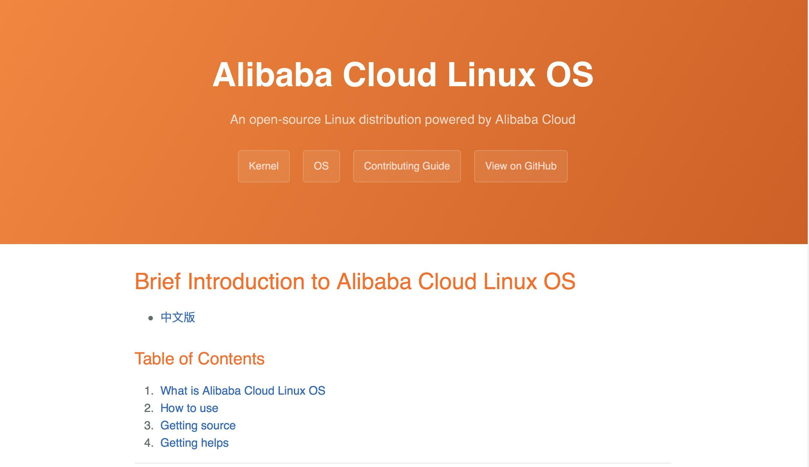

## 九年积累！Alibaba Cloud Linux 2终于开源  

> 作者: 赵钰莹  
> 发布日期: 2019 年 4 月 22 日  

> 经过数月开发、调优和测试，Alibaba Cloud Linux 2 OS 正式开源，软件包以 CentOS 7.6 和内核长期支持 \(LTS\)4.19 版本等社区来源为上游，重要亮点是自带的阿里云云内核，这也是阿里巴巴在云环境单机操作系统领域的又一重大突破。

近日，阿里巴巴宣布重磅开源其 Alibaba Cloud Linux 2，这可以理解为下一代 Alibaba Cloud Linux 操作系统，软件包以 CentOS 7.6 和内核长期支持 \(LTS\)4.19 版本等社区来源为上游，为云上应用程序环境提供 Linux 社区的最新增强功能，在提供云上最佳用户体验的同时，也针对阿里云基础设施做了深度优化。

真正熟悉阿里巴巴云环境单机操作系统历史的人应该知道，Alibaba Cloud Linux 一开始就是开源的，但相比于成熟的社区发行版来说，Alibaba Cloud Linux 在阿里云市场一直不温不火，此时推出 **Alibaba Cloud Linux 2 OS** 是出于哪些考虑？与第一代相比，进行了哪些重大创新？这一领域的发展趋势会是什么？

对此，InfoQ 对 Alibaba Cloud Linux 2 项目负责人 **夷则** 进行了独家专访，试图寻找上述问题的答案。

### 九年积累：Alibaba Cloud Linux 2 OS

> 我们的开发团队是阿里巴巴操作系统团队（前身是淘宝内核组），团队成员大多是活跃在内核社区的开发者，九年来积累了深厚的操作系统和内核开发底蕴，希望通过 Alibaba Cloud Linux 2 的开源，将阿里巴巴多年技术积累持续对外输出，将底层系统领域的技术通过操作系统这个大平台输出给所有人。

九年来，阿里巴巴一直致力于操作领域的研发和创新，众所周知的飞天操作系统就是阿里云自研的分布式集群操作系统，主要负责统一管理数据中心内的通用服务器集群，一经推出就备受关注。虽然，Alibaba Cloud Linux 2 OS 的范围远小于阿里云飞天操作系统，仅指代传统单机上的操作系统，但这一技术的开源多少弥补了国内云环境上单机操作系统领域的不足。

作为云基础设施的底座，操作系统的存在就好比是水和空气，虽然云上客户日常运行很难注意到操作系统，但是一旦出现问题，便让用户无法忍受甚至难以生存，可见操作系统对云上客户的重要性。在阿里云环境中，增强客户与阿里云底层各类云产品的联系，完成客户与阿里云产品之间“最后一公里”的同样是操作系统。

过去，云上客户使用的操作系统已是丰富多彩，主要以 Linux 操作系统为主，有企业级的收费操作系统发行版 RHEL \(红帽企业版 Linux\)，也有受众极广的免费操作系统发行版 CentOS、Ubuntu 等。夷则表示，这些发行版的特点是诞生、发展于传统环境，几乎没有针对云上产品和环境进行定制、优化。

在这种背景下，阿里巴巴操作系统团队决定开发 Alibaba Cloud Linux。

2015 年，阿里巴巴推出过早期版本的 Alibaba Cloud Linux，但是当时并没有围绕阿里云产品和基础设施环境做定制和开发。因此，相比 CentOS 和 Ubuntu 这种成熟的社区发行版来说，Alibaba Cloud Linux 一直显得不温不火，此次推出的 Alibaba Cloud Linux 2 是否有望改变这一现状呢？

夷则表示，在 Alibaba Cloud Linux 2 项目立项之初，整个团队就制定了多项优化计划，分别基于短期、中期和长期等不同开发节奏将阿里云产品和基础设施的优化分批落地，致力于针对阿里云产品和基础设施环境在操作系统级别进行定制和优化，力求可靠衔接阿里云上客户与阿里云产品的“最后一公里”。

开放源码是一种共享的黑客精神，从开放源码运动诞生至今，无数优秀的开源产品给数以百万计的软硬件产品和云产品提供了强大的基础系统底座支撑。谈及开源，夷则认为，操作系统开源更能获得用户认同感和信任感，也有助于阿里云生态的良好发展。

如今，Linux 操作系统已经囊括了一系列庞大而成熟的开源生态圈，Alibaba Cloud Linux 2 是这个庞大开源生态圈的收益者，阿里巴巴也在努力成为优秀的贡献者，希望将操作系统领域的多年技术积累回馈给开源社区，也欢迎志同道合的开发者一同参与内核开发协作，共同创造更加有益的价值。

#### 重要特性

相比之下，Alibaba Cloud Linux 2 的最大亮点是搭载阿里云[内核](https://github.com/alibaba/cloud-kernel)\(Alibaba Cloud Linux Kernel, ALK\)。较之前的版本，ALK 选用了基于内核社区最新的长期支持版本 4.19 内核；该版本的内核在 CPU、内存、文件系统、IO、网络、cgroup 等子系统上增加了大量新特性、性能改进和重大缺陷修复，具体如下：

* CPU: 多项 CPU 安全修复，CPU 负载预测功能改进以增强调度均衡性；
* 内存：TLB 相关优化，writeback 相关优化，OOM-Killer 可靠性优化，空闲页面跟踪 \(Idle Page Tracking\) 特性支持；
* 文件系统：Ext4, XFS, Btrfs, NFS, Overlayfs 等重要文件系统的新特性支持及优化；
* IO: 全新的异步 I/O 优化，异步 I/O 轮询特性支持；
* 网络：BBR，零拷贝 TCP API 支持，XDP 及 AF\_XDP 机制支持；
* cgroup: cgroup v2 支持, 基于 cgroup v2 的 cgroup writeback 支持, 和 blkio latency 支持。

开发团队对其进行了大量功能和稳定性测试，确保对外输出最新内核社区技术红利的同时，也能保证系统稳定；在定制优化上，针对阿里云环境，做了内核启动参数和系统配置参数调优，大幅提升启动速度和错误恢复相关能力；对于数据库场景、高并发多线程场景、阿里云弹性裸金属 \(EBM\) 实例和云原生场景，Alibaba Cloud Linux 2 也做了相应性能优化，以适应云产品快速迭代的特点。

整体上， Alibaba Cloud Linux 2 的特点可以概括为：

* 性能：大幅优化启动性能，并针对 ECS 大规格实例，弹性裸金属服务器等产品深度优化性能；
* 软件：积极引入诸如 4.19 内核等新版本开源软件，并承诺持续丰富开源软件包生态，并不断完善；
* 生态：源于开源社区，帮助用户及时获得开源社区创新红利，同时引入更完善的发行版质量体系，提高发行版品质，并积极回馈开源社区；
* 安全：对系统进行定制裁剪，减少系统受攻击面，提升系统安全，同时承诺及时跟进修复产品中的安全漏洞，并持续提升系统的安全标准；

夷则表示，相比 CentOS、Ubuntu 等社区版，Alibaba Cloud Linux 2 在同样免费的基础上，提供来自阿里云的官方支持，这是专门为阿里云环境定制的发行版，开箱即用，无需过多设置，并将持续针对阿里云环境和上层应用进行优化；相比同样有企业支持的红帽企业版 Linux 系统，Alibaba Cloud Linux 2 又具有免费优势。后续，阿里巴巴操作系统团队会持续对该项目进行维护，持续集成新功能和修复缺陷，并继续向开源社区回馈。

### 云环境上单机操作系统研发不易

作为传统技术领域，操作系统具备极强的通用扩展性，而对于云计算领域的专有优化则略显不足。因此，亟需解决的痛点便是如何开发定制基于云产品的操作系统功能，将操作系统这棵“老树”在云计算上焕发新的生命力。

在云环境上单机操作系统领域，各大云厂商几乎都有侧重的操作系统，以业界前列的几位厂商为例，Amazon 作为行业领头羊，其 Amazon Linux 是 AWS 上最受用户欢迎的操作系统；微软作为老牌操作系统厂商，在 Azure 上的 Windows Server 必当是首选系统；Google Cloud Platform \(GCP\) 略微有些不同，其更强调云原生，而非传统 IaaS 架构，因此没有特意推出某款操作系统，但 GCP 上运行的显然是一个精心优化过的基于容器的操作系统。

长远来看，操作系统研发是一项重要技能，但其研发门槛较高，即便有各类开源解决方案也需要企业自身的研发能力足够强大。此外，操作系统的受关注程度远不如上层应用，这也让很多企业不愿意将精力投入到这一领域，而更愿意放到能直观吸引客户注意力的应用层面。夷则表示，底层操作系统包括内核优化是全链路优化中至关重要的一环，许多新产品都依赖底层操作系统的实现或优化，缺少操作系统研发能力就等于不具备全链路优化的能力。

### 未来规划

如今，越来越多的公有云厂商进入快速发展阶段，有能力也有时间投入到技术的精细化打磨，无论是基于开源技术改进还是自主研发，未来应该都会看到更多云厂商的技术输出。至于 Alibaba Cloud Linux 2 ，如果感兴趣，现有 Alibaba Cloud Linux 用户可以在阿里云云服务器 \(ECS\) 产品控制台中更换系统镜像到 Alibaba Cloud Linux 2，阿里云近期也将支持原地升级，用户无需更换系统镜像即可滚动升级到 Alibaba Cloud Linux 2。此外，阿里巴巴将进一步完善开源相关文档，包括初学者文档，吸引更多用户参与操作系统与内核开发，在该领域与开发者进行持续交流。

未来，Alibaba Cloud Linux 2 将持续开发新特性，也会积极将开源社区的最新成果带给 Alibaba Cloud Linux 2 用户，回馈开源社区。同时，夷则提到，阿里云将重点关注典型云上应用场景的垂直优化，致力于建设最易用、性能最好的阿里云环境上单机操作系统。Alibaba Cloud Linux 将会持续滚动更新软件包和操作系统镜像，以大约三个月为一个版本发布周期持续更新迭代该操作系统。

项目官方开源地址：<https://alibaba.github.io/cloud-kernel/os.html>
