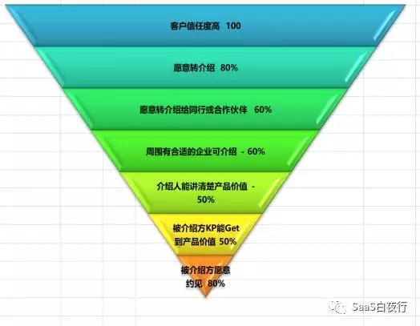
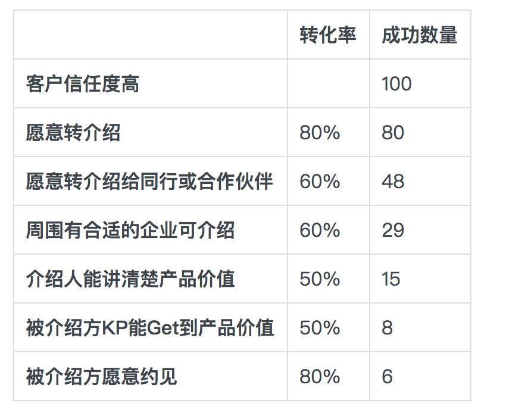
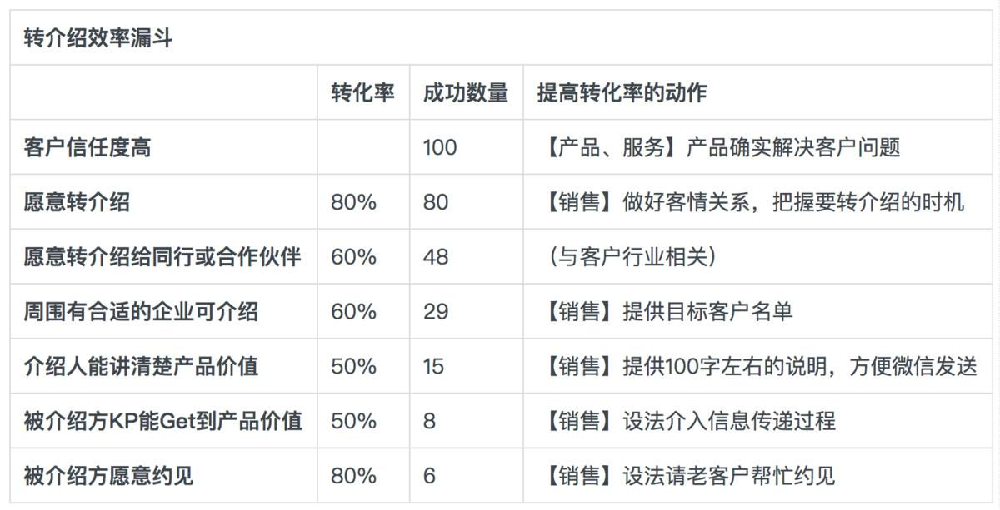
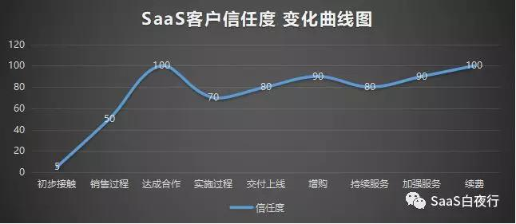

## 客户信任度曲线与转介绍漏斗模型 | SaaS创业路线图（41）  

> 发布: 吴昊@SaaS  
> 发布日期: 2019-04-03  

> 做好客户“转介绍”，同样是个系统工程，需要对每个环节进行分析；作为组织来说，如果“转介绍”是占比10%以上的成交客户来源，那么就应该考虑做标准化工作。

**作者介绍** **-** 吴昊，SaaS创业顾问，纷享销客天使投资人、前执行总裁，8年SaaS营销团队创新+13年企业信息化经验。目前在为SaaS公司提供战略咨询，重点是市场、销售、服务团队的规模化。

点击查看[\#SaaS创业路线图\#](https://36kr.com/user/1308477002)系列文章

在C端，老客户转介绍新客户有很多有效的玩法，例如，赠送多张优惠券、推荐朋友均享优惠，但这些在B端往往不好操作，甚至会造成客户反感。

比方说，A企业老板转介绍了B企业老板，你给A一个续费优惠，A会担心B知道了会很不爽；A还会担心B是否合适用？用不好是否会责怪自己？......

企业老板更在意自己与合作伙伴的关系，而不是自己能享受到一个不痛不痒的优惠。

###  **一、转介绍效率漏斗** C端转介绍

一个C（消费者）身边肯定有不少类似的C（消费者）。但B端产品不同， **要根据产品本身的覆盖率测算公司要求Sales做转介绍成功率有多大** 。例如，做员工福利产品的面就很广，50%的中型以上企业都可能适用，转介绍效率可以预期；CRM产品，则只有10%的企业可能适用，转介绍成功率就比较小。

还有一个因素是：目标客户群体之间的关系。有的行业大家比较开放，有好东西都学，例如广东的家居建材行业和江浙的很多产业聚集地；有的行业则比较封闭，互相来往很少，例如北方的医疗器械行业。后者企业间的转介绍自然就少了。

我画了一个漏斗图：

那我们作为销售流程的设计者，应该在每个转化率上下功夫。

我把上面这张漏斗图转化成一个表格：

所以B端转介绍更重要的是公司整体设计，时机点的把握和转介绍前中后动作标准化。我简单列了一下各个环节提高转化率的动作，详见下表。同样，这些动作也需要每家公司根据自己的情况设计。从上面这张表可以算得，100个高信任度的客户中，最终能有成功转介绍的也就只有6个老客户。当然，每家企业的产品、市场、员工获得转介绍的能力及意愿不同，结果肯定差别很大。 **这需要各家企业自己根据逻辑和经验测算。**

**作为组织来说，如果“转介绍”是占比10%以上的成交客户来源，那么就应该考虑做标准化工作。** 详见我的同系列文章:[SaaS创业路线图（39）可复制的市场成功](http://mp.weixin.qq.com/s?__biz=MzIxNjc2MTc2MQ==&mid=2247483997&idx=1&sn=6a664dfe9564edf0284fcf5eb3bd4146&chksm=97855693a0f2df85865f225467cad08b4f88684333f111957fecb9f7225c151536b640d63135&scene=21#wechat_redirect)

###  **二、客户信任度变化曲线与转介绍的时机**

Sales最应该在什么时候向客户要转介绍呢？当然是客户最信任你和公司的时候。

我画了一个SaaS公司的客户信任度变化曲线，个中酸楚做实施、做CSM（客户成功）的同学肯定最有感触。

虽然每个SaaS公司的各阶段“信任度”数值各有差别，但我看大趋势类似。

那么我们的业务员应该在什么时刻要转介绍？

经过接触、客户需求及产品价值沟通、商务谈判 **，达成** **合作** **时应该是客户信任的一个高峰点** **，** **这时候就应该要转介绍。** 而后面的实施过程一般还是会有些困难要度过的，包括有的公司Sales为了拿到单子什么都敢承诺、售前嘴巴比较大，因此实施团队坑很多，客户满意度和信任度都会下降。后面增购、续费时，信任度和满意度还有积累，但不少SaaS公司续费也不轻松。增和续费环节如果能做地好，也是要转介绍的合适时机。

###  **三、转介绍的** **一些细节**

1、要转介绍的对象不一定是老板或KP，也可以是下属的员工，那就需要做一些价值设计了；当然，所有的价值设计不是直接给钱、给东西，大家处成朋友，在业务和个人发展上有更多合作，这样的形式更容易被接受。

2、要有准备，例如准备对方可能知道的企业名单等；3、让对方有一个给你转介绍的理由 **（** **这个理由很重要，大家自己想，欢迎留言）** ；4、持续update对方进展，达成合作后应表达感谢。

当然，这些都是“术”，”道”还是公司对转介绍的底层驱动分析以及有组织地标准化转介绍动作要求、跟进数字化的结果，不断提高方法效率和工具。

###  **四、最后，我再分析一下SaaS公司中获客来源类型**

一年来我见了大概160家SaaS公司的创始团队，有的SaaS公司70%成交来自市场线索（SEO/SEM、线下活动等），有的公司70%成交来自Sales的自开拓（打陌生电话、陌拜、自己资源、客户转介绍等）。

如果自开拓比例过高（超过80%），说明市场能力需要加强，销售自拓的可持续性未必有那么保险；而且 **销售能力再强也需要市场护航，市场提供有效线索太少，说明公司在Marketing上缺乏积累。**

如果市场线索比例过高（超过80%），说明销售团队在自开拓的套路、组织、激励上有短板。这个也要设法提升，因为纯靠SEM来的线索量天花板很低，公司未来业务增长将有瓶颈。

而“获得客户转介绍”是Sales自开拓能力中的一种，从效率角度看，它是最佳获客途径 —— 获得成本低、成交转化率高。但“转介绍”即便在方法上设计地很好、执行环节也非常依赖Sales的个人能力，所以在可复制性上并没有那么高。

我在团队里也见过Sales有本事把一二十个客户老板组织起来搞社交活动的、见过帮客户老板组织社交活动获得间接式转介绍的......他们的业绩很好，但能做到这个程度的业务员都是百里挑一的。 **在我带过的千人销售团队里，能做好转介绍的业务员也就10~20%吧。**

相对而言， **如果有一个几百人的全国销售团队，我倾向于主要依赖可规模化的获客方式。“转介绍”需要做好，但始终是辅助来源。**

各位同学，相信大家都有不少“转介绍”方面的好方法，欢迎留言分享！
